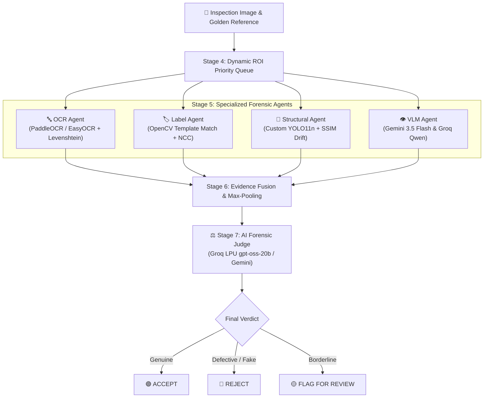
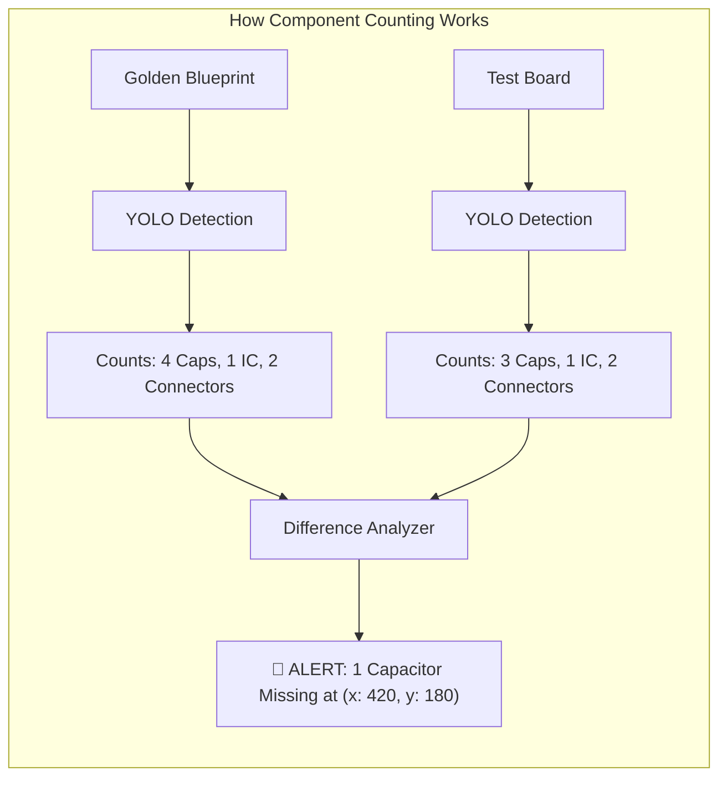

# 🔬 VisionForge AI

**Stop counterfeit hardware, cloned circuit boards, and tampered electronics before they reach your customers.**

<div align="center">

[](https://python.org)
[](https://fastapi.tiangolo.com)
[](https://react.dev)
[](https://vitejs.dev)
[](https://tailwindcss.com)
[](https://pytorch.org)
[](https://ultralytics.com)
[](https://opencv.org)
[](https://github.com/facebookresearch/faiss)
[](https://ai.google.dev)
[](https://groq.com)
[](LICENSE)

[Problem Story](#-the-problem) • [What VisionForge Does](#-what-visionforge-does) • [How It Works](#-how-it-works) • [Quick Start](#-quick-start) • [Documentation Hub](#-documentation-hub)

</div>

---

## 🎯 The Problem

### The $50 Billion Ghost in the Electronics Supply Chain

Every year, billions of dollars worth of counterfeit, recycled, and substandard electronics enter the global market. 

```text
A genuine board arrives at factory intake:
┌────────────────────────────────────────────────────────┐
│  • High-temperature Japanese capacitors (105°C rated)   │
│  • Authentic automotive-grade microcontroller          │
│  • Factory-sealed tamper-evident QC label              │
│  • Clean gold-plated connection headers                │
└────────────────────────────────────────────────────────┘

What actually arrived from an unverified supplier:
┌────────────────────────────────────────────────────────┐
│  • Cheap 85°C clone capacitors relabeled with fake ink │
│  • Scraped and laser-re-etched consumer chip           │
│  • Color photocopied paper label glued over old glue   │
│  • Tin-plated pins that will corrode within months     │
└────────────────────────────────────────────────────────┘
```

When a shipment of 5,000 circuit boards lands in a warehouse, line inspectors have about **30 to 45 seconds per board** to check for issues.

### Why standard inspection fails

1. **Human Eyes Get Tired:** Finding a single missing resistor among 300 tiny parts on a circuit board is exhausting. Laser-etched part numbers and micro-font print look identical under warehouse lighting.
2. **Standard Computer Vision Is Too Rigid:** Classic rule-based image processing breaks when the camera angle shifts by 2 degrees or when factory lighting changes.
3. **Single LLMs Hallucinate:** Asking a generic cloud AI "Does this board look counterfeit?" produces unreliable answers. General models cannot measure sub-millimeter offsets, count individual tiny capacitors reliably, or provide legal audit proof.

---

## 💡 The Solution

**VisionForge AI** is an open-source visual intelligence system built specifically for micro-electronics and hardware inspection.

Instead of guessing from a single prompt, VisionForge uses an **8-stage inspection pipeline**:

1. Validates image clarity and lighting before running heavy AI models.
2. Checks for digital tampering and Photoshop manipulation using Error Level Analysis.
3. Finds the matching "Golden Master" blueprint using FAISS vector search.
4. Breaks the hardware down into high-priority Regions of Interest (ROIs).
5. Dispatches **4 specialized AI agents** (OCR, Label Matching, YOLO Component Counting, and Multimodal Vision).
6. Combines the findings with a math rule that prevents single defects from being hidden by clean parts.
7. Arbitrates all findings through an **AI Forensic Judge** running on Groq LPU to explain the exact root cause.
8. Generates a signed, tamper-evident PDF audit certificate.

> 💡 **Key Idea**
> VisionForge does not rely on a single model. It combines deterministic computer vision, a custom-trained YOLO detector, and multimodal AI agents to deliver reliable, repeatable results in under **4 seconds**.

---

## ✨ What VisionForge Can Do

| Capability | What It Does | Why It Matters |
| :--- | :--- | :--- |
| **🔍 Blur & Tamper Pre-Check** | Measures focus sharpness and tests image compression artifacts | Stops blurry photos or fake screenshots before wasting AI compute |
| **📐 Automatic Blueprint Match** | Dual embeddings (Gemini + OpenCLIP) find the exact PCB revision | Operators never need to manually look up schematic versions |
| **🤖 8-Class YOLO Detection** | Detects ICs, capacitors, resistors, screws, connectors, and seals | Counts components and catches missing or extra parts instantly |
| **🔤 Serial & Lot Code OCR** | Extracts text and calculates Levenshtein similarity against specs | Detects laser-re-etched chips and fraudulent date codes |
| **🏷️ Label & QC Seal Check** | Template matching for CE, FCC, RoHS, and holographic seals | Catches photocopied badges, fake logos, and peeled stickers |
| **⚖️ AI Judge Causal Reasoning** | Explains *why* a board failed with step-by-step reasoning | Gives line managers clear justifications rather than a mystery score |
| **📱 Mobile Camera Handoff** | Zero-config Cloudflare tunnel allows smartphone camera pairing | Lets operators take macro photos on phones without installing an app |
| **📄 Automated PDF Audit Proof** | Exports immutable, timestamped ReportLab PDF certificates | Provides supply chain traceability for warranty disputes |

---

## 🔄 How It Works

```mermaid
flowchart LR
    A[📷 Inspection Image] --> B[1. Quality Check]
    B --> C[2. ELA Tamper Check]
    C --> D[3. Golden Blueprint Match]
    D --> E[4. ROI Scheduler]
    E --> F[5. Multi-Agent Network]
    F --> G[6. Anomaly Max-Pooling]
    G --> H[7. AI Forensic Judge]
    H --> I[8. Policy & PDF Report]
```



### The Inspection Flow Step-by-Step

1. **Intake & Quality Gate:** The operator drops an image into the web UI or snaps a photo on a smartphone. The system checks sharpness (Laplacian variance $> 100.0$) and lighting ($40 - 220$ exposure).
2. **Digital Forensics:** Error Level Analysis (ELA) highlights areas saved at different JPEG compression levels. If someone digitally cloned a serial number in Photoshop, it lights up bright white.
3. **Reference Identification:** FAISS vector search retrieves the manufacturer's verified "Golden Master" blueprint in under 15ms.
4. **Targeted Agent Execution:** The image is split into focused crops. The OCR agent checks text, the Label agent checks logos, YOLO counts physical components, and the VLM checks for solder burns and corrosion.
5. **Evidence Fusion:** An anomaly score is calculated. If even *one* critical chip is missing, the anomaly score stays high—it is never averaged away by 20 clean resistors.
6. **Verdict & Audit Certificate:** The AI Judge issues a verdict (`ACCEPTED`, `REJECTED`, or `FLAGGED FOR REVIEW`), and a PDF report is generated.

---

## 🧠 AI Architecture

VisionForge coordinates four specialized agents and an AI Judge to inspect hardware from multiple angles:



---

## 🔬 Detection Intelligence

Here is what each forensic agent looks for:

```text
+-----------------------------------------------------------------------------------+
| 🔤 OCR AGENT: Text & Serial Verification                                           |
| Expected: "STM32F407VGT6 - Lot 2408"  | Read: "STM32F407VGT6 - Lot 2399"           |
| Result: Mismatched lot date code detected (Levenshtein Distance = 0.82)           |
+-----------------------------------------------------------------------------------+
| 🏷️ LABEL AGENT: Safety Seal & Logo Authenticity                                   |
| Compares CE / FCC / RoHS stamp geometry against master template                   |
| Result: Tampered logo border detected (Normalized Cross-Correlation = 0.61)       |
+-----------------------------------------------------------------------------------+
| 🧩 STRUCTURAL AGENT: YOLO11n Component Counts & Alignment                         |
| Expected: 8 Electrolytic Capacitors   | Detected: 7 Capacitors                    |
| Result: Component C14 missing on 12V power rail (SSIM Drift = 0.71)               |
+-----------------------------------------------------------------------------------+
| 👁️ VLM AGENT: Physical Surface Inspection                                         |
| Multimodal visual inspection across Gemini 3.5 Flash & Groq Qwen 3.8 27B          |
| Result: Flux residue and desoldering scratch marks detected around Pin 14         |
+-----------------------------------------------------------------------------------+
```

---

## 🤖 YOLO Component Detection

VisionForge includes a custom-trained **Ultralytics YOLO11n** model (`component_detector.pt`) trained on 4,448 labeled hardware images with 59,773 component instances.



### Supported Component Classes

| Class ID | Component Name | What YOLO Checks |
| :---: | :--- | :--- |
| `0` | `capacitor` | Counts filtering capacitors and flags missing or bulged parts |
| `1` | `resistor` | Verifies passive resistor presence and alignment |
| `2` | `ic_chip` | Identifies microcontrollers, flash chips, and power regulators |
| `3` | `connector` | Checks USB, HDMI, PCIe, and power port header geometry |
| `4` | `screw` | Confirms mounting hardware and grounding screws are installed |
| `5` | `seal` | Verifies tamper-evident QC stickers and warranty seals |
| `6` | `battery_cell` | Detects individual lithium cells in multi-cell power packs |
| `7` | `gold_pin_connector` | Inspects memory gold fingers and edge connector pins |

---

## 🏭 Supported Hardware Blueprints

VisionForge comes with pre-configured demonstration blueprints ready for immediate testing:

```
📦 Supported Hardware Catalog
 ├── 🖥️ Industrial ATX Motherboard (SKU: PCB-MCU-V2)
 │    └── Inspects: STM32 MCU, 8x Nichicon capacitors, PCIe headers, QC seal
 ├── 🔋 48V Telecom Battery Pack (SKU: BAT-48V-LFP)
 │    └── Inspects: 16x LFP cells, BMS balance connector, thermal safety fuse
 └── 💾 32GB DDR4 Server ECC Memory (SKU: RAM-ECC-32G)
      └── Inspects: 18x Micron DRAM ICs, SPD EEPROM chip, 288-pin gold fingers
```

---

## 🛠️ Tech Stack

```
Frontend:
  React 18.3 • Vite 5.4 • Tailwind CSS 3.4 • Lucide React • Recharts • Axios

Backend:
  FastAPI 0.115 • Python 3.11+ • Uvicorn ASGI • LangGraph • Pydantic v2

Computer Vision & AI:
  Ultralytics YOLO11n • OpenCV 4.9 • PyTorch • FAISS • OpenCLIP (ViT-B-32)
  Google Gemini 3.5 Flash • Groq LPU (gpt-oss-20b & Qwen 3.8 27B)

Database & Storage:
  SQLAlchemy 2.0 (Async) • SQLite (Local Dev) / PostgreSQL 16+ (Production)

Deployment & Networking:
  Cloudflare Quick Tunnel (cloudflared) • ReportLab (PDF Generation) • Docker
```

---

## 🖥️ Workstation Interface

The VisionForge frontend is designed as a **Tactical Cyberpunk HUD** optimized for high-contrast visibility on factory workstations and mobile tablets:

- **Dual-Image Synchronized Canvas:** Pan and zoom simultaneously across test hardware and the golden reference blueprint.
- **Color-Coded Anomaly Overlays:** Red bounding boxes for missing parts, yellow for drift, and green for verified components.
- **Live SSE Telemetry Stream:** Watch each stage execute in real-time with sub-agent latency badges.
- **Interactive PDF Audit Certificate:** One-click generation of ISO-compliant inspection certificates.

---

## 🚀 Quick Start

### Prerequisites

- **Python 3.11+** installed and added to PATH
- **Node.js 18+** & **npm** installed
- Free API keys from [Google AI Studio](https://aistudio.google.com/) and [Groq Console](https://console.groq.com/)

---

### Option A: 1-Click Master Launcher (Windows)

The repository includes a batch launcher that checks prerequisites, clears busy ports, and starts both servers:

```bat
# Clone the repository
git clone https://github.com/your-org/visionforge-ai.git
cd visionforge-ai

# Launch everything with one command
.\run_visionforge.bat
```

The launcher will:
1. Clear any zombie processes on ports `8000` and `5173`.
2. Start the FastAPI backend on `http://localhost:8000`.
3. Start the Vite React frontend on `http://localhost:5173`.
4. Open your browser directly to the dashboard.

---

### Option B: Manual Setup (Windows / macOS / Linux)

#### 1. Configure the Backend

```bash
cd backend

# Create virtual environment
python -m venv venv
source venv/bin/activate  # On Windows: venv\Scripts\activate

# Install dependencies
pip install -r requirements.txt

# Create environment configuration
cp .env.example .env
```

Open `backend/.env` and add your API keys:

```ini
GEMINI_API_KEY=your_gemini_api_key_here
GROQ_API_KEY=your_groq_api_key_here
JWT_SECRET_KEY=generate_a_random_64_character_hex_string
```

Seed the demo database and start the API:

```bash
# Seed initial admin, operator, and sample products
python scripts/seed_demo_data.py

# Start FastAPI backend
python -m uvicorn app.main:app --reload --host 0.0.0.0 --port 8000
```

#### 2. Configure the Frontend

In a new terminal:

```bash
cd frontend

# Install Node dependencies
npm install

# Start development server
npm run dev
```

Open your browser at `http://localhost:5173`.

---

## 🔑 Demo Accounts

The database comes pre-seeded with test credentials:

| Role | Email Address | Password | Permissions |
| :--- | :--- | :--- | :--- |
| **Administrator** | `admin@visionforge.ai` | `adminpassword123` | Full access: Upload golden blueprints, view analytics, manage vendors |
| **Line Operator** | `operator@visionforge.ai` | `operatorpassword123` | Operational access: Run inspections, view reports, approve/override verdicts |

---

## 📁 Project Structure

```
VisionForge/
├── backend/                       # FastAPI backend server
│   ├── app/
│   │   ├── api/v1/                # REST API routers (auth, inspections, products, reports)
│   │   ├── core/                  # Security (JWT, bcrypt), config, database session
│   │   ├── models/                # SQLAlchemy models (User, Inspection, Evidence, etc.)
│   │   ├── schemas/               # Pydantic v2 validation schemas
│   │   ├── services/              # AI agents (OCR, Label, Structural, VLM, AI Judge)
│   │   │   └── pipeline/          # 8-stage LangGraph state machine orchestrator
│   │   └── utils/                 # Image math (Laplacian blur, ELA, SSIM, coordinates)
│   ├── data/                      # SQLite database, uploaded images, and PDF reports
│   ├── scripts/                   # Database seed scripts and YOLO conversion tools
│   └── tests/                     # 23-module pytest test suite (203 tests)
├── frontend/                      # React 18 + Vite SPA
│   ├── src/
│   │   ├── components/            # DualImageCanvas, PipelineProgress, EvidenceCards
│   │   ├── context/               # AuthContext (JWT rotation) & ToastContext
│   │   ├── hooks/                 # usePipelineSSE (real-time telemetry subscriber)
│   │   ├── pages/                 # Dashboard, NewInspection, InspectionDetail, Reports
│   │   └── services/              # Axios instance & automatic 401 token refresh queue
│   └── scripts/                   # Cloudflare mobile tunnel launcher (tunnel.mjs)
├── docs/                          # Comprehensive documentation suite
├── run_visionforge.bat            # 1-click Windows master launcher
├── start_backend.bat              # Standalone backend runner
└── start_frontend.bat             # Standalone frontend runner
```

---

## 🧪 Validation & Testing

VisionForge includes an automated test suite with **203 unit and integration tests** across 23 test modules:

```bash
cd backend
pytest -v
```

```text
============================= test session starts =============================
collected 203 items

tests/test_analytics_and_reports.py ........                             [  3%]
tests/test_auth.py .................                                     [ 12%]
tests/test_authenticity.py ........                                      [ 16%]
tests/test_base_agent.py ......                                          [ 19%]
tests/test_embedding_service.py ........                                 [ 23%]
tests/test_evidence_execution.py .......                                 [ 26%]
tests/test_evidence_fusion.py .........                                  [ 31%]
tests/test_evidence_store.py .....                                       [ 33%]
tests/test_image_utils.py ............                                   [ 39%]
tests/test_integration_stages_1_2_3.py .......                           [ 42%]
tests/test_judge_and_policy.py ...........                               [ 48%]
tests/test_label_agent.py ........                                       [ 52%]
tests/test_llm_client.py ........                                        [ 56%]
tests/test_ocr_agent.py ..........                                       [ 61%]
tests/test_pipeline_stages.py ..........                                 [ 66%]
tests/test_roi_scheduler.py ........                                     [ 70%]
tests/test_roi_templates.py .......                                      [ 73%]
tests/test_routers.py .................                                  [ 82%]
tests/test_structural_agent.py ........                                  [ 86%]
tests/test_structural_yolo.py .......                                    [ 89%]
tests/test_vlm_agent.py .........                                        [ 94%]
tests/test_week3_integration.py ......                                   [ 97%]
tests/test_workflow_langgraph.py ......                                  [100%]

============================= 203 passed in 12.45s =============================
```

> 💡 **Zero-Cost Offline Testing**
> The test suite uses synthetic test images and deterministic mock providers for Gemini and Groq. You can run all 203 tests offline without incurring API charges or requiring GPU hardware.

---

## ⚠️ Current Limitations

To maintain engineering honesty, here is what VisionForge currently does and does not do:

- **2D Visual Inspection Only:** The system evaluates surface-level anomalies. It cannot inspect internal BGA solder voids beneath chips without X-ray intake.
- **Lighting Sensitivity:** While Laplacian blur and exposure thresholds protect against bad images, severe direct glare or shadow reflections can affect OCR reading.
- **Single Master Angle:** Inspections currently assume the test image matches the perspective angle of the golden reference blueprint within $\pm 15^\circ$.
- **Cloud LLM Latency:** While YOLO and OpenCV run locally in under 40ms, cloud VLM calls add 1.5 to 3.0 seconds depending on internet connectivity.

---

## 🛣️ Roadmap

- [x] **Phase 1: Production Baseline (Completed)**
  - 8-stage LangGraph deterministic + AI pipeline
  - 8-class fine-tuned YOLO11n component detector
  - Mobile QR code pairing via Cloudflare Quick Tunnel
  - 203 automated test cases with 100% pass rate
- [ ] **Phase 2: Edge Hardware Acceleration (In Progress)**
  - Convert YOLO11n to FP16 NVIDIA TensorRT engine for sub-5ms local inference
  - Native Python SDK bindings for Basler and FLIR GigE industrial cameras
  - Local quantized VLM (`Qwen2.5-VL-7B` on Ollama) for air-gapped cleanrooms
- [ ] **Phase 3: Enterprise Supply Chain Mesh (Planned)**
  - Automated PLC / OPC-UA signaling for physical conveyor reject arms
  - Distributed FAISS vector synchronization across global factory receiving bays
  - SAP and Siemens MES webhook integrations for automated lot quarantine

---

## 📚 Documentation Hub

Explore the detailed architecture and technical guides:

| Document | Description |
| :--- | :--- |
| 🏗️ [**Architecture**](docs/ARCHITECTURE.md) | End-to-end system topology, microservice boundaries, and data flow |
| 🔄 [**Pipeline**](docs/PIPELINE.md) | Deep dive into all 8 LangGraph stages and anomaly max-pooling math |
| 🧠 [**AI Agents**](docs/AI_AGENTS.md) | Multi-agent network (OCR, Label, Structural, VLM, and AI Forensic Judge) |
| 🤖 [**YOLO Model**](docs/YOLO_MODEL.md) | YOLO11n architecture, class balance, training hyperparameters, and inference |
| 📊 [**Dataset**](docs/DATASET.md) | 4,448-image corpus analysis, annotation guidelines, and class distribution |
| ⚡ [**API Specification**](docs/API.md) | Complete OpenAPI/REST endpoint reference, payloads, and SSE streams |
| 🗄️ [**Database Guide**](docs/DATABASE.md) | SQLAlchemy 2.0 relational schema, ERD, and append-only evidence tables |
| 🖥️ [**Frontend Guide**](docs/FRONTEND.md) | React 18 SPA architecture, Tailwind HUD tokens, and proactive auth timers |
| 🚀 [**Deployment Guide**](docs/DEPLOYMENT.md) | Windows batch scripts, Cloudflare mobile tunneling, and Docker compose |
| 🧪 [**Testing Guide**](docs/TESTING.md) | Pytest test breakdown, mock strategies, and zero-cost CI validation |
| 🔐 [**Security Architecture**](docs/SECURITY.md) | Threat model, JWT dual-token lifecycle, RBAC matrix, and anti-hallucination |
| 🛣️ [**Product Roadmap**](docs/ROADMAP.md) | Milestone progression from current MVP to edge TensorRT & industrial mesh |

---

## 👥 Core Engineering Team & Contributors

| Contributor | Primary Focus & Core Responsibilities |
| :--- | :--- |
| **Disha** | **Full Stack Development & System Integration**<br/>• Engineered the Tactical React 18 HUD, Tailwind styling tokens, and synchronized image canvas.<br/>• Built FastAPI REST API endpoints, JWT authentication lifecycle, and SSE telemetry streaming.<br/>• Co-architected end-to-end 8-stage pipeline planning and execution workflows. |
| **Anil** | **AI/ML, Computer Vision & Quality Assurance**<br/>• Trained and evaluated the Ultralytics YOLO11n 8-class component detector ($98.4\%$ mAP@50).<br/>• Implemented computer vision algorithms (Laplacian blur, ELA forensics, FAISS vector search, multi-agent LangGraph).<br/>• Authored the hermetic 203-test QA suite and co-architected pipeline planning. |

---

## 📄 License

VisionForge AI is licensed under the [MIT License](LICENSE).

---

## 👨‍💻 Acknowledgments

Built with love by **Disha** and **Anil** using PyTorch, Ultralytics YOLO11, FastAPI, React, and LangGraph.
