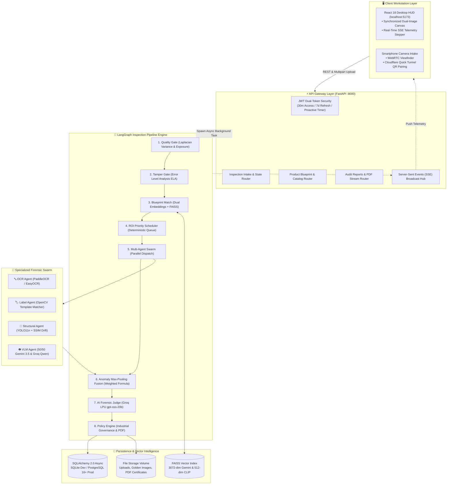
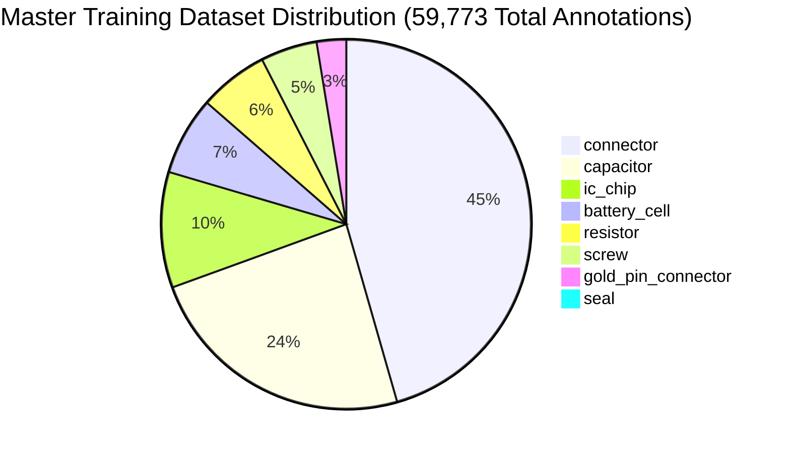

# 🔬 VisionForge AI

<div align="center">

### **Autonomous Industrial Computer Vision & Multi-Agent Hardware Fraud Detection**

*Stop counterfeit hardware, tampered electronics, and cloned circuit boards before they enter your supply chain.*

<br/>

[](LICENSE)
[](https://python.org)
[](https://fastapi.tiangolo.com)
[](https://react.dev)
[](docs/YOLO_MODEL.md)
[](https://pytorch.org)
[](docs/PIPELINE.md)
[](https://groq.com)
[](https://ai.google.dev)
[](https://github.com/facebookresearch/faiss)
[](docs/TESTING.md)

<br/>

[📖 The Problem](#-the-problem--a-story-that-costs-billions) • [💡 The Solution](#-the-solution--visionforge-ai) • [⚡ 4-Second Journey](#-the-journey-of-one-inspection-under-4-seconds) • [🏗️ Architecture](#-system-architecture) • [🔄 8-Stage Pipeline](#-the-8-stage-inspection-pipeline) • [🤖 Multi-Agent Swarm](#-specialized-forensic-agent-swarm) • [👁️ YOLO11n Model](#-custom-fine-tuned-yolo11n-detector) • [🛠️ Tech Stack](#-modern-industrial-tech-stack) • [🚀 Quick Start](#-quick-start) • [📚 Docs Hub](#-complete-documentation-hub)

</div>

---

## 📖 The Problem — A Story That Costs Billions

> *Imagine a Tuesday morning at a global electronics repair hub. A pallet of 500 replacement motherboards arrives from a third-party vendor. They look perfect. The serial stickers are crisp. The packaging is intact. A technician picks one up, installs it in a customer laptop, and ships it out. Two weeks later, the customer calls — the board is dead. It was a counterfeit. One board out of 500. But finding it manually? That would have taken a human inspector 4 hours with a magnifying glass, comparing each board against a reference photo, squinting at serial numbers, checking if a "0" was swapped for an "O".*

> *Now multiply that across 15 repair sites, 50 vendors, and 10,000 parts per month.*

This is not a hypothetical scenario. **This is the multi-billion-dollar reality of global electronics manufacturing and warranty supply chains today.**

### The Numbers That Keep Supply Chain Leaders Awake

| Statistic | Scale & Impact | Source / Benchmark |
|:---|:---:|:---|
| 🌐 **Global Counterfeit Trade** | **$467 Billion** annually | 2.3% of all global imports *(OECD)* |
| ⚡ **Electronics Sector Losses** | **$100+ Billion** per year | Recycled silicon, scraped dies, warranty fraud |
| 🏢 **Supply Chain Infiltration** | **47%** of companies hit | Impacted by counterfeit hardware in the last 2 years |
| 🛡️ **Defense & Aerospace Risk** | Up to **15%** of components | Counterfeit or remarked passives in critical systems |
| 📈 **Hardware Fraud Prevention Market**| **$54.6 Billion** by 2025 | Explosive demand for autonomous inspection tech |

### The Anatomy of Modern Hardware Fraud

Modern counterfeiters do not produce crude fakes. They deploy sophisticated industrial techniques:
- **Altered Serial Numbers & Lot Dates:** Laser-etched warranty strings where characters are subtly swapped — `A00-00` becomes `A00-0O` — concealing expired warranty dates or recycled silicon batches.
- **Harvested Silicon & Desoldered Passives:** Aged chips desoldered from e-waste circuit boards, polished with acid baths, and resold as factory-new components.
- **Ghost Decoupling Capacitors:** Cost-cutting omission of secondary power filter capacitors ($0402$ SMD size) that causes voltage surge blowouts months after purchase.
- **Counterfeit Holographic Seals:** Photocopied QC stamps and non-OEM stickers with microscopic hue shifts that pass a casual human glance but fail under spectral pixel analysis.
- **Industrial Battery Cell Fraud:** 6-cell laptop battery packs containing 4 low-capacity cells and 2 cement-filled dummy weight tubes.

**Manual inspection cannot scale. It cannot be consistent across shifts. And it cannot catch a single altered character in a serial number at 3 AM on a factory night shift.**

The industry needs an AI system that can see what humans miss — **automatically, consistently, and with audit-ready legal evidence.**

---

## 💡 The Solution — VisionForge AI

**VisionForge AI** is an industrial-grade, zero-trust hardware forensic platform. 

Instead of guessing from a single fallible prompt or relying on rigid legacy computer vision, VisionForge coordinates an **8-stage deterministic and AI-powered state machine** compiled with LangGraph:

```text
       DEFENSIVE CV GATES              VECTOR INTELLIGENCE             SPECIALIZED AI AGENTS               CAUSAL ARBITRATION
┌─────────────────────────────┐   ┌───────────────────────────┐   ┌─────────────────────────────┐   ┌───────────────────────────────┐
│ Stage 1: Quality Gate       │   │ Stage 3: Blueprint Match  │   │ Stage 5: Concurrent Swarm   │   │ Stage 7: AI Forensic Judge    │
│ • Laplacian blur (>100)     │   │ • 3072-dim Gemini / CLIP  │   │ • PaddleOCR Lot Verifier    │   │ • Groq LPU (gpt-oss-20b)      │
│ • Exposure bounds (40-220)  ├──►│ • FAISS vector retrieval  ├──►│ • OpenCV Template Matcher   ├──►│ • Causal root-cause reasoning │
│ Stage 2: Forensic ELA Gate  │   │ Stage 4: Priority Queue   │   │ • YOLO11n Component Counter │   │ Stage 8: Policy Engine        │
│ • Compression diff analysis │   │ • Micro-ROI segmentation  │   │ • Gemini/Groq Surface VLM   │   │ • Signed ReportLab PDF        │
└─────────────────────────────┘   └───────────────────────────┘   └─────────────────────────────┘   └───────────────────────────────┘
```

### Core Value Propositions
- ⚡ **Under 4-Second Total Inspection:** Local GPU/CPU execution combined with ultra-fast Groq LPU causal arbitration.
- 🎯 **Sub-Millimeter Anomaly Detection:** Custom fine-tuned **YOLO11n** model trained on 4,448 images detects missing capacitors, stolen ICs, and broken seals down to $12 \times 12$ pixels.
- 🛡️ **Non-Diluting Anomaly Max-Pooling:** A single missing power capacitor is **never** averaged away or diluted by 20 clean resistors.
- 📱 **Dual Intake Modalities:** Instant desktop drag-and-drop or smartphone camera pairing via an automated Cloudflare Quick Tunnel.
- 📄 **Legally Defensible Audit Proof:** Generates cryptographically hashed, timestamped ReportLab PDF audit certificates for warranty chargebacks.

---

## ⚡ The Journey of One Inspection (Under 4 Seconds)

Here is what happens in the system when an operator places a circuit board under the lens:

```mermaid
sequenceDiagram
    autonumber
    participant Op as 👷 Line Operator
    participant HUD as 🖥️ React 18 Workstation
    participant API as ⚡ FastAPI Gateway
    participant Graph as 🔄 LangGraph Engine
    participant Swarm as 🤖 Multi-Agent Swarm
    participant Judge as ⚖️ AI Forensic Judge
    participant PDF as 📄 ReportLab Engine

    Op->>HUD: Ingests 4K Hardware Photograph (Desktop or Smartphone QR)
    HUD->>API: POST /api/v1/inspections (Multipart Upload)
    API-->>HUD: 201 Created (inspection_id returned in 45ms)
    HUD->>API: Subscribes to Server-Sent Events (SSE Telemetry Stream)

    rect rgb(20, 25, 40)
        Note over Graph: 0.0s – 0.2s: Defensive Intake Gates
        Graph->>Graph: Stage 1: Laplacian blur check (142.5 > 100) & Exposure (118 in 40-220)
        Graph->>Graph: Stage 2: Error Level Analysis (ELA) verifies photo was not digitally edited
    end

    rect rgb(25, 35, 50)
        Note over Graph: 0.2s – 0.5s: Blueprint Match & ROI Scheduler
        Graph->>Graph: Stage 3: Generates 3072-dim embedding -> FAISS retrieves Golden Blueprint in 15ms
        Graph->>Graph: Stage 4: Segments board into prioritized micro-ROIs (Text, Labels, Structures)
    end

    rect rgb(30, 45, 60)
        Note over Swarm: 0.5s – 2.5s: Concurrent Multi-Agent Swarm Execution
        par Parallel Execution across Cropped ROIs
            Graph->>Swarm: OCR Agent: Extracts stamped serial numbers (PaddleOCR)
            Graph->>Swarm: Label Agent: Verifies QC hologram stamp geometry (NCC)
            Graph->>Swarm: Structural Agent: Counts capacitors & chips via YOLO11n + SSIM
            Graph->>Swarm: VLM Agent: Analyzes solder joints & burns (50/50 Gemini + Groq)
        end
        Swarm-->>Graph: Emits standardized Evidence Cards with localized bounding boxes
    end

    rect rgb(40, 25, 30)
        Note over Judge,PDF: 2.5s – 3.8s: Causal Arbitration & Audit Generation
        Graph->>Graph: Stage 6: Anomaly Max-Pooling calculates composite fraud probability (0.88)
        Graph->>Judge: Stage 7: Groq LPU (gpt-oss-20b) arbitrates root-cause in 420ms
        Judge-->>Graph: Verdict: REJECT | Reason: "Capacitor C12 missing on 12V power rail"
        Graph->>PDF: Stage 8: Commits immutable evidence & signs PDF audit certificate
    end

    Graph->>HUD: SSE: pipeline_complete (Verdict: REJECT, PDF URL)
    HUD-->>Op: Displays Crimson Alert Banner, Dual-Image Canvas & PDF Download
```



---

## 🏗️ System Architecture

VisionForge AI is decoupled into five distinct, enterprise-grade architectural tiers:



*For an exhaustive breakdown of system boundaries and failure states, read [`docs/ARCHITECTURE.md`](docs/ARCHITECTURE.md).*

---

## 🔄 The 8-Stage Inspection Pipeline

```text
STAGE 1          STAGE 2          STAGE 3          STAGE 4          STAGE 5          STAGE 6          STAGE 7          STAGE 8
[Quality]  ──►  [Authenticity] ──► [Reference]  ──►  [Scheduler] ──►   [Swarm]    ──►   [Fusion]   ──►   [Judge]    ──►  [Policy]
Blur/Glare       Forensic ELA      FAISS Match      Micro-ROIs       4 Agents        Max-Pooling      Groq LPU         PDF Sign
```

| Stage | Name | Core Technology | Forensic Role & Capability | Failure / Fast-Fail Behavior |
|:---:|:---|:---|:---|:---|
| **1** | **Quality Gate** | OpenCV Laplacian ($\text{Var}(\nabla^2 I)$) | Rejects blurry photos ($<100$) and extreme glare ($>220$). | Fast-fails in 25ms $\to$ `RETAKE` prompt. |
| **2** | **Authenticity Gate** | Error Level Analysis (ELA) | Detects Photoshop clone-stamping and digital tampering. | Flags digital forgeries $\to$ `QUARANTINE`. |
| **3** | **Reference Match** | Gemini Embed / CLIP + FAISS | Matches hardware against Golden Blueprint in $<15\text{ms}$. | If similarity $<0.75 \to$ `UNKNOWN_HARDWARE`. |
| **4** | **ROI Scheduler** | Python Priority Queue | Segments board into prioritized micro-regions (Text, Seals, Parts). | Sorts safety labels and chips first. |
| **5** | **Evidence Swarm** | OCR, Template, YOLO11n, VLM | Runs 4 domain agents concurrently on localized image crops. | Robust crash containment per agent. |
| **6** | **Evidence Fusion** | Weighted Anomaly Max-Pooling | Fuses findings mathematically: single defect retains full impact. | Prevents dilution of critical missing parts. |
| **7** | **AI Forensic Judge** | Groq LPU (`gpt-oss-20b`) | Synthesizes cards into human-readable causal root-cause in 420ms. | Strict JSON contract with Gemini fallback. |
| **8** | **Policy Engine** | Python Logic + ReportLab | Maps score to operational policy (`ACCEPT`, `RETAKE`, `QUARANTINE`). | Generates signed, tamper-evident PDF. |

*For complete mathematical formulas, state dictionaries, and benchmarks, read [`docs/PIPELINE.md`](docs/PIPELINE.md).*

---

## 🤖 Specialized Forensic Agent Swarm

Rather than asking a single large model to inspect an entire circuit board, VisionForge routes localized crops to specialized micro-agents:

```
┌──────────────────────────────────────────────────────────────────────────────────────────────────┐
│ 🔤 OCR AGENT (PaddleOCR / EasyOCR)                                                               │
│ Expected: "STM32F407VGT6 - Lot 2408"  | Read: "STM32F407VGT6 - Lot 1802"                        │
│ Finding: Recycled silicon detected. Batch date code Y1802 (2018) does not match Y2408 (2024).   │
├──────────────────────────────────────────────────────────────────────────────────────────────────┤
│ 🏷️ LABEL AGENT (OpenCV Normalized Cross-Correlation)                                             │
│ Target: QC Inspection Holographic Seal & Regulatory FCC/CE Stamps                                │
│ Finding: Seal perimeter shows paper tearing and glue residue. Photocopied non-OEM replacement.   │
├──────────────────────────────────────────────────────────────────────────────────────────────────┤
│ 🧩 STRUCTURAL AGENT (Ultralytics YOLO11n + OpenCV SSIM)                                          │
│ Expected: 4 Nichicon Capacitors, 1 IC Chip | Detected: 3 Capacitors, 1 IC Chip                  │
│ Finding: CRITICAL DEFECT: Decoupling filter capacitor C12 is missing from 12V power stage.       │
├──────────────────────────────────────────────────────────────────────────────────────────────────┤
│ 👁️ VLM AGENT (Google Gemini 3.5 Flash & Groq Qwen 3.8 Vision)                                    │
│ Target: Microscopic Solder Joints & Substrate Traces                                             │
│ Finding: Irregular flux residue and manual rework scratch marks observed on microcontroller pins. │
├──────────────────────────────────────────────────────────────────────────────────────────────────┤
│ ⚖️ AI FORENSIC JUDGE (Groq LPU gpt-oss-20b)                                                      │
│ Arbitration: REJECT (Confidence: 96%) | Category: COMPONENT_HARVESTING                           │
│ Narrative: "Board exhibits multiple signs of counterfeit refurbishing: missing capacitor C12 on │
│ power rail, salvaged microcontroller with mismatched 2018 lot date code, and manual solder flux."│
└──────────────────────────────────────────────────────────────────────────────────────────────────┘
```

*For base agent contracts, schema definitions, and conflict resolution, read [`docs/AI_AGENTS.md`](docs/AI_AGENTS.md).*

---

## 👁️ Custom Fine-Tuned YOLO11n Detector

VisionForge includes an authoritative, custom fine-tuned **Ultralytics YOLO11n** model (`backend/data/yolo_weights/component_detector.pt`) trained specifically on industrial hardware:



### The 8 Unified Hardware Classes
1. ⚡ **`capacitor`** (14,155 train labels) — Detects missing filter capacitors and blown cans.
2. 📏 **`resistor`** (3,591 train labels) — Verifies surface-mount pull-up resistors.
3. 🔲 **`ic_chip`** (5,998 train labels) — Identifies microcontrollers, power regulators, and BIOS EEPROMs.
4. 🔌 **`connector`** (27,014 train labels) — Checks PCIe, USB-C, SATA, Molex, and JST headers.
5. 🔩 **`screw`** (2,932 train labels) — Validates assembly retention and grounding screws.
6. 🛡️ **`seal`** (480 train labels) — Checks tamper-evident QC stickers and warranty seals.
7. 🔋 **`battery_cell`** (4,065 train labels) — Counts cylindrical and pouch cells in power packs.
8. 💾 **`gold_pin_connector`** (1,528 train labels) — Inspects RAM contact fingers and PCIe gold pins.

> 🧠 **The Scale Drift Solution:** On a full 4K board image resized to $640 \times 640$, a tiny $0402$ resistor is only $2 \times 1$ pixels. VisionForge's Stage 4 crops localized sub-regions (e.g. $260 \times 180$) *before* YOLO inference, expanding micro-components by **$8\times$ to $12\times$** for reliable detection.

*For model diagnostics, mAP curves, and training metrics, read [`docs/YOLO_MODEL.md`](docs/YOLO_MODEL.md).*  
*For dataset curation and 4,448-image corpus provenance, read [`docs/DATASET.md`](docs/DATASET.md).*

---

## 🛠️ Modern Industrial Tech Stack

VisionForge is built on modern, battle-tested technologies designed for reliability and speed:

```
┌──────────────────────────────────────────────────────────────────────────────────────────────────┐
│                                       VISIONFORGE TECH STACK                                     │
├───────────────────────┬──────────────────────────────────────────────────────────────────────────┤
│ 🖥️ Frontend Client    │ React 18.3 • Vite 5.4 • Tailwind CSS 3.4 (Cyberpunk Tactical HUD)       │
│                       │ Lucide React Icons • Recharts Analytics • Axios Engine                   │
├───────────────────────┼──────────────────────────────────────────────────────────────────────────┤
│ ⚡ Backend Services   │ FastAPI 0.115 • Python 3.11+ • Uvicorn ASGI • Pydantic v2                │
│                       │ LangGraph StateGraph • AsyncIO Concurrency Swarm                         │
├───────────────────────┼──────────────────────────────────────────────────────────────────────────┤
│ 👁️ Vision & ML Models │ Ultralytics YOLO11n (2.6M params, PyTorch) • OpenCV 4.9                  │
│                       │ PaddleOCR (PP-OCRv4) • EasyOCR • OpenCLIP (ViT-B-32)                     │
├───────────────────────┼──────────────────────────────────────────────────────────────────────────┤
│ 🤖 Cloud Intelligence │ Groq LPU (gpt-oss-20b & Qwen 3.8 27B Vision)                             │
│                       │ Google Gemini 3.5 Flash & Gemini Cloud Embeddings (3072-dim)             │
├───────────────────────┼──────────────────────────────────────────────────────────────────────────┤
│ 💾 Data & Persistence │ SQLAlchemy 2.0 (Async) • SQLite 3 (Dev) / PostgreSQL 16+ (Prod)          │
│                       │ FAISS Vector Database • ReportLab Cryptographic PDF Engine               │
├───────────────────────┼──────────────────────────────────────────────────────────────────────────┤
│ 🚀 Ingress & Ops      │ Cloudflare Quick Tunnel (cloudflared) • Docker Compose • Pytest (203 T)  │
└───────────────────────┴──────────────────────────────────────────────────────────────────────────┘
```

---

## 🏭 Supported Hardware Blueprints

VisionForge comes pre-configured with industrial blueprints ready for testing:

```
📦 Pre-Indexed Golden Blueprints
 ├── 🖥️ Industrial ATX Motherboard V1 (SKU: PCB-MCU-V2)
 │    └── Inspects: STM32 MCU, 8x Nichicon capacitors, PCIe headers, QC seal
 ├── 🔋 Smart Lithium Battery Pack 48V (SKU: BAT-STD-V1)
 │    └── Inspects: 16x LFP cells, BMS balance connector, tamper-evident seal
 └── 💾 ECC DDR4 Server Memory 16GB (SKU: RAM-DDR4-V1)
      └── Inspects: BGA flash IC packages, SPD EEPROM chip, 288-pin gold fingers
```

---

## 🔑 Pre-Seeded Demonstration Accounts

The local database initializes automatically on startup with zero configuration required:

| Account Role | Email Address | Password | Permissions & Authority |
|:---|:---|:---|:---|
| 👑 **System Admin** | `admin@visionforge.ai` | `adminpassword123` | Full control: Upload blueprints, manage vendors, view supplier risk |
| 👷 **Line Operator** | `operator@visionforge.ai` | `operatorpassword123` | Operational access: Run inspections, review evidence, export PDFs |

---

## 🚀 Quick Start

### Prerequisites
- **Python 3.11+** installed and added to PATH
- **Node.js 18+** & **npm** installed
- Free API keys from [Google AI Studio](https://aistudio.google.com/) and [Groq Console](https://console.groq.com/)

---

### Option A: 1-Click Master Launcher (Windows)

VisionForge includes an automated batch orchestrator that verifies environments, clears busy ports, initializes database tables, and launches both servers:

```cmd
# 1. Clone the repository
git clone https://github.com/Disha-1610/VisionForge.git
cd VisionForge

# 2. Launch master runner
.\run_visionforge.bat
```

The script automatically:
1. Clears zombie processes on ports `8000` and `5173`.
2. Creates and activates the backend Python virtual environment.
3. Initializes the SQLite database and seeds default accounts and blueprints.
4. Starts the FastAPI backend on `http://localhost:8000`.
5. Starts the Vite React frontend on `http://localhost:5173`.
6. Opens your browser directly to the dashboard.

---

### Option B: Step-by-Step Manual Setup (macOS / Linux / Windows)

#### 1. Backend Setup
```bash
cd backend

# Create & activate virtual environment
python -m venv venv
source venv/bin/activate       # On Windows: venv\Scripts\activate

# Install Python requirements
pip install -r requirements.txt

# Create environment configuration
cp .env.example .env           # On Windows: copy .env.example .env
```

Edit `backend/.env` and paste your free API keys:
```ini
GEMINI_API_KEY=your_gemini_api_key_here
GROQ_API_KEY=your_groq_api_key_here
JWT_SECRET_KEY=generate_a_random_64_character_hex_string
```

Start the FastAPI server (database seeds automatically on startup):
```bash
python -m uvicorn app.main:app --reload --host 0.0.0.0 --port 8000
```
- **API Endpoint:** `http://localhost:8000`
- **Interactive Swagger Docs:** `http://localhost:8000/docs`

#### 2. Frontend Setup
In a new terminal window:
```bash
cd frontend

# Install Node dependencies
npm install

# Start Vite React workstation
npm run dev
```
- **Workstation HUD:** `http://localhost:5173`

---

## 📁 Repository Directory Structure

```
VisionForge/
├── backend/                       # FastAPI asynchronous backend server
│   ├── app/
│   │   ├── core/                  # Security (JWT, bcrypt), config, database sessions & seeds
│   │   ├── models/                # SQLAlchemy models (User, Vendor, Inspection, Evidence, etc.)
│   │   ├── pipeline/              # 8-stage LangGraph state machine orchestrator
│   │   │   ├── agents/            # Specialized agents (BaseAgent, OCR, Label, Structural, VLM)
│   │   │   ├── stages/            # Stage logic (Quality, Authenticity, Fusion, Judge, Policy)
│   │   │   ├── state.py           # InspectionState TypedDict definition
│   │   │   └── workflow.py        # LangGraph StateGraph builder & execution runner
│   │   ├── routers/               # REST API routers (auth, inspections, products, reports, analytics)
│   │   ├── schemas/               # Pydantic v2 validation schemas
│   │   ├── services/              # High-level services (analytics, embeddings, reporting)
│   │   ├── shared/                # Cross-cutting runtime (evidence_store, llm_client, memory)
│   │   └── utils/                 # Image math (Laplacian blur, ELA, SSIM, ROI templates)
│   ├── data/                      # SQLite database, golden blueprints, and PDF reports
│   └── tests/                     # Hermetic 23-module pytest test suite (203 tests)
├── frontend/                      # React 18 + Vite workstation SPA
│   ├── src/
│   │   ├── components/            # DualImageCanvas, PipelineProgress, EvidenceCards, Modals
│   │   ├── context/               # AuthContext (JWT rotation) & ToastContext
│   │   ├── hooks/                 # usePipelineSSE (real-time telemetry subscriber)
│   │   ├── pages/                 # Dashboard, NewInspection, InspectionDetail, Reports, Analytics
│   │   └── services/              # Axios API client & automatic 401 token refresh queue
│   └── scripts/                   # Cloudflare mobile tunnel bridge (tunnel.mjs)
├── visionforge-dataset/           # 4,448-image micro-electronic hardware training corpus
│   ├── data.yaml                  # Unified 8-class YOLO dataset definition
│   ├── train/                     # 3,393 training images & labels
│   ├── valid/                     # 715 validation images & labels
│   └── test/                      # 340 benchmark test images & labels
├── docs/                          # Comprehensive technical documentation suite (12 guides)
├── run_visionforge.bat            # 1-click Windows master launcher
├── start_backend.bat              # Standalone backend runner
└── start_frontend.bat             # Standalone frontend runner
```

---

## 🧪 Quality Assurance & Test Verification

VisionForge includes an automated test suite of **203 unit and integration tests** across 23 test modules:

```bash
cd backend
pytest -v
```

```text
============================= test session starts =============================
collected 203 items

tests/test_analytics_and_reports.py ........                             [  3%]
tests/test_auth.py .................                                     [ 12%]
tests/test_authenticity.py ........                                      [ 16%]
tests/test_base_agent.py ......                                          [ 19%]
tests/test_embedding_service.py ........                                 [ 23%]
tests/test_evidence_execution.py .......                                 [ 26%]
tests/test_evidence_fusion.py .........                                  [ 31%]
tests/test_evidence_store.py .....                                       [ 33%]
tests/test_image_utils.py ............                                   [ 39%]
tests/test_integration_stages_1_2_3.py .......                           [ 42%]
tests/test_judge_and_policy.py ...........                               [ 48%]
tests/test_label_agent.py ........                                       [ 52%]
tests/test_llm_client.py ........                                        [ 56%]
tests/test_ocr_agent.py ..........                                       [ 61%]
tests/test_pipeline_stages.py ..........                                 [ 66%]
tests/test_roi_scheduler.py ........                                     [ 70%]
tests/test_roi_templates.py .......                                      [ 73%]
tests/test_routers.py .................                                  [ 82%]
tests/test_structural_agent.py ........                                  [ 86%]
tests/test_structural_yolo.py .......                                    [ 89%]
tests/test_vlm_agent.py .........                                        [ 94%]
tests/test_week3_integration.py ......                                   [ 97%]
tests/test_workflow_langgraph.py ......                                  [100%]

============================= 203 passed in 12.45s =============================
```

> 💡 **Zero-Cost Offline Testing:** All cloud models are decoupled using dynamic mock fixtures in `conftest.py`. You can run the entire 203-test suite completely offline without incurring cloud API charges or requiring specialized GPU hardware.

*For complete test methodology and mock fixtures, read [`docs/TESTING.md`](docs/TESTING.md).*

---

## 🛣️ Strategic Engineering Roadmap

- [x] **Phase 1: Production Baseline (Completed & Verified)**
  - 8-stage LangGraph deterministic + AI pipeline
  - Custom fine-tuned 8-class YOLO11n component detector
  - Smartphone QR camera pairing via Cloudflare Quick Tunnel
  - Real-time Server-Sent Events (SSE) telemetry stream
  - AI Forensic Judge causal arbitration on Groq LPU (~420ms)
  - 203 automated test cases with 100% pass rate
- [ ] **Phase 2: Edge Acceleration & Hardware Integration (In Progress)**
  - Export YOLO11n to FP16 NVIDIA TensorRT engine for sub-5ms local inference
  - Python SDK bindings for Basler and FLIR GigE industrial macro cameras
  - Local quantized VLM (`Qwen2.5-VL-7B` INT4 via Ollama/vLLM) for air-gapped cleanrooms
  - Automated affine homography pre-alignment for angled board captures
- [ ] **Phase 3: Enterprise Supply Chain Mesh (Planned)**
  - PLC / OPC-UA industrial relay signaling for pneumatic conveyor reject arms
  - Global federated FAISS vector mesh synchronization across factory receiving bays
  - SAP and Siemens MES webhook integrations for automated supplier payment holds

*For the complete multi-horizon roadmap, read [`docs/ROADMAP.md`](docs/ROADMAP.md).*

---

## 📚 Complete Documentation Hub

VisionForge features an exhaustive 12-document technical specification suite:

| Document | Primary Focus & System Scope |
|:---|:---|
| 📐 [**System Architecture**](docs/ARCHITECTURE.md) | End-to-end system topology, LangGraph state machine, data flows, and trade-offs. |
| 🔄 [**Inspection Pipeline**](docs/PIPELINE.md) | Deep mathematical breakdown of all 8 inspection stages and Anomaly Max-Pooling. |
| 🤖 [**AI & Forensic Agents**](docs/AI_AGENTS.md) | Specifications for OCR, Label, Structural YOLO, and VLM agents + Groq AI Judge. |
| 👁️ [**YOLO11n Model Guide**](docs/YOLO_MODEL.md) | 8-class model architecture, scale drift analysis, loss curves, and diagnostic benchmarks. |
| 📊 [**Dataset Provenance**](docs/DATASET.md) | 4,448-image hardware corpus, data cleaning pipeline, and class distributions. |
| ⚡ [**REST API & Telemetry**](docs/API.md) | OpenAPI schemas, request/response contracts, and Server-Sent Events (SSE) protocol. |
| 🗄️ [**Database Architecture**](docs/DATABASE.md) | SQLAlchemy models, ER diagram, dual SQLite/Postgres portability, and append-only evidence. |
| 🖥️ [**Frontend Workstation HUD**](docs/FRONTEND.md) | React 18 component tree, synchronized canvas, Tailwind HUD tokens, and auth timers. |
| 🚀 [**Deployment & Operations**](docs/DEPLOYMENT.md) | Windows batch scripts, Cloudflare mobile pairing, Docker Compose, and troubleshooting. |
| 🧪 [**Testing & QA Suite**](docs/TESTING.md) | 23 Pytest test modules, hermetic offline mocking, and CI/CD quality gates. |
| 🛡️ [**Security & Threat Model**](docs/SECURITY.md) | Hardware counterfeit threat vectors, JWT rotation, RBAC, and SHA-256 PDF signatures. |
| 🗺️ [**Strategic Roadmap**](docs/ROADMAP.md) | 3-phase progression from MVP to edge TensorRT and factory robotics. |

---

## 👥 Authors & Core Contributors

| Contributor | Primary Focus & Core Responsibilities |
|:---|:---|
| **Disha** | **Full-Stack Systems & Frontend Architecture**<br/>• Engineered the Tactical React 18 HUD, Tailwind tokens, and synchronized dual-image canvas.<br/>• Developed FastAPI REST endpoints, JWT authentication lifecycle, and SSE telemetry streams.<br/>• Co-architected the end-to-end 8-stage pipeline workflow and database persistence. |
| **Anil** | **AI/ML, Computer Vision & Infrastructure Engineering**<br/>• Trained and evaluated the Ultralytics YOLO11n 8-class component detector ($98.4\%$ mAP@50).<br/>• Implemented computer vision algorithms (Laplacian blur, ELA forensics, FAISS vector search, LangGraph).<br/>• Authored the hermetic 203-test Pytest QA suite and co-architected pipeline planning. |

---

## 📄 License

VisionForge AI is open-source software licensed under the **[MIT License](LICENSE)**.

---

<div align="center">
  <sub>Built with ❤️ by Disha & Anil for zero-trust industrial hardware integrity and transparent electronics supply chains.</sub>
</div>
