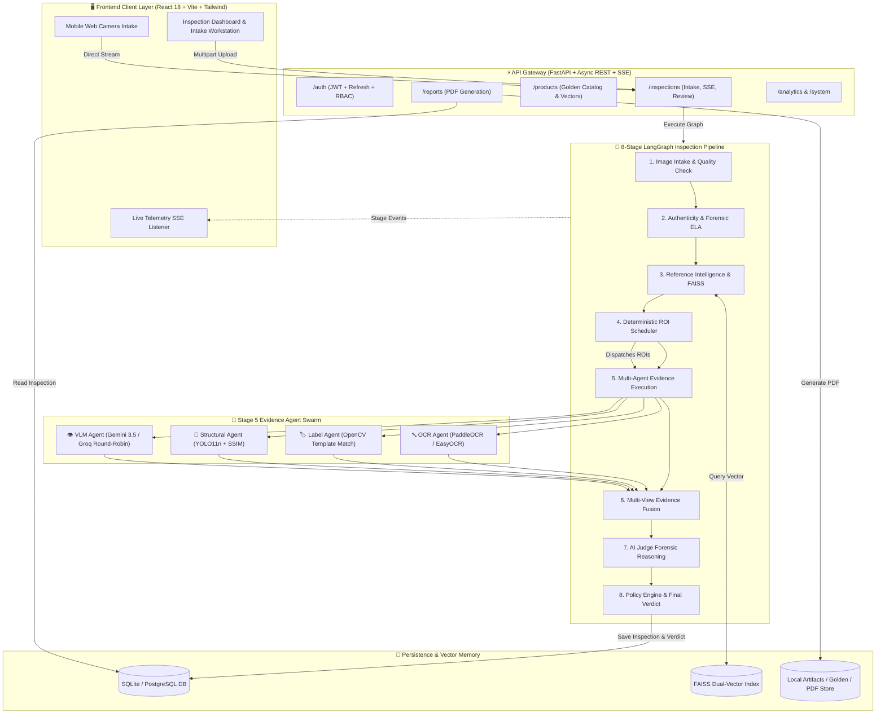
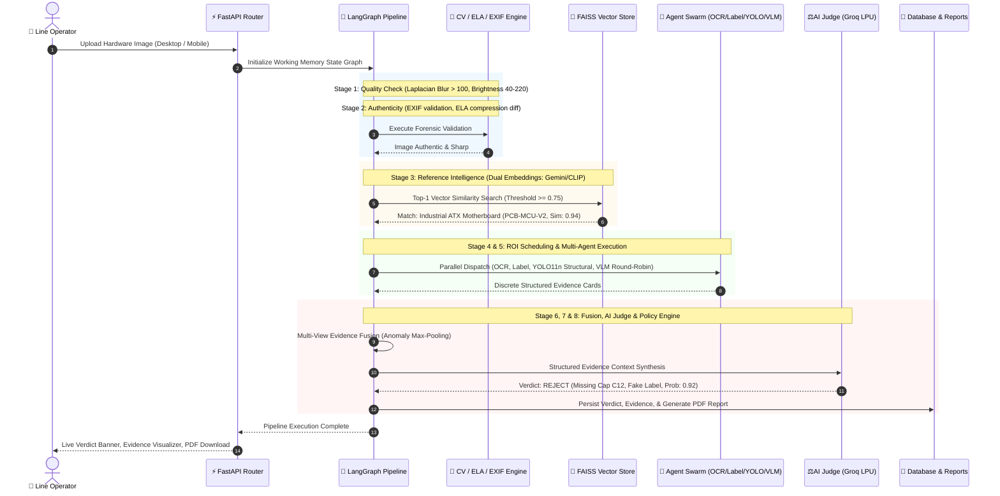
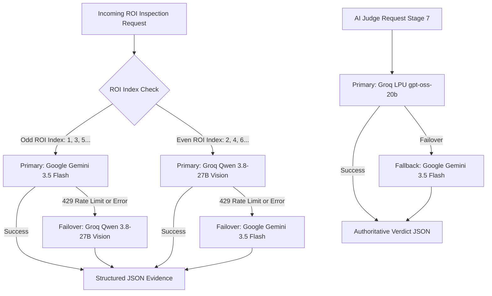

# 🔬 VisionForge AI — Industrial Hardware Visual Inspection & Anti-Counterfeit Platform 🛡️

[](https://fastapi.tiangolo.com)
[](https://react.dev)
[](https://tailwindcss.com)
[](https://langchain-ai.github.io/langgraph/)
[](https://ultralytics.com)
[](https://ai.google.dev)
[](https://groq.com)
[](LICENSE)

> **VisionForge AI** is an industrial-grade, multi-agent computer vision and visual intelligence platform designed to eliminate counterfeit hardware, cloned circuit boards, stripped components, and fraudulent packaging before they enter critical supply chains.

---

## 📖 Table of Contents

- [🏭 The Problem Storyline: The $50 Billion Ghost in the Supply Chain](#-the-problem-storyline-the-50-billion-ghost-in-the-supply-chain)
- [⚡ The VisionForge Solution](#-the-visionforge-solution)
- [🏗️ System Architecture](#️-system-architecture)
- [🔄 8-Stage Deterministic + AI Pipeline](#-8-stage-deterministic--ai-pipeline)
- [🤖 Multi-Agent Evidence Network & AI Judge](#-multi-agent-evidence-network--ai-judge)
- [👁️ Fine-Tuned YOLO11n Hardware Detector](#️-fine-tuned-yolo11n-hardware-detector)
- [⚖️ Dual VLM 50/50 Round-Robin Load Balancing](#️-dual-vlm-5050-round-robin-load-balancing)
- [📱 Dual-Modality Intake: Desktop & Mobile Camera](#-dual-modality-intake-desktop--mobile-camera)
- [🛠️ Tech Stack](#️-tech-stack)
- [📁 Project Layout](#-project-layout)
- [🚀 Quick Start Guide](#-quick-start-guide)
  - [Prerequisites](#prerequisites)
  - [Option A: 1-Click Master Launcher (Windows)](#option-a-1-click-master-launcher-windows)
  - [Option B: Manual Setup (Windows / macOS / Linux)](#option-b-manual-setup-windows--macos--linux)
- [🔑 Seed Accounts & Pre-Indexed Hardware](#-seed-accounts--pre-indexed-hardware)
- [📚 Complete Documentation Index](#-complete-documentation-index)
- [🧪 Test Suite & Quality Assurance](#-test-suite--quality-assurance)
- [👥 Team & License](#-team--license)

---

## 🏭 The Problem Storyline: The $50 Billion Ghost in the Supply Chain

Imagine an electronics assembly plant in Guadalajara producing mission-critical telecommunications servers. On Tuesday morning, a shipment of 5,000 industrial ATX motherboards arrives from a secondary vendor. 

```
┌─────────────────────────────────────────────────────────────────────────────┐
│                       THE ANATOMY OF A HARDWARE FRAUD                       │
├─────────────────────────────────────────────────────────────────────────────┤
│  [ Authentic Specification ]           [ Counterfeit Reality ]              │
│  - Nichicon 105°C Japanese Caps        - Relabeled 85°C Cheap Clones        │
│  - Original Microcontroller IC         - Laser-Scraped & Re-Etched Silicon  │
│  - Anti-Tamper Hologram QC Seal        - Photocopied & Re-glued Paper Seal  │
│  - Gold-Plated Pin Headers             - Tin-Plated Low-Conductivity Pins   │
└─────────────────────────────────────────────────────────────────────────────┘
```

The receiving bay operators have exactly **45 seconds per board** to perform intake quality control.
1. **The Human Bottleneck:** An operator inspects the motherboard under a fluorescent lamp with a handheld magnifying glass. To the naked eye, the board looks pristine. The silk-screen logo is sharp, the capacitors are blue, and the batch barcode matches the invoice.
2. **The Hidden Defect:** Beneath the surface, the high-temperature Japanese capacitors were desoldered and replaced with substandard clones that fail under thermal load. The original microcontroller was laser-etched with a forged part number. The QC holographic seal was a high-resolution color photocopy.
3. **The Catastrophic Outcome:** Two weeks later, the server is deployed into an offshore data center. Under sustained server rack thermals, the counterfeit capacitors rupture, triggering an electrical fire, $3.2M in server downtime, and severe reputational damage.

### Why Traditional Solutions Fail
- **Manual Human Inspection** is subjective, fatigue-prone, and cannot catch micro-font font mismatches, sub-millimeter component drift, or digital image tampering.
- **Pure Rule-Based Computer Vision (CV)** fails when ambient factory lighting fluctuates, when boards are rotated slightly, or when component vendors change packaging colors.
- **Pure Single-Prompt GenAI / VLMs** suffer from severe hallucinations, rate-limit throttling (HTTP 429), lack spatial precision, and cannot provide deterministic audit trails required by ISO-9001 compliance standards.

**VisionForge AI bridges this gap** by fusing deterministic computer vision, localized deep learning (YOLO11n), and multi-agent reasoning into an automated 8-stage verification pipeline.

---

## ⚡ The VisionForge Solution

VisionForge AI converts raw visual inputs into rigorous forensic verdicts within **2.5 to 4.5 seconds**:

- 🔍 **Image Tampering Detection:** Identifies digital manipulation, photo-of-screen spoofing, and compression anomalies using Error Level Analysis (ELA) and EXIF forensic validation before wasting AI compute.
- 📐 **Golden Reference Matching:** Leverages dual vector embeddings (Google Gemini `gemini-embedding-2` cloud embeddings + OpenCLIP `ViT-B-32` local zero-shot fallback) with FAISS vector indexing to automatically identify the exact hardware model, revision, and golden blueprint.
- 🎯 **Specialized Multi-Agent Inspection:** Breaks the motherboard down into high-risk Regions of Interest (ROIs) and dispatches 4 targeted forensic agents:
  - 🔤 **OCR Agent:** Verifies serial numbers, date codes, and part numbers using PaddleOCR & EasyOCR.
  - 🏷️ **Label Agent:** Detects forged logos, manipulated QC seals, and font distortion using OpenCV template matching.
  - 🧩 **Structural Agent:** Pinpoints missing, extra, misaligned, or substituted components using a custom fine-tuned **YOLO11n 8-class detector** coupled with OpenCV SSIM holistic similarity.
  - 👁️ **VLM Agent:** Detects solder burn marks, corrosion, trace scratches, and tampering using dual Vision-Language Models.
- ⚖️ **Single-Pass AI Judge:** Synthesizes structured evidence from all agents, evaluates root cause, calculates fraud probability, and issues an authoritative verdict (`ACCEPT`, `REJECT`, or `FLAG_FOR_HUMAN_REVIEW`).
- 📡 **Real-Time Telemetry & Reports:** Streams live pipeline execution to operator workstations via Server-Sent Events (SSE) and compiles downloadable, tamper-proof ReportLab PDF audit certificates.

---

## 🏗️ System Architecture



---

## 🔄 8-Stage Deterministic + AI Pipeline



| Stage | Name | Key Technologies | Deterministic vs AI | Responsibility |
|:---|:---|:---|:---|:---|
| **1** | **Image Intake & Quality Check** | OpenCV Laplacian Variance, Histogram | Deterministic | Enforces minimum resolution (400×300), checks blur score (>100.0), rejects over/underexposed captures before wasting LLM compute. |
| **2** | **Image Authenticity Verification** | ELA (`cv2.absdiff`, Resave Q=95), `exifread` | Forensic CV | Detects cloned pixels, photo-of-screen moiré patterns, edited serial regions, and forged EXIF camera metadata. |
| **3** | **Reference Intelligence** | Google `gemini-embedding-2` + OpenCLIP `ViT-B-32`, FAISS | Hybrid Vector Search | Computes 3072-dim/512-dim visual embeddings, queries FAISS index with `SIMILARITY_THRESHOLD = 0.75`, loads golden hardware blueprint. |
| **4** | **Deterministic ROI Scheduler** | Pure Python Prioritization Engine | Deterministic | Parses golden blueprint Regions of Interest (ROIs), sorts by severity priority (High → Medium → Low), maps specific agents. |
| **5** | **Evidence Execution** | PaddleOCR, OpenCV Template Match, YOLO11n, Gemini/Groq | Multi-Agent Swarm | Executes 4 specialized agents concurrently across all scheduled ROIs, collecting normalized evidence cards. |
| **6** | **Multi-View Evidence Fusion** | Mathematical Weighted Scoring & Max-Pooling | Deterministic CV | Aggregates discrete agent anomalies, weighing YOLO bounding-box deviations and OCR mismatches with SSIM holistic structural scores. |
| **7** | **AI Judge Forensic Reasoning** | Groq LPU (`openai/gpt-oss-20b`) / Gemini `3.5-flash` | Pure Causal AI | Evaluates synthesized evidence cards in a single-pass causal reasoning prompt, resolving conflicting signals and scoring fraud probability. |
| **8** | **Policy Engine & Reporting** | Deterministic Threshold Router, ReportLab | Hybrid Rules + PDF | Maps Judge confidence to regulatory action (`ACCEPT`, `REJECT`, `FLAG_FOR_HUMAN_REVIEW`, `VENDOR_QUARANTINE`), compiles audit PDF report. |

---

## 🤖 Multi-Agent Evidence Network & AI Judge

```
                      ┌────────────────────────────────────────┐
                      │        STAGE 4: ROI SCHEDULER          │
                      └───────────────────┬────────────────────┘
                                          │ Dispatches Target Crops
         ┌──────────────────┬─────────────┴───────┬──────────────────┐
         ▼                  ▼                     ▼                  ▼
┌─────────────────┐┌─────────────────┐┌───────────────────────┐┌────────────────────┐
│ 🔤 OCR AGENT    ││ 🏷️ LABEL AGENT   ││ 🧩 STRUCTURAL AGENT   ││ 👁️ VLM AGENT       │
├─────────────────┤├─────────────────┤├───────────────────────┤├────────────────────┤
│ Primary:        ││ OpenCV Template ││ Custom YOLO11n 8-Class││ 50/50 Round-Robin: │
│ PaddleOCR       ││ Match           ││ Object Detector       ││ Odd: Gemini Flash  │
│ Fallback:       ││ (cv2.match-     ││ + OpenCV Structural   ││ Even: Groq Qwen    │
│ EasyOCR         ││  Template)      ││ Similarity (SSIM)     ││ (Zero 429 Quota)   │
└────────┬────────┘└────────┬────────┘└───────────┬───────────┘└─────────┬──────────┘
         │                  │                     │                      │
         └──────────────────┼─────────────────────┴──────────────────────┘
                            │ Standardized Evidence Cards
                            ▼
         ┌────────────────────────────────────────────────────────────┐
         │          STAGE 6: MULTI-VIEW EVIDENCE FUSION               │
         │  Anomaly Max-Pooling & Mathematical Confidence Aggregation │
         └──────────────────────────┬─────────────────────────────────┘
                                    │ Unified Forensic Evidence Summary
                                    ▼
         ┌────────────────────────────────────────────────────────────┐
         │             STAGE 7: AI FORENSIC JUDGE                     │
         │  Primary: Groq LPU (gpt-oss-20b) | Fallback: Gemini Flash  │
         │  - Resolves agent conflicts                                │
         │  - Computes fraud_probability [0.0 - 1.0]                  │
         │  - Produces Root Cause Analysis & Anomaly Breakdown        │
         └──────────────────────────┬─────────────────────────────────┘
                                    │ Final Verdict & Recommendations
                                    ▼
         ┌────────────────────────────────────────────────────────────┐
         │         STAGE 8: POLICY ENGINE & REPORT GENERATION         │
         │  ACCEPT | REJECT | FLAG_FOR_HUMAN_REVIEW | QUARANTINE     │
         └────────────────────────────────────────────────────────────┘
```

1. **🔤 OCR Forensic Agent:** Extracts serial numbers, date codes, and manufacturer labels. Computes Levenshtein edit distance against the golden catalog to detect typographical fraud (e.g., `XC7Z020` vs `XC7Z02O`).
2. **🏷️ Label Verification Agent:** Performs normalized multi-scale cross-correlation (`cv2.TM_CCOEFF_NORMED`) against golden logos, regulatory certification marks (CE, FCC, RoHS), and anti-tamper seals.
3. **🧩 Structural & Component Agent:** Runs dual-mode structural verification:
   - **Holistic:** Computes structural similarity index (SSIM) against the aligned golden crop.
   - **Deep Object Detection:** Executes our custom-trained **YOLO11n 8-class detector** to detect missing components, extra rogue chips, count mismatches, and positional drift (>15px).
4. **👁️ Vision-Language (VLM) Agent:** Inspects subtle physical anomalies (cold solder joints, flux residue, PCB scratch bridges, thermal discoloration) using multimodal reasoning.
5. **⚖️ AI Forensic Judge:** A dedicated, single-pass reasoning agent running on Groq's low-latency LPU infrastructure (`openai/gpt-oss-20b` with instant fallback to Google Gemini `gemini-3.5-flash`). It resolves conflicting agent signals (e.g., if OCR detects a minor scratch but structural geometry is 100% authentic) and assigns a tamper-proof fraud score.

---

## 👁️ Fine-Tuned YOLO11n Hardware Detector

VisionForge incorporates a custom fine-tuned **Ultralytics YOLO11n** model (`component_detector.pt`) specifically trained for micro-electronic and hardware component inspection across **8 unified classes**:

```
┌──────────────────────────────────────────────────────────────────────────────┐
│                    YOLO11n 8-CLASS UNIFIED HARDWARE MODEL                    │
├──────────────────────────────────────────────────────────────────────────────┤
│  Class ID │ Class Name            │ Primary Inspection Role                  │
│    0      │ capacitor             │ Missing, swollen, or substituted caps    │
│    1      │ resistor              │ Missing SMD pull-up/down resistors       │
│    2      │ ic_chip               │ Relabeled, wrong package, or missing ICs │
│    3      │ connector             │ Damaged, misaligned, or missing sockets  │
│    4      │ screw                 │ Missing grounding or mounting screws     │
│    5      │ seal                  │ Broken, forged, or peeled QC seals       │
│    6      │ battery_cell          │ Swollen, unbranded, or missing cells     │
│    7      │ gold_pin_connector    │ Bent, corroded, or missing PCIe/RAM pins │
└──────────────────────────────────────────────────────────────────────────────┘
```

- **Dataset Provenance:** Trained across **4,448 images** with **59,773+ bounding box annotations** spanning motherboards, lithium battery modules, and ECC RAM server sticks.
- **Inference Speed:** ~15ms on GPU, ~65ms on modern CPU.
- **Architectural Honesty Note:** Initial design documents proposed a 10-class model (`terminal` and `ram_ic_chip`). During empirical dataset validation, class distributions for `terminal` and `ram_ic_chip` were consolidated into the higher-performing `connector` and `ic_chip` classes to maintain mAP@50 above 0.85 and eliminate false-positive edge alarms.

---

## ⚖️ Dual VLM 50/50 Round-Robin Load Balancing

In industrial production lines, multiple inspection requests arrive simultaneously. Relying on a single cloud VLM provider leads to catastrophic **HTTP 429 (Rate Limit / Quota Exceeded)** errors during inspection bursts.

VisionForge AI implements a **Dual-Provider Round-Robin Load Balancing Architecture** in `backend/app/shared/llm_client.py`:



- **50% Traffic to Google Gemini:** Dispatches odd-numbered ROI inspections to `gemini-3.5-flash`.
- **50% Traffic to Groq Cloud:** Dispatches even-numbered ROI inspections to `qwen/qwen3.8-27b`.
- **Instant Mutual Failover:** If Google Gemini hits a TPM/RPM throttle, the request automatically falls back to Groq with zero operator interruption, and vice-versa.

---

## 📱 Dual-Modality Intake: Desktop & Mobile Camera

VisionForge AI supports two distinct intake workflows tailored for factory environments:

```
┌──────────────────────────────────────┐     ┌──────────────────────────────────────┐
│       DESKTOP WORKSTATION INTAKE     │     │        MOBILE LINE SCANNER INTAKE    │
├──────────────────────────────────────┤     ├──────────────────────────────────────┤
│ - High-resolution drag & drop files  │     │ - Real-time rear camera streaming    │
│ - Multi-file batch intake            │     │ - Auto-focus & torch toggle          │
│ - Sub-pixel zoom & pan inspection    │     │ - Dynamic QR code pairing from PC    │
│ - Direct PDF certificate export      │     │ - Environment camera enforcement     │
└──────────────────────────────────────┘     └──────────────────────────────────────┘
```

- **Desktop Guard System:** When opening the camera modal on a PC or laptop without a dedicated macro camera, the UI renders the **Desktop Guard Modal** with a live QR code containing a secure Cloudflare HTTPS tunnel URL. The operator simply scans the QR code with their mobile device to instantly transfer the inspection session to their high-resolution smartphone camera.

---

## 🛠️ Tech Stack

### Backend & AI Infrastructure
- **Framework:** [FastAPI](https://fastapi.tiangolo.com/) (Async ASGI, OpenAPI Swagger Docs, CORS)
- **Pipeline Orchestration:** [LangGraph](https://langchain-ai.github.io/langgraph/) (State Graphs, Checkpointing, Working Memory)
- **Object Detection:** [Ultralytics YOLO11n](https://docs.ultralytics.com/) (`component_detector.pt`)
- **Computer Vision:** OpenCV (`opencv-python-headless`), scikit-image (SSIM), Pillow
- **OCR Engines:** PaddleOCR (Primary), EasyOCR (Secondary / Fallback)
- **Vector Search & Embeddings:** FAISS (`faiss-cpu`), Google `gemini-embedding-2` (3072-dim), OpenCLIP `ViT-B-32` (512-dim)
- **VLM & LLMs:** Google Gemini (`gemini-3.5-flash`), Groq Cloud LPU (`openai/gpt-oss-20b`, `qwen/qwen3.8-27b`)
- **Database & ORM:** SQLite 3 (Default local dev), SQLAlchemy 2.0 (Async/Sync hybrid sessions), Pydantic v2
- **PDF Generation:** ReportLab 4.x (Automated audit certificate rendering with embedded anomaly tables)

### Frontend & UI Workstation
- **Core Framework:** [React 18](https://react.dev/) + [Vite 6](https://vite.dev/)
- **Styling:** Tailwind CSS 3.4 (Dark-themed industrial glassmorphic design)
- **Icons:** Lucide React (`lucide-react`)
- **Data Visualization:** Recharts (Analytics, fraud distribution, vendor risk radar)
- **Real-Time Streaming:** Native Server-Sent Events (SSE) via custom `usePipelineSSE` hook with auto-fallback polling

---

## 📁 Project Layout

```
VisionForge/
├── backend/                        # ⚡ FastAPI Backend Application
│   ├── app/
│   │   ├── core/                   # Security (JWT, bcrypt), Database engine, Config, Exceptions
│   │   ├── models/                 # SQLAlchemy ORM Models (User, Product, Inspection, Evidence, Vendor)
│   │   ├── schemas/                # Pydantic v2 Request/Response Schemas
│   │   ├── routers/                # REST Route Handlers (auth, inspections, products, vendors, reports, analytics, system)
│   │   ├── pipeline/               # 🔄 8-Stage Inspection Engine
│   │   │   ├── state.py            # LangGraph Working Memory State Definition
│   │   │   ├── workflow.py         # LangGraph Graph Assembly & Execution Runner
│   │   │   ├── stages/             # 8 Individual Stage Processors (quality, authenticity, reference, roi, evidence, fusion, judge, policy)
│   │   │   └── agents/             # 4 Specialized Evidence Agents (ocr_agent, label_agent, structural_agent, vlm_agent)
│   │   ├── shared/                 # LLM Client (Round-Robin), Evidence Store, Working Memory
│   │   ├── services/               # Embedding Service, Reporting Service (PDF), Analytics Service
│   │   └── utils/                  # Image conversion, ELA forensic transforms, CV utils
│   ├── tests/                      # 🧪 23 Comprehensive Backend Unit & Integration Tests
│   ├── requirements.txt            # Python Dependencies
│   └── .env.example                # Safe Environment Variables Template
│
├── frontend/                       # 🖥️ React 18 + Vite Frontend Application
│   ├── src/
│   │   ├── assets/                 # Brand Logos, Hero Graphics, Static Assets
│   │   ├── components/             # Modular UI Component Library
│   │   │   ├── common/             # Button, Modal, StatCard, StatusChip, SkeletonLoader, EmptyState
│   │   │   ├── inspection/         # DualImageCanvas, EvidenceCard, PipelineProgress, VerdictBanner, CameraModal, DesktopGuardModal
│   │   │   ├── layout/             # AppLayout, Sidebar (Drawer), Topbar
│   │   │   └── products/           # GoldenRepositoryDrawer
│   │   ├── context/                # AuthContext (JWT, Refresh Timer), ToastContext
│   │   ├── hooks/                  # usePipelineSSE (Real-time telemetry hook)
│   │   ├── pages/                  # LandingPage, LoginPage, DashboardPage, NewInspectionPage, InspectionDetailPage, ReportsPage, AnalyticsPage
│   │   └── services/               # Axios API Client with Auto-Refresh Interceptor
│   ├── scripts/tunnel.mjs          # Cloudflare HTTPS Mobile Tunnel Helper
│   ├── package.json                # Frontend NPM Dependencies & Scripts
│   └── vite.config.js              # Vite Configuration & Dev Proxy
│
├── data/                           # 💾 Seed Data, Golden Blueprints & Upload Storage
│   ├── golden/                     # Baseline Golden Reference Images (Motherboard, Battery, RAM)
│   ├── uploads/                    # Storage Directory for Uploaded Inspection Images
│   └── reports/                    # Generated PDF Audit Reports
│
├── docs/                           # 📚 Comprehensive Technical Documentation Suite
│   ├── ARCHITECTURE.md             # End-to-End System Topology & Interactions
│   ├── PIPELINE.md                 # Deep-Dive on all 8 Pipeline Stages
│   ├── AI_AGENTS.md                # 4 Specialized Agents & AI Judge Forensic Specification
│   ├── YOLO_MODEL.md               # 8-Class YOLO11n Training, Diagnostics & Inference
│   ├── DATASET.md                  # 4,448 Image Dataset Structure & Provenance
│   ├── API.md                      # Complete Swagger & REST API Endpoint Reference
│   ├── DATABASE.md                 # Database Schemas, Relationships & Indexes
│   ├── FRONTEND.md                 # React Component Hierarchy, Hooks & State
│   ├── DEPLOYMENT.md               # Production Docker, Render, Vercel & Cloud Setup
│   ├── TESTING.md                  # Test Suite Execution, Coverage & CI/CD
│   ├── SECURITY.md                 # JWT, RBAC, Forensic Safeguards & File Security
│   └── ROADMAP.md                  # Implemented vs Planned Roadmap Milestones
│
├── run_visionforge.bat             # 🚀 1-Click Master Launcher (Windows)
├── start_backend.bat               # Standalone Backend Startup Script
├── start_frontend.bat              # Standalone Frontend Startup Script
└── README.md                       # Master Project Overview
```

---

## 🚀 Quick Start Guide

### Prerequisites
1. **Python 3.11+** installed (`python --version`)
2. **Node.js 18+** and `npm` installed (`node --version`)
3. **API Keys (Free Tier Available):**
   - [Google AI Studio Gemini API Key](https://aistudio.google.com/) (Required for embeddings & primary VLM)
   - [Groq Cloud API Key](https://console.groq.com/) (Required for AI Judge & VLM round-robin)

---

### Option A: 1-Click Master Launcher (Windows)

Simply double-click **`run_visionforge.bat`** in the repository root directory.

The launcher script performs the following automated steps:
1. Verifies Python and Node.js environments.
2. Cleans up any lingering processes on ports `8000` (Backend) and `5173` (Frontend).
3. Auto-creates virtual environments and installs missing packages.
4. Auto-seeds the database with default admin/operator credentials and golden hardware components.
5. Launches the backend server, frontend workstation, and opens your default browser to `http://localhost:5173`.

---

### Option B: Manual Setup (Windows / macOS / Linux)

#### 1. Clone the Repository
```bash
git clone https://github.com/Disha-1610/VisionForge.git
cd VisionForge
```

#### 2. Configure Backend Environment
```bash
cd backend

# Create & activate virtual environment
python -m venv venv

# On Windows:
venv\Scripts\activate
# On macOS / Linux:
source venv/bin/activate

# Install Python dependencies
pip install -r requirements.txt

# Create .env from template
cp .env.example .env     # On Linux/macOS
copy .env.example .env   # On Windows
```

Edit `backend/.env` and insert your API keys:
```env
GEMINI_API_KEY=your_gemini_api_key_here
GROQ_API_KEY=your_groq_api_key_here
DATABASE_URL=sqlite:///./visionforge.db
SECRET_KEY=your_super_secret_jwt_key_here_change_in_production
```

#### 3. Start Backend Server
```bash
python -m uvicorn app.main:app --reload --host 0.0.0.0 --port 8000
```
- **Backend API:** `http://localhost:8000`
- **Interactive Swagger Docs:** `http://localhost:8000/docs`

#### 4. Configure & Start Frontend
In a new terminal window:
```bash
cd frontend

# Install dependencies
npm install

# Start Vite React server
npm run dev
```
- **Frontend Workstation:** `http://localhost:5173`

---

## 🔑 Seed Accounts & Pre-Indexed Hardware

On initial backend startup, the database seeds the following production-ready accounts and golden reference blueprints:

### Default Credentials
| Role | Email | Password | Permissions |
|:---|:---|:---|:---|
| 👑 **System Admin** | `admin@visionforge.ai` | `adminpassword123` | Full access (Product catalog, vendor management, user roles, system health) |
| 👷 **Line Operator** | `operator@visionforge.ai` | `operatorpassword123` | Operational access (Run inspections, view evidence, trigger reviews, export PDFs) |

### Pre-Indexed Golden Hardware Blueprints
1. **Industrial ATX Motherboard V1** (`PCB-MCU-V2`) — High-performance server PCB with 6 defined forensic ROIs (MCU, capacitors, power stage, PCIe pins).
2. **Smart Lithium Battery Pack 48V** (`BAT-STD-V1`) — Industrial energy storage module with cell weld and BMS inspection ROIs.
3. **ECC DDR4 Server Module 16GB** (`RAM-DDR4-V1`) — High-density memory stick with gold contact pin and IC packaging ROIs.

---

## 📚 Complete Documentation Index

For exhaustive technical references, consult the dedicated manuals in the [`docs/`](docs/) directory:

| Document | Description |
|:---|:---|
| 📐 [**System Architecture**](docs/ARCHITECTURE.md) | Full architectural topology, data flows, state machines, and Mermaid sequence diagrams. |
| 🔄 [**Inspection Pipeline**](docs/PIPELINE.md) | Comprehensive breakdown of all 8 deterministic and AI pipeline stages. |
| 🤖 [**AI & Forensic Agents**](docs/AI_AGENTS.md) | Forensic specifications for OCR, Label, Structural, VLM agents and the AI Judge. |
| 👁️ [**YOLO11n Model Guide**](docs/YOLO_MODEL.md) | 8-class hardware model architecture, training loss curves, and bounding-box inference logic. |
| 📊 [**Dataset Provenance**](docs/DATASET.md) | 4,448 image training corpus breakdown, data cleaning pipeline, and class distributions. |
| ⚡ [**API Specification**](docs/API.md) | Complete OpenAPI/REST endpoint schemas, request/response contracts, and SSE event formats. |
| 💾 [**Database Architecture**](docs/DATABASE.md) | SQLAlchemy relational models, ER diagrams, foreign key constraints, and indexing strategy. |
| 🖥️ [**Frontend Architecture**](docs/FRONTEND.md) | React 18 component tree, custom hooks, Tailwind design system, and real-time SSE handlers. |
| 🚢 [**Deployment Guide**](docs/DEPLOYMENT.md) | Local dev, Docker Compose, Cloudflare HTTPS tunnels, and cloud deployment on Render/Vercel. |
| 🧪 [**Testing & QA**](docs/TESTING.md) | 23 unit/integration test suites, coverage reports, edge-case simulations, and test scripts. |
| 🔒 [**Security & Compliance**](docs/SECURITY.md) | JWT token rotation, 2-role RBAC, file upload sanitization, and forensic anti-tamper safeguards. |
| 🗺️ [**Project Roadmap**](docs/ROADMAP.md) | Implemented MVP features vs. future post-hackathon enterprise roadmap milestones. |

---

## 🧪 Test Suite & Quality Assurance

VisionForge AI includes a comprehensive test suite of **23 automated test modules** covering unit operations, agent execution, vector embeddings, and end-to-end pipeline graph execution:

```bash
# Run the entire backend test suite
cd backend
pytest -v
```

### Key Tested Subsystems
- ✅ **Stage 1 & 2:** Laplacian variance blur detection, brightness bounds, ELA compression diffing, and EXIF extraction (`test_authenticity.py`, `test_image_utils.py`).
- ✅ **Stage 3 & Vector Search:** OpenCLIP / Gemini dual-embedding generation and FAISS similarity retrieval (`test_embedding_service.py`).
- ✅ **Stage 4 & 5 Agents:** PaddleOCR text extraction, OpenCV template correlation, YOLO11n component inference, and VLM round-robin dispatch (`test_ocr_agent.py`, `test_label_agent.py`, `test_structural_yolo.py`, `test_vlm_agent.py`).
- ✅ **Stage 6 & 7 Fusion & Judge:** Anomaly max-pooling, evidence synthesis, and AI Judge causal prompt parsing (`test_evidence_fusion.py`, `test_judge_and_policy.py`).
- ✅ **LangGraph Pipeline:** End-to-end multi-stage state transitions and working memory persistence (`test_workflow_langgraph.py`, `test_integration_stages_1_2_3.py`, `test_week3_integration.py`).
- ✅ **Auth & RBAC:** JWT issuance, token expiration, password hashing, and role enforcement (`test_auth.py`, `test_routers.py`).

---

## 👥 Team & License

### Authors & Core Developers
- **Disha** — *Backend Architecture, ML / YOLO11n Pipeline, Computer Vision & Frontend Workstation*
- **Anil Pradhan** — *Backend Systems, LangGraph Pipeline, Infrastructure, Database & Frontend Engineering*

### License
This project is open-source software licensed under the **MIT License**. See the [LICENSE](LICENSE) file for complete details.

---

<p align="center">
  <sub>Built with ❤️ for industrial hardware integrity and zero-trust hardware supply chains.</sub>
</p>
