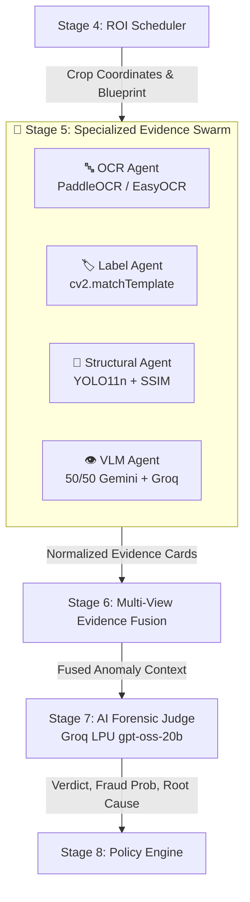
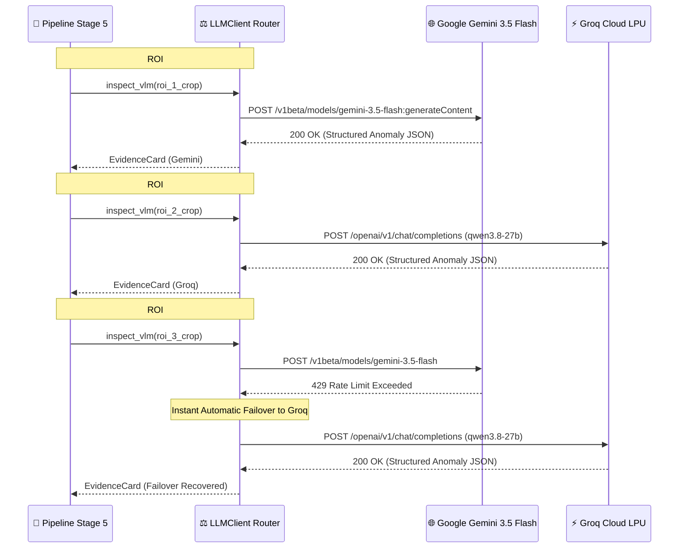

# 🤖 VisionForge AI — Multi-Agent Forensic Network & AI Judge Specification

> **Status:** Authoritative (Reflects Actual Implemented Codebase)  
> **Source Files:** `backend/app/pipeline/agents/*.py`, `backend/app/pipeline/stages/judge.py`, `backend/app/shared/llm_client.py`

---

## 📑 Table of Contents

- [1. Multi-Agent System Philosophy](#1-multi-agent-system-philosophy)
- [2. Base Agent Architecture (`base_agent.py`)](#2-base-agent-architecture-base_agentpy)
- [3. Standardized Evidence Card Schema](#3-standardized-evidence-card-schema)
- [4. Deep-Dive: The 4 Specialized Forensic Agents](#4-deep-dive-the-4-specialized-forensic-agents)
  - [4.1 🔤 OCR Forensic Agent (`ocr_agent.py`)](#41--ocr-forensic-agent-ocr_agentpy)
  - [4.2 🏷️ Label & Seal Verification Agent (`label_agent.py`)](#42-️-label--seal-verification-agent-label_agentpy)
  - [4.3 🧩 Structural & Component Agent (`structural_agent.py`)](#43--structural--component-agent-structural_agentpy)
  - [4.4 👁️ Vision-Language (VLM) Agent (`vlm_agent.py`)](#44-️-vision-language-vlm-agent-vlm_agentpy)
- [5. Dual-Provider Round-Robin Balancing Engine](#5-dual-provider-round-robin-balancing-engine)
- [6. The AI Forensic Judge (`judge.py`)](#6-the-ai-forensic-judge-judgepy)
- [7. Conflict Resolution & Arbitration Mechanics](#7-conflict-resolution--arbitration-mechanics)

---

## 1. Multi-Agent System Philosophy

Industrial hardware counterfeiters employ sophisticated multi-vector deception:
- They laser-etch authentic manufacturer markings onto inferior silicon dies.
- They desolder authentic capacitors and substitute them with visually identical, low-spec alternatives.
- They forge QC inspection stamps while leaving the underlying solder pads cold or damaged.

A single monolithic vision model cannot catch all these vectors simultaneously without losing spatial resolution or hallucinating. VisionForge deploys a **Micro-Agent Swarm**: each agent is an isolated domain expert armed with specialized CV algorithms and neural models dedicated to a single forensic dimension.



---

## 2. Base Agent Architecture (`base_agent.py`)

All evidence agents inherit from `BaseAgent` (`backend/app/pipeline/agents/base_agent.py`), enforcing a unified lifecycle, error containment, and output normalization:

```python
class BaseAgent(ABC):
    def __init__(self, agent_name: str, agent_type: str):
        self.agent_name = agent_name
        self.agent_type = agent_type

    @abstractmethod
    async def inspect_roi(
        self,
        test_crop: np.ndarray,
        golden_crop: Optional[np.ndarray],
        roi_metadata: Dict[str, Any]
    ) -> EvidenceCard:
        """Execute domain-specific inspection on a single ROI."""
        pass

    def create_evidence_card(
        self,
        roi_id: str,
        anomaly_detected: bool,
        anomaly_score: float,
        confidence: float,
        finding_type: str,
        description: str,
        details: Dict[str, Any]
    ) -> EvidenceCard:
        """Factory method returning a standardized evidence card."""
        ...
```

---

## 3. Standardized Evidence Card Schema

Every agent returns a strongly-typed `EvidenceCard` JSON object stored in Working Memory:

```json
{
  "agent_name": "structural_agent",
  "agent_type": "STRUCTURAL",
  "roi_id": "roi_mcu_power_stage_01",
  "roi_name": "Power Delivery Stage",
  "anomaly_detected": true,
  "anomaly_score": 0.88,
  "confidence": 0.94,
  "finding_type": "MISSING_COMPONENT",
  "description": "Critical capacitor C12 is missing from PCB layout. Expected 8 capacitors, found 7.",
  "bounding_box": [342, 128, 120, 95],
  "details": {
    "yolo_detected_classes": ["capacitor", "resistor", "ic_chip"],
    "expected_count": 8,
    "actual_count": 7,
    "missing_components": ["capacitor_c12"],
    "ssim_similarity": 0.712
  }
}
```

---

## 4. Deep-Dive: The 4 Specialized Forensic Agents

### 4.1 🔤 OCR Forensic Agent (`ocr_agent.py`)
- **Primary Role:** Inspects alphanumeric markings, batch date codes, part numbers, and serial strings.
- **Engines:** **PaddleOCR** (Primary GPU/CPU engine) with automatic fallback to **EasyOCR**.
- **Execution Logic:**
  1. Receives the cropped ROI containing serial text or IC silk-screen markings.
  2. Runs text extraction, recovering bounding boxes, raw strings, and OCR confidence scores.
  3. Preprocesses text (removes noise, normalizes uppercase/hyphens).
  4. Compares the extracted string against the expected golden catalog string using **Levenshtein Edit Distance**:
     $$\text{Edit Ratio} = 1.0 - \frac{\text{Levenshtein}(S_{\text{actual}}, S_{\text{golden}})}{\max(|S_{\text{actual}}|, |S_{\text{golden}}|)}$$
  5. If the ratio drops below `0.90`, the agent generates an anomaly card flagging typographical fraud (e.g., swapping `XC7Z020` for `XC7Z02O` or altered lot codes).

---

### 4.2 🏷️ Label & Seal Verification Agent (`label_agent.py`)
- **Primary Role:** Validates brand logos, regulatory certification marks (CE, FCC, RoHS), and holographic anti-tamper seals.
- **Engine:** OpenCV Multi-Scale Template Matching (`cv2.matchTemplate`).
- **Execution Logic:**
  1. Aligns the test crop with the golden reference template.
  2. Applies Normalized Cross-Correlation:
     $$R(x,y) = \frac{\sum_{x',y'} (T(x',y') \cdot I(x+x', y+y'))}{\sqrt{\sum_{x',y'} T(x',y')^2 \cdot \sum_{x',y'} I(x+x', y+y')^2}}$$
  3. Evaluates peak correlation against the threshold (`CORRELATION_THRESHOLD = 0.80`).
  4. Flags blurred edges, missing holograms, inverted colors, or peeled seal boundaries.

---

### 4.3 🧩 Structural & Component Agent (`structural_agent.py`)
- **Primary Role:** Verifies micro-component presence, orientation, count, and sub-millimeter positional alignment.
- **Engines:** **Ultralytics YOLO11n** (`component_detector.pt`) + OpenCV Structural Similarity Index (SSIM).
- **Execution Logic:**
  1. **Holistic Structural Comparison:** Computes grayscale SSIM between aligned test and golden crops:
     $$\text{SSIM}(x, y) = \frac{(2\mu_x\mu_y + c_1)(2\sigma_{xy} + c_2)}{(\mu_x^2 + \mu_y^2 + c_1)(\sigma_x^2 + \sigma_y^2 + c_2)}$$
  2. **YOLO11n Bounding-Box Inference:** Runs the 8-class hardware model across the crop, detecting all discrete components (`capacitor`, `resistor`, `ic_chip`, `connector`, `screw`, `seal`, `battery_cell`, `gold_pin_connector`).
  3. **Delta Analysis:**
     - **Missing Components:** Expected in golden blueprint but undetected in test crop.
     - **Extra / Rogue Components:** Detected in test crop but absent from golden blueprint.
     - **Count Mismatch:** e.g., Golden specifies 12 capacitors, test image has 10.
     - **Positional Drift:** Measures Euclidean distance between detected center $(x_t, y_t)$ and golden center $(x_g, y_g)$. If $\Delta d > 15\text{ pixels}$, flags a `POSITIONAL_DRIFT` anomaly.

---

### 4.4 👁️ Vision-Language (VLM) Agent (`vlm_agent.py`)
- **Primary Role:** Inspects subtle physical, thermal, and chemical defects (cold solder joints, flux residue, PCB scratch bridges, burn marks, thermal discoloration).
- **Engines:** Dual-Provider 50/50 Round-Robin (**Google Gemini 3.5 Flash** + **Groq Qwen 3.8-27B Vision**).
- **Execution Logic:**
  1. Encodes the high-resolution ROI crop into base64 JPEG format.
  2. Dispatches the crop with a specialized forensic system prompt:
     > *"You are an industrial micro-electronics forensic inspector. Inspect this PCB region for solder bridges, burn marks, physical scratching, corrosion, or non-standard package replacement. Return strict JSON with anomaly_detected, anomaly_score, and description."*
  3. Parses the structured JSON response into a normalized `EvidenceCard`.

---

## 5. Dual-Provider Round-Robin Balancing Engine

To ensure **zero rate-limiting lockouts (HTTP 429)** and sub-second VLM response times, `backend/app/shared/llm_client.py` routes requests using deterministic round-robin interleaving:

```python
# LLMClient Round-Robin Dispatch Strategy
if roi_index % 2 == 1:
    primary_provider = "GEMINI"      # gemini-3.5-flash
    fallback_provider = "GROQ"       # qwen/qwen3.8-27b
else:
    primary_provider = "GROQ"        # qwen/qwen3.8-27b
    fallback_provider = "GEMINI"     # gemini-3.5-flash
```



---

## 6. The AI Forensic Judge (`judge.py`)

The **AI Forensic Judge** is the cognitive apex of VisionForge. Executing on **Groq LPU hardware (`openai/gpt-oss-20b`)** with instant fallback to **Google Gemini 3.5 Flash**, the judge analyzes the entire body of evidence in a single inference pass (~450ms).

### Judge Input Context Assembly
The judge prompt aggregates:
1. **Inspection Metadata:** Hardware SKU, Vendor ID, Golden Similarity Score.
2. **Forensic Pre-Checks:** ELA Anomaly Score, EXIF authenticity status, Blur/Exposure metrics.
3. **Agent Evidence Cards:** Complete list of all discrete anomalies reported by OCR, Label, Structural YOLO, and VLM agents.
4. **Fused Scores:** Max anomaly severity and composite weighted confidence.

### Judge Output Schema
```json
{
  "verdict": "REJECT",
  "fraud_probability": 0.92,
  "confidence": 0.96,
  "root_cause_analysis": "Critical structural and material fraud detected. Capacitors C12 and C14 are missing from the power delivery stage, and the primary microcontroller silkscreen exhibits an altered part number (XC7Z02O instead of authentic XC7Z020). High risk of cloned silicon and premature thermal failure.",
  "anomaly_breakdown": [
    "Missing capacitor C12 (Structural YOLO)",
    "Missing capacitor C14 (Structural YOLO)",
    "Part number typographical mismatch (OCR)",
    "Severe localized SSIM structural variance (0.64)"
  ],
  "recommended_action": "QUARANTINE_LOT_AND_AUDIT_VENDOR"
}
```

---

## 7. Conflict Resolution & Arbitration Mechanics

In real-world manufacturing, agents occasionally report conflicting signals. The AI Judge employs deterministic arbitration rules:

| Conflict Scenario | Agent A Finding | Agent B Finding | AI Judge Resolution & Rationale |
|:---|:---|:---|:---|
| **Dirty Silk-Screen vs. Perfect Geometry** | **OCR Agent:** Low text confidence (0.68) due to surface dust. | **Structural YOLO:** 100% component match, all 12 capacitors aligned. | **Verdict: ACCEPT (Low Risk)** — Judge recognizes surface dust is non-fatal when component geometry and part numbers match. |
| **Pristine Label vs. Missing SMD Resistor** | **Label Agent:** Authentic brand logo (0.95 correlation). | **Structural YOLO:** Missing pull-up resistor R42. | **Verdict: REJECT (Counterfeit)** — Judge recognizes counterfeiters frequently reuse authentic enclosures/labels while stripping internal silicon. |
| **VLM Surface Scratch vs. High SSIM** | **VLM Agent:** Minor surface scratch detected near ground plane. | **Structural YOLO:** 100% component presence. | **Verdict: FLAG_FOR_HUMAN_REVIEW** — Escalates to human operator to verify whether the scratch severed copper signal traces. |

---

*For detailed specifications on the YOLO11n detection model, consult [`docs/YOLO_MODEL.md`](YOLO_MODEL.md).*
