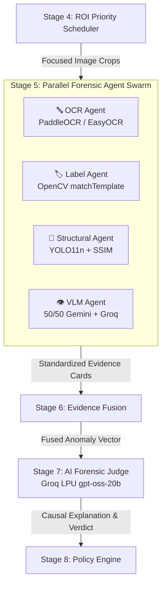
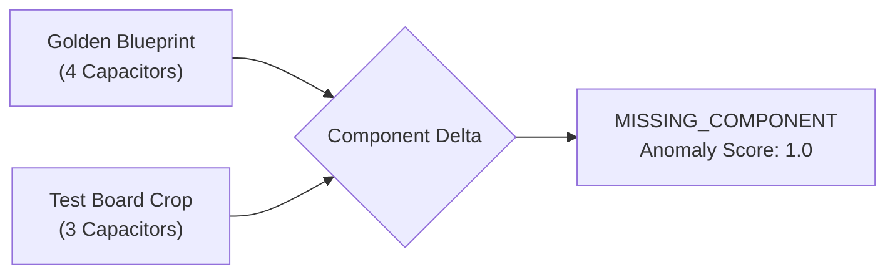
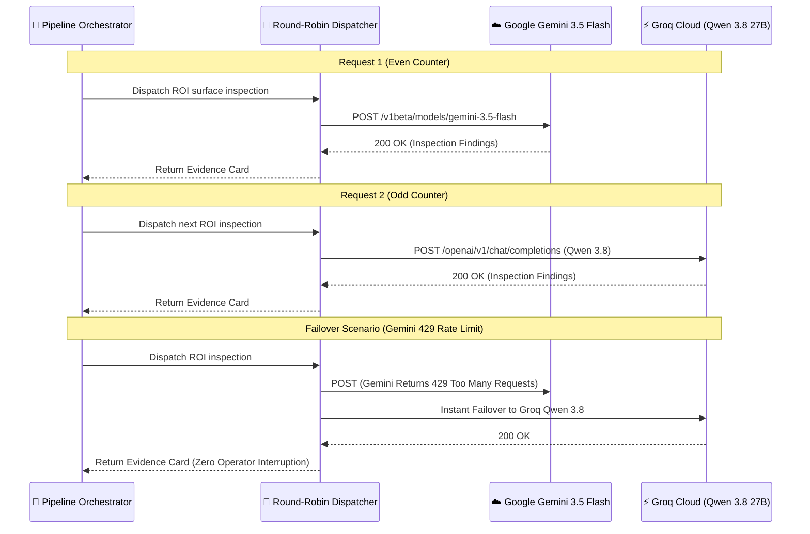
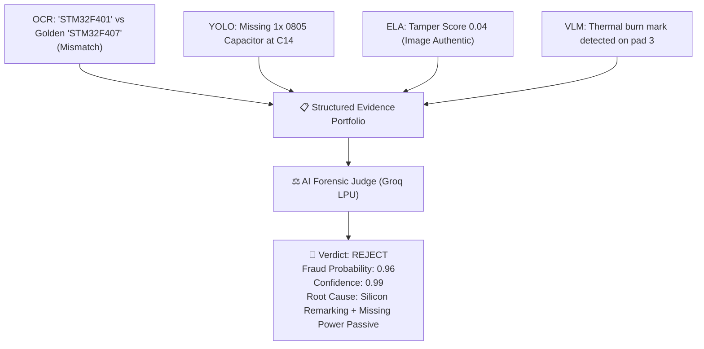

# 🤖 Specialized AI Agents & Forensic Judge

> **Why a swarm of dedicated domain experts outperforms a single monolithic vision model in hardware inspection.**

---

## 📖 Table of Contents

- [1. Why No Single AI Model Works for Everything](#1-why-no-single-ai-model-works-for-everything)
- [2. The Agent Swarm Architecture](#2-the-agent-swarm-architecture)
- [3. The Standardized Evidence Card Contract](#3-the-standardized-evidence-card-contract)
- [4. Deep Dive into the 4 Forensic Agents](#4-deep-dive-into-the-4-forensic-agents)
  - [🔤 1. OCR Forensic Agent](#-1-ocr-forensic-agent)
  - [🏷️ 2. Label & Security Seal Agent](#️-2-label--security-seal-agent)
  - [🧩 3. Structural YOLO & SSIM Agent](#-3-structural-yolo--ssim-agent)
  - [👁️ 4. Vision-Language (VLM) Surface Agent](#️-4-vision-language-vlm-surface-agent)
- [5. 50/50 Dual-Provider Round-Robin Load Balancer](#5-5050-dual-provider-round-robin-load-balancer)
- [6. The AI Forensic Judge](#6-the-ai-forensic-judge)
- [7. Conflict Resolution & Evidence Arbitration](#7-conflict-resolution--evidence-arbitration)

---

## 1. Why No Single AI Model Works for Everything

When engineering an automated hardware fraud detection system, it is tempting to feed an entire motherboard image into a large multimodal vision model (like GPT-4o or Gemini 1.5 Pro) with a single prompt:

> *"Is there anything counterfeit, missing, or altered on this circuit board?"*

In practice, this approach fails on factory intake lines:

1. **Resolution Loss:** Modern industrial cameras capture 4K to 12K images. Uploading a full board to a cloud VLM forces aggressive downscaling, destroying the microscopic details of tiny surface-mount resistors ($0.4\text{mm} \times 0.2\text{mm}$).
2. **Counting Inaccuracy:** Multimodal LLMs are notoriously poor at exact object counting. Asking a VLM to count 48 decoupling capacitors frequently produces hallucinated counts.
3. **Slow Latency & High Cost:** Sending multi-megabyte images to cloud frontier models takes 3 to 8 seconds and costs several cents per query.
4. **Lack of Explainable Chain-of-Custody:** A vague *"The board looks slightly off"* output cannot be defended in a legal warranty dispute with a supplier.

### The VisionForge Solution: A Modular Micro-Agent Swarm

VisionForge replaces the single monolithic model with a **specialized agent swarm**:



Each agent is a focused domain expert. It runs only on relevant Regions of Interest (ROIs), uses the fastest tool for that specific job, and outputs a standardized, verifiable **Evidence Card**.

---

## 2. The Agent Swarm Architecture

All agents inherit from a common base class (`backend/app/pipeline/agents/base_agent.py`) enforcing a strict inspection contract:

```python
class BaseAgent(ABC):
    def __init__(self, agent_name: str, agent_type: str):
        self.agent_name = agent_name
        self.agent_type = agent_type

    @abstractmethod
    async def inspect_roi(
        self,
        test_crop: np.ndarray,
        golden_crop: Optional[np.ndarray],
        roi_metadata: Dict[str, Any]
    ) -> EvidenceCard:
        """Inspect a single ROI crop against golden reference."""
        pass
```

### Key Architectural Safeguards:
- **Non-Blocking Async Execution:** Agents execute concurrently via Python `asyncio.gather()`, ensuring 4 agents inspect an ROI in the time it takes the slowest agent to run.
- **Fail-Safe Isolation:** If one agent throws an unexpected error (e.g., OCR fails on a featureless black surface), it emits a neutral evidence card rather than crashing the pipeline.

---

## 3. The Standardized Evidence Card Contract

Every agent outputs evidence using a strict Pydantic schema:

```json
{
  "agent_name": "structural_agent",
  "agent_type": "STRUCTURAL",
  "roi_id": "roi_power_rail_01",
  "roi_name": "12V Power Delivery Stage",
  "anomaly_detected": true,
  "anomaly_score": 0.88,
  "confidence": 0.94,
  "finding_type": "MISSING_COMPONENT",
  "description": "Expected 4 capacitors based on golden reference; found only 3 (C14 missing).",
  "details": {
    "expected_count": 4,
    "detected_count": 3,
    "missing_classes": ["capacitor"],
    "ssim_drift_score": 0.42
  }
}
```

> 💡 **Key Idea:** Because all agents speak the exact same language (the Evidence Card), downstream stages (Evidence Fusion and the AI Judge) never need to know *how* an agent computed its score—only *what* physical fact was discovered.

---

## 4. Deep Dive into the 4 Forensic Agents

---

### 🔤 1. OCR Forensic Agent

```text
File: backend/app/pipeline/agents/ocr_agent.py
Primary Models: PaddleOCR / EasyOCR
Processing Time: ~120ms
```

#### The Problem It Solves
Counterfeiters often take cheap consumer microcontrollers, sand down the original laser etching, and re-etch a part number for an expensive industrial or automotive microcontroller (silicon remarking).

#### How It Works
1. Pre-processes the chip surface crop (grayscale conversion, adaptive thresholding, and contrast normalization).
2. Extracts all visible alphanumeric strings.
3. Compares the extracted string against the expected part number from the Golden Blueprint using **Levenshtein Distance Similarity**:

$$\text{Similarity}(S_{\text{test}}, S_{\text{golden}}) = 1 - \frac{\text{Levenshtein}(S_{\text{test}}, S_{\text{golden}})}{\max(|S_{\text{test}}|, |S_{\text{golden}}|)}$$

```text
Golden Master Part Number:  STM32F407VGT6
Detected Chip Marking:      STM32F401CBU6
Levenshtein Distance:       5 characters mismatched
Anomaly Score:              0.83 (FLAGGED AS REMARKED CHIP)
```

---

### 🏷️ 2. Label & Security Seal Agent

```text
File: backend/app/pipeline/agents/label_agent.py
Primary Algorithm: OpenCV Normalized Cross-Correlation (cv2.matchTemplate)
Processing Time: ~15ms
```

#### The Problem It Solves
Suppliers sometimes paste photocopied safety logos (CE, FCC, RoHS) or counterfeit holographic seals over defective components to bypass visual quality gates.

#### How It Works
1. Extracts the safety seal or regulatory badge from the test board ROI.
2. Performs multi-scale template matching (`cv2.TM_CCOEFF_NORMED`) against the manufacturer's verified reference graphic.
3. Computes rotation invariance and correlation coefficients:

```text
Correlation >= 0.85  →  Genuine Stamp (Authentic)
0.60 <= Corr < 0.85  →  Poor Print Quality / Potential Tamper (Review)
Correlation < 0.60   →  Missing or Forged Certification Logo (Reject)
```

---

### 🧩 3. Structural YOLO & SSIM Agent

```text
File: backend/app/pipeline/agents/structural_agent.py
Primary Models: Ultralytics YOLO11n (Fine-Tuned 8-Class) + Structural Similarity (SSIM)
Processing Time: ~25ms
```

#### The Problem It Solves
Missing bypass capacitors, unpopulated mounting holes, or displaced surface-mount resistors alter electrical impedance and cause premature hardware failure.

#### How It Works
1. Runs the fine-tuned **YOLO11n model** across the ROI to count and classify every electronic component:
   - `capacitor`, `resistor`, `ic_chip`, `connector`, `screw`, `seal`, `battery_cell`, `gold_pin_connector`
2. Compares detected component counts against the Golden Blueprint.
3. Computes pixel-level **Structural Similarity (SSIM)** against the aligned golden crop to detect components that are present but crooked, lifted, or tombstoned.



---

### 👁️ 4. Vision-Language (VLM) Surface Agent

```text
File: backend/app/pipeline/agents/vlm_agent.py
Primary Models: Google Gemini 3.5 Flash & Groq Qwen 3.8 27B
Processing Time: ~800ms
```

#### The Problem It Solves
Some defects cannot be caught by template matching or bounding boxes: burned traces, flux residue, cold solder joints, scratched solder masks, or heat-gun discoloration from chip harvesting.

#### How It Works
1. Sends the cropped high-resolution surface patch to a multimodal LLM.
2. Uses structured JSON prompting to enforce diagnostic rigor:

```json
{
  "surface_integrity_score": 0.35,
  "burn_marks_detected": true,
  "solder_bridging": false,
  "flux_residue_severity": "HIGH",
  "reasoning": "Thermal discoloration and flux residue observed around pin 12 of U4, consistent with manual desoldering and replacement."
}
```

---

## 5. 50/50 Dual-Provider Round-Robin Load Balancer

To prevent factory intake lines from stalling due to cloud rate limits (`HTTP 429`) or provider outages, VisionForge uses a **stateful round-robin load balancer**:



```python
# backend/app/shared/llm_client.py
class LLMClient:
    _counter = 0

    async def analyze_visual_patch(self, image_bytes: bytes, prompt: str) -> dict:
        self._counter += 1
        provider = "gemini" if (self._counter % 2 == 0) else "groq"
        
        try:
            return await self._call_provider(provider, image_bytes, prompt)
        except Exception as primary_err:
            fallback = "groq" if provider == "gemini" else "gemini"
            logger.warning(f"Provider {provider} failed ({primary_err}). Falling back to {fallback}.")
            return await self._call_provider(fallback, image_bytes, prompt)
```

---

## 6. The AI Forensic Judge

```text
File: backend/app/pipeline/stages/judge.py
Hardware Engine: Groq LPU (Language Processing Unit)
Model: openai/gpt-oss-20b (with Gemini 3.5 Flash Fallback)
Inference Speed: ~400ms
```

### Why the Judge Never Looks at Raw Pixels

A critical engineering decision in VisionForge is that **the AI Judge does not receive images directly**.

Instead, the Judge receives the **fused evidence portfolio** containing the deterministic findings of all four upstream agents:



### Why This Design Eliminates Hallucinations:
- The Judge acts as a **forensic logician**, not a computer vision model.
- It weighs conflicting evidence mathematically, correlates related failures (e.g., a burn mark next to a missing capacitor), and drafts an audit-ready root cause explanation for plant managers.

---

## 7. Conflict Resolution & Evidence Arbitration

When specialized agents return disagreeing signals, the Judge applies strict evidentiary precedence:

| Conflict Scenario | Agent A Signal | Agent B Signal | Judge Decision & Reasoning |
| :--- | :--- | :--- | :--- |
| **Pristine Text on Sanded Chip** | OCR: Part number matches ($1.0$) | VLM: Surface has circular sanding scratches | **FLAGGED FOR REVIEW:** OCR was likely re-etched onto sanded silicon. |
| **Component Shift vs Missing** | YOLO: Expected 4, Found 4 | SSIM: Drift score $>0.60$ | **FLAGGED AS DEFECT:** Component is present but tombstoned or lifted. |
| **Photoshop Artifact vs Physical Defect** | ELA: High tampering score ($0.45$) | YOLO: All parts present | **IMMEDIATE REJECT:** Digital forgery in submitted photo. |

---

*For detailed specifications on the YOLO11n structural detection model, read [`docs/YOLO_MODEL.md`](YOLO_MODEL.md).*
