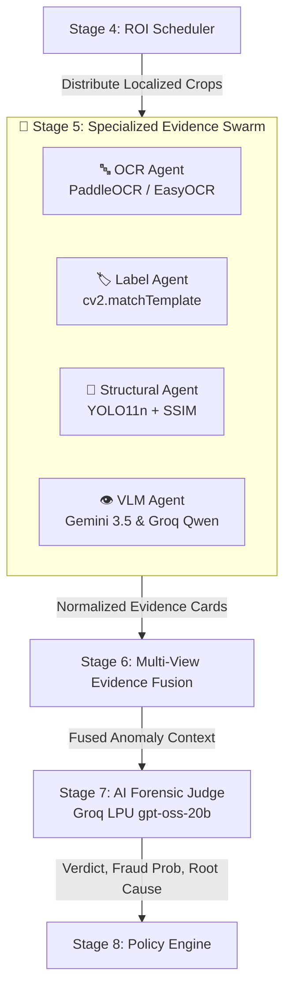
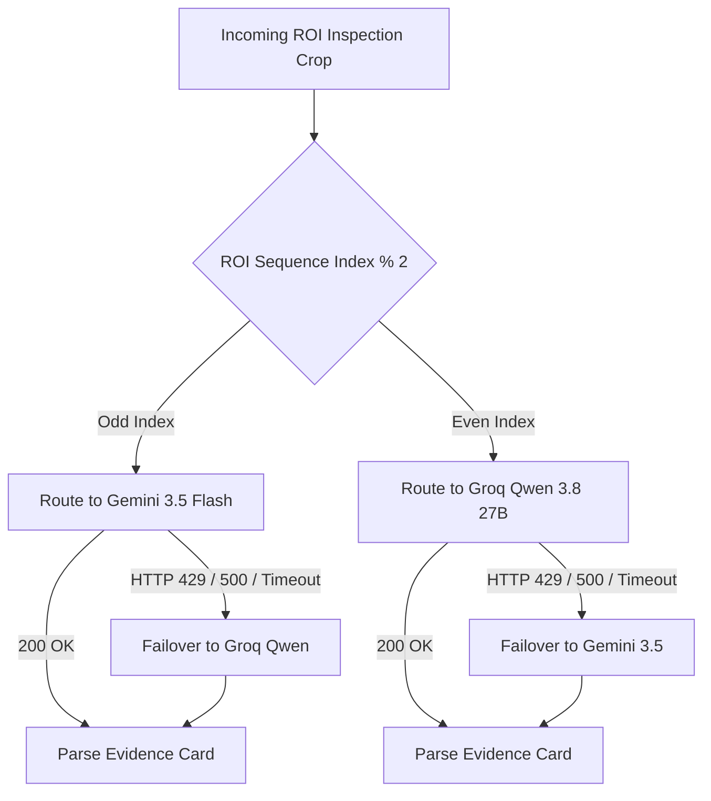

# 🤖 Forensic AI Agents & Multi-Agent Swarm

> **Technical Specification of the Specialized Forensic Swarm and AI Arbitration Judge**  
> **Status:** Authoritative (Reflects Actual Implemented Codebase)  
> **Source Files:** `backend/app/pipeline/agents/*.py`, `backend/app/pipeline/stages/evidence_execution.py`, `backend/app/pipeline/stages/judge.py`, `backend/app/shared/llm_client.py`

---

## 📖 Table of Contents

- [1. Multi-Agent Philosophy & Hardware Threat Model](#1-multi-agent-philosophy--hardware-threat-model)
- [2. Base Agent Architecture & Standardized Contracts](#2-base-agent-architecture--standardized-contracts)
- [3. Standardized Evidence Card Schema](#3-standardized-evidence-card-schema)
- [4. Deep-Dive: The 4 Specialized Forensic Agents](#4-deep-dive-the-4-specialized-forensic-agents)
  - [4.1 🔤 OCR Forensic Agent (`ocr_agent.py`)](#41--ocr-forensic-agent-ocr_agentpy)
  - [4.2 🏷️ Label & Seal Verification Agent (`label_agent.py`)](#42-️-label--seal-verification-agent-label_agentpy)
  - [4.3 🧩 Structural & Component Agent (`structural_agent.py`)](#43--structural--component-agent-structural_agentpy)
  - [4.4 👁️ Vision-Language (VLM) Agent (`vlm_agent.py`)](#44-️-vision-language-vlm-agent-vlm_agentpy)
- [5. Dual-Provider Round-Robin Balancing Engine](#5-dual-provider-round-robin-balancing-engine)
- [6. The AI Forensic Judge (`judge.py`)](#6-the-ai-forensic-judge-judgepy)
- [7. Conflict Resolution & Arbitration Mechanics](#7-conflict-resolution--arbitration-mechanics)
- [8. Agent Latency & Resource Utilization](#8-agent-latency--resource-utilization)
- [9. Known Agent Limitations & Safeguards](#9-known-agent-limitations--safeguards)

---

## 1. Multi-Agent Philosophy & Hardware Threat Model

### Why Not a Single "Omniscient" AI Prompt?
When developers first approach computer vision for hardware inspection, the instinctive approach is to feed a full 4K photograph of a circuit board to a large multimodal model (such as GPT-4o or Gemini 1.5 Pro) with a prompt like: *"Find all counterfeit parts on this motherboard."*

In industrial reality, this fails completely:
1. **Severe Downscaling:** Modern VLMs downscale large images to $1024 \times 1024$ or $768 \times 768$ tokens. On a $300\text{ mm} \times 200\text{ mm}$ server motherboard, a $1.0\text{ mm}$ surface-mount resistor becomes a blurry $3 \times 2$ pixel smear. The model cannot read its code or verify its presence.
2. **Counting Hallucinations:** Large language models struggle with high-density counting tasks. Asking an LLM to count 64 identical decoupling capacitors around a CPU socket produces unpredictable errors.
3. **Execution Latency:** Multi-modal cloud calls take 4 to 8 seconds per image, which is unacceptable on a factory line running 60 inspections per minute.
4. **Different Defects Require Different Physics:** Verifying a laser-etched font requires high-contrast character segmentation. Verifying a capacitor requires discrete object detection. Verifying thermal burn marks requires qualitative semantic reasoning.

### The VisionForge Multi-Agent Swarm
VisionForge deploys a **Micro-Agent Swarm**: each agent is a specialized domain expert with its own mathematical algorithms, neural weights, and execution contracts:



---

## 2. Base Agent Architecture & Standardized Contracts

All evidence agents inherit from the abstract base class `BaseAgent` (`backend/app/pipeline/agents/base_agent.py`). This guarantees uniform error isolation, execution timing, and output serialization:

```python
class BaseAgent(abc.ABC):
    """Abstract base class for all VisionForge evidence agents."""
    
    def __init__(self, name: str, agent_type: AgentType):
        self.name = name
        self.agent_type = agent_type

    @abc.abstractmethod
    async def inspect(
        self,
        inspection_crop: ImageSource,
        golden_crop: Optional[ImageSource],
        roi_metadata: dict[str, Any],
    ) -> AgentResult:
        """Execute domain inspection and return standardized AgentResult."""
        raise NotImplementedError

    async def run(
        self,
        inspection_crop: ImageSource,
        golden_crop: Optional[ImageSource],
        roi_metadata: dict[str, Any],
    ) -> AgentResult:
        """Standard wrapper providing execution timing and crash isolation."""
        start_t = time.perf_counter()
        try:
            result = await self.inspect(inspection_crop, golden_crop, roi_metadata)
        except Exception as exc:
            logger.exception("Agent %s failed on ROI %s", self.name, roi_metadata.get("id"))
            return AgentResult(
                agent_type=self.agent_type,
                detector_name=self.name,
                roi_id=roi_metadata.get("id", "unknown"),
                failed=True,
                failure_reason=str(exc),
                processing_time_ms=(time.perf_counter() - start_t) * 1000.0,
            )
        elapsed = (time.perf_counter() - start_t) * 1000.0
        return result.model_copy(update={"processing_time_ms": elapsed})
```

---

## 3. Standardized Evidence Card Schema

Every agent converts its internal findings into a standardized `AgentResult` Pydantic schema:

```python
class AgentResult(BaseModel):
    model_config = ConfigDict(frozen=True, extra="ignore")

    agent_type: AgentType           # "ocr" | "label" | "structural" | "vlm"
    detector_name: str              # e.g. "paddle_ocr", "yolo11n", "gemini_vlm"
    roi_id: str                     # Target ROI identifier
    roi_type: Optional[str]         # "text" | "label" | "structural" | "surface"
    confidence: float               # Confidence in detection (0.0 to 1.0)
    has_defect: bool                # True if anomaly detected
    evidence: dict[str, Any]        # Structured key-value findings
    explanation: str                # Human-readable forensic summary
    bounding_box: Optional[Any]     # Normalized coordinates {x, y, w, h}
    processing_time_ms: float       # Execution duration in milliseconds
    failed: bool                    # Error flag
    failure_reason: Optional[str]   # Stacktrace or error description
    raw_output: Optional[dict[str, Any]]
```

---

## 4. Deep-Dive: The 4 Specialized Forensic Agents

---

### 4.1 🔤 OCR Forensic Agent (`ocr_agent.py`)
- **Primary Engine:** **PaddleOCR** (PP-OCRv4) — Highly optimized for rotated text and tiny stamped industrial serial numbers.
- **Secondary Engine:** **EasyOCR** (PyTorch-based) — Local fallback if PaddleOCR fails or experiences initialization errors.
- **Target ROI Types:** `serial_number`, `mac_address`, `chip_marking`, `lot_code`, `date_code`.

#### Forensic Problem Solved
Counterfeiters frequently sand down low-speed microcontrollers (e.g. 16MHz) and laser-etch part numbers for high-speed variants (e.g. 72MHz automotive grade) or alter date codes to sell expired military hardware.

#### Processing Algorithm & Math
1. **Text Extraction:** PaddleOCR detects text polygons and executes character classification on $C_{\text{test}}$.
2. **Text Normalization:** Strips non-alphanumeric noise, standardizes casing, and handles common OCR confusion pairs (e.g., `'O'` vs `'0'`, `'I'` vs `'1'`).
3. **Levenshtein Similarity Matching:** Computes the Levenshtein edit distance between detected text $T_{\text{det}}$ and expected blueprint text $T_{\text{exp}}$:
   $$\text{Dist} = \text{Levenshtein}(T_{\text{det}}, T_{\text{exp}})$$
   $$\text{Text Match Ratio} = 1.0 - \frac{\text{Dist}}{\max(|T_{\text{det}}|, |T_{\text{exp}}|)}$$
4. **Defect Gating:** If $\text{Text Match Ratio} < 0.85$, flags a `TEXT_MISMATCH` defect.

#### Concrete Example
```text
Expected Blueprint Text: "STM32F407VGT6-Y2408"
Detected Hardware Text: "STM32F407VGT6-Y1802"
Levenshtein Distance: 4 edits
Result: Text Mismatch Flagged!
Explanation: "Date code discrepancy: Hardware displays batch Y1802 (2018), expected Y2408 (2024). High probability of recycled silicon."
```

---

### 4.2 🏷️ Label & Seal Verification Agent (`label_agent.py`)
- **Primary Engine:** OpenCV Multi-Scale Normalized Cross-Correlation (`cv2.matchTemplate`).
- **Target ROI Types:** `qc_seal`, `warranty_label`, `fcc_logo`, `ce_stamp`, `ul_mark`.

#### Forensic Problem Solved
Recycled or tampered equipment often features photocopied QC seals, missing regulatory certifications, or stickers that have been peeled and reattached at an angle.

#### Processing Algorithm & Math
1. **Multi-Scale Pyramid Matching:** The golden template $T$ is scaled across multiple factors $s \in [0.90, 1.10]$ to handle minor camera distance variances.
2. **Normalized Cross-Correlation (TM_CCOEFF_NORMED):**
   $$R(x, y) = \frac{\sum_{x', y'} (T'(x', y') \cdot I'(x+x', y+y'))}{\sqrt{\sum_{x', y'} T'(x', y')^2 \cdot \sum_{x', y'} I'(x+x', y+y')^2}}$$
   Where $T'$ and $I'$ denote mean-subtracted patches.
3. **Score Calibration:**
   - Perfect alignment: $R \ge 0.88$
   - Misaligned or altered seal: $R < 0.70$ $\to$ Defect Flagged.

---

### 4.3 🧩 Structural & Component Agent (`structural_agent.py`)
- **Primary Engine:** Custom fine-tuned **Ultralytics YOLO11n** (`component_detector.pt`) + **OpenCV SSIM**.
- **Target ROI Types:** `component_bank`, `power_stage`, `pcie_slot`, `battery_array`, `memory_banks`.

#### Forensic Problem Solved
Detects physical component absence, ghost components, stolen ICs, and solder alignment drift across 8 unified component classes.

#### Dual-Layer Detection Engine
1. **Holistic Structural Similarity (SSIM):**
   $$\text{SSIM}(x, y) = \frac{(2\mu_x\mu_y + c_1)(2\sigma_{xy} + c_2)}{(\mu_x^2 + \mu_y^2 + c_1)(\sigma_x^2 + \sigma_y^2 + c_2)}$$
   Computes overall pixel drift ($0.0$ to $1.0$). If $\text{SSIM} < 0.80$, flags general structural anomaly.
2. **Discrete YOLO11n Object Detection:** Runs simultaneous inference on both $C_{\text{golden}}$ and $C_{\text{test}}$ at localized resolution, outputting discrete bounding boxes and class counts.
3. **Four-Mode Component Reasoning:**
   - **Missing Component:** $N_{\text{golden}} > 0$ and $N_{\text{test}} = 0$.
   - **Extra Component:** $N_{\text{test}} > 0$ and $N_{\text{golden}} = 0$.
   - **Count Divergence:** $N_{\text{golden}} \neq N_{\text{test}}$.
   - **Position Drift:** $\sqrt{(x_t - x_g)^2 + (y_t - y_g)^2} > \tau_{\text{drift}}$.

#### Concrete Example
```text
Target ROI: Main 12V Power Delivery Stage
Golden Blueprint YOLO Detections: 4 capacitors, 1 IC chip, 4 screws
Test Board YOLO Detections: 3 capacitors, 1 IC chip, 4 screws
SSIM Score: 0.71 (Significant localized pixel difference)
Result: STRUCTURAL DEFECT FLAGGED
Explanation: "Capacitor count mismatch in Power Delivery Stage: Expected 4, detected 3. Electrolytic capacitor C12 is missing from PCB."
```

---

### 4.4 👁️ Vision-Language (VLM) Agent (`vlm_agent.py`)
- **Primary Providers:** Dual load-balanced **Google Gemini 3.5 Flash** (`gemini-3.5-flash`) + **Groq Qwen 3.8 27B Vision** (`qwen/qwen3.8-27b`).
- **Target ROI Types:** `solder_joints`, `substrate`, `connector_pins`, `thermal_dissipation`.

#### Forensic Problem Solved
Analyzes complex physical phenomena that rigid bounding boxes cannot quantify: cold solder joints, solder bridges, burnt PCB traces, flux residue from manual desoldering, and water corrosion.

#### Structured Prompt & JSON Contract
The VLM receives both the golden crop and inspection crop side-by-side with a strict system prompt instructing it to output structured JSON:
```json
{
  "has_anomaly": true,
  "anomaly_score": 0.85,
  "confidence": 0.92,
  "defect_type": "THERMAL_DAMAGE",
  "explanation": "Darkened carbonization and burnt PCB substrate observed adjacent to MOSFET Q3, indicating severe overcurrent failure or rework torch damage."
}
```

---

## 5. Dual-Provider Round-Robin Balancing Engine

To ensure **zero downtime and complete protection against free-tier cloud rate limits**, VisionForge incorporates a 50/50 round-robin load balancer directly inside `backend/app/shared/llm_client.py`:



### Why This Engine is Essential
- **Gemini Free Tier Quota:** 15 Requests Per Minute (RPM).
- **Groq Free Tier Quota:** 30 Requests Per Minute (RPM) & 7,000 Input Tokens Per Minute (ITPM).
- An inspection with 6 ROIs would normally consume 6 calls on a single provider, risking immediate `HTTP 429 (Too Many Requests)` rate-limiting on burst submissions.
- By splitting requests 3-and-3 across both providers, neither provider exceeds $50\%$ of its per-minute rate limit. If either provider temporarily degrades, the mutual failover intercepts the request with zero dropped inspections.

---

## 6. The AI Forensic Judge (`judge.py`)

The AI Forensic Judge acts as the **courtroom arbitrator** of the pipeline. It does not look at raw images directly; instead, it reviews the structured evidence submitted by all four forensic agents and resolves conflicting findings into an explainable root cause narrative.

- **Primary Model:** **Groq LPU (`openai/gpt-oss-20b`)** — Delivers ultra-low latency (~420ms) and verified JSON formatting.
- **Secondary Fallback:** **Google Gemini 3.5 Flash** (`gemini-3.5-flash`).

### Judge System Prompt Logic
The Judge is provided with:
1. Expected hardware part details (e.g. "Industrial ATX Motherboard V1").
2. Vendor historical trust score.
3. Authenticity metrics from Stage 2.
4. An array of all completed Evidence Cards.

```markdown
You are the Chief Hardware Forensic Investigator for VisionForge AI.
Analyze the provided evidence cards. Identify the root cause of any defects.
Distinguish between minor cosmetic blemishes and critical counterfeit fraud.
Return a structured JSON verdict with fields:
- verdict: "ACCEPT" | "REJECT" | "REVIEW"
- fraud_category: string
- confidence: float (0.0 to 1.0)
- root_cause: detailed forensic narrative
- risk_level: "LOW" | "MEDIUM" | "HIGH" | "CRITICAL"
```

---

## 7. Conflict Resolution & Arbitration Mechanics

In real-world inspections, agents occasionally emit conflicting evidence. The Judge enforces strict domain hierarchy:

| Conflict Scenario | Agent A Finding | Agent B Finding | Judge Resolution Strategy |
|:---|:---|:---|:---|
| **Remarked Recycled Chip** | OCR: `Text Match Ratio = 0.98` (Text matches expected) | Structural: `SSIM = 0.62`, package thickness irregular | **Reject.** Genuine text laser-etched onto a non-original package is a classic sign of remarked recycled silicon. |
| **Peeled QC Seal** | Label: `Match = 0.55` (Seal missing / damaged) | Structural: `SSIM = 0.98`, all components present | **Review / Quarantine.** Hardware may be physically authentic, but a broken warranty seal implies unauthorized repair. |
| **Cosmetic Dust Particle** | VLM: `Anomaly Score = 0.72` (Dark speck observed) | Structural: `YOLO = 100% match`, no components missing | **Accept / Ignore.** Judge determines the speck is non-conductive surface dust rather than a blown component. |

---

## 8. Agent Latency & Resource Utilization

| Agent | Technology Stack | Execution Location | Avg Latency | Memory Footprint |
|:---|:---|:---|:---:|:---:|
| **OCR Agent** | PaddleOCR / EasyOCR | Local CPU / GPU | ~280ms | ~320 MB |
| **Label Agent** | OpenCV `matchTemplate` | Local CPU | ~18ms | ~15 MB |
| **Structural Agent**| Ultralytics YOLO11n + SSIM | Local CPU / CUDA | ~65ms (CPU) / ~15ms (GPU) | ~80 MB |
| **VLM Agent** | Gemini 3.5 / Groq Qwen | Cloud HTTPS (Async) | ~1,100ms | <5 MB |
| **AI Judge** | Groq LPU (`gpt-oss-20b`) | Cloud HTTPS (Async) | ~420ms | <5 MB |

---

## 9. Known Agent Limitations & Safeguards

1. **OCR Low-Contrast Laser Markings:** Ultra-faint grey-on-black laser markings on worn IC chips can result in low character confidence.  
   *Safeguard:* The OCR Agent applies adaptive CLAHE (Contrast Limited Adaptive Histogram Equalization) before character binarization.
2. **YOLO Component Occlusion:** Very tall heat sinks can obscure small capacitors located directly at their base.  
   *Safeguard:* The intake schema accepts multi-angle photo arrays so that angled shots capture hidden component rows.
3. **Cloud Latency Variance:** Internet congestion can cause VLM calls to take >3 seconds.  
   *Safeguard:* `llm_client.py` enforces a strict 8-second timeout guard, falling back to local heuristic evidence cards if the cloud times out.

---

*For details on the YOLO11n object detection model, see [`docs/YOLO_MODEL.md`](YOLO_MODEL.md).*  
*To review how evidence cards are fused into composite scores, see [`docs/PIPELINE.md`](PIPELINE.md).*
