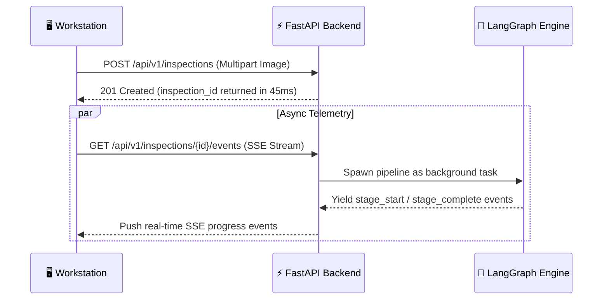

# ⚡ REST API & Telemetry Specification

> **Complete OpenAPI / REST & Server-Sent Events (SSE) Interface Reference**  
> **Status:** Authoritative (Reflects Actual Implemented Codebase)  
> **Base URL:** `http://localhost:8000/api/v1`  
> **Interactive Docs:** `http://localhost:8000/docs` (Swagger UI) & `http://localhost:8000/redoc`  
> **Source Files:** `backend/app/routers/*.py`, `backend/app/schemas/*.py`

---

## 📖 Table of Contents

- [1. API Design Philosophy & Asynchronous Protocol](#1-api-design-philosophy--asynchronous-protocol)
- [2. Authentication & RBAC Security Headers](#2-authentication--rbac-security-headers)
- [3. Standardized Error Response Schema](#3-standardized-error-response-schema)
- [4. Authentication Endpoints (`/auth`)](#4-authentication-endpoints-auth)
- [5. Inspection & Telemetry Endpoints (`/inspections`)](#5-inspection--telemetry-endpoints-inspections)
- [6. Server-Sent Events (SSE) Event Protocol](#6-server-sent-events-sse-event-protocol)
- [7. Product & Golden Reference Endpoints (`/products`)](#7-product--golden-reference-endpoints-products)
- [8. Supply-Chain Vendor Endpoints (`/vendors`)](#8-supply-chain-vendor-endpoints-vendors)
- [9. Audit Reports & PDF Endpoints (`/reports`)](#9-audit-reports--pdf-endpoints-reports)
- [10. Analytics & Risk Metrics Endpoints (`/analytics`)](#10-analytics--risk-metrics-endpoints-analytics)
- [11. System Health & Tunnel Endpoints (`/system`)](#11-system-health--tunnel-endpoints-system)

---

## 1. API Design Philosophy & Asynchronous Protocol

### Why Async Background Tasks + SSE Streaming?
A hardware inspection requires image quality checks, forensic tampering calculations, vector retrieval, parallel agent execution, and LLM Judge arbitration, taking **2 to 4 seconds total**.

If this were implemented as a synchronous HTTP request:
1. The browser UI would freeze on "loading" for several seconds.
2. If an intermediate proxy or Wi-Fi glitch disconnected the socket, the entire inspection would crash without returning a case number.
3. The operator would receive zero visual feedback while the 8 pipeline stages were executing.

VisionForge separates **intake from execution**:


---

## 2. Authentication & RBAC Security Headers

All protected endpoints require an HTTP `Authorization` header containing a valid Bearer token:

```http
Authorization: Bearer <your_jwt_access_token>
```

- **Access Token:** 30-minute lifespan, HS256 signed. Contains user ID and RBAC role.
- **Refresh Token:** 7-day lifespan. Used to renew access tokens without prompting the user for credentials.
- **Role Permissions:**
  - `OPERATOR`: Run inspections, view real-time evidence, submit human reviews, and download PDF certificates.
  - `ADMIN`: Everything an operator can do + create vendors, upload new golden blueprints, tune quality thresholds, and access cross-supplier analytics.

---

## 3. Standardized Error Response Schema

All unhandled exceptions and validation errors return a standardized JSON error body:

```json
{
  "detail": "Descriptive human-readable error explanation.",
  "error_code": "INVALID_CREDENTIALS",
  "timestamp": "2026-09-18T10:15:00Z"
}
```

### Common HTTP Status Codes
| Code | Status | Meaning |
|:---:|:---|:---|
| `200` | OK | Request succeeded. |
| `201` | Created | Resource successfully created. |
| `204` | No Content | Resource deleted successfully. |
| `400` | Bad Request | Validation error or invalid query parameter. |
| `401` | Unauthorized | Missing, expired, or invalid JWT token. |
| `403` | Forbidden | Insufficient RBAC role permissions. |
| `404` | Not Found | Requested entity does not exist. |
| `422` | Unprocessable Entity | Pydantic validation error in request payload. |

---

## 4. Authentication Endpoints (`/auth`)

### 4.1 Register User
- **Method / Path:** `POST /api/v1/auth/register`
- **Access Level:** Public
- **Request Body:**
  ```json
  {
    "email": "operator@visionforge.ai",
    "password": "SecurePassword123!",
    "full_name": "John Doe",
    "role": "operator"
  }
  ```
- **Response (`201 Created`):**
  ```json
  {
    "id": "3fa85f64-5717-4562-b3fc-2c963f66afa6",
    "email": "operator@visionforge.ai",
    "full_name": "John Doe",
    "role": "operator",
    "is_active": true,
    "created_at": "2026-09-18T10:15:00Z"
  }
  ```

### 4.2 Login
- **Method / Path:** `POST /api/v1/auth/login`
- **Access Level:** Public
- **Request Body:**
  ```json
  {
    "email": "operator@visionforge.ai",
    "password": "operatorpassword123"
  }
  ```
- **Response (`200 OK`):**
  ```json
  {
    "access_token": "eyJhbGciOiJIUzI1NiIsIn...",
    "refresh_token": "eyJhbGciOiJIUzI1NiIsIn...",
    "token_type": "bearer",
    "user": {
      "id": "3fa85f64-5717-4562-b3fc-2c963f66afa6",
      "email": "operator@visionforge.ai",
      "full_name": "John Doe",
      "role": "operator"
    }
  }
  ```

### 4.3 Refresh Token
- **Method / Path:** `POST /api/v1/auth/refresh`
- **Access Level:** Public
- **Request Body:**
  ```json
  {
    "refresh_token": "eyJhbGciOiJIUzI1NiIsIn..."
  }
  ```
- **Response (`200 OK`):** Returns new `access_token` and `refresh_token`.

### 4.4 Current User Profile
- **Method / Path:** `GET /api/v1/auth/me`
- **Access Level:** Authenticated (`OPERATOR` / `ADMIN`)
- **Response (`200 OK`):** Returns user profile and assigned role.

---

## 5. Inspection & Telemetry Endpoints (`/inspections`)

### 5.1 Create & Dispatch Inspection
- **Method / Path:** `POST /api/v1/inspections`
- **Access Level:** Authenticated (`OPERATOR` / `ADMIN`)
- **Content-Type:** `multipart/form-data`
- **Form Fields:**
  - `images`: One or more binary image files (JPEG, PNG).
  - `vendor_id`: UUID of the component supplier.
  - `location`: Facility location string (e.g. `"Austin Receiving Dock 4"`).
  - `golden_reference_id` *(Optional)*: Pre-selected blueprint UUID. If omitted, Stage 3 auto-retrieves it via vector search.
- **Response (`201 Created`):**
  ```json
  {
    "id": "7b12c8a4-e912-4c22-9214-419b489a2345",
    "case_number": "VF-20260918-7B12",
    "status": "pending",
    "image_count": 1,
    "created_at": "2026-09-18T10:20:00Z"
  }
  ```

### 5.2 Get Inspection Details
- **Method / Path:** `GET /api/v1/inspections/{id}`
- **Access Level:** Authenticated (`OPERATOR` / `ADMIN`)
- **Response (`200 OK`):** Returns full inspection model including case number, vendor, status, verdict, fraud probability, root cause, policy action, and the complete array of `evidence_records`.

### 5.3 Lightweight Status Polling Endpoint
- **Method / Path:** `GET /api/v1/inspections/{id}/status`
- **Access Level:** Authenticated (`OPERATOR` / `ADMIN`)
- **Purpose:** Used as a fast fallback when SSE connections are blocked by proxies.
- **Response (`200 OK`):**
  ```json
  {
    "id": "7b12c8a4-e912-4c22-9214-419b489a2345",
    "status": "completed",
    "verdict": "reject",
    "policy_action": "quarantine",
    "fraud_probability": 0.88,
    "report_path": "/data/reports/VF-20260918-7B12.pdf"
  }
  ```

### 5.4 Submit Human Operator Review
- **Method / Path:** `POST /api/v1/inspections/{id}/review`
- **Access Level:** Authenticated (`OPERATOR` / `ADMIN`)
- **Request Body:**
  ```json
  {
    "decision": "approved",
    "comment": "Confirmed missing capacitor C12 under physical stereo microscope."
  }
  ```
- **Response (`200 OK`):** Updates inspection with review decision and timestamps.

---

## 6. Server-Sent Events (SSE) Event Protocol

- **Endpoint:** `GET /api/v1/inspections/{id}/events`
- **Response Headers:**
  ```http
  Content-Type: text/event-stream
  Cache-Control: no-cache
  Connection: keep-alive
  ```

### Event Stream Lifecycle
1. **`stage_progress` Event:** Broadcast as each pipeline stage starts and completes:
   ```json
   data: {
     "event": "stage_progress",
     "stage": 5,
     "stage_name": "Evidence Execution",
     "status": "IN_PROGRESS",
     "progress": 62.5,
     "timestamp": "2026-09-18T10:20:02Z"
   }
   ```
2. **`evidence_card` Event:** Broadcast in real time as each specialized agent finishes its ROI crop:
   ```json
   data: {
     "event": "evidence_card",
     "agent_type": "structural",
     "roi_id": "roi_power_stage_01",
     "anomaly_detected": true,
     "anomaly_score": 0.88,
     "confidence": 0.94,
     "explanation": "Capacitor count mismatch: expected 4, detected 3."
   }
   ```
3. **`pipeline_complete` Event:** Emitted upon final arbitration:
   ```json
   data: {
     "event": "pipeline_complete",
     "verdict": "reject",
     "policy_action": "quarantine",
     "fraud_probability": 0.88,
     "report_url": "/api/v1/reports/7b12c8a4.../pdf"
   }
   ```

---

## 7. Product & Golden Reference Endpoints (`/products`)

- `GET /api/v1/products`: List all indexed golden reference hardware components.
- `GET /api/v1/products/{id}`: Retrieve full blueprint details including ROI coordinates.
- `POST /api/v1/products/upload`: *(Admin Only)* Multipart upload to register a new golden reference image, generate FAISS vector embeddings, and save its ROI coordinate template.
- `DELETE /api/v1/products/{id}`: *(Admin Only)* Delete a blueprint and remove its vector from FAISS.

---

## 8. Supply-Chain Vendor Endpoints (`/vendors`)

- `GET /api/v1/vendors`: List all registered component suppliers.
- `POST /api/v1/vendors`: *(Admin Only)* Register a new hardware supplier:
  ```json
  {
    "name": "Apex Semiconductor Corp",
    "site_name": "Shenzhen Fab 4",
    "code": "VND-APEX-04"
  }
  ```

---

## 9. Audit Reports & PDF Endpoints (`/reports`)

- `GET /api/v1/reports`: Filterable archive of generated inspection reports (query by `verdict`, `vendor_id`, `date_range`).
- `GET /api/v1/reports/{id}`: Retrieve report metadata and summary findings.
- `GET /api/v1/reports/{id}/pdf`: Stream binary PDF report directly to browser for download.

---

## 10. Analytics & Risk Metrics Endpoints (`/analytics`)

- `GET /api/v1/analytics/summary`: Aggregate counts (total inspections, rejection rate, average fraud score, active vendors).
- `GET /api/v1/analytics/by-vendor`: Breakdown of fraud rates grouped by supplier ID.
- `GET /api/v1/analytics/by-location`: Defect distribution grouped by receiving facility.
- `GET /api/v1/analytics/vendor-risk`: High-risk supplier ranking with risk score calculated from counterfeit rates.
- `GET /api/v1/analytics/monthly-trend`: Monthly historical trend of inspections vs. rejections.

---

## 11. System Health & Tunnel Endpoints (`/system`)

- `GET /api/v1/system/health`: System health diagnostic:
  ```json
  {
    "status": "healthy",
    "app_name": "VisionForge-AI",
    "version": "0.1.0",
    "database": "connected",
    "faiss_index": "loaded (3 vectors)",
    "yolo_model": "loaded (component_detector.pt)"
  }
  ```
- `GET /api/v1/system/tunnel-url`: Returns the active Cloudflare Quick Tunnel HTTPS URL for smartphone camera pairing.

---

*For database schemas backing these endpoints, see [`docs/DATABASE.md`](DATABASE.md).*  
*For frontend integration details, see [`docs/FRONTEND.md`](FRONTEND.md).*
