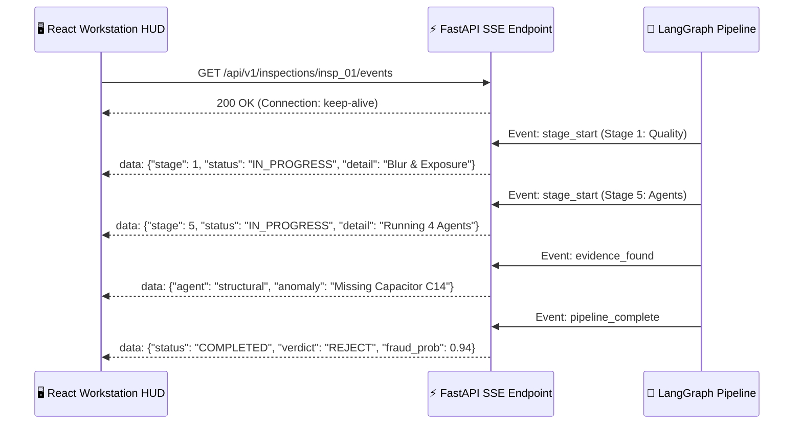

# ⚡ VisionForge AI REST API & Telemetry Reference

> **The complete OpenAPI reference for hardware intake, real-time SSE telemetry, and forensic audit reports.**

---

## 📖 Table of Contents

- [1. Authentication & Security Headers](#1-authentication--security-headers)
- [2. Standard Error Response Schema](#2-standard-error-response-schema)
- [3. Grouped API Endpoints](#3-grouped-api-endpoints)
  - [🔐 3.1 Authentication (`/auth`)](#-31-authentication-auth)
  - [📦 3.2 Products & Blueprints (`/products`)](#-32-products--blueprints-products)
  - [🏢 3.3 Supplier / Vendor Management (`/vendors`)](#-33-supplier--vendor-management-vendors)
  - [🔍 3.4 Hardware Inspections & Reviews (`/inspections`)](#-34-hardware-inspections--reviews-inspections)
  - [📜 3.5 Forensic PDF Reports (`/reports`)](#-35-forensic-pdf-reports-reports)
  - [📊 3.6 Analytics & KPIs (`/analytics`)](#-36-analytics--kpis-analytics)
  - [⚙️ 3.7 System & Tunnel Status (`/system`)](#-37-system--tunnel-status-system)
- [4. Server-Sent Events (SSE) Real-Time Telemetry](#4-server-sent-events-sse-real-time-telemetry)

---

## 1. Authentication & Security Headers

All protected endpoints require an HTTP `Authorization` header with a valid JSON Web Token (JWT):

```http
Authorization: Bearer <your_access_token>
```

- **Base URL:** `http://localhost:8000/api/v1`
- **Interactive OpenAPI Documentation:** `http://localhost:8000/docs` (Swagger UI) & `http://localhost:8000/redoc`
- **Role Guards:**
  - `OPERATOR`: Can run inspections, view history, approve verdicts, and download PDFs.
  - `ADMIN`: Full system access, including uploading/deleting Golden Master blueprints and registering suppliers.

---

## 2. Standard Error Response Schema

All errors follow a unified Pydantic schema:

```json
{
  "detail": "Descriptive error message.",
  "error_code": "INVALID_CREDENTIALS",
  "timestamp": "2026-09-17T12:00:00Z"
}
```

| HTTP Code | Description | Common Cause |
| :--- | :--- | :--- |
| `200 / 201` | Success | Request succeeded / Resource created. |
| `400` | Bad Request | Image too small ($<400\times300$) or invalid parameters. |
| `401` | Unauthorized | Access token expired or missing. |
| `403` | Forbidden | Operator attempting an Admin-only action (e.g. deleting a blueprint). |
| `404` | Not Found | Inspection or product ID does not exist. |
| `422` | Unprocessable Entity | Pydantic JSON validation failure. |

---

## 3. Grouped API Endpoints

---

### 🔐 3.1 Authentication (`/auth`)

#### Register User
```http
POST /api/v1/auth/register
```
```json
// Request Body
{
  "email": "operator@factory.com",
  "password": "SecurePassword123!",
  "full_name": "Alex Mercer",
  "role": "OPERATOR"
}
```
```json
// Response 201 Created
{
  "id": "usr_94a8e2b1",
  "email": "operator@factory.com",
  "full_name": "Alex Mercer",
  "role": "OPERATOR",
  "is_active": true
}
```

#### Login & Obtain Tokens
```http
POST /api/v1/auth/login
```
```json
// Request Body
{
  "email": "operator@factory.com",
  "password": "SecurePassword123!"
}
```
```json
// Response 200 OK
{
  "access_token": "eyJhbGciOi...",
  "refresh_token": "eyJhbGciOi...",
  "token_type": "bearer",
  "expires_in": 1800,
  "user": {
    "id": "usr_94a8e2b1",
    "email": "operator@factory.com",
    "role": "OPERATOR"
  }
}
```

#### Refresh Access Token
```http
POST /api/v1/auth/refresh
```
```json
// Request Body
{
  "refresh_token": "eyJhbGciOi..."
}
```

---

### 📦 3.2 Products & Blueprints (`/products`)

| Method | Endpoint | Access | Description |
| :--- | :--- | :---: | :--- |
| `GET` | `/api/v1/products` | `OPERATOR` | List all registered hardware SKUs and blueprints |
| `POST` | `/api/v1/products` | `ADMIN` | Register a new hardware product SKU |
| `GET` | `/api/v1/products/{id}` | `OPERATOR` | Retrieve product blueprint details and ROI zones |
| `POST` | `/api/v1/products/{id}/golden` | `ADMIN` | Upload 4K Golden Master reference image |
| `POST` | `/api/v1/products/{id}/rois` | `ADMIN` | Define inspection Regions of Interest (ROIs) |

---

### 🏢 3.3 Supplier / Vendor Management (`/vendors`)

| Method | Endpoint | Access | Description |
| :--- | :--- | :---: | :--- |
| `GET` | `/api/v1/vendors` | `OPERATOR` | List all suppliers with trust scores and rejection rates |
| `POST` | `/api/v1/vendors` | `ADMIN` | Register a new component supplier |
| `GET` | `/api/v1/vendors/{id}` | `OPERATOR` | Retrieve vendor history and past inspection certificates |

---

### 🔍 3.4 Hardware Inspections & Reviews (`/inspections`)

#### Start New Hardware Inspection
```http
POST /api/v1/inspections
Content-Type: multipart/form-data
```

| Field Name | Type | Description |
| :--- | :--- | :--- |
| `image` | `File (Binary)` | Raw JPEG/PNG image from camera or intake dropzone |
| `product_id` | `String (Optional)` | Pre-selected SKU (if omitted, Stage 3 auto-matches via FAISS) |
| `vendor_id` | `String (Optional)` | Supplier ID for lot provenance tracking |
| `batch_lot` | `String (Optional)` | Manufacturer batch / lot number string |

```json
// Response 200 OK
{
  "inspection_id": "insp_88f2a1b9",
  "status": "PENDING",
  "message": "Inspection queued. Subscribe to SSE stream for live updates.",
  "events_url": "/api/v1/inspections/insp_88f2a1b9/events"
}
```

#### Get Inspection Summary & Evidence
```http
GET /api/v1/inspections/{id}
```
```json
// Response 200 OK
{
  "id": "insp_88f2a1b9",
  "status": "COMPLETED",
  "verdict": "REJECT",
  "fraud_probability": 0.94,
  "confidence": 0.98,
  "root_cause": "Critical capacitor C14 missing on 12V power rail. IC chip laser remarking detected.",
  "policy_action": "REJECT_SUPPLIER_LOT",
  "evidence": [
    {
      "agent_name": "structural_agent",
      "finding_type": "MISSING_COMPONENT",
      "anomaly_score": 1.0,
      "description": "Expected 4 capacitors; detected 3."
    }
  ]
}
```

#### Operator Manual Verdict Override
```http
POST /api/v1/inspections/{id}/review
```
```json
// Request Body
{
  "override_verdict": "ACCEPT",
  "notes": "Engineering sample variant. Missing capacitor C14 is an approved factory revision."
}
```

---

### 📜 3.5 Forensic PDF Reports (`/reports`)

```http
GET /api/v1/reports/{inspection_id}/pdf
```
Returns a signed, immutable `application/pdf` cryptographic audit certificate containing timestamped model versions, ROI bounding boxes, and operator signatures.

---

### 📊 3.6 Analytics & KPIs (`/analytics`)

| Method | Endpoint | Description |
| :--- | :--- | :--- |
| `GET` | `/api/v1/analytics/summary` | Global counts: Total inspections, Pass/Reject ratio, Active SKUs |
| `GET` | `/api/v1/analytics/fraud-trends` | 30-day time-series of counterfeit component occurrences |
| `GET` | `/api/v1/analytics/vendor-risk` | High-risk supplier ranking based on rejection rates |

---

### ⚙️ 3.7 System & Tunnel Status (`/system`)

| Method | Endpoint | Description |
| :--- | :--- | :--- |
| `GET` | `/api/v1/system/health` | Health check (Database, FAISS index, YOLO weights status) |
| `GET` | `/api/v1/system/tunnel-status` | Returns active Cloudflare Quick Tunnel URL and QR code pairing status |

---

## 4. Server-Sent Events (SSE) Real-Time Telemetry

Instead of hammering the backend with polling requests, the frontend workstation opens a **Server-Sent Events (SSE)** connection:

```http
GET /api/v1/inspections/{id}/events
Accept: text/event-stream
```



```json
// Example SSE Payload (Stage Progress)
data: {
  "type": "STAGE_PROGRESS",
  "inspection_id": "insp_88f2a1b9",
  "stage_index": 5,
  "stage_name": "Multi-Agent Evidence Execution",
  "progress_percent": 65,
  "timestamp": "2026-09-17T12:00:02.140Z"
}
```

---

*For details on the database tables storing these entities, read [`docs/DATABASE.md`](DATABASE.md).*
