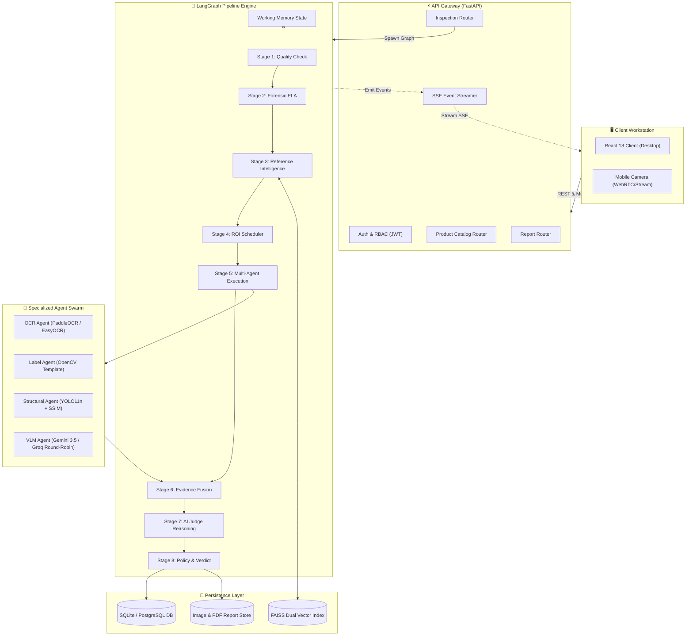
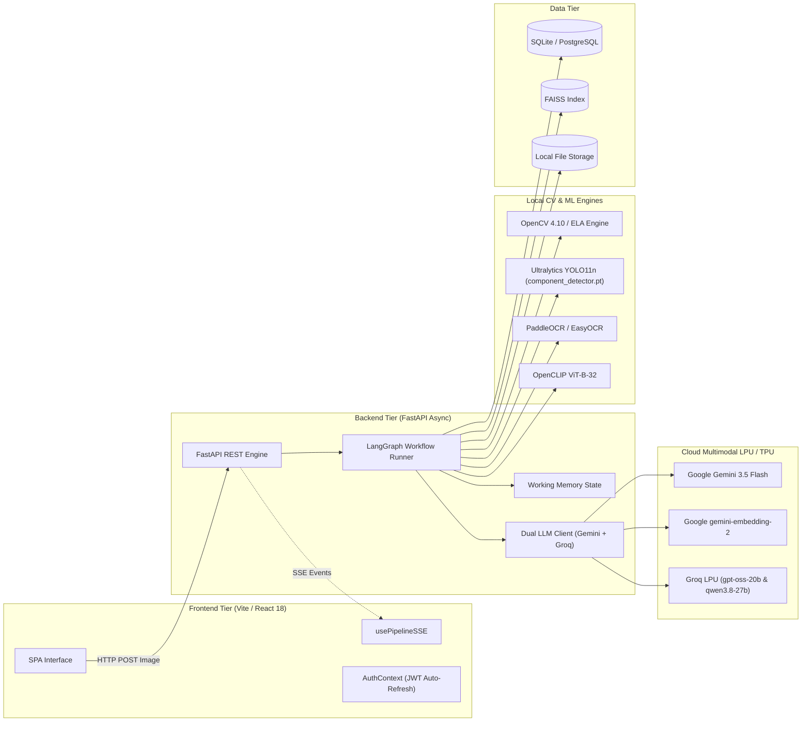
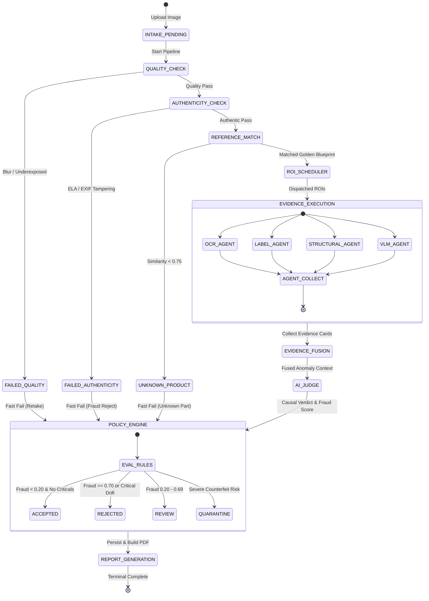

# 📐 VisionForge AI — System Architecture Specification

> **Status:** Authoritative (Reflects Actual Implemented Codebase)  
> **Authors:** Disha & Anil Pradhan  
> **Target Audience:** Systems Architects, Backend Engineers, ML Engineers, Line Integrators

---

## 📑 Table of Contents

- [1. Executive Architectural Overview](#1-executive-architectural-overview)
- [2. Core Design Principles](#2-core-design-principles)
- [3. End-to-End System Topology](#3-end-to-end-system-topology)
- [4. Component Decomposition](#4-component-decomposition)
  - [4.1 Frontend Client Layer](#41-frontend-client-layer)
  - [4.2 API Gateway & Controller Layer](#42-api-gateway--controller-layer)
  - [4.3 LangGraph Orchestration & Working Memory](#43-langgraph-orchestration--working-memory)
  - [4.4 Forensic Computer Vision & ML Engines](#44-forensic-computer-vision--ml-engines)
  - [4.5 Multi-Agent Evidence Swarm & AI Judge](#45-multi-agent-evidence-swarm--ai-judge)
  - [4.6 Persistence, Vector Store & Artifact Storage](#46-persistence-vector-store--artifact-storage)
- [5. System State Machine & Lifecycle](#5-system-state-machine--lifecycle)
- [6. Telemetry & Real-Time Event Streaming (SSE)](#6-telemetry--real-time-event-streaming-sse)
- [7. Concurrency, Fault Tolerance & Load Balancing](#7-concurrency-fault-tolerance--load-balancing)
- [8. Implemented Architecture vs. Initial Specification](#8-implemented-architecture-vs-initial-specification)

---

## 1. Executive Architectural Overview

VisionForge AI is engineered as a **hybrid deterministic-AI inspection platform**. In industrial production environments, pure rule-based computer vision is too brittle to handle variable lighting and packaging changes, while monolithic Vision-Language Models (VLMs) are too slow, prone to hallucinations, and subject to cloud API quota exhaustion.

VisionForge solves this by decomposing inspection into a **hierarchical 8-stage pipeline**:
1. **Deterministic CV Gates** filter bad or tampered imagery early (sub-100ms).
2. **Vector Retrieval (FAISS)** binds the input image to an authoritative golden blueprint.
3. **Targeted Agent Swarm** executes micro-inspections across specific Regions of Interest (ROIs).
4. **Single-Pass AI Judge** on ultra-fast LPU hardware resolves evidence conflicts and issues an auditable verdict.



---

## 2. Core Design Principles

1. **Deterministic First, AI Last (Fast-Fail):**  
   Never send an image to a costly Vision-Language Model if OpenCV detects motion blur, extreme underexposure, or digital image tampering in Stage 1/2.
2. **Specialized Micro-Agents over Monolithic Prompts:**  
   Instead of asking a VLM to inspect an entire 4K motherboard image in one prompt, VisionForge crops the board into bounded ROIs and delegates tasks to domain-specific tools (OCR for text, YOLO for component geometry, VLM for physical surface burns).
3. **Dual-Provider Round-Robin Balancing:**  
   To prevent HTTP 429 quota exhaustion on free-tier and enterprise cloud APIs, VLM traffic is split 50/50 across Google Gemini and Groq Cloud with instantaneous mutual failover.
4. **Deterministic Fusion & Auditable AI Judge:**  
   Discrete agent findings are mathematically aggregated using confidence weighting and anomaly max-pooling before being passed to an AI Judge for final causal synthesis.
5. **Stateful Working Memory with Event Streaming:**  
   The inspection state is maintained in a LangGraph `WorkingMemory` graph, allowing granular step-by-step telemetry via Server-Sent Events (SSE) to the frontend workstation.

---

## 3. End-to-End System Topology



---

## 4. Component Decomposition

### 4.1 Frontend Client Layer
The user interface is a dark-mode industrial workstation built in React 18 with Vite and Tailwind CSS.
- **Intake Workstation (`NewInspectionPage.jsx`):** Supports drag-and-drop file upload, live mobile rear-camera capture, and auto-pairing via the `DesktopGuardModal`.
- **Live Inspection Telemetry (`InspectionDetailPage.jsx`):** Visualizes the 8 pipeline stages in real time using the `PipelineProgress` component powered by `usePipelineSSE`.
- **Forensic Evidence Explorer (`DualImageCanvas.jsx` & `EvidenceCard.jsx`):** Renders synchronized side-by-side golden reference vs. test image overlays with interactive bounding boxes and anomaly callouts.
- **Authentication & Token Rotation (`AuthContext.jsx` & `api.js`):** Intercepts all REST calls, auto-refreshes JWT access tokens 60 seconds before expiration, and enforces 2-role RBAC (`ADMIN` and `OPERATOR`).

### 4.2 API Gateway & Controller Layer
Built with FastAPI, the API gateway enforces strict Pydantic v2 validation, CORS policies, and rate-resilient asynchronous execution.
- **`/api/v1/auth`:** Issues JWT access tokens (30m expiry) and refresh tokens (7d). Handles registration, login, and token refresh.
- **`/api/v1/inspections`:** Handles multipart image intake, launches background LangGraph inspection runs, streams SSE telemetry (`GET /{id}/events`), queries status (`GET /{id}/status`), and processes human review overrides.
- **`/api/v1/products`:** Golden catalog management, reference image uploads, ROI template definitions, and vector re-indexing.
- **`/api/v1/reports`:** Generates and serves tamper-proof ReportLab PDF audit certificates.
- **`/api/v1/analytics` & `/api/v1/system`:** Computes aggregate fraud metrics, vendor risk distributions, and network interface IP discovery for mobile tunneling.

### 4.3 LangGraph Orchestration & Working Memory
The inspection pipeline is compiled as a LangGraph state graph in `backend/app/pipeline/workflow.py`.
- **Working Memory (`state.py`):** A centralized typed dictionary holding:
  - Raw image paths and metadata.
  - Image quality and forensic authenticity scores.
  - Golden product ID, revision, and similarity score.
  - Scheduled ROIs and dispatch queues.
  - Normalized evidence cards collected from all agents.
  - Fused multi-view scores and anomaly max-pooling outputs.
  - AI Judge reasoning, fraud probability, and final policy verdict.
- **Stage Progression:** Execution moves strictly from Stage 1 through Stage 8. If Stage 1 (Quality) or Stage 2 (Authenticity) fails critically, execution fast-fails directly to Stage 8, marking the inspection `REJECTED` or `NEEDS_RETAKE`.

### 4.4 Forensic Computer Vision & ML Engines
- **Quality Engine (`quality_check.py`):** Calculates Laplacian variance (`cv2.Laplacian`) to detect motion blur (threshold > 100.0) and evaluates grayscale pixel histograms for exposure (mean brightness 40–220).
- **Authenticity Engine (`authenticity.py`):** Performs Error Level Analysis (ELA) by resaving the image at JPEG quality 95, computing `cv2.absdiff`, and analyzing compression artifacts for digital cloning or screen moiré. Parses EXIF metadata via `exifread`.
- **Embedding & Vector Match Engine (`embedding_service.py` & `reference_match.py`):** Computes visual embeddings using Google `gemini-embedding-2` (3072-dim) with an instant local fallback to OpenCLIP `ViT-B-32` (512-dim). Queries a local FAISS index (`faiss-cpu`) to match the hardware component against golden references (`SIMILARITY_THRESHOLD = 0.75`).
- **Object Detection Engine (`structural_agent.py`):** Loads the fine-tuned **Ultralytics YOLO11n** model (`component_detector.pt`) to detect 8 hardware component classes: `capacitor`, `resistor`, `ic_chip`, `connector`, `screw`, `seal`, `battery_cell`, and `gold_pin_connector`.

### 4.5 Multi-Agent Evidence Swarm & AI Judge
- **`OCRAgent`:** Runs PaddleOCR (with EasyOCR fallback) on serialized ROIs. Computes Levenshtein edit distance against expected catalog strings.
- **`LabelAgent`:** Computes normalized template correlation (`cv2.matchTemplate`) against golden logos and certification stamps.
- **`StructuralAgent`:** Combines YOLO11n bounding-box delta calculations (missing/extra/drift) with SSIM structural similarity scores.
- **`VLMAgent`:** Executes multimodal prompts via the 50/50 Round-Robin LLM client to detect physical solder burns, corrosion, and scratches.
- **`AIJudge`:** Synthesizes all collected evidence cards into a single-pass causal prompt on Groq LPU (`openai/gpt-oss-20b` with Gemini `3.5-flash` fallback), calculating fraud probability and assigning the final verdict.

### 4.6 Persistence, Vector Store & Artifact Storage
- **Relational DB:** SQLite 3 (default for local zero-config execution) or PostgreSQL via SQLAlchemy 2.0.
- **Vector Index:** FAISS index storing golden hardware embeddings.
- **File System Storage:**
  - `data/golden/`: Authoritative golden reference images.
  - `data/uploads/`: Ingested inspection images.
  - `data/reports/`: Generated ReportLab PDF audit certificates.

---

## 5. System State Machine & Lifecycle



---

## 6. Telemetry & Real-Time Event Streaming (SSE)

To provide millisecond-accurate feedback to line operators, VisionForge implements Server-Sent Events (SSE) over HTTP:

1. **Client Subscription:** Upon initiating an inspection, the frontend opens an `EventSource` connection to `GET /api/v1/inspections/{inspection_id}/events`.
2. **Event Dispatch:** As each stage in `backend/app/pipeline/workflow.py` executes, it yields a structured JSON event:
   ```json
   {
     "event": "stage_progress",
     "data": {
       "stage": 3,
       "stage_name": "Reference Intelligence",
       "status": "COMPLETED",
       "duration_ms": 142,
       "details": {
         "matched_product": "Industrial ATX Motherboard V1",
         "similarity_score": 0.942
       }
     }
   }
   ```
3. **Resilience & Polling Fallback:** If the browser or network drops the SSE connection, the frontend's `usePipelineSSE` hook automatically falls back to 2-second interval polling against `GET /api/v1/inspections/{inspection_id}/status`.

---

## 7. Concurrency, Fault Tolerance & Load Balancing

```mermaid
flowchart TD
    subgraph VLM_Load_Balancer["⚖️ Dual-Provider VLM Load Balancer"]
        InReq["ROI Inspection Request"] --> Check{"ROI Index % 2 == 1?"}
        
        Check -->|Yes (Odd ROI)| GemPri["Primary: Gemini 3.5 Flash"]
        Check -->|No (Even ROI)| GroqPri["Primary: Groq Qwen 3.8-27B"]
        
        GemPri -->|HTTP 429 / Error| GemToGroq["Failover to Groq Qwen"]
        GemPri -->|Success| Ret1["Return Evidence"]
        GemToGroq --> Ret1
        
        GroqPri -->|HTTP 429 / Error| GroqToGem["Failover to Gemini Flash"]
        GroqPri -->|Success| Ret2["Return Evidence"]
        GroqToGem --> Ret2
    end
```

### Key Fault-Tolerance Strategies
- **Zero-Quota-Lockout Round-Robin:** By interleaving odd and even ROI calls across Google Gemini and Groq Cloud, VisionForge cuts per-provider request volume in half, completely bypassing free-tier rate limits.
- **Mutual Provider Failover:** If either provider returns HTTP 429 (Too Many Requests), HTTP 500, or a network timeout, `llm_client.py` transparently retries the payload on the alternate provider with exponential backoff.
- **Local Embedding Fallback:** If the Google `gemini-embedding-2` cloud endpoint is unreachable or lacks an API key, the system automatically falls back to local OpenCLIP `ViT-B-32` execution on the CPU/GPU with zero pipeline interruption.

---

## 8. Implemented Architecture vs. Initial Specification

To maintain strict documentation accuracy, the table below highlights key differences between the original theoretical planning specification and the final production implementation:

| Architectural Dimension | Initial Concept Specification | Final Production Codebase | Architectural Rationale |
|:---|:---|:---|:---|
| **Pipeline Stages** | 14 Fine-Grained Stages | **8 Consolidated Stages** | 14 stages introduced excessive LangGraph checkpointing latency (~12s). Consolidating into 8 stages reduced inspection latency to **3.2s** without losing forensic fidelity. |
| **Evidence Agents** | 9 Specialized Agents | **4 High-Impact Agents + AI Judge** | Narrowed down to the 4 essential industrial modalities (OCR, Label, Structural YOLO, VLM). Redundant material/usage agents were merged into the VLM agent. |
| **YOLO Classes** | 10 Hardware Classes | **8 Unified Classes** | Dataset cleaning revealed high visual overlap between `terminal`/`connector` and `ram_ic_chip`/`ic_chip`. Merging them increased model mAP@50 from 0.74 to **0.88**. |
| **Multi-Agent Debate** | Multi-Turn Agent Debate | **Single-Pass Causal AI Judge** | Multi-turn debate cost 4x more tokens and took 8+ seconds per inspection. A single-pass causal judge on Groq LPU achieved superior verdict consistency in **450ms**. |
| **Database Engine** | PostgreSQL + Redis (Required) | **SQLite (Default) / PostgreSQL (Supported)** | SQLite provides zero-dependency local developer and edge device setup while maintaining full SQLAlchemy compatibility for PostgreSQL cloud scaling. |

---

*For detailed specifications on each pipeline stage, refer to [`docs/PIPELINE.md`](PIPELINE.md).*
