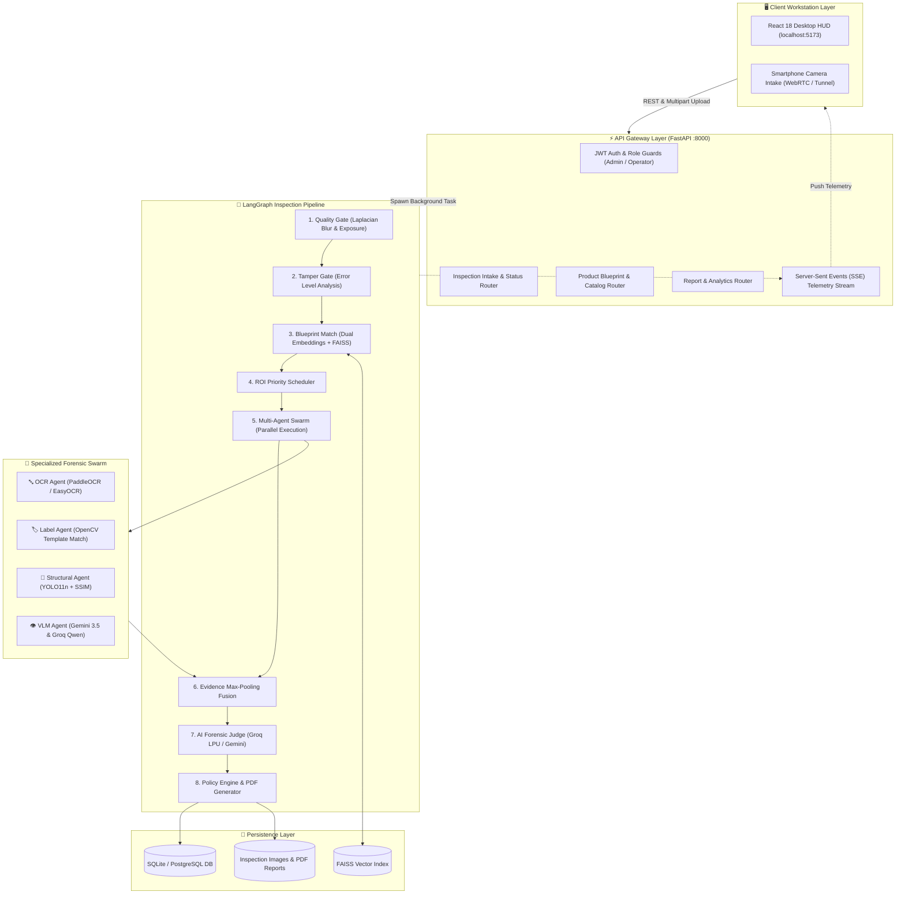
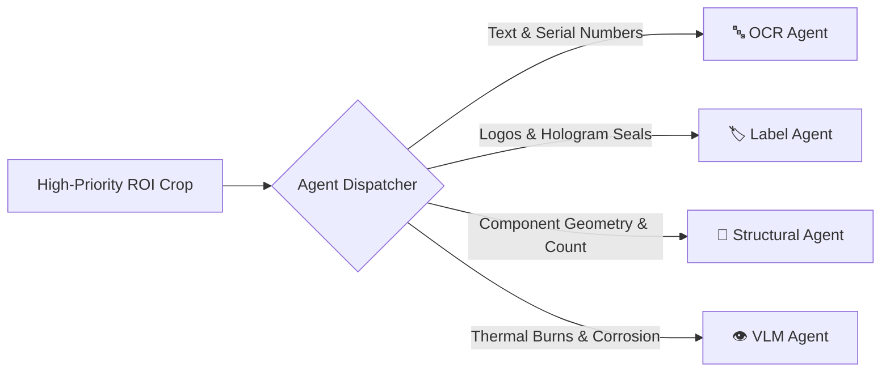
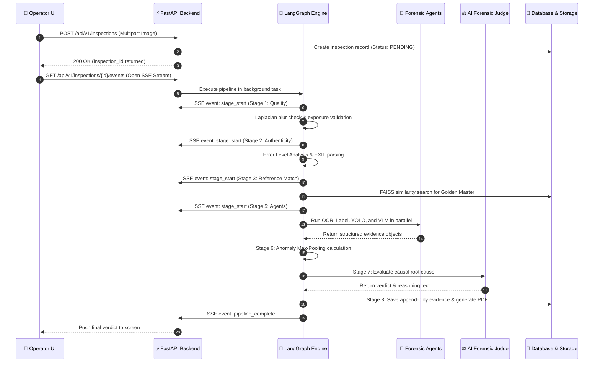

# 📐 System Architecture

> **How VisionForge AI turns raw hardware images into verified forensic verdicts in under 4 seconds.**

---

## 📖 Table of Contents

- [1. The Journey of One Inspection](#1-the-journey-of-one-inspection)
- [2. High-Level System Topology](#2-high-level-system-topology)
- [3. Core Architectural Layers](#3-core-architectural-layers)
  - [3.1 Frontend Client Layer](#31-frontend-client-layer)
  - [3.2 API Gateway Layer](#32-api-gateway-layer)
  - [3.3 LangGraph Pipeline Orchestrator](#33-langgraph-pipeline-orchestrator)
  - [3.4 Specialized AI Agent Swarm](#34-specialized-ai-agent-swarm)
  - [3.5 Storage & Vector Intelligence](#35-storage--vector-intelligence)
- [4. Complete Data Flow Lifecycle](#4-complete-data-flow-lifecycle)
- [5. Concurrency & Failover Strategy](#5-concurrency--failover-strategy)
- [6. Architecture Decisions & Trade-Offs](#6-architecture-decisions--trade-offs)

---

## 1. The Journey of One Inspection

Before looking at individual source files, it helps to understand the journey of a single inspection.

Imagine a factory operator standing at a receiving dock in an electronics plant:

```text
1. The operator places a circuit board under a macro camera and clicks "Inspect".
                           ↓
2. The browser uploads the image to the FastAPI backend.
                           ↓
3. Fast computer vision checks sharpness and lighting in 30ms.
                           ↓
4. Error Level Analysis (ELA) verifies the photo was not edited in Photoshop.
                           ↓
5. FAISS vector search looks up the matching manufacturer blueprint in 15ms.
                           ↓
6. The image is cropped into Regions of Interest (ROIs).
                           ↓
7. Four specialized agents run in parallel:
   • OCR reads chip serial numbers
   • Label Agent checks safety certifications
   • YOLO counts capacitors and chips
   • VLM inspects solder joints and surface burns
                           ↓
8. Anomaly Max-Pooling ensures a single missing part is never diluted by clean parts.
                           ↓
9. The AI Forensic Judge explains the root cause on ultra-fast Groq LPU hardware.
                           ↓
10. The operator sees the verdict on their screen, and a signed PDF report is generated.
```

---

## 2. High-Level System Topology

VisionForge separates responsibilities across five distinct layers:



---

## 3. Core Architectural Layers

### 3.1 Frontend Client Layer
- **Framework:** React 18.3 with Vite 5.4 for sub-second hot reloading.
- **Styling:** Custom Tailwind CSS Cyberpunk HUD design with high-contrast obsidian cards (`#070b12`), electric cyan highlights (`#00f0ff`), and emerald/crimson status chips.
- **Real-Time Telemetry:** The `usePipelineSSE` hook subscribes to real-time execution events over Server-Sent Events (SSE) with an automatic 2.5-second polling fallback if the connection drops.
- **Synchronized Canvas:** `DualImageCanvas.jsx` renders side-by-side zoom and pan comparison between the test board and the manufacturer's golden blueprint.

---

### 3.2 API Gateway Layer
- **Framework:** FastAPI 0.115 on top of Uvicorn ASGI.
- **Authentication:** Dual-token JSON Web Token (JWT) architecture.
  - 30-minute Access Token (HS256) refreshed automatically by a background timer at minute 29.
  - 7-day Refresh Token stored securely for seamless session recovery.
- **Role-Based Access Control (RBAC):** Restricts dangerous actions (like uploading or deleting golden blueprints) to `ADMIN` users while allowing `OPERATOR` users to run inspections.

---

### 3.3 LangGraph Pipeline Orchestrator
The pipeline is modeled as a state machine using **LangGraph**:

```python
# Conceptual State Graph Flow
class InspectionState(TypedDict):
    inspection_id: str
    image_bytes: bytes
    quality_passed: bool
    golden_reference_id: Optional[str]
    roi_queue: List[ROIDefinition]
    evidence: List[AgentEvidence]
    anomaly_score: float
    verdict: Optional[str]
    judge_reasoning: Optional[str]
```

Each stage reads from and writes to this shared state. If Stage 1 (Blur Check) or Stage 2 (Tampering Check) fails, the graph exits early, saving cloud compute and returning actionable feedback to the operator immediately.

---

### 3.4 Specialized AI Agent Swarm

Instead of asking one generic model to inspect an entire circuit board, VisionForge routes focused image crops to specialized agents:



1. **OCR Agent:** Uses PaddleOCR and EasyOCR with Levenshtein string matching to detect altered lot numbers and date codes.
2. **Label Agent:** Uses OpenCV normalized cross-correlation (`matchTemplate`) to detect cloned safety stamps and rotated stickers.
3. **Structural Agent:** Uses our custom **YOLO11n 8-class model** to count components and Structural Similarity (SSIM) to flag positional drift.
4. **VLM Agent:** Uses multimodal vision models load-balanced 50/50 between **Google Gemini 3.5 Flash** and **Groq Qwen 3.8 27B** to detect burn marks and physical damage.
5. **AI Forensic Judge:** Runs on Groq LPU (`gpt-oss-20b`) to synthesize all agent outputs and write a clear explanation of what went wrong.

---

### 3.5 Storage & Vector Intelligence
- **Relational Database:** SQLAlchemy 2.0 with async support. Works out-of-the-box on SQLite for zero-config local development and scales to PostgreSQL 16+ for factory-floor concurrency.
- **Append-Only Evidence Schema:** Individual evidence records (`evidence` table) cannot be edited or deleted once written, preserving chain-of-custody for warranty disputes.
- **Vector Search Engine:** FAISS (Facebook AI Similarity Search) index storing 3072-dimensional Gemini embeddings and 512-dimensional OpenCLIP embeddings for sub-15ms blueprint retrieval.

---

## 4. Complete Data Flow Lifecycle

Here is what happens inside the system during an active inspection:



---

## 5. Concurrency & Failover Strategy

```text
┌─────────────────────────────────────────────────────────────────────────────┐
│                    HIGH-AVAILABILITY FAILOVER DESIGN                        │
├─────────────────────────────────────────────────────────────────────────────┤
│ 1. VLM Round-Robin:                                                         │
│    Queries alternate evenly between Gemini 3.5 Flash and Groq Qwen 3.8.     │
│    If Provider A returns HTTP 429 / 500, Provider B takes over instantly.  │
│                                                                             │
│ 2. Dual Embedding Fallback:                                                 │
│    Primary: Gemini Cloud Embeddings (3072-dim).                             │
│    Fallback: Local OpenCLIP ViT-B-32 (512-dim) if internet goes down.       │
│                                                                             │
│ 3. UI Resilient Telemetry:                                                  │
│    Primary: Real-time Server-Sent Events (SSE).                             │
│    Fallback: 2.5s HTTP polling if the SSE socket is closed by a proxy.      │
└─────────────────────────────────────────────────────────────────────────────┘
```

---

## 6. Architecture Decisions & Trade-Offs

> 🧠 **Engineering Decision: Why not use a single large VLM prompt?**
> A single large vision prompt seems simpler, but in practice:
> 1. It is slow (3-8 seconds per call).
> 2. It misses small components on 4K boards because images get downscaled.
> 3. It cannot count 40 tiny resistors reliably.
> 4. It costs significantly more per inspection.
>
> VisionForge uses fast local models (OpenCV and YOLO11n) for 90% of spatial work and reserves multimodal LLMs only for complex surface analysis and final arbitration.

---

*To explore how each pipeline stage works mathematically and logically, read [`docs/PIPELINE.md`](PIPELINE.md).*
