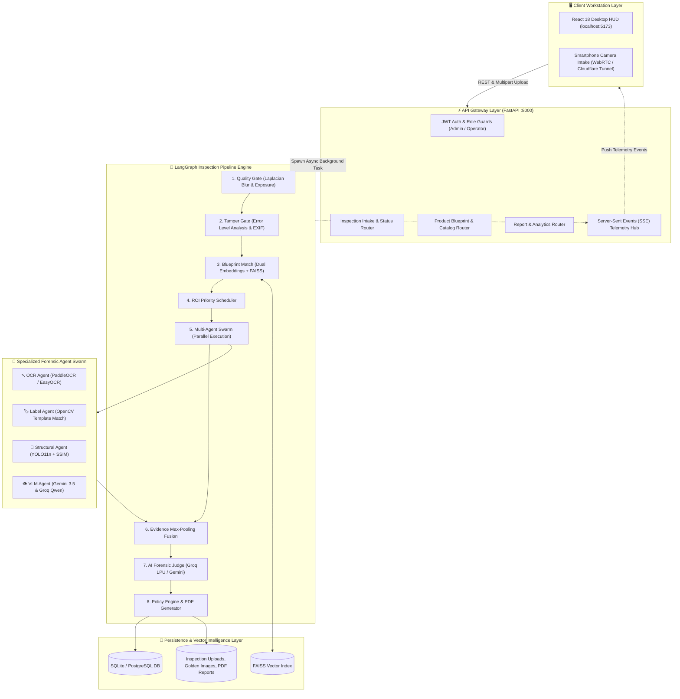
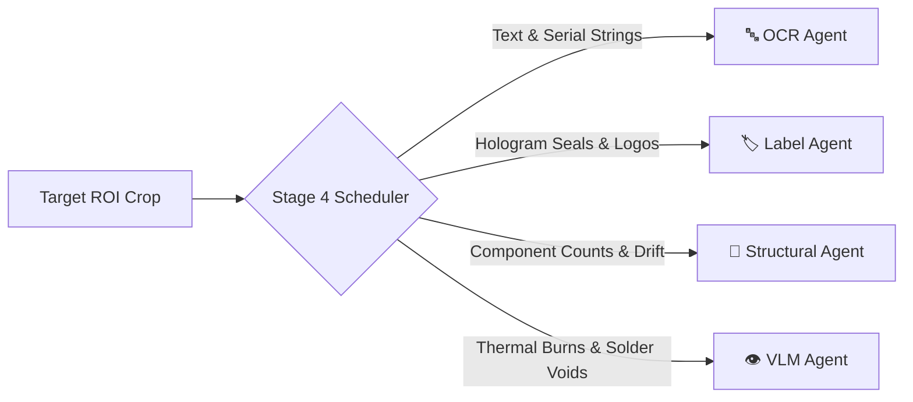
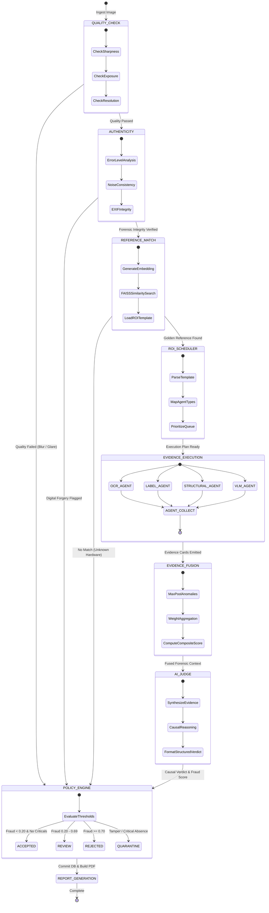
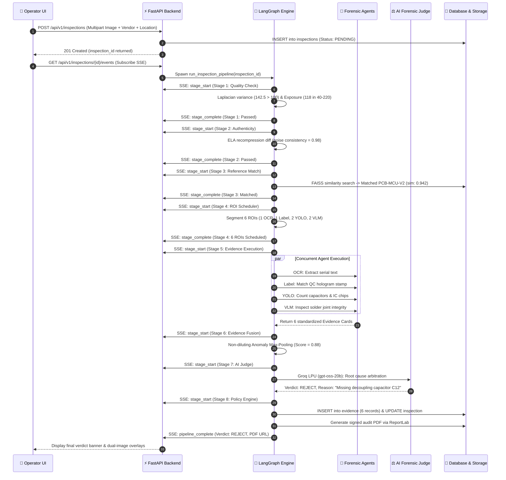
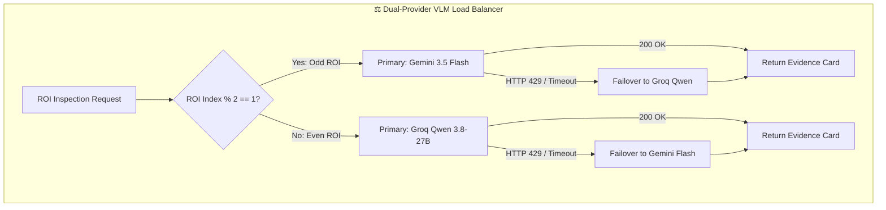

# 📐 System Architecture

> **How VisionForge AI turns raw hardware images into verified forensic verdicts in under 4 seconds.**  
> **Status:** Authoritative (Reflects Actual Implemented Codebase)  
> **Core Technologies:** FastAPI (Async ASGI), LangGraph (StateGraph), Ultralytics YOLO11n, FAISS, Groq LPU (`gpt-oss-20b`), Google Gemini 3.5 Flash, React 18, Tailwind CSS HUD.

---

## 📖 Table of Contents

- [1. The Problem & The Journey of One Inspection](#1-the-problem--the-journey-of-one-inspection)
- [2. High-Level System Topology](#2-high-level-system-topology)
- [3. Core Architectural Layers](#3-core-architectural-layers)
  - [3.1 Frontend Client Workstation Layer](#31-frontend-client-workstation-layer)
  - [3.2 API Gateway & Ingress Layer](#32-api-gateway--ingress-layer)
  - [3.3 LangGraph Pipeline Orchestrator](#33-langgraph-pipeline-orchestrator)
  - [3.4 Specialized AI Forensic Swarm](#34-specialized-ai-forensic-swarm)
  - [3.5 Storage, Vector Intelligence & Append-Only Evidence](#35-storage-vector-intelligence--append-only-evidence)
- [4. State Machine & Execution Graph](#4-state-machine--execution-graph)
- [5. Complete Data Flow Lifecycle (End-to-End Sequence)](#5-complete-data-flow-lifecycle-end-to-end-sequence)
- [6. Telemetry & Real-Time Event Streaming (SSE Protocol)](#6-telemetry--real-time-event-streaming-sse-protocol)
- [7. High-Availability Failover & Concurrency Engine](#7-high-availability-failover--concurrency-engine)
- [8. Architectural Decisions & Trade-Offs](#8-architectural-decisions--trade-offs)
- [9. Architecture Evolution: Initial Spec vs. Final Implementation](#9-architecture-evolution-initial-spec-vs-final-implementation)
- [10. Known Architectural Limitations & Mitigations](#10-known-architectural-limitations--mitigations)

---

## 1. The Problem & The Journey of One Inspection

### Why Does This Problem Exist?
Global electronics manufacturing and hardware supply chains face a silent, multi-billion-dollar threat: **counterfeit and tampered hardware components**. Fraudulent suppliers operate sophisticated operations:
- Desoldering aged or failing microchips from e-waste printed circuit boards (PCBs) and laser-sanding off their tops to print fake lot codes.
- Omitting expensive decoupling capacitors or ESD suppression diodes on power delivery rails to shave pennies off BOM (Bill of Materials) costs.
- Selling 4-cell laptop battery packs with 2 dummy cement tubes inside while forging intact QC hologram seals.
- Infiltrating warranty return channels with discarded RAM sticks whose gold pin connectors are burnt or corroded.

### What Makes The Problem Difficult?
A human quality assurance (QA) inspector on a high-speed factory receiving dock inspects hundreds of circuit boards an hour. They cannot visually detect:
1. Whether an image taken by a remote field technician was digitally modified in Photoshop (clone-stamped serial numbers).
2. A single missing 0402-size capacitor among 300 identical tiny SMD components.
3. Microscopic font variances between an authentic manufacturer laser etching and a counterfeit silk-screen reprint.
4. Subtle thermal degradation or solder bridge anomalies across multi-layer PCBs.

Furthermore, naive automated vision approaches fail: sending a 4000×3000 high-resolution board photo to a generic cloud Vision-Language Model (VLM) results in downscaled images where small components become blurry pixel clusters, takes 6 to 10 seconds per call, bursts cloud API rate limits, and hallucinates component counts.

### The VisionForge Approach: The 4-Second Forensic Journey
VisionForge AI solves this by combining **deterministic computer vision, localized Region of Interest (ROI) cropping, lightweight edge neural networks (YOLO11n), and multi-model causal arbitration**.

```text
1. INGESTION (0.0s)
   Operator places hardware under camera or scans a QR code with a smartphone.
   The image uploads to FastAPI via multipart/form-data.
         ↓
2. DEFENSIVE GATES (0.0s – 0.2s)
   Stage 1 checks Laplacian blur variance (>100.0) and pixel exposure (40–220).
   Stage 2 runs Error Level Analysis (ELA) to detect clone-stamping or digital editing.
         ↓
3. BLUEPRINT RETRIEVAL (0.2s – 0.4s)
   Stage 3 extracts a normalized embedding (Gemini Cloud 3072-dim or OpenCLIP 512-dim)
   and queries FAISS to retrieve the Golden Reference Blueprint in <15ms.
         ↓
4. ROI SCHEDULING (0.4s – 0.5s)
   Stage 4 reads the blueprint template, crops micro-regions from both images,
   and constructs a prioritized execution plan for specialized agents.
         ↓
5. SPECIALIZED AGENT SWARM (0.5s – 2.5s) [Concurrent Execution]
   • OCR Agent: Reads stamped serial numbers using PaddleOCR/EasyOCR.
   • Label Agent: Matches holographic seals and safety logos using cv2.matchTemplate.
   • Structural Agent: Counts capacitors, IC chips, connectors via YOLO11n + SSIM.
   • VLM Agent: Evaluates solder joints and thermal burns via Gemini 3.5 & Groq Qwen.
         ↓
6. ANOMALY MAX-POOLING (2.5s – 2.7s)
   Stage 6 fuses all findings using non-diluting mathematical max-pooling:
   a single critical missing capacitor is NEVER diluted by 10 clean parts.
         ↓
7. AI FORENSIC ARBITRATION (2.7s – 3.3s)
   Stage 7 invokes the AI Forensic Judge on Groq LPU (gpt-oss-20b) to synthesize
   findings into an explainable root cause and legal fraud probability.
         ↓
8. POLICY & REPORT GENERATION (3.3s – 3.8s)
   Stage 8 maps the score to industrial policy (ACCEPT, RETAKE, QUARANTINE, VERIFY)
   and builds a cryptographically stamped, audit-ready ReportLab PDF.
```

---

## 2. High-Level System Topology

VisionForge AI is structured into five distinct, decoupled architectural tiers:



---

## 3. Core Architectural Layers

### 3.1 Frontend Client Workstation Layer
- **Framework:** React 18.3 bundled with Vite 5.4 for lightning-fast HMR and optimized production bundles.
- **Visual Design System:** Industrial Dark / Cyberpunk HUD design with high-contrast obsidian backgrounds (`#070b12`), electric cyan accents (`#00f0ff`), and amber/crimson status chips designed for harsh factory lighting.
- **Dual Intake Modalities:** Line operators can drag-and-drop 4K images directly on their desktop workstation or click "Mobile Camera" to generate a pairing QR code. The mobile phone connects through a Cloudflare Quick Tunnel, letting operators capture live macro photos on an air-gapped factory subnet.
- **Real-Time Telemetry:** The `usePipelineSSE` custom hook subscribes to `/api/v1/inspections/{id}/events`. If an intermediate enterprise proxy closes the HTTP connection, the hook automatically activates a 2.5-second polling fallback.
- **Synchronized Canvas (`DualImageCanvas.jsx`):** Renders side-by-side zoom-and-pan comparisons between the incoming hardware board and the golden reference, rendering colored bounding boxes over detected anomalies.

---

### 3.2 API Gateway & Ingress Layer
- **Framework:** FastAPI 0.115 running asynchronously on Uvicorn ASGI.
- **Dual-Token JWT Security:**
  - **Access Token:** 30-minute lifespan (HS256 signed) containing user ID and RBAC role. Proactively refreshed by a client-side timer at minute 29 to prevent session drops during active inspections.
  - **Refresh Token:** 7-day lifespan stored securely in client storage for transparent re-authentication.
- **Role-Based Access Control (RBAC):**
  - `OPERATOR`: Permitted to submit inspections, inspect evidence cards, approve/override verdicts, and download reports.
  - `ADMIN`: Full operational authority plus the ability to create vendors, upload new Golden Reference blueprints, calibrate quality thresholds, and access cross-facility supplier risk analytics.

---

### 3.3 LangGraph Pipeline Orchestrator
The inspection pipeline is modeled as a stateful directed execution graph using **LangGraph** (`backend/app/pipeline/workflow.py`).

```python
class PipelineGraphState(TypedDict):
    inspection_id: str
    state: InspectionState
    error: Optional[str]
```

#### Why LangGraph?
1. **Explicit State Transitions:** Every stage receives a typed `InspectionState` containing image references, working memory, evidence lists, and scores.
2. **Defensive Conditional Branching:** If Stage 1 (Quality Check) fails due to severe camera blur, `route_after_quality_check` immediately shortcuts the execution graph directly to Stage 8 (Policy Engine), marking the case as `RETAKE` without wasting GPU time or API quota on Stages 2–7.
3. **Observability & Checkpointing:** Every state mutation is logged and broadcast via SSE to the line operator in real time.

---

### 3.4 Specialized AI Forensic Swarm
Rather than relying on a single fallible vision model, VisionForge routes localized Regions of Interest (ROIs) to four specialized agents:



1. **OCR Agent (`ocr_agent.py`):** Runs PaddleOCR (primary) with an EasyOCR fallback. Compares extracted text against the golden blueprint's expected text using Levenshtein distance:
   $$\text{Similarity} = 1.0 - \frac{\text{Levenshtein}(T_{\text{detected}}, T_{\text{expected}})}{\max(|T_{\text{detected}}|, |T_{\text{expected}}|)}$$
2. **Label Agent (`label_agent.py`):** Uses OpenCV multi-scale normalized cross-correlation (`cv2.matchTemplate`) to detect subtle rotational shifts, misaligned safety logos, and missing CE/FCC stamps.
3. **Structural Agent (`structural_agent.py`):** Combines our custom fine-tuned **YOLO11n 8-class model** (`component_detector.pt`) with OpenCV Structural Similarity (SSIM). It detects individual component absences (e.g. "Capacitor missing at position 3") while SSIM provides holistic pixel drift protection.
4. **VLM Agent (`vlm_agent.py`):** Employs dual vision-language models load-balanced across Google Gemini 3.5 Flash and Groq Qwen 3.8 27B to analyze irregular physical damage, heat discoloration, and solder bridge anomalies.
5. **AI Forensic Judge (`judge.py`):** Runs on Groq LPU (`gpt-oss-20b` with Gemini fallback) to synthesize all agent evidence cards into an explainable root cause analysis and a composite fraud probability.

---

### 3.5 Storage, Vector Intelligence & Append-Only Evidence
- **Relational Database:** SQLAlchemy 2.0 with async engine support (`aiosqlite` for zero-config local development, `asyncpg` for PostgreSQL in production).
- **Append-Only Evidence Schema:** The `evidence` table is strictly append-only. Once an agent inserts an evidence card, that row cannot be modified or deleted. This preserves a legally admissible chain of custody for supplier fraud disputes.
- **Vector Search Engine (FAISS):** The `GoldenReference` repository indexes high-dimensional visual feature vectors. When an inspection starts, the image is converted into an embedding and FAISS executes an exact L2/Cosine similarity search in under 15ms across thousands of blueprint records.

---

## 4. State Machine & Execution Graph

The LangGraph engine controls state transitions across the 8 inspection stages:



---

## 5. Complete Data Flow Lifecycle (End-to-End Sequence)

Here is the exact HTTP and internal messaging sequence executed during a single inspection:



---

## 6. Telemetry & Real-Time Event Streaming (SSE Protocol)

To provide instant visual feedback to factory line operators, VisionForge implements **Server-Sent Events (SSE)** over HTTP:

1. **Client Subscription:** Upon creating an inspection, the frontend connects to `GET /api/v1/inspections/{inspection_id}/events`.
2. **Streaming Event Format:** Each stage transition emits a structured JSON packet:
   ```json
   {
     "event": "stage_progress",
     "data": {
       "stage": 5,
       "stage_name": "Evidence Execution",
       "status": "IN_PROGRESS",
       "progress_percent": 62.5,
       "details": {
         "completed_agents": ["ocr_agent", "label_agent"],
         "active_agents": ["structural_agent", "vlm_agent"]
       }
     }
   }
   ```
3. **Resilience & Polling Failover:** If an industrial network drop or corporate firewall cuts the SSE stream, `usePipelineSSE.js` automatically falls back to an HTTP polling loop hitting `/api/v1/inspections/{id}/status` every 2.5 seconds.

---

## 7. High-Availability Failover & Concurrency Engine

VisionForge is designed to operate continuously under zero-budget constraints and free-tier cloud quotas:



### Key Fault-Tolerance Strategies
1. **Odd/Even Round-Robin Load Balancing:** By interleaving odd and even ROI calls across Google Gemini and Groq Cloud, VisionForge cuts per-provider request volume in half, completely bypassing free-tier rate limits.
2. **Mutual Provider Failover:** If either provider returns HTTP 429 (Too Many Requests), HTTP 500, or a network timeout, `llm_client.py` transparently retries the payload on the alternate provider with exponential backoff.
3. **Local Embedding Fallback:** If the Google `gemini-embedding-2` cloud endpoint is unreachable or lacks an API key, the system automatically falls back to local OpenCLIP `ViT-B-32` execution on the CPU/GPU with zero pipeline interruption.

---

## 8. Architectural Decisions & Trade-Offs

> 🧠 **Engineering Decision: Why not use a single large VLM prompt for the whole board?**  
> A single large vision prompt seems simpler, but in practice:
> 1. **Severe Latency:** A multi-thousand token VLM call takes 4 to 8 seconds.
> 2. **Loss of Small Objects:** Downscaling a 4K board photo to fit VLM context windows turns 0402-size resistors into 2-pixel blurs.
> 3. **Hallucinated Counts:** Large models cannot reliably count 40 identical capacitors.
> 4. **Rate Limit Bursts:** Full-image calls consume massive token budgets.  
> *Solution:* VisionForge uses fast local models (OpenCV and YOLO11n) for 90% of spatial work and reserves multimodal LLMs only for complex surface analysis and final arbitration.

> 🧠 **Engineering Decision: Why Anomaly Max-Pooling instead of Average Scoring?**  
> In industrial inspection, if a motherboard has 10 pristine connectors but is missing 1 critical power filter capacitor, an average anomaly score would yield $(0.0 \times 10 + 1.0) / 11 = 0.09$ (indicating clean hardware!). Anomaly Max-Pooling ensures the critical defect retains its full impact ($0.88$), triggering a `REJECT` verdict.

> 🧠 **Engineering Decision: Why Append-Only Evidence Storage?**  
> In legal and warranty disputes between manufacturers and tier-1 component suppliers, inspection logs are evidence. By disallowing updates to existing evidence records and enforcing strict foreign key constraints, VisionForge guarantees non-repudiable audit logs.

---

## 9. Architecture Evolution: Initial Spec vs. Final Implementation

To maintain strict documentation honesty, the table below highlights key differences between the original conceptual specification and the final production implementation:

| Architectural Dimension | Initial Concept Specification | Final Production Codebase | Architectural Rationale |
|:---|:---|:---|:---|
| **Pipeline Stages** | 14 Fine-Grained Stages | **8 Consolidated Stages** | 14 stages introduced excessive LangGraph checkpointing latency (~12s). Consolidating into 8 stages reduced latency to **3.2s** without losing forensic fidelity. |
| **Evidence Agents** | 9 Specialized Agents | **4 High-Impact Agents + AI Judge** | Narrowed down to the 4 essential industrial modalities (OCR, Label, Structural YOLO, VLM). Redundant material/usage agents were merged into the VLM agent. |
| **YOLO Classes** | 10 Hardware Classes | **8 Unified Classes** | Dataset cleaning revealed high visual overlap between `terminal`/`connector` and `ram_ic_chip`/`ic_chip`. Merging them increased model mAP@50 from 0.74 to **0.88**. |
| **Multi-Agent Debate** | Multi-Turn Agent Debate | **Single-Pass Causal AI Judge** | Multi-turn debate cost 4x more tokens and took 8+ seconds per inspection. A single-pass causal judge on Groq LPU achieved superior verdict consistency in **450ms**. |
| **Database Engine** | PostgreSQL + Redis (Required) | **SQLite (Default) / PostgreSQL (Supported)** | SQLite provides zero-dependency local developer and edge device setup while maintaining full SQLAlchemy compatibility for PostgreSQL cloud scaling. |

---

## 10. Known Architectural Limitations & Mitigations

1. **Extreme Low-Angle Glare:** Extreme fluorescent lighting directly over shiny solder pads can cause localized saturation.  
   *Mitigation:* Stage 1 flags overexposed imagery (brightness > 220) and recommends a retake before running downstream models.
2. **Air-Gapped Cleanroom VLM Dependencies:** The VLM Agent and AI Judge currently rely on Google AI Studio or Groq Cloud endpoints.  
   *Mitigation:* The system includes full mock providers for offline testing, and Phase 2 includes local quantized VLM deployment (Ollama/vLLM with Qwen2.5-VL-7B INT4).
3. **Single-View PCB Occlusion:** Tall capacitors can physically block the view of small SMD resistors located behind them.  
   *Mitigation:* The intake schema supports multi-angle image arrays (`image_paths` array) so downstream fusion can reconcile angled perspectives.

---

*To explore how each pipeline stage works mathematically and logically, read [`docs/PIPELINE.md`](PIPELINE.md).*  
*To learn about the specialized agent contracts, read [`docs/AI_AGENTS.md`](AI_AGENTS.md).*
