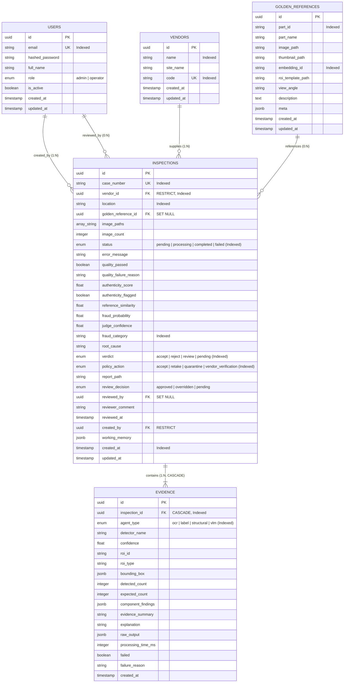

# 🗄️ VisionForge AI — Relational Database Schema & Data Models

> **Status:** Authoritative (Reflects Actual Implemented Codebase)  
> **ORM Engine:** SQLAlchemy 2.0 Mapped Columns (`app.models.*`)  
> **Database Engine:** PostgreSQL 16+ (Production) / SQLite 3 (Test & Local Zero-Config Mode)

---

## 📑 Table of Contents

- [1. Database Architecture & Design Principles](#1-database-architecture--design-principles)
- [2. Entity-Relationship Diagram (ERD)](#2-entity-relationship-diagram-erd)
- [3. Enumerations & Data Types](#3-enumerations--data-types)
- [4. Table Specifications & Column DDL](#4-table-specifications--column-ddl)
  - [4.1 `users` — Authentication & RBAC](#41-users--authentication--rbac)
  - [4.2 `vendors` — Supply Chain Vendor Tracking](#42-vendors--supply-chain-vendor-tracking)
  - [4.3 `golden_references` — Hardware Blueprints & Vectors](#43-golden_references--hardware-blueprints--vectors)
  - [4.4 `inspections` — Inspection Lifecycle & Verdicts](#44-inspections--inspection-lifecycle--verdicts)
  - [4.5 `evidence` — Append-Only Forensic Telemetry](#45-evidence--append-only-forensic-telemetry)
- [5. Cross-Platform Dialect Compatibility](#5-cross-platform-dialect-compatibility)
- [6. Foreign Key Constraints & Cascade Rules](#6-foreign-key-constraints--cascade-rules)
- [7. Database Seeding & Initialization](#7-database-seeding--initialization)

---

## 1. Database Architecture & Design Principles

The VisionForge relational database schema is architected around **strict forensic auditability, referential integrity, and append-only evidence provenance**:

1. **Immutable Forensic Telemetry:** The `evidence` table is strictly append-only. Once an AI agent writes an evidence card or YOLO detection count, the record is never updated or mutated, ensuring legal chain-of-custody compliance for industrial fraud disputes.
2. **Dual-Dialect Portability:** To allow seamless local development without spinning up external containers while providing full high-concurrency performance in production, all columns utilizing PostgreSQL advanced types (`JSONB`, `ARRAY`) declare native SQLite fallbacks (`JSON`).
3. **Optimized Foreign Key Indexing:** Every relational foreign key (`vendor_id`, `created_by`, `inspection_id`, `golden_reference_id`) is explicitly indexed to prevent full-table scans during heavy multi-view analytics joins.

---

## 2. Entity-Relationship Diagram (ERD)



---

## 3. Enumerations & Data Types

The database models declare strongly-typed Python enums mapped to database native enum types:

### 3.1 `UserRole`
- `admin`: Full administrative rights (blueprint creation, vendor deletion, operator performance analytics).
- `operator`: Standard line operator (run inspections, review verdicts, view self statistics).

### 3.2 `InspectionStatus`
- `pending`: Inspection created, awaiting pipeline queue dispatch.
- `processing`: Active execution within the 8-stage LangGraph workflow.
- `completed`: Successfully processed end-to-end; final verdict and PDF generated.
- `failed`: Pipeline terminated due to unrecoverable system exception.

### 3.3 `InspectionVerdict`
- `accept`: Hardware is authentic, undamaged, and matches golden specification.
- `reject`: Confirmed hardware fraud, tampering, or critical structural defect.
- `review`: Ambiguous or borderline defect requiring human operator verification.
- `pending`: In-flight inspection prior to AI Judge stage completion.

### 3.4 `PolicyAction`
- `accept`: Release component lot to manufacturing line.
- `retake`: Prompt operator for image recapture due to blur or lighting failure.
- `quarantine`: Isolate hardware lot and trigger supply chain hold.
- `vendor_verification`: Escalate to supplier quality assurance team for certification verification.

### 3.5 `ReviewDecision`
- `pending`: No human operator review performed.
- `approved`: Human operator affirmed the AI Judge's verdict.
- `overridden`: Human operator manually reversed the AI Judge's verdict with recorded engineering justification.

### 3.6 `AgentType`
- `ocr`: Text, lot code, and serial string extraction agent (PaddleOCR/EasyOCR).
- `label`: Certification marks and holographic seal template matcher (`cv2.matchTemplate`).
- `structural`: Component count, missing parts, and positional drift detector (YOLO11n + SSIM).
- `vlm`: Physical damage, burn marks, and solder bridge vision-language model (Gemini/Groq).

---

## 4. Table Specifications & Column DDL

### 4.1 `users` — Authentication & RBAC

Tracks registered factory personnel, hashed authentication credentials, and permission tiers.

| Column | Type | Constraints | Description |
|:---|:---|:---|:---|
| `id` | `UUID` | `PRIMARY KEY, DEFAULT uuid_generate_v4()` | Unique user identifier. |
| `email` | `VARCHAR(255)` | `NOT NULL, UNIQUE, INDEX` | Corporate email address. |
| `hashed_password` | `VARCHAR(255)` | `NOT NULL` | Bcrypt hashed password string. |
| `full_name` | `VARCHAR(255)` | `NOT NULL` | Full legal name of operator/administrator. |
| `role` | `ENUM(user_role)` | `NOT NULL, DEFAULT 'operator'` | RBAC permission level (`admin`, `operator`). |
| `is_active` | `BOOLEAN` | `NOT NULL, DEFAULT true` | Account active flag for access revocation. |
| `created_at` | `TIMESTAMPTZ` | `NOT NULL, DEFAULT NOW()` | Account creation timestamp. |
| `updated_at` | `TIMESTAMPTZ` | `NOT NULL, DEFAULT NOW()` | Last update timestamp. |

---

### 4.2 `vendors` — Supply Chain Vendor Tracking

Maintains the catalog of approved component manufacturers, assembly suppliers, and risk baselines.

| Column | Type | Constraints | Description |
|:---|:---|:---|:---|
| `id` | `UUID` | `PRIMARY KEY, DEFAULT uuid_generate_v4()` | Unique vendor identifier. |
| `name` | `VARCHAR(255)` | `NOT NULL, INDEX` | Vendor corporate entity name. |
| `site_name` | `VARCHAR(255)` | `NOT NULL` | Manufacturing facility or warehouse location. |
| `code` | `VARCHAR(50)` | `NOT NULL, UNIQUE, INDEX` | Supply chain vendor code (e.g., `VND-FOXCONN-01`). |
| `created_at` | `TIMESTAMPTZ` | `NOT NULL, DEFAULT NOW()` | Vendor registration timestamp. |
| `updated_at` | `TIMESTAMPTZ` | `NOT NULL, DEFAULT NOW()` | Last update timestamp. |

---

### 4.3 `golden_references` — Hardware Blueprints & Vectors

Stores authorized golden reference blueprints, visual embeddings, and expected ROI coordinate maps.

| Column | Type | Constraints | Description |
|:---|:---|:---|:---|
| `id` | `UUID` | `PRIMARY KEY, DEFAULT uuid_generate_v4()` | Unique golden blueprint identifier. |
| `part_id` | `VARCHAR(100)` | `NOT NULL, INDEX` | Internal SKU / Part number (e.g., `PCB-MCU-V2`). |
| `part_name` | `VARCHAR(255)` | `NOT NULL` | Descriptive name (e.g., `Industrial ATX Motherboard V1`). |
| `image_path` | `VARCHAR(512)` | `NOT NULL` | File path to 4K golden master reference image. |
| `thumbnail_path`| `VARCHAR(512)` | `NULLABLE` | Path to downscaled UI thumbnail. |
| `embedding_id` | `VARCHAR(100)` | `NULLABLE, INDEX` | FAISS vector index row ID for vector similarity query. |
| `roi_template_path`| `VARCHAR(512)`| `NULLABLE` | Path to JSON blueprint defining critical ROIs. |
| `view_angle` | `VARCHAR(50)` | `NOT NULL, DEFAULT 'front'` | Camera angle perspective (`front`, `top`, `angled`). |
| `description` | `TEXT` | `NULLABLE` | Engineering blueprint specifications. |
| `meta` | `JSONB / JSON` | `NULLABLE` | Structured metadata (dimensions, component counts). |
| `created_at` | `TIMESTAMPTZ` | `NOT NULL, DEFAULT NOW()` | Blueprint creation timestamp. |
| `updated_at` | `TIMESTAMPTZ` | `NOT NULL, DEFAULT NOW()` | Last update timestamp. |

---

### 4.4 `inspections` — Inspection Lifecycle & Verdicts

The core transaction entity recording intake parameters, stage metrics, AI Judge verdicts, and policy actions.

| Column | Type | Constraints | Description |
|:---|:---|:---|:---|
| `id` | `UUID` | `PRIMARY KEY, DEFAULT uuid_generate_v4()` | Unique inspection run identifier. |
| `case_number` | `VARCHAR(50)` | `NOT NULL, UNIQUE, INDEX` | Human-readable case tracking code (e.g., `VF-2026-0917-001`). |
| `vendor_id` | `UUID` | `NOT NULL, FK(vendors.id, RESTRICT), INDEX` | Target component supplier. |
| `location` | `VARCHAR(255)` | `NOT NULL, INDEX` | Manufacturing line or receiving dock location. |
| `golden_reference_id` | `UUID` | `NULLABLE, FK(golden_references.id, SET NULL)` | Matched golden reference blueprint. |
| `image_paths` | `ARRAY(VARCHAR) / JSON` | `NOT NULL` | List of uploaded inspection capture image paths. |
| `image_count` | `INTEGER` | `NOT NULL, DEFAULT 1` | Total image perspectives captured. |
| `status` | `ENUM(inspection_status)` | `NOT NULL, DEFAULT 'pending', INDEX` | Execution lifecycle status. |
| `error_message`| `VARCHAR(2000)`| `NULLABLE` | Fatal exception stack or error description. |
| `quality_passed`| `BOOLEAN` | `NOT NULL, DEFAULT false` | Stage 1 blur/exposure check pass flag. |
| `quality_failure_reason`| `VARCHAR(500)`| `NULLABLE` | Explanation if Stage 1 fails (e.g., `Blur score 64.2 < 100`). |
| `authenticity_score`| `FLOAT` | `NULLABLE` | Stage 2 ELA tampering metric. |
| `authenticity_flagged`| `BOOLEAN` | `NOT NULL, DEFAULT false` | True if EXIF/ELA detected digital manipulation. |
| `reference_similarity`| `FLOAT` | `NULLABLE` | Stage 3 FAISS cosine similarity to golden image. |
| `fraud_probability`| `FLOAT` | `NULLABLE` | Composite fraud likelihood score ($0.0 \le p \le 1.0$). |
| `judge_confidence`| `FLOAT` | `NULLABLE` | AI Judge cognitive confidence score ($0.0 \le c \le 1.0$). |
| `fraud_category`| `VARCHAR(100)` | `NULLABLE, INDEX` | Defect category (e.g., `MISSING_COMPONENTS`, `RE-MARKING`). |
| `root_cause` | `VARCHAR(4000)` | `NULLABLE` | Comprehensive plain-English reasoning from AI Judge. |
| `verdict` | `ENUM(inspection_verdict)` | `NOT NULL, DEFAULT 'pending', INDEX` | Final inspection verdict. |
| `policy_action`| `ENUM(policy_action)` | `NULLABLE, INDEX` | Recommended supply chain policy action. |
| `report_path` | `VARCHAR(500)` | `NULLABLE` | Path to generated ReportLab PDF audit report. |
| `review_decision`| `ENUM(review_decision)` | `NOT NULL, DEFAULT 'pending'` | Human review resolution. |
| `reviewed_by` | `UUID` | `NULLABLE, FK(users.id, SET NULL)` | Operator who approved/overrode verdict. |
| `reviewer_comment`| `VARCHAR(2000)`| `NULLABLE` | Engineering justification for review action. |
| `reviewed_at` | `TIMESTAMPTZ` | `NULLABLE` | Review timestamp. |
| `created_by` | `UUID` | `NOT NULL, FK(users.id, RESTRICT)` | Operator who ingested the inspection. |
| `working_memory`| `JSONB / JSON` | `NULLABLE` | Complete LangGraph working memory state snapshot. |
| `created_at` | `TIMESTAMPTZ` | `NOT NULL, DEFAULT NOW(), INDEX` | Intake creation timestamp. |
| `updated_at` | `TIMESTAMPTZ` | `NOT NULL, DEFAULT NOW()` | Last update timestamp. |

---

### 4.5 `evidence` — Append-Only Forensic Telemetry

Stores individual component-level anomalies, bounding boxes, and OCR/YOLO/VLM detections linked to an inspection.

| Column | Type | Constraints | Description |
|:---|:---|:---|:---|
| `id` | `UUID` | `PRIMARY KEY, DEFAULT uuid_generate_v4()` | Unique evidence record identifier. |
| `inspection_id` | `UUID` | `NOT NULL, FK(inspections.id, CASCADE), INDEX` | Parent inspection run. |
| `agent_type` | `ENUM(agent_type)` | `NOT NULL, INDEX` | Generating forensic agent (`ocr`, `label`, `structural`, `vlm`). |
| `detector_name` | `VARCHAR(100)` | `NOT NULL` | Specific model/engine name (e.g., `yolo11n_detector`, `gemini-3.5-flash`). |
| `confidence` | `FLOAT` | `NOT NULL` | Agent confidence metric ($0.0 \le c \le 1.0$). |
| `roi_id` | `VARCHAR(100)` | `NOT NULL` | Target Region of Interest identifier. |
| `roi_type` | `VARCHAR(50)` | `NOT NULL` | Classification of ROI (`mcu`, `power_stage`, `connector`). |
| `bounding_box` | `JSONB / JSON` | `NOT NULL` | Bounding box coordinates `{x, y, w, h}`. |
| `detected_count`| `INTEGER` | `NULLABLE` | YOLO detected component count in ROI. |
| `expected_count`| `INTEGER` | `NULLABLE` | Blueprint expected component count in ROI. |
| `component_findings`| `JSONB / JSON`| `NULLABLE` | Structured list of missing, extra, or drifted components. |
| `evidence_summary`| `VARCHAR(2000)`| `NOT NULL` | Brief summary of forensic observation. |
| `explanation` | `VARCHAR(2000)`| `NOT NULL` | Detailed technical analysis of anomaly. |
| `raw_output` | `JSONB / JSON` | `NULLABLE` | Raw unstructured JSON output from upstream model. |
| `processing_time_ms`| `INTEGER` | `NOT NULL` | Execution latency in milliseconds. |
| `failed` | `BOOLEAN` | `NOT NULL, DEFAULT false` | True if agent encountered an execution fault. |
| `failure_reason`| `VARCHAR(500)` | `NULLABLE` | Error message if agent execution failed. |
| `created_at` | `TIMESTAMPTZ` | `NOT NULL, DEFAULT NOW()` | Record creation timestamp. |

---

## 5. Cross-Platform Dialect Compatibility

To eliminate configuration friction across different operating environments, VisionForge utilizes SQLAlchemy's `.with_variant()` pattern:

```python
from sqlalchemy import JSON
from sqlalchemy.dialects.postgresql import JSONB, ARRAY, UUID

# Portable JSON Column: Uses native binary JSONB on PostgreSQL, JSON text on SQLite
working_memory: Mapped[dict | None] = mapped_column(
    JSONB().with_variant(JSON(), "sqlite"), nullable=True
)

# Portable String Array: Uses ARRAY(String) on PostgreSQL, JSON list on SQLite
image_paths: Mapped[list[str]] = mapped_column(
    ARRAY(String).with_variant(JSON(), "sqlite"), nullable=False
)
```

---

## 6. Foreign Key Constraints & Cascade Rules

| Relationship | Parent Table | Child Table | On Delete Action | Integrity Rationale |
|:---|:---|:---|:---|:---|
| **Inspection Evidence** | `inspections` | `evidence` | `CASCADE` | If an inspection record is deleted, all child evidence cards and YOLO detection records are pruned automatically. |
| **Vendor Intake** | `vendors` | `inspections` | `RESTRICT` | Prevents deleting a vendor that has active or historical inspection audit records attached. |
| **Intake Operator** | `users` | `inspections` (`created_by`) | `RESTRICT` | Prevents deleting a user account if that user is the legal author of past component inspection reports. |
| **Reviewer Operator** | `users` | `inspections` (`reviewed_by`) | `SET NULL` | If an operator account is deactivated, existing review records preserve their comments and timestamps with a nullable foreign key. |
| **Golden Reference** | `golden_references` | `inspections` | `SET NULL` | If a reference blueprint is retired or updated, past historical inspections retain their records without breaking foreign keys. |

---

## 7. Database Seeding & Initialization

Database initialization and seeding is managed via `backend/scripts/seed_demo_data.py`:

```bash
# Execute Database Migrations and Default Hardware Seeding
python backend/scripts/seed_demo_data.py
```

### Seeded Default Records:
1. **User Accounts:**
   - `admin@visionforge.ai` (Role: `admin`)
   - `operator@visionforge.ai` (Role: `operator`)
2. **Hardware Vendors:**
   - `Foxconn Precision Assembly` (`VND-FOX-01`)
   - `Delta Electronics Taiwan` (`VND-DLT-02`)
   - `Shenzhen Micro-Tech Ltd` (`VND-SZX-03`)
3. **Golden Hardware Blueprints:**
   - `Industrial ATX Motherboard V1` (`PCB-MCU-V2`)
   - `48V Industrial Telecom Battery Pack` (`BAT-48V-LFP`)
   - `32GB DDR4 Server ECC Memory Module` (`RAM-ECC-32G`)

---

*For REST API endpoints interacting with these tables, consult [`docs/API.md`](API.md).*
