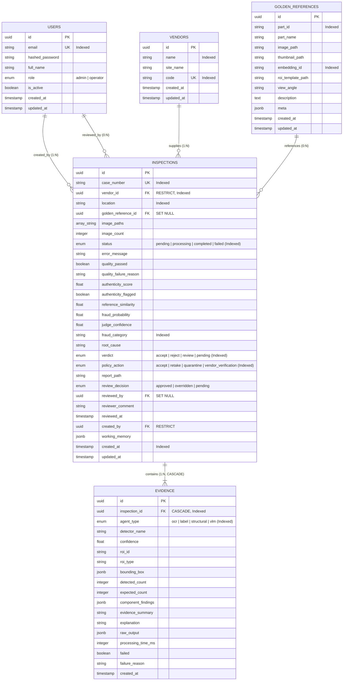

# 🗄️ Relational Database Schema & Data Models

> **Architectural Specification of the VisionForge AI Relational & Vector Persistence Layer**  
> **Status:** Authoritative (Reflects Actual Implemented Codebase)  
> **ORM Framework:** SQLAlchemy 2.0 Async Mapped Columns (`app.models.*`)  
> **Database Engines:** PostgreSQL 16+ (Production) / SQLite 3 (Zero-Config Development)  
> **Vector Engine:** FAISS (Facebook AI Similarity Search)

---

## 📖 Table of Contents

- [1. Database Design Philosophy & Audit Integrity](#1-database-design-philosophy--audit-integrity)
- [2. Complete Entity-Relationship Diagram (ERD)](#2-complete-entity-relationship-diagram-erd)
- [3. Dual-Dialect Compatibility (PostgreSQL & SQLite)](#3-dual-dialect-compatibility-postgresql--sqlite)
- [4. Table Specifications & Model Schemas](#4-table-specifications--model-schemas)
  - [4.1 `users` — Authentication & RBAC](#41-users--authentication--rbac)
  - [4.2 `vendors` — Hardware Supply Chain Partners](#42-vendors--hardware-supply-chain-partners)
  - [4.3 `golden_references` — Hardware Blueprints & Vectors](#43-golden_references--hardware-blueprints--vectors)
  - [4.4 `inspections` — Inspection Lifecycle & Verdicts](#44-inspections--inspection-lifecycle--verdicts)
  - [4.5 `evidence` — Append-Only Forensic Telemetry](#45-evidence--append-only-forensic-telemetry)
- [5. Foreign Key Constraints & Referential Integrity](#5-foreign-key-constraints--referential-integrity)
- [6. Database Seeding & Cross-Machine Path Resolution](#6-database-seeding--cross-machine-path-resolution)
- [7. Indexing Strategy & High-Throughput Query Optimization](#7-indexing-strategy--high-throughput-query-optimization)

---

## 1. Database Design Philosophy & Audit Integrity

### Why an Append-Only Forensic Schema?
In manufacturing warranty disputes, millions of dollars are on the line. If a computer manufacturer rejects a shipment of 10,000 server motherboards due to counterfeit components, the tier-1 supplier's legal team will demand the inspection records.

If the inspection database allowed rows in the `evidence` table to be updated, overwritten, or modified by operators, the data would be legally inadmissible.

VisionForge enforces three core persistence principles:
1. **Immutable Forensic Telemetry:** The `evidence` table is strictly append-only. New findings are inserted; existing rows are never updated or mutated.
2. **Defensive Referential Integrity:** Deleting a vendor that has existing inspections is blocked (`ondelete="RESTRICT"`). Deleting an inspection cascades only to its child evidence records.
3. **Dual-Dialect Portability:** The application runs out-of-the-box on local SQLite (`sqlite+aiosqlite`) for instant developer onboarding without requiring Docker, while maintaining complete schema compatibility with high-concurrency production PostgreSQL (`postgresql+asyncpg`).

---

## 2. Complete Entity-Relationship Diagram (ERD)



---

## 3. Dual-Dialect Compatibility (PostgreSQL & SQLite)

PostgreSQL provides advanced native data types (`JSONB`, `ARRAY(String)`) that allow fast indexing of structured JSON attributes. However, SQLite lacks native JSONB and ARRAY types.

To enable seamless cross-environment deployment, VisionForge utilizes SQLAlchemy's `with_variant` mapping:

```python
# Cross-dialect JSONB mapping
from sqlalchemy import JSON
from sqlalchemy.dialects.postgresql import JSONB

working_memory: Mapped[dict | None] = mapped_column(
    JSONB().with_variant(JSON(), "sqlite"), nullable=True
)

# Cross-dialect Array mapping
from sqlalchemy.dialects.postgresql import ARRAY

image_paths: Mapped[list[str]] = mapped_column(
    ARRAY(String).with_variant(JSON(), "sqlite"), nullable=False
)
```
- In **PostgreSQL**, columns are created as high-performance binary `JSONB` and native `VARCHAR[]` arrays.
- In **SQLite**, columns transparently degrade to standard serialized `JSON` text, requiring zero code changes between development and production.

---

## 4. Table Specifications & Model Schemas

---

### 4.1 `users` — Authentication & RBAC
**Source File:** `backend/app/models/user.py`

| Column | Type | Constraints | Description |
|:---|:---|:---|:---|
| `id` | `UUID` | `PRIMARY KEY`, default `uuid.uuid4` | Unique user identifier. |
| `email` | `VARCHAR(255)` | `UNIQUE`, `NOT NULL`, `INDEX` | User login email address. |
| `hashed_password` | `VARCHAR(255)` | `NOT NULL` | Bcrypt salted password hash. |
| `full_name` | `VARCHAR(255)` | `NOT NULL` | Display name of the operator. |
| `role` | `Enum(UserRole)` | `NOT NULL`, default `OPERATOR` | Role: `admin` or `operator`. |
| `is_active` | `BOOLEAN` | `NOT NULL`, default `TRUE` | Account active flag. |
| `created_at` | `TIMESTAMPTZ` | `NOT NULL`, `server_default=now()` | Account creation timestamp. |
| `updated_at` | `TIMESTAMPTZ` | `NOT NULL`, `onupdate=now()` | Last profile update timestamp. |

---

### 4.2 `vendors` — Hardware Supply Chain Partners
**Source File:** `backend/app/models/vendor.py`

| Column | Type | Constraints | Description |
|:---|:---|:---|:---|
| `id` | `UUID` | `PRIMARY KEY`, default `uuid.uuid4` | Unique vendor identifier. |
| `name` | `VARCHAR(255)` | `NOT NULL`, `INDEX` | Corporate name of supplier. |
| `site_name` | `VARCHAR(255)` | `NOT NULL` | Specific manufacturing fab / facility. |
| `code` | `VARCHAR(50)` | `UNIQUE`, `NOT NULL`, `INDEX` | Standard ERP vendor code (e.g. `VND-INTEL-01`). |
| `created_at` | `TIMESTAMPTZ` | `NOT NULL`, `server_default=now()` | Record creation timestamp. |

---

### 4.3 `golden_references` — Hardware Blueprints & Vectors
**Source File:** `backend/app/models/product.py`

| Column | Type | Constraints | Description |
|:---|:---|:---|:---|
| `id` | `UUID` | `PRIMARY KEY`, default `uuid.uuid4` | Unique golden blueprint identifier. |
| `part_id` | `VARCHAR(100)` | `NOT NULL`, `INDEX` | Manufacturer part number (e.g. `PCB-MCU-V2`). |
| `part_name` | `VARCHAR(255)` | `NOT NULL` | Human-readable component title. |
| `image_path` | `VARCHAR(500)` | `NOT NULL` | File path to 4K golden master photograph. |
| `thumbnail_path`| `VARCHAR(500)` | `NULLABLE` | Path to low-res preview image. |
| `embedding_id` | `VARCHAR(100)` | `NOT NULL`, `INDEX` | Key mapping into FAISS vector database. |
| `roi_template_path`|`VARCHAR(500)`| `NOT NULL` | Path to JSON bounding box template. |
| `view_angle` | `VARCHAR(50)` | `NOT NULL`, default `"top"` | Camera perspective (`"top"`, `"iso"`, `"pins"`). |
| `meta` | `JSONB / JSON` | `NULLABLE` | Product category, rated specs, component counts. |

---

### 4.4 `inspections` — Inspection Lifecycle & Verdicts
**Source File:** `backend/app/models/inspection.py`

Tracks the lifecycle of a physical inspection from initial intake to human sign-off:

```python
# Key Enum Definitions
class InspectionStatus(str, enum.Enum):
    PENDING = "pending"
    PROCESSING = "processing"
    COMPLETED = "completed"
    FAILED = "failed"

class InspectionVerdict(str, enum.Enum):
    ACCEPT = "accept"
    REJECT = "reject"
    REVIEW = "review"
    PENDING = "pending"

class PolicyAction(str, enum.Enum):
    ACCEPT = "accept"
    RETAKE = "retake"
    QUARANTINE = "quarantine"
    VENDOR_VERIFICATION = "vendor_verification"
```

| Column | Type | Constraints | Description |
|:---|:---|:---|:---|
| `id` | `UUID` | `PRIMARY KEY` | Unique inspection identifier. |
| `case_number` | `VARCHAR(50)` | `UNIQUE`, `NOT NULL`, `INDEX` | Human-friendly case ID (e.g. `VF-20260918-7B12`). |
| `vendor_id` | `UUID` | `FK(vendors.id, RESTRICT)`, `INDEX` | Component supplier reference. |
| `location` | `VARCHAR(255)` | `NOT NULL`, `INDEX` | Receiving dock / cleanroom station. |
| `golden_reference_id` | `UUID` | `FK(golden_references.id, SET NULL)` | Matched manufacturer blueprint. |
| `image_paths` | `ARRAY / JSON` | `NOT NULL` | List of captured hardware photo paths. |
| `status` | `Enum(InspectionStatus)` | `NOT NULL`, `INDEX` | Pipeline execution status. |
| `quality_passed` | `BOOLEAN` | `NOT NULL`, default `FALSE` | Stage 1 blur/exposure gate result. |
| `authenticity_score` | `FLOAT` | `NULLABLE` | Stage 2 ELA forensic authenticity score. |
| `reference_similarity` | `FLOAT` | `NULLABLE` | Stage 3 FAISS cosine similarity score. |
| `fraud_probability` | `FLOAT` | `NULLABLE` | Stage 6 fused composite fraud score. |
| `verdict` | `Enum(InspectionVerdict)` | `NOT NULL`, `INDEX` | Stage 7 AI Forensic Judge verdict. |
| `policy_action` | `Enum(PolicyAction)` | `NULLABLE`, `INDEX` | Stage 8 operational governance decision. |
| `report_path` | `VARCHAR(500)` | `NULLABLE` | Path to signed ReportLab PDF certificate. |
| `working_memory` | `JSONB / JSON` | `NULLABLE` | Complete JSON snapshot of pipeline state. |

---

### 4.5 `evidence` — Append-Only Forensic Telemetry
**Source File:** `backend/app/models/evidence.py`

The immutable audit log where individual agent findings are recorded:

| Column | Type | Constraints | Description |
|:---|:---|:---|:---|
| `id` | `UUID` | `PRIMARY KEY` | Unique evidence card identifier. |
| `inspection_id` | `UUID` | `FK(inspections.id, CASCADE)`, `INDEX` | Parent inspection reference. |
| `agent_type` | `Enum(AgentType)` | `NOT NULL`, `INDEX` | Agent: `ocr`, `label`, `structural`, `vlm`. |
| `detector_name` | `VARCHAR(100)` | `NOT NULL` | Underlying engine (`"yolo11n"`, `"paddle_ocr"`). |
| `confidence` | `FLOAT` | `NOT NULL` | Detection confidence (0.0 to 1.0). |
| `roi_id` | `VARCHAR(100)` | `NOT NULL` | Blueprint ROI identifier. |
| `bounding_box` | `JSONB / JSON` | `NOT NULL` | Localized coordinates `{x, y, w, h}`. |
| `detected_count` | `INTEGER` | `NULLABLE` | YOLO component count found on test board. |
| `expected_count` | `INTEGER` | `NULLABLE` | Blueprint component count on golden master. |
| `component_findings` | `JSONB / JSON` | `NULLABLE` | Structured discrete findings (missing/extra). |
| `evidence_summary` | `VARCHAR(2000)`| `NOT NULL` | Short forensic finding summary. |
| `explanation` | `VARCHAR(2000)`| `NOT NULL` | Detailed technical justification. |
| `processing_time_ms`| `INTEGER` | `NOT NULL` | Milliseconds taken by agent. |

---

## 5. Foreign Key Constraints & Referential Integrity

VisionForge enforces strict relational constraints to safeguard audit integrity:

1. **`inspections.vendor_id` $\to$ `vendors.id` (`ondelete="RESTRICT"`):**  
   Prevents accidental or malicious deletion of a vendor while historical inspections cite that supplier.
2. **`evidence.inspection_id` $\to$ `inspections.id` (`ondelete="CASCADE"`):**  
   If an administrator explicitly purges an entire test inspection, all associated evidence cards are cleanly removed.
3. **`inspections.created_by` $\to$ `users.id` (`ondelete="RESTRICT"`):**  
   Guarantees that user accounts tied to historical inspections cannot be dropped, maintaining chain-of-custody attribution.
4. **`inspections.golden_reference_id` $\to$ `golden_references.id` (`ondelete="SET NULL"`):**  
   If an obsolete hardware blueprint is retired, existing inspection records retain their data with the blueprint reference set to null.

---

## 6. Database Seeding & Cross-Machine Path Resolution

During application startup (`backend/app/core/database.py`), the database engine verifies table schemas and automatically seeds default credentials and hardware blueprints:

### Default Seed Accounts
- **System Admin:** `admin@visionforge.ai` / `adminpassword123`
- **Line Operator:** `operator@visionforge.ai` / `operatorpassword123`

### Pre-Indexed Golden Hardware Blueprints
1. **Industrial ATX Motherboard V1** (`PCB-MCU-V2`) — 6 defined forensic ROIs.
2. **Smart Lithium Battery Pack 48V** (`BAT-STD-V1`) — Cell weld & BMS inspection ROIs.
3. **ECC DDR4 Server Module 16GB** (`RAM-DDR4-V1`) — Gold pin connector & IC packaging ROIs.

### Dynamic Path Normalization (`_resolve_image_path`)
When repository clones are moved between developers' machines (e.g. from macOS `/Users/...` to Windows `C:\Users\...`), absolute file paths in database seeds break. VisionForge implements a dynamic path resolution fallback in `app/utils/image_utils.py` that reconstructs valid relative paths from the current `BASE_DIR`, guaranteeing zero broken images across diverse team machines.

---

## 7. Indexing Strategy & High-Throughput Query Optimization

To maintain sub-50ms API response times across millions of historical inspections:

1. **Composite Analytics Indexes:** `CREATE INDEX ix_inspections_vendor_created ON inspections(vendor_id, created_at);` accelerates time-series risk aggregations.
2. **B-Tree Lookups on Case Numbers:** `case_number` is indexed with a unique B-Tree index for instant barcode/QR lookups.
3. **Partial Evidence Indexing:** `agent_type` and `confidence` are indexed to allow fast forensic filtering during human review sessions.

---

*For API endpoints querying this database, see [`docs/API.md`](API.md).*  
*For pipeline stages populating these tables, see [`docs/PIPELINE.md`](PIPELINE.md).*
