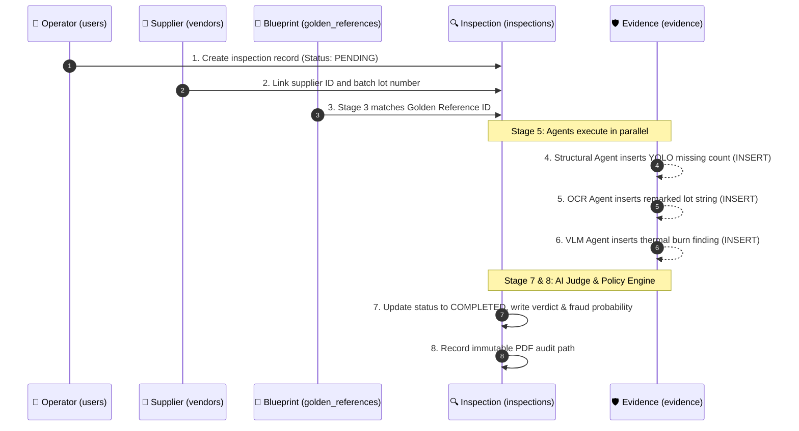
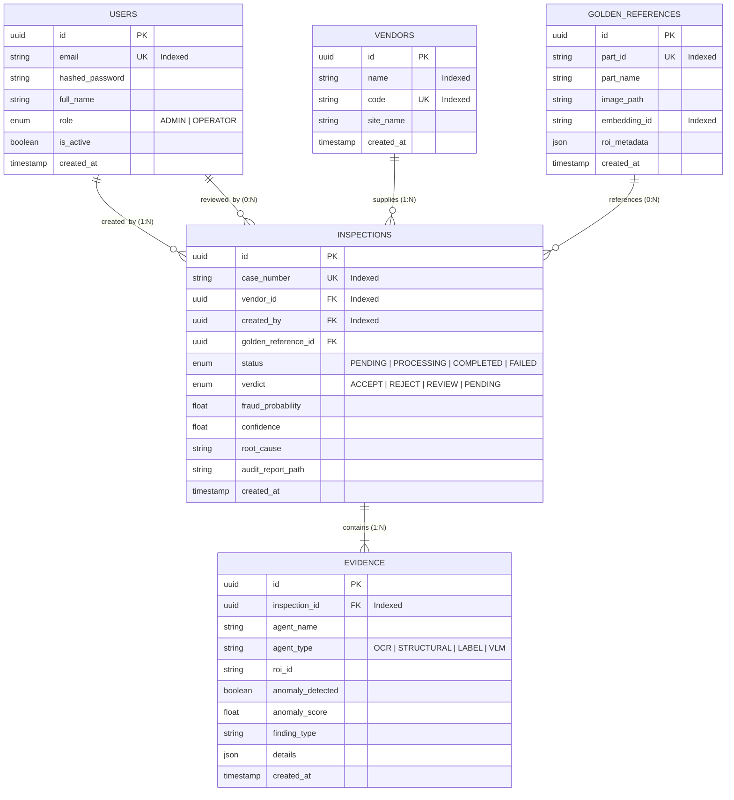

# 🗄️ Relational Database Schema & Evidence Provenance

> **How VisionForge AI uses SQLAlchemy 2.0 and append-only tables to guarantee immutable chain-of-custody in fraud disputes.**

---

## 📖 Table of Contents

- [1. The Story: The Database Lifecycle of an Inspection](#1-the-story-the-database-lifecycle-of-an-inspection)
- [2. Entity-Relationship Diagram (ERD)](#2-entity-relationship-diagram-erd)
- [3. Core Database Tables & Data Dictionary](#3-core-database-tables--data-dictionary)
  - [👤 3.1 `users` — Authentication & RBAC](#-31-users--authentication--rbac)
  - [🏢 3.2 `vendors` — Supply Chain Vendor Tracking](#-32-vendors--supply-chain-vendor-tracking)
  - [📐 3.3 `golden_references` — Hardware Blueprints & Vectors](#-33-golden_references--hardware-blueprints--vectors)
  - [🔍 3.4 `inspections` — Inspection Records & Verdicts](#-34-inspections--inspection-records--verdicts)
  - [🛡️ 3.5 `evidence` — Append-Only Forensic Telemetry](#-35-evidence--append-only-forensic-telemetry)
- [4. Dual Database Engine Support (SQLite & PostgreSQL)](#4-dual-database-engine-support-sqlite--postgresql)
- [5. Referential Integrity & Deletion Protection](#5-referential-integrity--deletion-protection)

---

## 1. The Story: The Database Lifecycle of an Inspection

In industrial manufacturing, an inspection verdict is not just a temporary screen alert—it is **legal evidence** used in multi-million-dollar warranty claims and supplier contract disputes.

If a supplier delivers 1,000 counterfeit circuit boards, the factory must prove beyond doubt which lot was inspected, which operator ran the scan, which blueprint was used as the baseline, and what exact anomalies were detected.

Here is what happens inside the database during an inspection:



> 🔒 **Immutable Append-Only Rule:** The `evidence` table has zero `UPDATE` or `DELETE` endpoints in the API. Once an agent records a finding, it remains permanently anchored to that inspection.

---

## 2. Entity-Relationship Diagram (ERD)



---

## 3. Core Database Tables & Data Dictionary

---

### 👤 3.1 `users` — Authentication & RBAC

Stores factory operators and supervisors:

| Column | Type | Constraints | Description |
| :--- | :--- | :--- | :--- |
| `id` | `UUID` | Primary Key | Unique user identifier. |
| `email` | `String` | Unique, Indexed | User login email. |
| `hashed_password` | `String` | Not Null | Bcrypt salted password hash. |
| `full_name` | `String` | Not Null | Operator name printed on PDF certificates. |
| `role` | `Enum` | `ADMIN`, `OPERATOR` | Role-Based Access Control level. |
| `is_active` | `Boolean` | Default: `True` | Account status. |

---

### 🏢 3.2 `vendors` — Supply Chain Vendor Tracking

Maintains the registry of electronic component suppliers:

| Column | Type | Constraints | Description |
| :--- | :--- | :--- | :--- |
| `id` | `UUID` | Primary Key | Unique vendor ID. |
| `name` | `String` | Indexed | Supplier company name (e.g., "Apex Silicon"). |
| `code` | `String` | Unique, Indexed | Supplier code (e.g., "VND-APX-01"). |
| `site_name` | `String` | Nullable | Manufacturing facility or dock location. |

---

### 📐 3.3 `golden_references` — Hardware Blueprints & Vectors

Stores verified manufacturer baseline blueprints:

| Column | Type | Constraints | Description |
| :--- | :--- | :--- | :--- |
| `id` | `UUID` | Primary Key | Unique blueprint ID. |
| `part_id` | `String` | Unique, Indexed | Hardware SKU code (e.g., "PCB-MCU-V2"). |
| `part_name` | `String` | Not Null | Human-readable board name. |
| `image_path` | `String` | Not Null | Path to verified 4K golden master photo. |
| `embedding_id` | `String` | Indexed | Vector ID in the FAISS similarity index. |
| `roi_metadata` | `JSON` | Not Null | Coordinates and component lists for ROIs. |

---

### 🔍 3.4 `inspections` — Inspection Records & Verdicts

The core inspection entity tracking state and forensic arbitration:

| Column | Type | Constraints | Description |
| :--- | :--- | :--- | :--- |
| `id` | `UUID` | Primary Key | Unique inspection ID. |
| `case_number` | `String` | Unique, Indexed | Human-readable case ID (`INSP-2026-0917-0042`). |
| `vendor_id` | `UUID` | Foreign Key (`vendors.id`) | Supplier of the inspected batch. |
| `golden_reference_id` | `UUID` | Foreign Key | Matched golden reference blueprint. |
| `status` | `Enum` | `PENDING`, `PROCESSING`, `COMPLETED`, `FAILED` | State machine status. |
| `verdict` | `Enum` | `ACCEPT`, `REJECT`, `REVIEW`, `PENDING` | Final forensic verdict from Stage 7/8. |
| `fraud_probability` | `Float` | Range: $0.0 - 1.0$ | Composite fraud risk score. |
| `root_cause` | `Text` | Nullable | Natural language explanation from AI Judge. |
| `audit_report_path` | `String` | Nullable | Path to generated ReportLab PDF certificate. |

---

### 🛡️ 3.5 `evidence` — Append-Only Forensic Telemetry

Immutable record of every anomaly detected by individual agents:

| Column | Type | Constraints | Description |
| :--- | :--- | :--- | :--- |
| `id` | `UUID` | Primary Key | Unique evidence record ID. |
| `inspection_id` | `UUID` | Foreign Key (`inspections.id`), Indexed | Parent inspection. |
| `agent_name` | `String` | Not Null | Name of agent (`structural_agent`, etc.). |
| `agent_type` | `String` | Not Null | Category: `OCR`, `LABEL`, `STRUCTURAL`, `VLM`. |
| `roi_id` | `String` | Not Null | Inspected region of interest ID. |
| `anomaly_detected` | `Boolean` | Not Null | Whether an anomaly was found. |
| `anomaly_score` | `Float` | Range: $0.0 - 1.0$ | Severity score for this specific finding. |
| `finding_type` | `String` | Not Null | Categorical code (`MISSING_COMPONENT`, etc.). |
| `details` | `JSON` | Not Null | Raw bounding boxes, expected vs actual counts. |

---

## 4. Dual Database Engine Support (SQLite & PostgreSQL)

VisionForge uses **SQLAlchemy 2.0 with type fallbacks** to support two deployment profiles with zero code changes:

```python
# backend/app/db/session.py
# If SQLALCHEMY_DATABASE_URI starts with 'sqlite', configure single-file local DB.
# If SQLALCHEMY_DATABASE_URI starts with 'postgresql', configure async connection pool.
```

- **Local Zero-Config Mode (SQLite 3):** Default for quick evaluation, local laptop testing, and offline cleanroom deployments. Requires zero setup.
- **Enterprise Mode (PostgreSQL 16+):** For high-concurrency multi-line factory installations with connection pooling and JSONB indexing.

---

## 5. Referential Integrity & Deletion Protection

To protect historical audit records from tampering or accidental deletion:

```sql
-- Foreign Key Deletion Rule Example
ALTER TABLE inspections 
ADD CONSTRAINT fk_inspections_vendor 
FOREIGN KEY (vendor_id) REFERENCES vendors(id) 
ON DELETE RESTRICT;
```

- **`ON DELETE RESTRICT` on Vendors:** Deleting a vendor is blocked if that vendor has historical inspection records in the database.
- **`ON DELETE RESTRICT` on Users:** Deleting an operator account is blocked if that operator performed previous inspections.
- **`ON DELETE CASCADE` on Evidence:** Deleting a test inspection (Admin only) cleans up associated evidence records automatically.

---

*For information on the React 18 workstation UI that renders this data, read [`docs/FRONTEND.md`](FRONTEND.md).*
