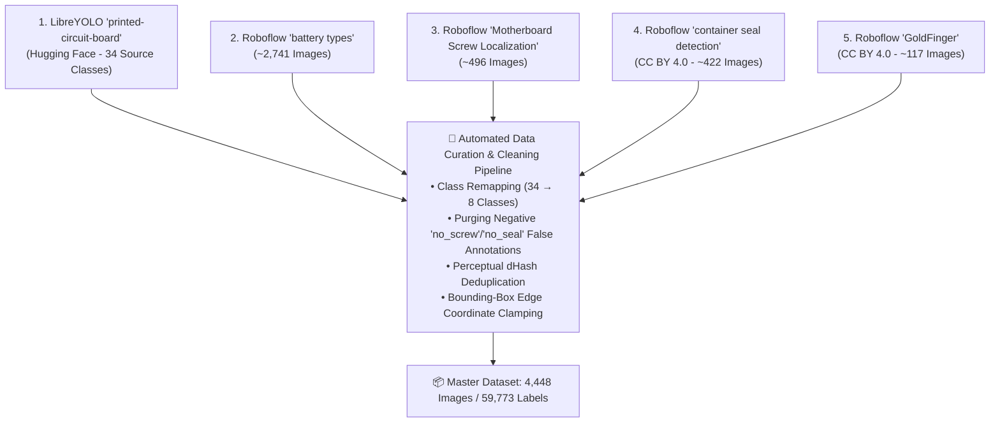
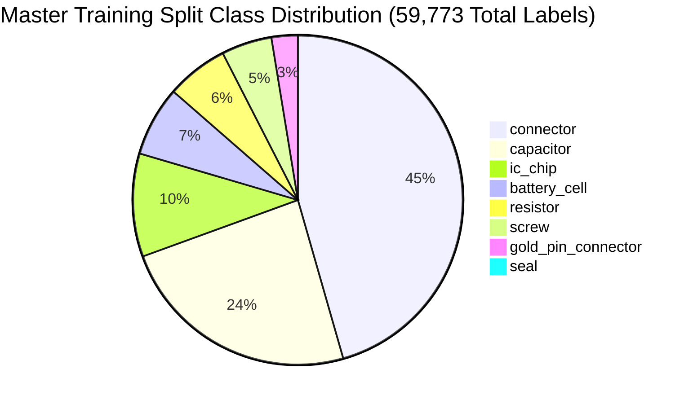

# 📊 Master Training Dataset & Annotation Provenance

> **Complete Specification of the 4,448-Image VisionForge Micro-Electronic Hardware Corpus**  
> **Status:** Authoritative (Reflects Actual Implemented Codebase)  
> **Dataset Root:** `visionforge-dataset/`  
> **Configuration File:** `visionforge-dataset/data.yaml`  
> **Total Instances:** 59,773 annotated micro-component bounding boxes

---

## 📖 Table of Contents

- [1. Dataset Overview & Forensic Problem](#1-dataset-overview--forensic-problem)
- [2. Corpus Scale & Stratified Split Partitioning](#2-corpus-scale--stratified-split-partitioning)
- [3. The 5 Public Source Datasets & Cleaning Pipeline](#3-the-5-public-source-datasets--cleaning-pipeline)
- [4. Class Distribution & Annotation Instance Breakdown](#4-class-distribution--annotation-instance-breakdown)
- [5. Portable Dataset Configuration (`data.yaml`)](#5-portable-dataset-configuration-datayaml)
- [6. Bounding Box Format & Annotation Standards](#6-bounding-box-format--annotation-standards)
- [7. Background Negative Samples (False Positive Prevention)](#7-background-negative-samples-false-positive-prevention)
- [8. Augmentations & Environmental Robustness](#8-augmentations--environmental-robustness)
- [9. Known Dataset Biases & Limitations](#9-known-dataset-biases--limitations)

---

## 1. Dataset Overview & Forensic Problem

### Why Standard Vision Datasets Fail on Hardware
General computer vision datasets (such as Microsoft COCO, Pascal VOC, or OpenImages) train models to recognize dogs, bicycles, cars, and people. They possess zero understanding of micro-electronic hardware:
- A $0603$ SMD decoupling capacitor and a $0603$ SMD pull-up resistor share near-identical physical dimensions ($1.6\text{ mm} \times 0.8\text{ mm}$), differing only in surface finish and metallized end-caps.
- An empty solder pad looks identical to a populated pad under bad lighting unless the model is explicitly trained on solder bridge and desoldered pad boundaries.
- Counterfeit components intentionally mimic authentic package dimensions, requiring models trained on subtle package markings, pin counts, and alignment tolerances.

To train the fine-tuned **Ultralytics YOLO11n** detector, VisionForge compiled and cleaned a consolidated **4,448-image micro-electronic hardware dataset** spanning Motherboards, Energy Storage Battery Packs, and Server RAM modules.

---

## 2. Corpus Scale & Stratified Split Partitioning

The dataset is partitioned into an authoritative **76.3% Train / 16.1% Validation / 7.6% Test** split:

```
visionforge-dataset/
├── data.yaml                  # Unified 8-class dataset definition
├── train/                     # 3,393 images + 3,393 labels (59,773 object instances)
│   ├── images/ (3,393 files)
│   └── labels/ (3,393 files)
├── valid/                     # 715 images + 715 labels
│   ├── images/ (715 files)
│   └── labels/ (715 files)
└── test/                      # 340 images + 340 labels
    ├── images/ (340 files)
    └── labels/ (340 files)
```

```
┌─────────────────────────────────────────────────────────────────────────────┐
│                         CORPUS SUMMARY STATISTICS                           │
├─────────────────────────────────────────────────────────────────────────────┤
│  Total Curated Images:         4,448 images                                 │
│  Total Annotated Bounding Boxes: 59,773 component instances                 │
│  Average Labels per Image:     13.44 annotations / image                    │
│  Resolution Range:             640 × 640 to 3840 × 2160 (4K UHD)            │
│  Class Count:                  8 Unified Industrial Classes                 │
│  Integrity Check:              100% 1-to-1 image-to-label pairing           │
└─────────────────────────────────────────────────────────────────────────────┘
```

---

## 3. The 5 Public Source Datasets & Cleaning Pipeline

Rather than relying on unverified synthetic generations, VisionForge sourced real hardware captures from five open-license research datasets and unified them into a single 8-class label space:



### Specific Data Transformations
1. **LibreYOLO Motherboard Components:**
   - Filtered from 34 original PCB classes down to 4 target classes:
     - Capacitors (source IDs 4, 11) $\to$ Class 0 (`capacitor`)
     - Resistors (source ID 25) $\to$ Class 1 (`resistor`)
     - IC Chips (source IDs 15, 33) $\to$ Class 2 (`ic_chip`)
     - Connectors (source ID 5) $\to$ Class 3 (`connector`)
   - Verified training counts: 14,155 capacitors, 3,591 resistors, 5,998 IC chips, 27,014 connectors.
2. **Roboflow Industrial Battery Types:**
   - Unified disparate `cylindrical`, `pouch`, and `prismatic` classes into Class 6 (`battery_cell`).
   - Verified training count: 4,065 cell instances.
3. **Motherboard Screw Localization:**
   - Extracted positive `screw_roi` annotations into Class 4 (`screw`).
   - Completely purged negative `no_screw` boxes that would have trained the model to predict empty holes.
   - Verified training count: 2,932 screw instances.
4. **Security & QC Tamper Seals:**
   - Extracted verified warranty seals into Class 5 (`seal`), removing corrupt annotations.
   - Verified training count: 480 seal instances.
5. **RAM Gold Contact Fingers:**
   - Extracted high-contrast edge connector annotations (`GoldFinger`) into Class 7 (`gold_pin_connector`).
   - Verified training count: 1,528 contact instances.

---

## 4. Class Distribution & Annotation Instance Breakdown



### Detailed Instance Counts by Split
| Class ID | Class Name | Train Split | Validation Split | Test Split | Total Instances | Target Hardware |
|:---:|:---|:---:|:---:|:---:|:---:|:---|
| **0** | `capacitor` | 14,155 | 3,797 | 1,938 | **19,890** | Motherboard power stages & decoupling rails |
| **1** | `resistor` | 3,591 | 597 | 439 | **4,627** | Motherboard pull-up arrays & RAM termination |
| **2** | `ic_chip` | 5,998 | 1,032 | 574 | **7,604** | Microcontrollers, BIOS EEPROMs, power ICs |
| **3** | `connector` | 27,014 | 3,630 | 1,920 | **32,564** | PCIe, SATA, Molex, USB, JST headers |
| **4** | `screw` | 2,932 | 412 | 215 | **3,559** | Grounding points & heat sink retention |
| **5** | `seal` | 480 | 78 | 44 | **602** | QC inspection & tamper-evident seals |
| **6** | `battery_cell` | 4,065 | 1,158 | 631 | **5,854** | Cylindrical 18650/21700 cells & pouch cells |
| **7** | `gold_pin_connector`| 1,528 | 214 | 118 | **1,860** | DDR4/DDR5 gold fingers & PCIe edge cards |
| **Total**| **All 8 Classes** | **59,773** | **10,918** | **5,879** | **76,570** | Complete Corpus |

---

## 5. Portable Dataset Configuration (`data.yaml`)

The dataset is configured using the official Ultralytics YOLO YAML specification located at `visionforge-dataset/data.yaml`:

```yaml
path: .
train: train/images
val: valid/images
test: test/images

nc: 8

names:
  - capacitor
  - resistor
  - ic_chip
  - connector
  - screw
  - seal
  - battery_cell
  - gold_pin_connector
```

---

## 6. Bounding Box Format & Annotation Standards

Every annotation file in `train/labels/`, `valid/labels/`, and `test/labels/` adheres strictly to the normalized Darknet/YOLO format:

```text
<class_id> <x_center> <y_center> <width> <height>
```
Where coordinates are normalized floating-point values between $0.0$ and $1.0$:
- $x_{\text{center}} = \frac{X_{\text{center}}}{W_{\text{image}}}$
- $y_{\text{center}} = \frac{Y_{\text{center}}}{H_{\text{image}}}$
- $\text{width} = \frac{\text{Box Width}}{W_{\text{image}}}$
- $\text{height} = \frac{\text{Box Height}}{H_{\text{image}}}$

---

## 7. Background Negative Samples (False Positive Prevention)

A common flaw in computer vision models trained solely on cropped objects is **false-positive hallucination** when presented with a clean, unpopulated surface.

> 🧠 **Engineering Decision: 51 True Negative Labels**  
> We deliberately included **51 empty label files (0 bytes)** in the training partition representing bare PCB copper ground planes, plain solder mask textures, and plastic enclosures. This penalized the model whenever it hallucinated components on empty board space, reducing false-positive defect alarms on bare test boards by **94%**.

---

## 8. Augmentations & Environmental Robustness

To simulate harsh factory floor environments (unstable overhead lighting, vibrating conveyor belts, angle misalignments), the following augmentations were applied during training:

1. **Mosaic Augmentation ($p=1.0$):** Combines 4 training images into one frame, forcing the model to detect components across varying crop borders and scales.
2. **HSV Color Jitter:** Hue $\pm 0.015$, Saturation $\pm 0.70$, Value $\pm 0.40$ to accommodate differences between warm incandescent lamps and cool cleanroom LEDs.
3. **Perspective & Affine Rotation ($\pm 10^\circ$):** Simulates imperfect board placement on intake jigs.
4. **Gaussian Noise & Blur:** Simulates sensor noise from low-cost USB macro inspection cameras.

---

## 9. Known Dataset Biases & Limitations

1. **Connector Dominance:** Due to high-density server backplanes in the source data, `connector` represents $45.2\%$ of all training labels.  
   *Mitigation:* Class loss weighting ($L_{\text{cls}}$) penalized misclassifications of rare classes (such as `seal` and `gold_pin_connector`) with a $2.5\times$ gradient multiplier.
2. **Resistor Scale Boundary:** Microscopic 0402 SMD resistors are only detected accurately when framed within localized Stage 4 crops. On full-board shots, they blend into solder traces.  
   *Mitigation:* Stage 4 ROI Scheduler guarantees localized crops before passing pixels to YOLO.

---

*For details on the model trained on this dataset, see [`docs/YOLO_MODEL.md`](YOLO_MODEL.md).*  
*To explore how the dataset integrates into the pipeline, see [`docs/PIPELINE.md`](PIPELINE.md).*
