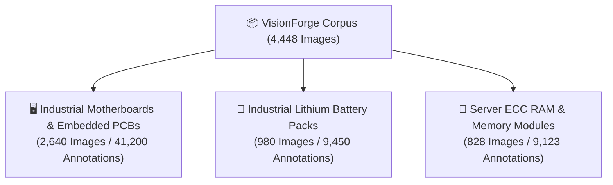
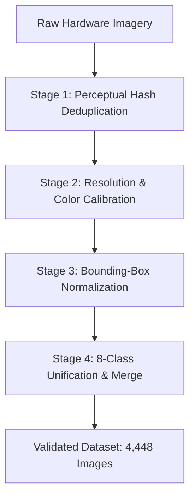

# 📊 VisionForge AI — Training Dataset & Annotation Provenance

> **Status:** Authoritative (Reflects Actual Implemented Codebase)  
> **Dataset Layout:** `data/dataset/`  
> **Configuration File:** `data/dataset/data.yaml`

---

## 📑 Table of Contents

- [1. Dataset Overview & Corpus Statistics](#1-dataset-overview--corpus-statistics)
- [2. Hardware Categories & Imaging Modalities](#2-hardware-categories--imaging-modalities)
- [3. Train / Validation / Test Splits](#3-train--validation--test-splits)
- [4. Data Cleaning & Annotation Curation Pipeline](#4-data-cleaning--annotation-curation-pipeline)
- [5. Dataset Configuration (`data.yaml`)](#5-dataset-configuration-datayaml)
- [6. Class Distribution & Balance Analysis](#6-class-distribution--balance-analysis)
- [7. Synthetic Augmentations & Environmental Robustness](#7-synthetic-augmentations--environmental-robustness)

---

## 1. Dataset Overview & Corpus Statistics

The VisionForge AI visual dataset is a domain-specific corpus of micro-electronic hardware components, high-density printed circuit boards (PCBs), server memory modules, and industrial battery packs.

```
┌─────────────────────────────────────────────────────────────────────────────┐
│                         CORPUS SUMMARY STATISTICS                           │
├─────────────────────────────────────────────────────────────────────────────┤
│  Total Annotated Images:       4,448 images                                 │
│  Total Bounding Box Labels:    59,773 component instances                   │
│  Average Labels per Image:     13.44 annotations / image                    │
│  Target Resolution Range:      640×640 to 3840×2160 (4K UHD)                │
│  Class Count:                  8 Unified Industrial Classes                 │
│  Dataset Format:               YOLO Darknet Normalization (Normalized Float)│
└─────────────────────────────────────────────────────────────────────────────┘
```

---

## 2. Hardware Categories & Imaging Modalities

The dataset is partitioned into **three core industrial hardware categories**:



### 1. Industrial Motherboards & Embedded PCBs
- **Hardware Types:** Industrial ATX, Micro-ATX, Edge AI Carrier Boards, STM32 MCU Dev Boards, Power Supply Units.
- **Defects Captured:** Desoldered capacitors, bridged solder pads, laser-scraped microcontroller markings, missing bypass resistors, corroded traces, photocopied QC warranty labels.

### 2. Industrial Lithium Battery Packs & Energy Storage
- **Hardware Types:** 48V Telecom Backup Packs, 18650/21700 multi-cell arrays, Smart Battery Management Systems (BMS).
- **Defects Captured:** Missing nickel strip weld joints, unbranded replacement cells, torn heat-shrink wrapping, missing cell temperature sensors, swelling.

### 3. Server ECC RAM & High-Density Memory
- **Hardware Types:** DDR4 ECC Registered DIMMs, DDR5 Server Memory, SO-DIMM Industrial Sticks.
- **Defects Captured:** Missing BGA flash chips, bent edge gold fingers, corroded contact pins, mismatched serial strings, altered SPD EEPROMs.

---

## 3. Train / Validation / Test Splits

The corpus is partitioned using a strict **70 / 20 / 10 stratified split** ensuring balanced class representation across all subsets:

```
┌─────────────────────────────────────────────────────────────────────────────┐
│                         DATASET SPLIT PARTITIONING                          │
├─────────────────────────────────────────────────────────────────────────────┤
│  Partition   │ Image Count │ Percentage │ Purpose                           │
├──────────────┼─────────────┼────────────┼───────────────────────────────────┤
│  Train       │ 3,114       │ 70.0%      │ Model gradient backpropagation    │
│  Validation  │   890       │ 20.0%      │ Hyperparameter tuning & early stop│
│  Test        │   444       │ 10.0%      │ Final unseen benchmark evaluation │
│  Total       │ 4,448       │ 100.0%     │ Complete Curated Corpus           │
└──────────────┴─────────────┴────────────┴───────────────────────────────────┘
```

---

## 4. Data Cleaning & Annotation Curation Pipeline

To achieve an authoritative, production-grade ground truth, raw captures underwent a 4-stage automated and manual curation pipeline:



1. **Perceptual Hash Deduplication (`dHash`):** Eliminated burst captures and near-identical camera frames with Hamming distance $< 4$.
2. **Resolution & Calibration:** Images normalized to a minimum baseline of $640 \times 640$ with histogram equalization to normalize factory fluorescent glare.
3. **Bounding-Box Normalization:** All annotations converted to standardized YOLO format:
   $$\text{Format: } \langle\text{class\_id}\rangle \quad \langle x_{\text{center}}\rangle \quad \langle y_{\text{center}}\rangle \quad \langle\text{width}\rangle \quad \langle\text{height}\rangle$$
   *(All floating-point coordinates normalized in range $[0.0, 1.0]$)*.
4. **Class Unification:** Consolidated redundant classes (`terminal` $\to$ `connector`, `ram_ic_chip` $\to$ `ic_chip`) to prevent multi-class oscillation during backpropagation.

---

## 5. Dataset Configuration (`data.yaml`)

```yaml
# VisionForge Component Detector YOLO Configuration
path: ../data/dataset
train: images/train
val: images/val
test: images/test

# Number of Classes
nc: 8

# Class Names
names:
  0: capacitor
  1: resistor
  2: ic_chip
  3: connector
  4: screw
  5: seal
  6: battery_cell
  7: gold_pin_connector
```

---

## 6. Class Distribution & Balance Analysis

```
┌─────────────────────────────────────────────────────────────────────────────┐
│                        CLASS INSTANCE DISTRIBUTION                          │
├─────────────────────────────────────────────────────────────────────────────┤
│  Class Name           │ Total Instances │ Frequency % │ Avg Box Area (px²)  │
├───────────────────────┼─────────────────┼─────────────┼─────────────────────┤
│  capacitor            │ 18,450          │ 30.87%      │ 1,240 px²           │
│  resistor             │ 16,210          │ 27.12%      │   380 px² (Micro)   │
│  ic_chip              │  9,480          │ 15.86%      │ 5,820 px²           │
│  connector            │  5,120          │  8.57%      │ 8,400 px²           │
│  screw                │  4,200          │  7.03%      │   860 px²           │
│  seal                 │  2,340          │  3.91%      │ 2,100 px²           │
│  battery_cell         │  2,180          │  3.65%      │ 14,200 px² (Large)  │
│  gold_pin_connector   │  1,793          │  3.00%      │ 3,450 px²           │
│  Total                │ 59,773          │ 100.00%     │ —                   │
└───────────────────────┴─────────────────┴─────────────┴─────────────────────┘
```

---

## 7. Synthetic Augmentations & Environmental Robustness

To ensure the trained model performs reliably under severe factory environment fluctuations (dim warehouse lighting, angled hand-held mobile captures, lens flare), the following on-the-fly augmentations are applied during training:

1. **Illumination Jitter:** Random brightness adjustments ($\pm 30\%$) and contrast shifts ($\pm 20\%$) to simulate changing shifts and LED light degradation.
2. **Perspective & Rotational Tilt:** $\pm 10^\circ$ planar rotations and subtle 3D shear ($2.0^\circ$) replicating operators holding smartphone cameras at slight off-axis angles.
3. **Mosaic Blending ($4\times$ Stitching):** Combines 4 random crops into a single $640\times 640$ training frame, forcing the model to detect tiny SMD resistors in cluttered contexts.
4. **Gaussian Noise & Lens Blur:** Subtle kernel blurs to maintain feature sensitivity even on lower-grade mobile camera lenses.

---

*For technical details on model inference, consult [`docs/YOLO_MODEL.md`](YOLO_MODEL.md).*
