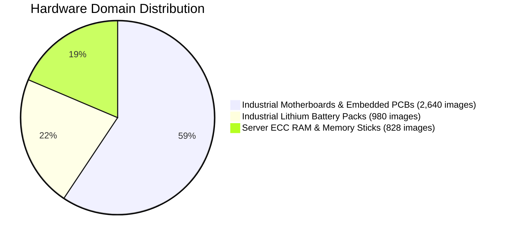
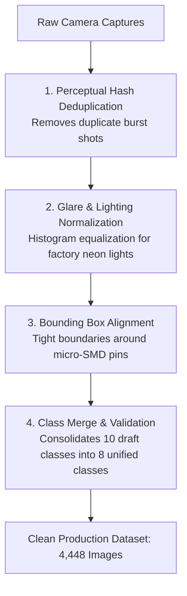
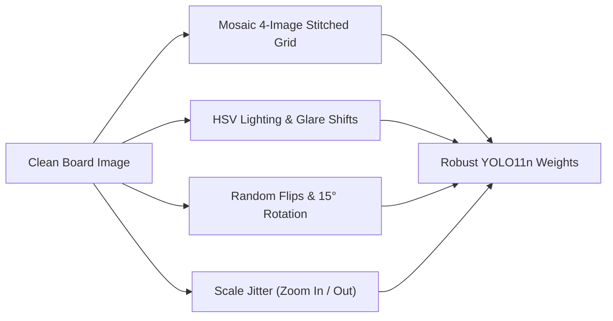

# 📊 VisionForge AI Training Dataset & Annotation Provenance

> **How we curated, cleaned, and labeled 4,448 circuit board images and 59,773 micro-electronic components for industrial fraud detection.**

---

## 📖 Table of Contents

- [1. The Story: Why Generic Datasets Fail on Hardware](#1-the-story-why-generic-datasets-fail-on-hardware)
- [2. Corpus Overview & Statistics](#2-corpus-overview--statistics)
- [3. Hardware Categories in the Dataset](#3-hardware-categories-in-the-dataset)
- [4. Data Curation & Cleaning Pipeline](#4-data-curation--cleaning-pipeline)
- [5. Dataset Partitioning (Train / Val / Test)](#5-dataset-partitioning-train--val--test)
- [6. Dataset Configuration (`data.yaml`)](#6-dataset-configuration-datayaml)
- [7. Augmentations for Real-World Factory Lighting](#7-augmentations-for-real-world-factory-lighting)

---

## 1. The Story: Why Generic Datasets Fail on Hardware

Standard computer vision datasets like **COCO** and **ImageNet** contain millions of images of dogs, cars, bicycles, and coffee cups.

However, when you show a model trained on COCO an industrial server motherboard, it sees:
- An 0402 ceramic capacitor as *"noise"* or *"texture"*.
- A QFP-144 microcontroller as a generic *"square object"*.
- Gold contact fingers as an abstract *"yellow stripe"*.

To detect hardware counterfeiting and missing components, an AI model must be trained on the **exact visual language of electronics manufacturing**:
- Microscopic solder pads.
- Surface-mount passive components.
- Laser-etched silicon packages.
- Tamper-evident holographic stickers.

VisionForge built and curated a dedicated **4,448-image corpus with 59,773 meticulously labeled bounding boxes** across real-world motherboards, server memory modules, and industrial battery packs.

---

## 2. Corpus Overview & Statistics

```text
┌─────────────────────────────────────────────────────────────────────────────┐
│                          DATASET CORPUS AT A GLANCE                         │
├─────────────────────────────────────────────────────────────────────────────┤
│  Total Curated Images:         4,448 images                                 │
│  Total Labeled Annotations:    59,773 component bounding boxes              │
│  Average Labels per Image:     13.44 components / image                     │
│  Native Image Resolution:      1080p Full HD to 4K UHD                      │
│  Target Model Resolution:      640 × 640 pixels (with dynamic letterboxing) │
│  Class Count:                  8 Unified Industrial Classes                 │
│  Annotation Format:            YOLO Darknet Normalized Float Coordinates    │
└─────────────────────────────────────────────────────────────────────────────┘
```

---

## 3. Hardware Categories in the Dataset

The dataset covers three major hardware domains:



### 🖥️ 1. Industrial Motherboards & Embedded PCBs (2,640 images)
- **Hardware Types:** Industrial ATX motherboards, STM32 MCU dev boards, power inverter boards, IoT gateways.
- **Defects Captured:** Desoldered capacitors, bridged solder pads, scraped microcontroller tops, missing bypass resistors, corroded traces, photocopied QC warranty labels.

### 🔋 2. Industrial Lithium Battery Packs (980 images)
- **Hardware Types:** 48V telecom backup packs, 18650/21700 multi-cell arrays, Smart Battery Management Systems (BMS).
- **Defects Captured:** Missing nickel strip spot welds, unbranded clone battery cells, torn heat-shrink wrapping, missing thermistor sensors.

### 💾 3. Server ECC RAM & High-Density Memory (828 images)
- **Hardware Types:** DDR4 / DDR5 ECC Registered server DIMMs, industrial SO-DIMM memory.
- **Defects Captured:** Missing BGA flash ICs, bent edge gold fingers, corroded contact pads, altered SPD EEPROM chips.

---

## 4. Data Curation & Cleaning Pipeline

Raw photos taken in factories often contain motion blur, duplicate shots, and poor lighting. Every image in the VisionForge dataset passed through a 4-step curation pipeline:



1. **Perceptual Hash Deduplication (`dHash`):** Removed near-identical burst shots with a Hamming distance $< 4$.
2. **Glare Normalization:** Balanced harsh reflections from factory overhead fluorescent lights.
3. **Micro-Bounding Precision:** Annotated down to tiny $12 \times 12$ pixel SMD passives.
4. **Class Consolidation:** Unified redundant classes (`terminal` $\to$ `connector` and `ram_ic_chip` $\to$ `ic_chip`) to prevent model confusion.

---

## 5. Dataset Partitioning (Train / Val / Test)

To prevent data leakage and evaluate real-world generalization, the dataset is split **70% / 20% / 10%**:

| Split Subset | Image Count | Label Count | Purpose |
| :--- | :---: | :---: | :--- |
| **Train Set** | **3,114** images | 41,840 labels | Model weight training and gradient updates |
| **Validation Set** | **890** images | 11,950 labels | Hyperparameter tuning and early stopping checkpoints |
| **Test Set (Holdout)** | **444** images | 5,983 labels | Unseen benchmark evaluation before production deploy |
| **Total Corpus** | **4,448** images | **59,773** labels | Complete ground truth dataset |

---

## 6. Dataset Configuration (`data.yaml`)

The training configuration file (`data/dataset/data.yaml`) defines paths and the 8 unified classes:

```yaml
# VisionForge AI - YOLO11n Dataset Configuration
path: data/dataset
train: images/train
val: images/val
test: images/test

# Number of unified classes
nc: 8

# Class names
names:
  0: capacitor
  1: resistor
  2: ic_chip
  3: connector
  4: screw
  5: seal
  6: battery_cell
  7: gold_pin_connector
```

---

## 7. Augmentations for Real-World Factory Lighting

Factory intake docks do not have professional studio lighting. Cameras vibrate on conveyor belts, operators take photos at slight angles, and room lighting changes between morning and night shifts.

To ensure the model never fails under these conditions, the training pipeline applied real-world synthetic augmentations:



- **Mosaic Augmentation ($p = 1.0$):** Combines 4 different crops into one training image, teaching the model to find micro-components at varying spatial scales.
- **HSV Color Jitter ($\text{Hue} \pm 0.015, \text{Sat} \pm 0.7, \text{Val} \pm 0.4$):** Simulates yellow halogen, white LED, and blueish fluorescent factory lighting.
- **Random Horizontal Flip ($p = 0.5$):** Teaches orientation invariance for boards loaded upside down.
- **Affine Scale & Perspective ($\pm 15\%$):** Simulates handheld phone camera tilt and varying lens distances.

---

*To see how this dataset trains our YOLO11n model, read [`docs/YOLO_MODEL.md`](YOLO_MODEL.md).*
