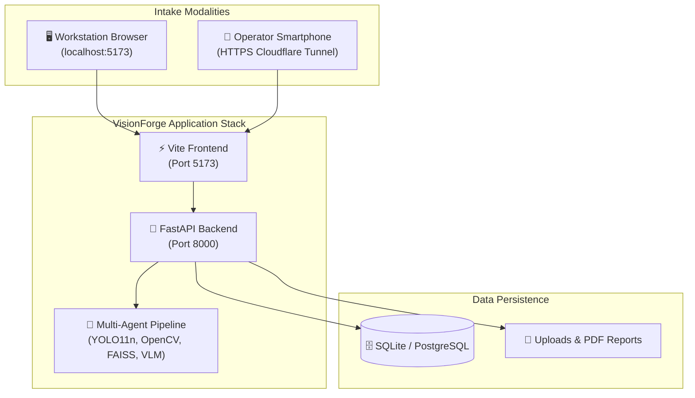
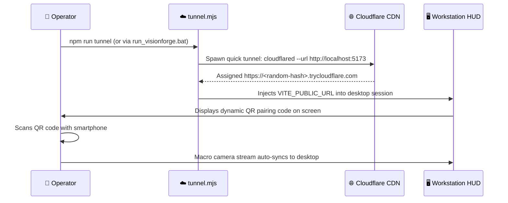

# 🚀 VisionForge AI Deployment & Operations Guide

> **How to deploy VisionForge AI across local developer machines, factory-floor edge PCs, and multi-container Docker environments.**

---

## 📖 Table of Contents

- [1. The Story: From Developer Laptop to Factory Floor](#1-the-story-from-developer-laptop-to-factory-floor)
- [2. System Requirements & Prerequisites](#2-system-requirements--prerequisites)
- [3. Environment Configuration](#3-environment-configuration)
  - [⚙️ 3.1 Backend `.env` Setup](#️-31-backend-env-setup)
  - [🖥️ 3.2 Frontend `.env` Setup](#️-32-frontend-env-setup)
- [4. Quick-Start Launch Options](#4-quick-start-launch-options)
  - [⚡ Option A: Windows 1-Click Master Launcher](#-option-a-windows-1-click-master-launcher)
  - [🛠️ Option B: Manual Step-by-Step Launch](#️-option-b-manual-step-by-step-launch)
  - [🐳 Option C: Production Docker Compose](#-option-c-production-docker-compose)
- [5. Smartphone Camera Pairing via Cloudflare Quick Tunnel](#5-smartphone-camera-pairing-via-cloudflare-quick-tunnel)
- [6. Database Seeding & Demo Fixtures](#6-database-seeding--demo-fixtures)
- [7. Operational Troubleshooting & Runbook](#7-operational-troubleshooting--runbook)

---

## 1. The Story: From Developer Laptop to Factory Floor

In manufacturing environments, software cannot assume an always-on gigabit cloud connection or dedicated DevOps engineers on site.

VisionForge AI is engineered with a **zero-dependency local-first philosophy**:
- **On a Developer Laptop:** Runs completely in-memory with SQLite and local PyTorch weights in $< 30\text{ seconds}$.
- **On a Factory Floor Edge PC:** Pairs with smartphone cameras via HTTPS tunnels and processes hardware inspections at 60 FPS without high-end GPUs.
- **In an Enterprise Cleanroom:** Deploys via Docker Compose with PostgreSQL 16 and automated health checks.



---

## 2. System Requirements & Prerequisites

```text
┌─────────────────────────────────────────────────────────────────────────────┐
│                         MINIMUM HARDWARE REQUIREMENTS                       │
├─────────────────────────────────────────────────────────────────────────────┤
│  Processor:            Quad-Core x86_64 / ARM64 (Intel i5 8th+, Apple M1+)  │
│  System Memory (RAM):  8 GB minimum (16 GB recommended for concurrent VLM)  │
│  Disk Space:           5 GB free SSD storage (model weights + local DB)     │
│  GPU (Optional):       NVIDIA CUDA 12.0+ supported for <15ms YOLO inference │
└─────────────────────────────────────────────────────────────────────────────┘
```

### Required Software Toolchains
| Software | Minimum | Recommended | Purpose |
| :--- | :---: | :---: | :--- |
| **Python** | `3.11.0` | `3.12+` | FastAPI server, PyTorch, OpenCV, ReportLab. |
| **Node.js** | `v18.0.0` | `v20.x+` | React 18 frontend & Vite bundling engine. |
| **npm** | `9.0.0+` | `10.x+` | Frontend package manager. |
| **Git** | `2.40+` | Latest | Repository version control. |

---

## 3. Environment Configuration

---

### ⚙️ 3.1 Backend `.env` Setup

Create your backend configuration file by copying the template:

```bash
cp backend/.env.example backend/.env
```

```ini
# backend/.env

# Application Settings
APP_NAME=VisionForge-AI
APP_VERSION=0.1.0
DEBUG=true

# Database (Zero-Config SQLite)
DATABASE_URL=sqlite+aiosqlite:///data/visionforge.db

# Authentication Security (Generate a secure 64-char key)
JWT_SECRET_KEY=your_random_64_character_hex_secret_here
JWT_ACCESS_TOKEN_EXPIRE_MINUTES=30
JWT_REFRESH_TOKEN_EXPIRE_DAYS=7

# Cloud AI Providers (Obtain free API keys)
# Google Gemini (https://aistudio.google.com/)
GEMINI_API_KEY=your_gemini_api_key_here

# Groq Cloud LPU (https://console.groq.com/)
GROQ_API_KEY=your_groq_api_key_here

# Visual Similarity Threshold
SIMILARITY_THRESHOLD=0.75
```

---

### 🖥️ 3.2 Frontend `.env` Setup

Create your frontend configuration file:

```bash
cp frontend/.env.example frontend/.env
```

```ini
# frontend/.env
VITE_API_BASE_URL=/api/v1
```

---

## 4. Quick-Start Launch Options

---

### ⚡ Option A: Windows 1-Click Master Launcher

For operators and developers on Windows workstations, launch the complete stack with a single command:

```bat
.\run_visionforge.bat
```

```
┌─────────────────────────────────────────────────────────────────────────────┐
│ 1. [Preflight Check] Verifies python.exe and npm.cmd are in system PATH.    │
│ 2. [Port Clearance] Kills stale processes holding ports 5173 & 8000.        │
│ 3. [Tunnel Prompt] Queries operator to enable Cloudflare HTTPS tunnel.      │
│ 4. [Backend Spawn] Launches Uvicorn ASGI server (:8000) in new window.      │
│ 5. [Frontend Spawn] Launches Vite React Dev server (:5173) in new window.   │
│ 6. [Browser Launch] Opens default web browser directly to localhost:5173.   │
└─────────────────────────────────────────────────────────────────────────────┘
```

---

### 🛠️ Option B: Manual Step-by-Step Launch

If you prefer launching each service manually in separate terminal windows:

#### Step 1: Start Backend (FastAPI)
```bash
cd backend
python -m venv venv
# Windows:
venv\Scripts\activate
# Linux/macOS:
source venv/bin/activate

pip install -r requirements.txt
python -m uvicorn app.main:app --host 0.0.0.0 --port 8000 --reload
```

#### Step 2: Start Frontend (React + Vite)
```bash
cd frontend
npm install
npm run dev
```

Your workstation HUD is now live at `http://localhost:5173`.

---

### 🐳 Option C: Production Docker Compose

For enterprise deployments on factory servers with PostgreSQL:

```bash
docker-compose up -d --build
```

```yaml
# docker-compose.yml summary
services:
  db:
    image: postgres:16-alpine
    environment:
      POSTGRES_USER: visionforge
      POSTGRES_PASSWORD: ${DB_PASSWORD:-secure_db_password}
      POSTGRES_DB: visionforge
    ports:
      - "5432:5432"

  backend:
    build: ./backend
    depends_on: [db]
    environment:
      DATABASE_URL: postgresql+asyncpg://visionforge:${DB_PASSWORD:-secure_db_password}@db:5432/visionforge
    ports:
      - "8000:8000"

  frontend:
    build: ./frontend
    depends_on: [backend]
    ports:
      - "80:80"
```

---

## 5. Smartphone Camera Pairing via Cloudflare Quick Tunnel

Mobile browsers require a secure HTTPS context to access device camera hardware (`navigator.mediaDevices.getUserMedia`).

VisionForge includes an automated zero-config tunnel script:



```bash
# Start the tunnel manually
cd frontend
npm run tunnel
```

---

## 6. Database Seeding & Demo Fixtures

To populate demonstration hardware blueprints, vendor profiles, and user accounts:

```bash
cd backend
python scripts/seed_demo_data.py
```

### Default Pre-Configured Accounts:
| Role | Email | Password |
| :--- | :--- | :--- |
| **Administrator** | `admin@visionforge.ai` | `adminpassword123` |
| **Line Operator** | `operator@visionforge.ai` | `operatorpassword123` |

### Included Hardware Blueprints:
1. **`Industrial ATX Motherboard V1`** (`PCB-MCU-V2`)
2. **`48V Telecom Lithium Battery Pack`** (`BAT-48V-LFP`)
3. **`32GB DDR4 Server ECC Memory`** (`RAM-ECC-32G`)

---

## 7. Operational Troubleshooting & Runbook

### 1. Port 8000 or 5173 Already in Use
- **Symptom:** `Uvicorn failed to bind: address already in use`.
- **Fix:** Run `run_visionforge.bat` (which cleans ports automatically) or kill the stale process in PowerShell:
  ```powershell
  Get-NetTCPConnection -LocalPort 5173,8000 -State Listen | ForEach-Object { Stop-Process -Id $_.OwningProcess -Force }
  ```

### 2. Missing YOLO Model Weights File
- **Symptom:** `FileNotFoundError: component_detector.pt`.
- **Fix:** Verify `backend/app/models/component_detector.pt` exists ($5.8\text{ MB}$). If absent, the structural agent falls back to OpenCV SSIM structural diffing.

### 3. Mobile Camera Permission Blocked
- **Symptom:** Smartphone browser displays *"Camera access denied"*.
- **Fix:** Ensure you are accessing the UI over the `https://*.trycloudflare.com` URL and not raw `http://192.168.x.x`.

---

*For details on automated test suites and quality gates, read [`docs/TESTING.md`](TESTING.md).*
