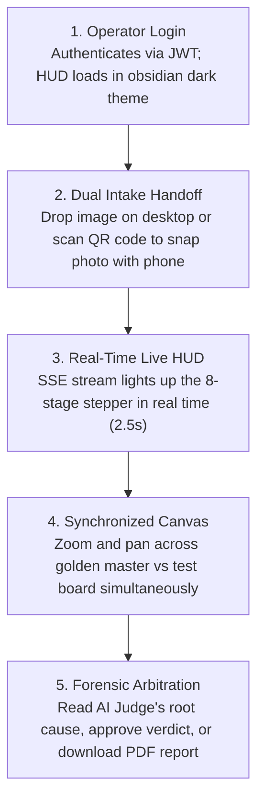
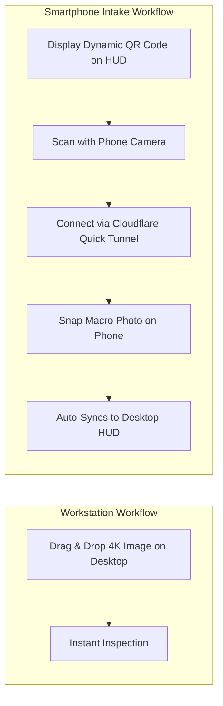
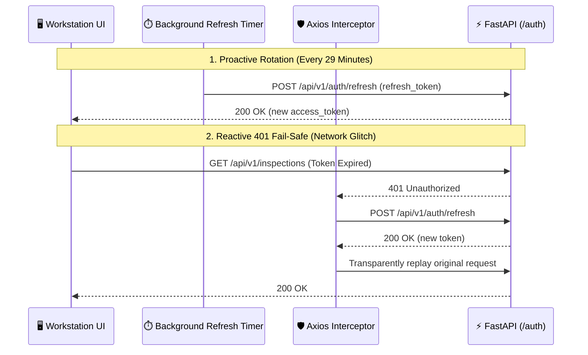

# 🖥️ VisionForge AI Tactical HUD & Frontend Architecture

> **How React 18, Server-Sent Events, and a Cyberpunk Tactical HUD give factory operators sub-second forensic insights.**

---

## 📖 Table of Contents

- [1. The Story: The Operator Inspection Journey](#1-the-story-the-operator-inspection-journey)
- [2. Frontend Tech Stack & Architectural Principles](#2-frontend-tech-stack--architectural-principles)
- [3. Component & Directory Topology](#3-component--directory-topology)
- [4. Real-Time Telemetry & The `usePipelineSSE` Hook](#4-real-time-telemetry--the-usepipelinesse-hook)
- [5. Dual Intake Modalities (Desktop & Mobile QR Pairing)](#5-dual-intake-modalities-desktop--mobile-qr-pairing)
- [6. Key Workstation UI Components](#6-key-workstation-ui-components)
  - [🔍 6.1 `DualImageCanvas.jsx` — Synchronized Zoom & Pan](#-61-dualimagecanvasjsx--synchronized-zoom--pan)
  - [⚡ 6.2 `PipelineProgress.jsx` — 8-Stage Real-Time Stepper](#-62-pipelineprogressjsx--8-stage-real-time-stepper)
  - [⚖️ 6.3 `VerdictBanner.jsx` — AI Judge Causal Reasoner](#-63-verdictbannerjsx--ai-judge-causal-reasoner)
  - [🛡️ 6.4 `EvidenceCard.jsx` — Anomaly Telemetry Cards](#-64-evidencecardjsx--anomaly-telemetry-cards)
- [7. Proactive Token Refresh & 401 Interception Queue](#7-proactive-token-refresh--401-interception-queue)

---

## 1. The Story: The Operator Inspection Journey

Imagine an operator on the factory receiving dock inspecting an incoming crate of automotive ECUs.

They do not have time to read complex log files or wait for slow page reloads. They need a high-visibility, keyboard-accessible workstation interface:



---

## 2. Frontend Tech Stack & Architectural Principles

```text
┌─────────────────────────────────────────────────────────────────────────────┐
│                          FRONTEND TECHNICAL STACK                           │
├─────────────────────────────────────────────────────────────────────────────┤
│  Framework:            React 18.3 (Component-Driven SPA)                    │
│  Build Tool:           Vite 5.4 (Sub-Second Hot Module Replacement)         │
│  Styling:              Tailwind CSS 3.4 (Cyberpunk Tactical HUD Theme)      │
│  Icons & Charts:       Lucide React + Recharts (Data Visualizations)        │
│  Routing:              React Router DOM v6 (RBAC Protected Routes)          │
│  State & Telemetry:    React Context API + Server-Sent Events (SSE)         │
│  HTTP Client:          Axios 1.7 (with Proactive JWT Token Renewal)         │
└─────────────────────────────────────────────────────────────────────────────┘
```

### Tactical HUD Design System
- **Ground Color:** Deep obsidian black (`#070b12`) minimizing eye strain under harsh factory lighting.
- **Card Surfaces:** Dark slate panels (`#0d1424`) with subtle 1px border glows (`#1e293b`).
- **Signal Accents:** Electric cyan (`#00f0ff`) for active elements, emerald green (`#10b981`) for genuine parts, crimson red (`#ef4444`) for counterfeits, and amber (`#f59e0b`) for review flags.

---

## 3. Component & Directory Topology

```text
frontend/src/
├── App.jsx                     # Top-level routing & role-based route guards
├── main.jsx                    # React 18 root mounting
├── index.css                   # Tailwind directives, custom scrollbars & HUD tokens
├── context/
│   ├── AuthContext.jsx         # User authentication, RBAC roles, and session state
│   └── ToastContext.jsx        # Non-blocking HUD toast notification system
├── hooks/
│   └── usePipelineSSE.js       # Real-time SSE stream subscriber with polling fallback
├── services/
│   └── api.js                  # Axios instance, proactive JWT renewal & 401 retry queue
├── components/
│   ├── common/                 # Button, Modal, StatCard, StatusChip, SkeletonLoader
│   ├── inspection/             # DualImageCanvas, PipelineProgress, EvidenceCard, CameraModal
│   ├── layout/                 # AppLayout, Sidebar (Mobile Responsive Drawer), Topbar
│   └── products/               # GoldenRepositoryDrawer blueprint manager
└── pages/
    ├── LandingPage.jsx         # Public marketing & feature overview
    ├── LoginPage.jsx           # Authentication screen with demo account quick-fill
    ├── DashboardPage.jsx       # Real-time inspection queue & factory stats
    ├── NewInspectionPage.jsx   # Desktop dropzone & mobile QR intake
    ├── InspectionDetailPage.jsx# Live 8-stage pipeline telemetry & evidence review
    ├── ReportsPage.jsx         # Historical audit certificates & PDF downloads
    └── AnalyticsPage.jsx       # Recharts supplier risk & operator KPIs
```

---

## 4. Real-Time Telemetry & The `usePipelineSSE` Hook

When an inspection starts, the `usePipelineSSE` custom hook connects to the FastAPI backend over **Server-Sent Events (SSE)**:

```javascript
// frontend/src/hooks/usePipelineSSE.js (Conceptual Summary)
export function usePipelineSSE(inspectionId) {
  const [stages, setStages] = useState([]);
  const [verdict, setVerdict] = useState(null);
  const [isLive, setIsLive] = useState(false);

  useEffect(() => {
    if (!inspectionId) return;

    const eventSource = new EventSource(`/api/v1/inspections/${inspectionId}/events`);

    eventSource.onmessage = (event) => {
      const data = JSON.parse(event.data);
      if (data.type === 'STAGE_PROGRESS') {
        updateStageProgress(data);
      } else if (data.type === 'PIPELINE_COMPLETE') {
        setVerdict(data.verdict);
        eventSource.close();
      }
    };

    // Automated 2.5s Polling Fallback if SSE drops
    eventSource.onerror = () => {
      eventSource.close();
      startPollingFallback(inspectionId);
    };

    return () => eventSource.close();
  }, [inspectionId]);

  return { stages, verdict, isLive };
}
```

> 🛡️ **Resilience Guarantee:** If a corporate firewall or proxy closes the SSE stream, the hook automatically fails over to HTTP polling every 2.5 seconds without interrupting the operator.

---

## 5. Dual Intake Modalities (Desktop & Mobile QR Pairing)

Factory workers can submit circuit boards using two seamless workflows:



1. **Desktop Drag-and-Drop:** High-resolution images from industrial camera stations can be dropped directly into `NewInspectionPage.jsx`.
2. **Mobile Smartphone Handoff:** Operators scanning boards on conveyor belts can click **"Use Mobile Camera"**, scan the on-screen QR code, and snap macro photos with their smartphone. The photo automatically streams into the desktop workstation via Cloudflare Quick Tunnel.

---

## 6. Key Workstation UI Components

---

### 🔍 6.1 `DualImageCanvas.jsx` — Synchronized Zoom & Pan

Renders the test board side-by-side with the manufacturer's Golden Reference. When an operator zooms in on a suspicious microcontroller, **both images zoom and pan synchronously**, allowing instant visual verification of silkscreen markings and component placement.

---

### ⚡ 6.2 `PipelineProgress.jsx` — 8-Stage Real-Time Stepper

Displays the real-time execution status of all 8 pipeline stages:
- 🔵 **Pulsing Cyan:** Stage currently running.
- 🟢 **Emerald Green:** Stage completed successfully.
- 🔴 **Crimson Red:** Anomaly detected / Fast-fail triggered.
- ⚪ **Muted Slate:** Pending downstream stage.

---

### ⚖️ 6.3 `VerdictBanner.jsx` — AI Judge Causal Reasoner

Displays the final decision from Stage 7 on Groq LPU hardware:
- **Verdict Badge:** `ACCEPT` (Green), `REJECT` (Red), or `FLAG FOR REVIEW` (Amber).
- **Fraud Probability Bar:** Visual percentage risk bar ($0\%$ to $100\%$).
- **Causal Explanation Box:** Clear, natural language summary of *why* the board was flagged.
- **Operator Action Buttons:** "Approve Verdict", "Override Decision", and "Download Signed PDF".

---

### 🛡️ 6.4 `EvidenceCard.jsx` — Anomaly Telemetry Cards

Collapsible accordion cards detailing the findings of each individual forensic agent (YOLO missing counts, OCR string differences, ELA tamper maps, and VLM surface burn reports).

---

## 7. Proactive Token Refresh & 401 Interception Queue

To ensure operators are never logged out during active inspections:



---

*For instructions on running and deploying the frontend, read [`docs/DEPLOYMENT.md`](DEPLOYMENT.md).*
