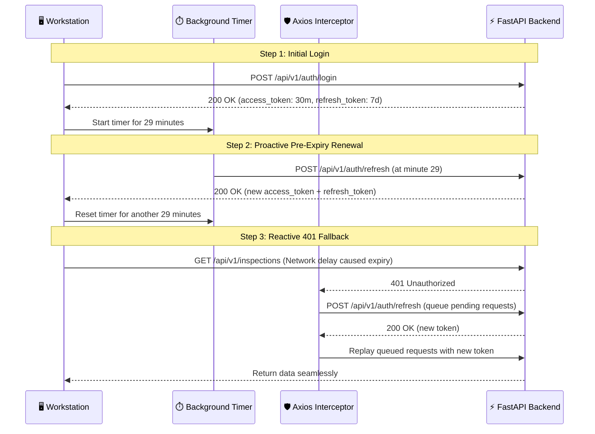
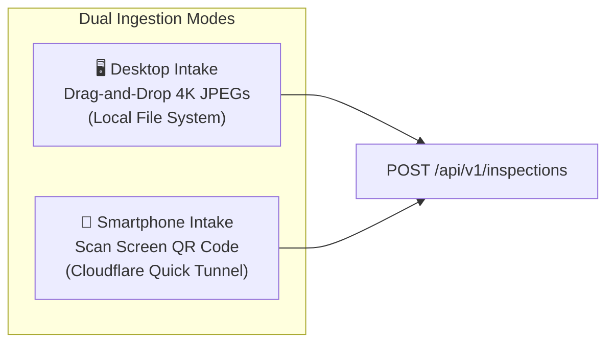
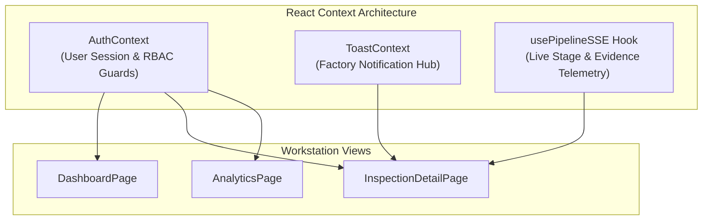

# 🖥️ Frontend Architecture & Workstation HUD

> **Technical Specification of the React 18 Industrial Workstation & Real-Time Telemetry HUD**  
> **Status:** Authoritative (Reflects Actual Implemented Codebase)  
> **Framework:** React 18.3 + Vite 5.4  
> **Theme:** Industrial Dark / Cyberpunk HUD (Tailwind CSS 3.4)  
> **Source Directory:** `frontend/src/`

---

## 📖 Table of Contents

- [1. Workstation Design Philosophy & Factory Floor Ergonomics](#1-workstation-design-philosophy--factory-floor-ergonomics)
- [2. Component & Directory Topology](#2-component--directory-topology)
- [3. Proactive Authentication & Token Rotation Engine](#3-proactive-authentication--token-rotation-engine)
- [4. Real-Time Telemetry: The `usePipelineSSE` Hook](#4-real-time-telemetry-the-usepipelinesse-hook)
- [5. Dual Intake Modalities (Desktop & Mobile QR Handoff)](#5-dual-intake-modalities-desktop--mobile-qr-handoff)
- [6. Core Workstation Components](#6-core-workstation-components)
  - [6.1 `DualImageCanvas.jsx` — Synchronized Forensic Comparator](#61-dualimagecanvasjsx--synchronized-forensic-comparator)
  - [6.2 `PipelineProgress.jsx` — 8-Stage Real-Time Stepper](#62-pipelineprogressjsx--8-stage-real-time-stepper)
  - [6.3 `VerdictBanner.jsx` — AI Judge Causal Display](#63-verdictbannerjsx--ai-judge-causal-display)
  - [6.4 `EvidenceCard.jsx` — Forensic Findings & YOLO Telemetry](#64-evidencecardjsx--forensic-findings--yolo-telemetry)
- [7. Application Pages & Workstation Views](#7-application-pages--workstation-views)
- [8. State Management & Data Flow Architecture](#8-state-management--data-flow-architecture)

---

## 1. Workstation Design Philosophy & Factory Floor Ergonomics

### Why an Industrial Dark HUD?
Standard enterprise SaaS interfaces (white backgrounds, subtle grey text, low contrast) fail on electronics manufacturing lines:
1. **Harsh Lighting & Eye Fatigue:** Receiving docks feature intense fluorescent lighting. Glare washes out low-contrast UI elements.
2. **Safety Equipment Constraints:** Line operators wear anti-static safety glasses and nitrile gloves. They require high-contrast typography, large click targets, and unmistakable color-coded status chips.
3. **Split-Second Verdict Comprehension:** An operator needs to know within $0.5\text{ seconds}$ whether a circuit board passed, failed, or was quarantined.

VisionForge implements an **Industrial Dark / Cyberpunk HUD**:
- **Background:** Deep obsidian (`#070b12` / `bg-hud-bg`) that absorbs ambient factory glare.
- **Accents:** High-visibility electric cyan (`#00f0ff`) and tactical emerald (`#10b981`).
- **Defect Alerts:** High-contrast crimson (`#ef4444`) and warning amber (`#f59e0b`).
- **Typography:** JetBrains Mono for machine telemetry and serial codes; Outfit for legible headings.

---

## 2. Component & Directory Topology

```
frontend/src/
├── App.jsx                     # Route architecture & ProtectedRoute guard
├── main.jsx                    # React 18 DOM mount point
├── index.css                   # Custom scrollbars, font definitions, glow utilities
├── context/
│   ├── AuthContext.jsx         # User credentials, login/logout, RBAC helpers
│   └── ToastContext.jsx        # Non-blocking factory notification system
├── hooks/
│   └── usePipelineSSE.js       # Server-Sent Events subscriber with polling failover
├── services/
│   └── api.js                  # Axios client, 29m token timer, 401 retry queue
├── components/
│   ├── common/                 # Button, Modal, StatCard, StatusChip, SkeletonLoader
│   ├── inspection/             # DualImageCanvas, PipelineProgress, EvidenceCard, CameraModal
│   ├── layout/                 # AppLayout, Topbar, Sidebar
│   └── products/               # GoldenRepositoryDrawer blueprint catalog
└── pages/
    ├── LandingPage.jsx         # Public overview & interactive pipeline demo
    ├── LoginPage.jsx           # Authentication view with demo account presets
    ├── DashboardPage.jsx       # Factory throughput KPI dashboard
    ├── NewInspectionPage.jsx   # Drag-and-drop & smartphone QR camera intake
    ├── InspectionDetailPage.jsx# Live 8-stage execution & human review view
    ├── ReportsPage.jsx         # Historical audit archive & PDF downloads
    ├── AnalyticsPage.jsx       # Supplier risk ranking & Recharts trend graphs
    └── NotFoundPage.jsx        # 404 tactical screen
```

---

## 3. Proactive Authentication & Token Rotation Engine

To ensure an active inspection is never interrupted by an expired JWT token, `frontend/src/services/api.js` implements a **proactive pre-expiry token rotation timer**:



---

## 4. Real-Time Telemetry: The `usePipelineSSE` Hook

The `usePipelineSSE` custom hook (`frontend/src/hooks/usePipelineSSE.js`) manages the real-time telemetry stream between the workstation and the LangGraph engine:

```javascript
// Conceptual SSE Lifecycle
export function usePipelineSSE(inspectionId) {
  const [stage, setStage] = useState(1);
  const [evidenceCards, setEvidenceCards] = useState([]);
  const [verdict, setVerdict] = useState(null);

  useEffect(() => {
    if (!inspectionId) return;
    
    // Connect to Server-Sent Events stream
    const eventSource = new EventSource(`/api/v1/inspections/${inspectionId}/events`);

    eventSource.addEventListener('stage_progress', (e) => {
      const data = JSON.parse(e.data);
      setStage(data.stage);
    });

    eventSource.addEventListener('evidence_card', (e) => {
      const card = JSON.parse(e.data);
      setEvidenceCards((prev) => [...prev, card]);
    });

    eventSource.addEventListener('pipeline_complete', (e) => {
      const result = JSON.parse(e.data);
      setVerdict(result);
      eventSource.close();
    });

    // Fallback: 2.5s HTTP polling if SSE connection drops
    eventSource.onerror = () => {
      eventSource.close();
      startPollingFallback(inspectionId);
    };

    return () => eventSource.close();
  }, [inspectionId]);
}
```

---

## 5. Dual Intake Modalities (Desktop & Mobile QR Handoff)

Factory inspection setups vary widely: some stations have fixed high-resolution USB microscopes, while others require roving operators with smartphones. VisionForge supports both:



1. **Desktop Direct Upload:** Drag-and-drop 4K imagery directly onto the HUD with immediate client-side thumbnail rendering and dimension validation.
2. **Mobile Smartphone Handoff:** Click "Mobile Camera" on the desktop HUD. The backend spins up an automated **Cloudflare Quick Tunnel** (`cloudflared`) and generates a dynamic QR code. The operator scans the QR code with their phone, opens the mobile-optimized camera page, snaps a photo, and the image streams directly into the desktop inspection queue in under $1\text{ second}$.

---

## 6. Core Workstation Components

---

### 6.1 `DualImageCanvas.jsx` — Synchronized Forensic Comparator
- **Source File:** `frontend/src/components/inspection/DualImageCanvas.jsx`
- **Purpose:** Renders the incoming hardware test board side-by-side with the manufacturer's golden blueprint.
- **Capabilities:**
  - **Synchronized Zoom & Pan:** Panning or zooming on the test board automatically pans and zooms the golden master to the identical relative coordinate.
  - **Interactive Bounding Box Overlays:** Renders color-coded SVG rectangles over ROIs:
    - 🟢 Green: Passed component check.
    - 🔴 Crimson: Failed component check (missing part, broken seal).
    - 🟡 Amber: Low confidence / review required.
  - **Hover Tooltips:** Clicking any bounding box opens an overlay displaying the specific agent's confidence, expected component count, and defect explanation.

---

### 6.2 `PipelineProgress.jsx` — 8-Stage Real-Time Stepper
- **Source File:** `frontend/src/components/inspection/PipelineProgress.jsx`
- **Purpose:** Visualizes the progress of the 8 LangGraph stages in real time.
- **Visual Indicators:**
  - Pulsing electric cyan halo around the currently executing stage.
  - Emerald checkmark for completed stages with millisecond latency badges.
  - Crimson alert badge if Stage 1 (Blur) or Stage 2 (Authenticity) triggers a fast-fail exit.

---

### 6.3 `VerdictBanner.jsx` — AI Judge Causal Display
- **Source File:** `frontend/src/components/inspection/VerdictBanner.jsx`
- **Purpose:** Renders the final legal arbitration decision at the top of the detail page.
- **Visual Design:**
  - **ACCEPT:** Emerald glowing border with `AUTHENTIC HARDWARE` badge.
  - **REJECT:** Crimson pulsing border with `COUNTERFEIT / DEFECT DETECTED` badge.
  - **REVIEW:** Amber border with `OPERATOR REVIEW REQUIRED` badge.
  - **Markdown Narrative:** Formats the AI Judge's formal root-cause explanation with bold highlights on missing parts and lot code discrepancies.

---

### 6.4 `EvidenceCard.jsx` — Forensic Findings & YOLO Telemetry
- **Source File:** `frontend/src/components/inspection/EvidenceCard.jsx`
- **Purpose:** Modular card rendering individual agent findings.
- **Sections:**
  - **Agent Identity:** Icon and badge (`OCR`, `LABEL`, `STRUCTURAL`, `VLM`).
  - **Anomaly Metric:** Circular progress gauge displaying normalized anomaly score ($0.0$ to $1.0$).
  - **YOLO Delta Table:** For structural cards, displays discrete expected vs. detected component counts:
    ```text
    Component: capacitor | Expected: 4 | Detected: 3 | Status: MISSING (-1)
    ```
  - **Raw JSON Drawer:** Expandable accordion displaying raw model outputs for deep engineering diagnostics.

---

## 7. Application Pages & Workstation Views

1. **`LandingPage.jsx`:** Public marketing and engineering overview featuring interactive pipeline simulations, live demo accounts, and technology breakdown.
2. **`LoginPage.jsx`:** High-security authentication portal with one-click demo presets (`System Admin` and `Line Operator`).
3. **`DashboardPage.jsx`:** Real-time factory KPI view displaying total inspections, rejection rate, recent case history, and quick-inspection launch cards.
4. **`NewInspectionPage.jsx`:** Ingestion hub with drag-and-drop upload, vendor dropdown, location tagging, and mobile QR pairing modal.
5. **`InspectionDetailPage.jsx`:** The core forensic workstation. Contains the synchronized `DualImageCanvas`, real-time `PipelineProgress` stepper, AI Judge `VerdictBanner`, and the interactive `EvidenceCard` grid.
6. **`ReportsPage.jsx`:** Searchable audit archive allowing operators to filter historical reports by vendor, verdict, and date range, with one-click PDF downloads.
7. **`AnalyticsPage.jsx`:** High-level supply-chain intelligence powered by Recharts, graphing supplier risk scores, monthly counterfeit trends, and defect distributions by location.

---

## 8. State Management & Data Flow Architecture

VisionForge avoids bloated global state stores (such as Redux) in favor of **focused React Contexts and custom hooks**:



- **Authentication State:** Managed via `AuthContext.jsx`, exposing `user`, `isAuthenticated`, `login()`, `logout()`, and role helper flags (`isAdmin`, `isOperator`).
- **Telemetry State:** Managed strictly inside `usePipelineSSE.js` during active inspections, tearing down socket connections upon navigation to prevent memory leaks.

---

*For backend APIs powering this frontend, see [`docs/API.md`](API.md).*  
*For deployment instructions, see [`docs/DEPLOYMENT.md`](DEPLOYMENT.md).*
