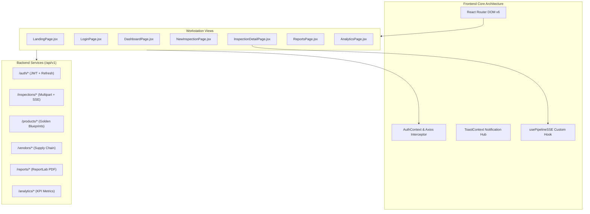
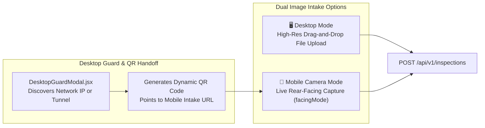

# 🖥️ VisionForge AI — Frontend Architecture & UI Specification

> **Status:** Authoritative (Reflects Actual Implemented Codebase)  
> **Framework:** React 18.3 + Vite 5.4  
> **Styling:** Tailwind CSS 3.4 (Cyberpunk / Industrial Dark HUD Theme)  
> **Icons & Charts:** Lucide React + Recharts  
> **Source Directory:** `frontend/src/`

---

## 📑 Table of Contents

- [1. Frontend Architecture Overview](#1-frontend-architecture-overview)
- [2. Component & Directory Topology](#2-component--directory-topology)
- [3. Tactical HUD Design System & Theme Tokens](#3-tactical-hud-design-system--theme-tokens)
- [4. Authentication Lifecycle & Proactive Token Rotation](#4-authentication-lifecycle--proactive-token-rotation)
- [5. Real-Time Telemetry & The `usePipelineSSE` Hook](#5-real-time-telemetry--the-usepipelinesse-hook)
- [6. Dual Intake Modalities (Desktop & Mobile QR Handoff)](#6-dual-intake-modalities-desktop--mobile-qr-handoff)
- [7. Core Workstation Components](#7-core-workstation-components)
  - [7.1 `DualImageCanvas.jsx` — Visual Comparison & ROI Overlays](#71-dualimagecanvasjsx--visual-comparison--roi-overlays)
  - [7.2 `PipelineProgress.jsx` — 8-Stage Real-Time Stepper](#72-pipelineprogressjsx--8-stage-real-time-stepper)
  - [7.3 `VerdictBanner.jsx` — AI Judge Causal Display](#73-verdictbannerjsx--ai-judge-causal-display)
  - [7.4 `EvidenceCard.jsx` — Forensic Telemetry Breakdown](#74-evidencecardjsx--forensic-telemetry-breakdown)
  - [7.5 `GoldenRepositoryDrawer.jsx` — Blueprint Management](#75-goldenrepositorydrawerjsx--blueprint-management)
- [8. Application Pages & Route Architecture](#8-application-pages--route-architecture)

---

## 1. Frontend Architecture Overview

The VisionForge AI frontend is an industrial-grade Single Page Application (SPA) engineered for fast response times, high-contrast factory floor visibility, and zero latency during micro-electronic inspection.



---

## 2. Component & Directory Topology

```
frontend/src/
├── App.jsx                     # Route definitions & ProtectedRoute guards
├── main.jsx                    # React 18 DOM mount point
├── index.css                   # Tactical scrollbars, JetBrains Mono & Outfit fonts
├── assets/                     # Hero graphics, branding SVGs
├── context/
│   ├── AuthContext.jsx         # User session state, RBAC role helpers, logout events
│   └── ToastContext.jsx        # Non-blocking industrial notification toast system
├── hooks/
│   └── usePipelineSSE.js       # Server-Sent Events subscriber with polling failover
├── services/
│   └── api.js                  # Axios instance, proactive JWT timer & 401 retry queue
├── components/
│   ├── common/                 # Button, Modal, StatCard, StatusChip, SkeletonLoader
│   ├── inspection/             # DualCanvas, PipelineProgress, EvidenceCard, CameraModal
│   ├── layout/                 # AppLayout, Sidebar (Mobile Drawer), Topbar
│   └── products/               # GoldenRepositoryDrawer blueprint manager
└── pages/
    ├── LandingPage.jsx         # Public marketing & feature overview
    ├── LoginPage.jsx           # Public authentication & demo account presets
    ├── DashboardPage.jsx       # Real-time factory KPI dashboard
    ├── NewInspectionPage.jsx   # Drag-and-drop & mobile camera intake
    ├── InspectionDetailPage.jsx# Live 8-stage execution & evidence review
    ├── ReportsPage.jsx         # Historical audit reports & PDF downloads
    ├── AnalyticsPage.jsx       # Recharts supplier risk & operator analytics
    └── NotFoundPage.jsx        # 404 tactical screen
```

---

## 3. Tactical HUD Design System & Theme Tokens

The application uses a custom **Tailwind HUD Palette** optimized for low-light industrial inspection stations and OLED cleanroom tablets:

```javascript
// tailwind.config.js - Industrial Palette Tokens
colors: {
  hud: {
    bg: '#070b12',           // Deep obsidian canvas ground
    surface: '#0d1527',      // Primary container and navigation ground
    card: '#121e36',         // Component evidence cards and panels
    panel: '#162340',        // Elevated modal backgrounds
    border: '#1f3154',       // Standard structural border
    'border-light': '#2b4474',// Interactive highlight border
    accent: '#06b6d4',       // Cyan-500 primary interaction accent
    cyan: '#00f0ff',         // Electric cyan active telemetry glow
    emerald: '#10b981',      // Green pass status indicator
    crimson: '#ef4444',      // Red reject / fraud alarm
    amber: '#f59e0b',        // Yellow human review / warning
    muted: '#94a3b8',        // Secondary technical typography
  }
}
```

### Typography Hierarchy
- **Technical Readouts & Telemetry:** `JetBrains Mono`, `monospace` (Used for part numbers, Levenshtein scores, YOLO confidence percentages, bounding box coordinates).
- **Interface & Metrics:** `Outfit`, `sans-serif` (Used for KPI headers, navigation titles, and judge root-cause analysis).

---

## 4. Authentication Lifecycle & Proactive Token Rotation

VisionForge implements a **two-tier proactive and reactive token management system** in `frontend/src/services/api.js`:

```mermaid
sequenceDiagram
    participant UI as 🖥️ Workstation UI
    participant Timer as ⏱️ Auth Refresh Timer
    participant Interceptor as 🛡️ Axios Interceptor
    participant Backend as ⚡ FastAPI (/auth)

    Note over UI,Timer: Login Successful (Token Exp: 30m)
    Timer->>Timer: Schedule refresh in 29 minutes (60s before expiry)
    
    rect rgb(20, 35, 60)
        Note over Timer,Backend: Pathway 1: Proactive Pre-Expiry Rotation
        Timer->>Backend: POST /api/v1/auth/refresh (refresh_token)
        Backend-->>Timer: 200 OK (New access_token + refresh_token)
        Timer->>UI: Update localStorage & headers seamlessly
    end

    rect rgb(40, 25, 30)
        Note over Interceptor,Backend: Pathway 2: Reactive 401 Interception
        UI->>Backend: GET /api/v1/inspections (Expired Token)
        Backend-->>Interceptor: 401 Unauthorized
        Interceptor->>Interceptor: Pause concurrent requests (failedQueue)
        Interceptor->>Backend: POST /api/v1/auth/refresh
        Backend-->>Interceptor: 200 OK (New Token)
        Interceptor->>Backend: Replay paused requests with new Token
        Backend-->>UI: 200 OK (Successful Data Load)
    end
```



---

## 5. Real-Time Telemetry & The `usePipelineSSE` Hook

The `usePipelineSSE` hook (`frontend/src/hooks/usePipelineSSE.js`) manages the real-time visual progression across all 8 pipeline stages:

1. **Native SSE Connection:** Connects to `GET /api/v1/inspections/{id}/events`.
2. **Event Parsing:** Dispatches stage updates (`stage_start`, `agent_complete`, `stage_complete`, `verdict`).
3. **Resilient Polling Fallback:** If the SSE socket is severed (e.g., intermediate proxy timeout or browser sleep), the hook automatically falls back to polling `GET /api/v1/inspections/{id}/status` every 2.5 seconds without crashing the user interface.

```javascript
// Usage Example in InspectionDetailPage.jsx
const {
  currentStage,
  stageName,
  completedStages,
  status,
  verdict,
  policyAction,
  detail,
  isDone
} = usePipelineSSE(inspectionId, (finalData) => {
  toast.success('Inspection audit analysis completed.');
  fetchInspectionDetails();
});
```

---

## 6. Dual Intake Modalities (Desktop & Mobile QR Handoff)

Factory inspection lines require flexible capture methods:



1. **Desktop Direct Upload:** Accepts high-resolution multi-angle JPEG/PNG/WebP captures directly from PC-connected industrial macro lenses.
2. **Mobile Camera Modal (`CameraModal.jsx`):** Activates the operator's smartphone camera using `navigator.mediaDevices.getUserMedia({ video: { facingMode: 'environment' } })` with real-time HUD crosshairs.
3. **Desktop Guard Modal (`DesktopGuardModal.jsx`):** If an operator clicks "Capture with Mobile" on a desktop browser, the modal calls `GET /api/v1/system/network` to resolve the computer's reachable LAN IP or Cloudflare tunnel URL, generating a QR code that pairs the mobile phone directly to the inspection session.

---

## 7. Core Workstation Components

### 7.1 `DualImageCanvas.jsx` — Visual Comparison & ROI Overlays
- Renders side-by-side synchronized comparison between the **Test Hardware Capture** and the **Golden Master Reference**.
- Renders colored bounding boxes over flagged anomalies:
  - 🔴 **Red Boxes:** Missing components or altered IC silk-screens.
  - 🟡 **Yellow Boxes:** Positional drift (>15px deviation) or unverified passive parts.
  - 🟢 **Green Boxes:** Validated authentic components.
- Supports synchronized mouse drag panning and wheel zooming.

### 7.2 `PipelineProgress.jsx` — 8-Stage Real-Time Stepper
- Displays the linear 8-stage progress tracker.
- Stages dynamically transition: `Upcoming` (dim border) $\to$ `Active` (pulsing electric cyan with spinning radar) $\to$ `Completed` (solid emerald check).
- Displays real-time stage execution latencies and sub-agent status badges.

### 7.3 `VerdictBanner.jsx` — AI Judge Causal Display
- Displays high-visibility color-coded banners:
  - `ACCEPTED` (Emerald Gradient): Hardware certified authentic.
  - `REJECTED` (Crimson Gradient): Counterfeit / physical damage detected.
  - `FLAGGED FOR REVIEW` (Amber Gradient): Borderline anomaly requiring supervisor sign-off.
- Features animated dials for **Fraud Probability** and **AI Judge Confidence**.

### 7.4 `EvidenceCard.jsx` — Forensic Telemetry Breakdown
- Renders individual cards for every discrete agent finding (OCR, Label, Structural YOLO11n, VLM).
- Shows exact Levenshtein ratios, SSIM delta percentages, and YOLO component counts (e.g., `Expected: 8 Capacitors | Detected: 7`).

### 7.5 `GoldenRepositoryDrawer.jsx` — Blueprint Management
- Slide-out drawer accessible by administrators.
- Allows uploading new reference images, previewing extracted FAISS vector embeddings, and editing ROI bounding box templates.

---

## 8. Application Pages & Route Architecture

| Route Path | Page Component | Access Level | Description |
|:---|:---|:---|:---|
| `/` | `LandingPage.jsx` | Public | System marketing, value proposition, and interactive architecture summary. |
| `/login` | `LoginPage.jsx` | Public | JWT authentication form with 1-click demo login buttons (`Admin`, `Operator`). |
| `/dashboard` | `DashboardPage.jsx` | Authenticated | Live factory KPI metrics, quick intake shortcuts, and recent inspection feed. |
| `/inspections/new` | `NewInspectionPage.jsx` | Authenticated | Intake form: Vendor selector, product SKU matcher, and drag-and-drop image dropzone. |
| `/inspections/:id`| `InspectionDetailPage.jsx`| Authenticated | Live SSE progress viewer, dual canvas comparison, and AI Judge verdict review. |
| `/reports` | `ReportsPage.jsx` | Authenticated | Paginated audit report repository with instant ReportLab PDF export buttons. |
| `/analytics` | `AnalyticsPage.jsx` | Authenticated | Recharts analytics: Vendor risk rankings, monthly fraud trends, and operator throughput. |
| `*` | `NotFoundPage.jsx` | Public | Tactical 404 error page. |

---

*For backend REST API details, consult [`docs/API.md`](API.md).*
