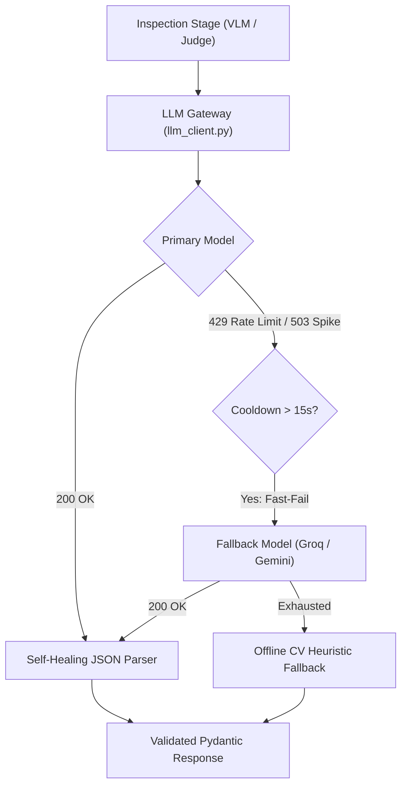

# VisionForge AI — LLM Gateway & Resilient Routing

## 1. Overview

The **LLM Gateway** (`backend/app/shared/llm_client.py`) is VisionForge AI's central routing engine for large language models and vision-language models.

Instead of calling third-party SDKs directly inside inspection stages, all AI requests pass through this unified gateway. It automatically handles **task-based routing, instant failover, rate-limit protection, and JSON recovery**.

---

## 2. Why We Built a Custom Gateway

| Traditional Approach | VisionForge LLM Gateway |
| :--- | :--- |
| Single SDK dependency (breaks if API changes) | Zero SDK lock-in; pure async `httpx` REST calls |
| Freezes UI during API rate limits (long `sleep`) | **Fast-Fail**: Switches to backup provider instantly |
| Model errors crash the pipeline | Graceful fallback keeps the inspection moving |
| LLMs return broken JSON (markdown tags, trailing commas) | Self-healing regex recovery engine repairs JSON |
| New TCP/SSL handshake on every request | Persistent connection pool (saves ~300ms per call) |

---

## 3. Model & Task Specialization

VisionForge assigns the best model for each specific task rather than using one generic model:

| Task | Primary Provider & Model | Fallback Provider & Model | Target Latency | Purpose |
| :--- | :--- | :--- | :--- | :--- |
| **AI Judge** (Stage 7) | **Groq** (`openai/gpt-oss-20b`) | **Gemini** (`gemini-2.5-flash`) | < 2.0s | Fast technical reasoning, root-cause deduction, and final verdict |
| **VLM Vision** (Stage 5) | **Gemini** (`gemini-2.5-flash`) | **Groq** (`qwen/qwen3.8-27b`) | < 3.5s | Detailed visual analysis of scratches, burns, missing parts, and surface wear |
| **Vector Search** (Stage 3) | **Gemini** (`gemini-embedding-2`, 3072-dim) | **Local OpenCLIP** (`ViT-B-32`, 512-dim) | < 0.5s | Golden reference image matching via FAISS vector database |

> **Load Balancing Note:** For VLM calls, the gateway uses a **50/50 Round-Robin** strategy between Gemini and Groq to distribute token consumption evenly across free tier quotas.

---

## 4. Key Architectural Features



### A. Smart Fast-Failover (No Freezing)
When a provider hits a rate limit (`429`) or server overload (`503`), waiting 30–60 seconds is unacceptable for an industrial QA line.
* The gateway inspects the error message and headers for cooldown times (e.g., `try again in 35.9s`).
* If the required cooldown is **> 15 seconds**, it fast-fails immediately (0 ms delay) and dispatches the request to the backup provider.

### B. VLM Token Economy
High-resolution images can easily consume 5,000+ tokens per call, blowing through token-per-minute (ITPM) limits.
* The gateway downscales image crops to **384px** max dimension with **75% JPEG quality**.
* This reduces token consumption from **~4,900 tokens down to ~1,200 tokens (~75% reduction)**, allowing multiple parallel ROI checks without exceeding free-tier limits.

### C. Self-Healing JSON Repair
When prompting LLMs for structured JSON, models often wrap output in markdown fences (` ```json ... ``` `) or append invalid trailing commas (`{"status": "ok",}`).
The gateway includes a 4-step recovery pipeline:
1. Strips markdown code blocks.
2. Attempts standard JSON decode.
3. Uses regex to extract valid `{ ... }` blocks from conversational text.
4. Cleans trailing commas before validating against strict Pydantic schemas.

### D. Offline Computer-Vision Fallback
If both cloud providers are unavailable or internet connectivity drops:
* The VLM agent falls back to local OpenCV difference and SSIM analysis.
* It verifies surface consistency without throwing unhandled exceptions, keeping the pipeline resilient.


## 5. How to Configure

All gateway settings are controlled via environment variables in `.env`:

```env
# Gemini Config
GEMINI_API_KEY=your_key_here
GEMINI_VLM_MODEL=gemini-2.5-flash
GEMINI_JUDGE_MODEL=gemini-2.5-flash
GEMINI_EMBEDDING_MODEL=gemini-embedding-2

# Groq Config
GROQ_API_KEY=your_key_here
GROQ_VLM_MODEL=qwen/qwen3.8-27b
GROQ_JUDGE_MODEL=openai/gpt-oss-20b

# Timeouts & Retries
LLM_TIMEOUT_SECONDS=10.0
LLM_MAX_RETRIES=3
```
