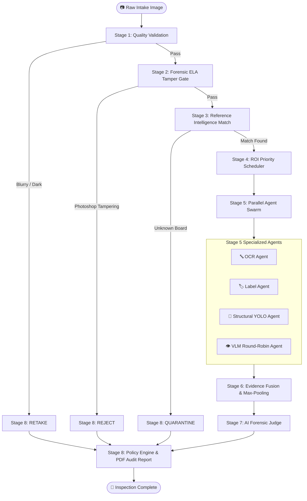
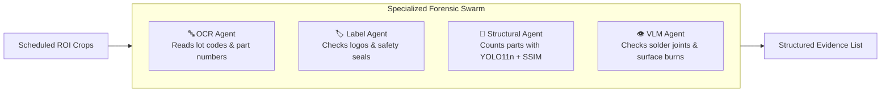

# 🔄 The 8-Stage Inspection Pipeline

> **How VisionForge AI breaks hardware fraud detection into eight progressive, verifiable steps.**

---

## 📖 Table of Contents

- [1. Why an 8-Stage Pipeline?](#1-why-an-8-stage-pipeline)
- [2. The Complete Pipeline at a Glance](#2-the-complete-pipeline-at-a-glance)
- [3. Deep Dive into the 8 Stages](#3-deep-dive-into-the-8-stages)
  - [🔍 Stage 1 — Image Quality Validation](#-stage-1--image-quality-validation)
  - [🛡️ Stage 2 — Image Authenticity & ELA](#️-stage-2--image-authenticity--ela)
  - [📐 Stage 3 — Reference Intelligence](#-stage-3--reference-intelligence)
  - [🎯 Stage 4 — Dynamic ROI Priority Scheduler](#-stage-4--dynamic-roi-priority-scheduler)
  - [🤖 Stage 5 — Multi-Agent Evidence Execution](#-stage-5--multi-agent-evidence-execution)
  - [🧪 Stage 6 — Evidence Fusion & Anomaly Max-Pooling](#-stage-6--evidence-fusion--anomaly-max-pooling)
  - [⚖️ Stage 7 — AI Forensic Judge](#-stage-7--ai-forensic-judge)
  - [📜 Stage 8 — Policy Engine & Audit Report](#-stage-8--policy-engine--audit-report)
- [4. Early-Exit & Fast-Fail Protection](#4-early-exit--fast-fail-protection)
- [5. Pipeline Latency Breakdown](#5-pipeline-latency-breakdown)

---

## 1. Why an 8-Stage Pipeline?

Imagine a quality technician at an intake dock inspecting an incoming batch of circuit boards.

To the naked eye, the board looks completely normal:
- The PCB coating is clean and green.
- The silk-screen logo is present.
- All large chips appear to be mounted.

**Yet hidden defects are easy to miss:**
- One tiny capacitor on the power rail is missing.
- An expensive automotive microcontroller was replaced with a cheap clone.
- A laser-etched serial code was altered.
- A tamper-evident hologram seal was photocopied.

If you send the entire 4K image to a generic AI model in a single prompt, the model will likely say: *"The board looks fine."* It lacks the spatial resolution to inspect every microscopic trace, and it cannot perform math on component counts.

**VisionForge solves this by breaking the inspection down into eight progressive stages.** Each stage checks one specific layer of truth before moving deeper.

---

## 2. The Complete Pipeline at a Glance



---

## 3. Deep Dive into the 8 Stages

---

### 🔍 Stage 1 — Image Quality Validation

#### Why it matters
If a photo is blurry, out of focus, or taken under severe glare, no vision model can reliably read chip part numbers. Running expensive AI models on unusable images wastes time and money.

#### What happens
The system uses fast, deterministic OpenCV math to check image clarity and exposure in under **25 milliseconds**.

```text
Input: Raw RGB image
  ↓
Processing:
  1. Compute Laplacian variance (measures edge sharpness)
  2. Compute mean grayscale pixel intensity (measures exposure)
  3. Validate image dimensions (minimum 400x300 pixels)
  ↓
Output:
  • blur_score: 142.8 (Threshold: > 100.0) → PASSED
  • brightness_score: 128.4 (Threshold: 40 - 220) → PASSED
```

- **Technology used:** OpenCV `cv2.Laplacian()`, NumPy array operations.
- **Failure example:** An operator moves their hand while taking a phone photo. Laplacian variance drops to `38.2` ($< 100.0$). The system immediately prompts: *"Image too blurry to inspect. Please retake."*
- **Why this design was chosen:** It takes less than 30ms and prevents 100% of blurry images from wasting downstream AI API calls.

---

### 🛡️ Stage 2 — Image Authenticity & ELA

#### Why it matters
Fraudulent suppliers sometimes submit digitally manipulated photos (e.g., using Photoshop to clone a serial number from a genuine board onto a counterfeit board) or photos of computer monitors.

#### What happens
The system applies **Error Level Analysis (ELA)**. When a JPEG image is modified and re-saved, the modified pixels have a different compression error rate than the surrounding original pixels.

```text
Input: Quality-checked image
  ↓
Processing:
  1. Re-compress the image at 95% JPEG quality in memory
  2. Compute the absolute pixel difference between original and re-compressed image
  3. Scale the difference by 10x to amplify tampering anomalies
  4. Parse EXIF metadata for editing software signatures (e.g., "Adobe Photoshop")
  ↓
Output:
  • ela_score: 0.04 (Threshold: < 0.15) → PASSED (No digital tampering)
```

- **Technology used:** Pillow (PIL), OpenCV, custom ELA delta amplification.
- **Failure example:** A supplier clone-stamps a fake batch barcode. The tampered area shines bright white on the ELA delta map (`ela_score = 0.48`). The inspection immediately flags `DIGITAL_TAMPERING_DETECTED`.
- **Why this design was chosen:** It catches digital forgery before any physical inspection begins.

---

### 📐 Stage 3 — Reference Intelligence

#### Why it matters
To know if a component is missing, the system must compare the test board against the manufacturer's verified "Golden Master" blueprint for that exact SKU and revision.

#### What happens
The image is embedded into a high-dimensional vector space and matched against a local FAISS vector catalog in under **15 milliseconds**.

```text
Input: Verified authentic image
  ↓
Processing:
  1. Generate 3072-dim embedding (Google Gemini) or 512-dim embedding (Local OpenCLIP)
  2. Search FAISS L2 cosine index for closest Golden Reference
  3. Check cosine similarity score against threshold (>= 0.75)
  ↓
Output:
  • matched_sku: "PCB-MCU-V2" (Industrial ATX Motherboard Rev 2.1)
  • similarity_score: 0.94 → PASSED
```

- **Technology used:** Google `gemini-embedding-2`, OpenCLIP `ViT-B-32`, FAISS (Facebook AI Similarity Search).
- **Failure example:** An operator submits an un-indexed battery pack. Similarity score is `0.52` ($< 0.75$). The pipeline marks the item `UNKNOWN_HARDWARE_SKU` and routes it to an administrator for blueprint registration.
- **Why this design was chosen:** Dual embeddings ensure that even if cloud internet is interrupted, local OpenCLIP handles matching offline.

---

### 🎯 Stage 4 — Dynamic ROI Priority Scheduler

#### Why it matters
A motherboard may have 500 components, but they are not all equally critical. An expensive microcontroller (MCU) is a much higher fraud risk than a grounding screw.

#### What happens
The blueprint's pre-configured Regions of Interest (ROIs) are loaded and sorted into an execution priority queue:

```text
Priority 1: Integrated Circuits (Microcontrollers, EEPROM, Power ICs)
Priority 2: Holographic Seals & Regulatory Compliance Stamps
Priority 3: Passive Power Filtering (Capacitors, Inductors)
Priority 4: Structural Connectors & Mounting Hardware
```

- **Technology used:** Python priority queue, bounding box crop normalizer.
- **Why this design was chosen:** High-risk components are inspected first. If an MCU is confirmed fake, the system can flag the board without waiting for 20 passive resistors.

---

### 🤖 Stage 5 — Multi-Agent Evidence Execution

#### Why it matters
No single AI model is good at everything. OCR models read text well but cannot count capacitors. Object detectors count parts but cannot read microscopic laser etching.

#### What happens
Four specialized agents run in parallel across the scheduled ROIs:



- **🔤 OCR Agent:** Extracts text and compares it against expected part numbers using Levenshtein similarity distance.
- **🏷️ Label Agent:** Uses OpenCV template matching to check CE, FCC, and RoHS logos.
- **🧩 Structural Agent:** Runs our fine-tuned **YOLO11n 8-class model** to count components and Structural Similarity (SSIM) to detect component shifts.
- **👁️ VLM Agent:** Uses **Google Gemini 3.5 Flash** and **Groq Qwen 3.8 27B** (in 50/50 round-robin) to inspect solder quality, scratches, and flux residue.

---

### 🧪 Stage 6 — Evidence Fusion & Anomaly Max-Pooling

#### Why it matters
In standard weighted-average math, if 19 components are authentic ($Score = 0.0$) and 1 capacitor is missing ($Score = 1.0$), the average is:
$$\frac{19 \times 0.0 + 1 \times 1.0}{20} = 0.05 \text{ (95\% Clean)}$$
A naive system would mark this board as "Authentic" despite a fatal missing part!

#### What happens
VisionForge uses **Non-Diluting Anomaly Max-Pooling**:

$$\text{Final Score} = \max\left( \max_i (\text{Anomaly}_i), \sum_k w_k \cdot S_k \right)$$

```text
Before Max-Pooling (Naive Average):
  19 Authentic Parts + 1 Missing Capacitor = 0.05 (PASSED ❌ FALSE NEGATIVE)

With VisionForge Max-Pooling:
  Max Anomaly Found = 1.0 (Missing Component C14)
  Final Anomaly Score = 1.0 → FLAGGED FOR FRAUD (REJECTED ✅)
```

- **Technology used:** Mathematical max-pooling fusion algorithm (`evidence_fusion.py`).
- **Why this design was chosen:** It ensures that a single critical hardware failure can never be hidden by clean surrounding components.

---

### ⚖️ Stage 7 — AI Forensic Judge

#### Why it matters
Numbers and confidence scores are not enough for factory managers. An operator needs a clear explanation: *"Why was this board rejected?"*

#### What happens
The AI Judge receives all structured evidence (OCR strings, YOLO missing counts, ELA scores, VLM surface observations). Running on **Groq LPU hardware (`gpt-oss-20b`)** with sub-second latency, it writes an authoritative causal explanation:

```json
{
  "verdict": "REJECT",
  "fraud_probability": 0.94,
  "confidence": 0.98,
  "root_cause": "Critical component C14 is missing on the 12V power rail. Additionally, the microcontroller silk-screen shows a mismatched date code ('Lot 2399' vs expected 'Lot 2408'), indicating chip re-marking."
}
```

- **Technology used:** Groq Cloud LPU (`gpt-oss-20b`) with Gemini 3.5 Flash fallback.
- **Why this design was chosen:** The judge never looks at raw pixels directly—it analyzes verified facts from the earlier stages, eliminating hallucinations.

---

### 📜 Stage 8 — Policy Engine & Audit Report

#### Why it matters
Inspection results must trigger factory actions (quarantine bin, return to vendor) and generate legal proof for warranty claims.

#### What happens
1. The Policy Engine applies factory rules:
   - Fraud Probability $< 0.20 \to$ **`ACCEPT`** (Certified Genuine)
   - Fraud Probability $\ge 0.70 \to$ **`REJECT`** (Quarantine & Return)
   - $0.20 \le \text{Fraud} < 0.70 \to$ **`FLAG FOR REVIEW`** (Escalate to Engineer)
2. ReportLab compiles a timestamped, signed PDF audit certificate with bounding boxes, model versions, and operator sign-offs.

```text
Output:
  • Status: COMPLETED
  • Policy Action: REJECT_SUPPLIER_LOT
  • Audit Certificate: /data/reports/INSP-2026-0917-0042.pdf
```

---

## 4. Early-Exit & Fast-Fail Protection

To save time and cloud API costs, the pipeline stops immediately if an unrecoverable failure occurs early:

| Early Failure Event | Trigger Stage | Action Taken | Cloud Cost Incurred |
| :--- | :---: | :--- | :---: |
| **Motion Blur / Severe Glare** | Stage 1 | Prompt operator to retake photo | **$0.00** |
| **Photoshop Image Tampering** | Stage 2 | Reject image as digital fraud | **$0.00** |
| **Unrecognized Hardware SKU** | Stage 3 | Route to admin for blueprint match | **$0.00** |

---

## 5. Pipeline Latency Breakdown

Average execution timings measured across a standard inspection:

```text
Stage 1: Image Quality Check      | ▇ 22ms
Stage 2: ELA Tampering Check      | ▇▇ 45ms
Stage 3: FAISS Blueprint Search   | ▇ 14ms
Stage 4: ROI Scheduling           | ▇ 5ms
Stage 5: Multi-Agent Execution    | ▇▇▇▇▇▇▇▇▇▇▇▇▇▇▇▇▇▇▇▇ 1,850ms (YOLO + OCR + VLM)
Stage 6: Evidence Fusion          | ▇ 8ms
Stage 7: Groq AI Judge            | ▇▇▇▇▇ 420ms
Stage 8: Policy & PDF Generation  | ▇▇▇ 180ms
---------------------------------------------------------------------------------
Total End-to-End Pipeline Time:   | ~2.5 to 3.2 seconds
```

---

*To learn more about the specialized agents in Stage 5, read [`docs/AI_AGENTS.md`](AI_AGENTS.md).*
