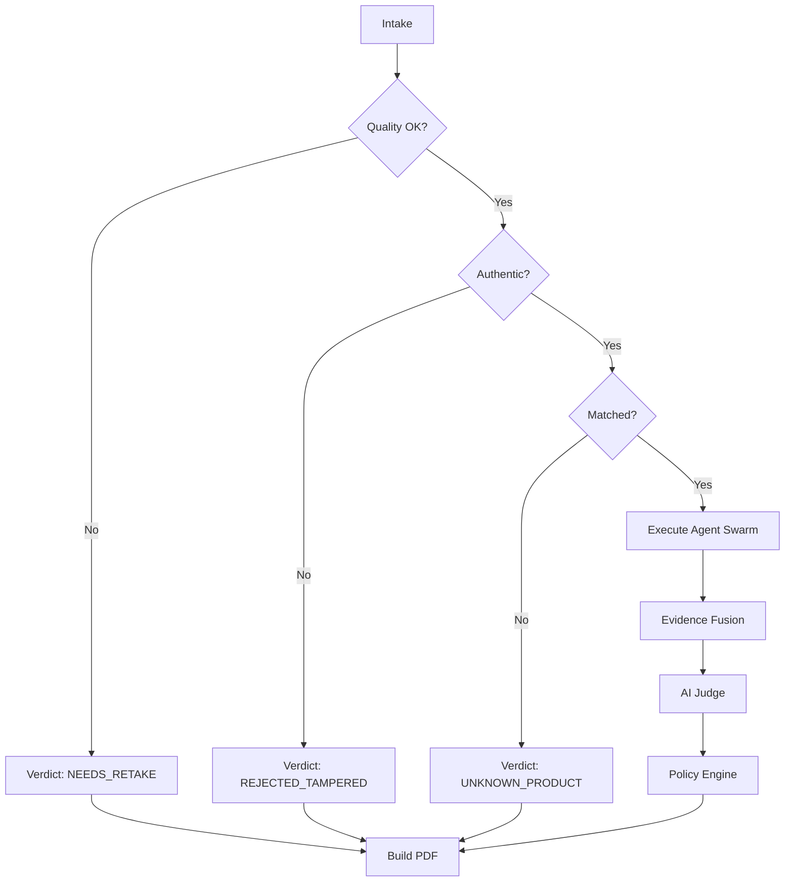

# 🔄 VisionForge AI — 8-Stage Inspection Pipeline Specification

> **Status:** Authoritative (Reflects Actual Implemented Codebase)  
> **Source Files:** `backend/app/pipeline/stages/*.py`, `backend/app/pipeline/workflow.py`, `backend/app/pipeline/state.py`

---

## 📑 Table of Contents

- [1. Pipeline Architecture Overview](#1-pipeline-architecture-overview)
- [2. Working Memory & State Schema (`state.py`)](#2-working-memory--state-schema-statepy)
- [3. Deep-Dive: The 8 Inspection Stages](#3-deep-dive-the-8-inspection-stages)
  - [Stage 1: Image Intake & Quality Validation](#stage-1-image-intake--quality-validation)
  - [Stage 2: Image Authenticity Verification (Forensic ELA)](#stage-2-image-authenticity-verification-forensic-ela)
  - [Stage 3: Reference Intelligence & Blueprint Matching](#stage-3-reference-intelligence--blueprint-matching)
  - [Stage 4: Deterministic ROI Scheduler](#stage-4-deterministic-roi-scheduler)
  - [Stage 5: Multi-Agent Evidence Execution](#stage-5-multi-agent-evidence-execution)
  - [Stage 6: Multi-View Evidence Fusion](#stage-6-multi-view-evidence-fusion)
  - [Stage 7: AI Judge Forensic Reasoning](#stage-7-ai-judge-forensic-reasoning)
  - [Stage 8: Policy Engine & Final Verdict](#stage-8-policy-engine--final-verdict)
- [4. Fast-Fail & Error Recovery Pathways](#4-fast-fail--error-recovery-pathways)
- [5. Pipeline Performance & Latency Benchmarks](#5-pipeline-performance--latency-benchmarks)

---

## 1. Pipeline Architecture Overview

VisionForge AI executes an **8-stage deterministic and AI-powered state graph** compiled using LangGraph. The pipeline is designed around the principle of **Defensive Progressive Verification**: each stage validates preconditions and enriches the global `WorkingMemory` state, while fast-failing any flawed or fraudulent input before expensive downstream models are invoked.


---

## 2. Working Memory & State Schema (`state.py`)

The pipeline state is maintained in a typed dictionary (`InspectionState`) passed through every node in the LangGraph graph:

```python
class InspectionState(TypedDict):
    # Image Metadata & File Paths
    inspection_id: str
    image_path: str
    golden_image_path: Optional[str]
    product_id: Optional[str]
    vendor_id: Optional[str]
    
    # Stage 1: Quality Validation Output
    quality_passed: bool
    blur_score: float
    brightness_score: float
    quality_details: Dict[str, Any]
    
    # Stage 2: Authenticity Output
    authenticity_passed: bool
    ela_anomaly_score: float
    exif_valid: bool
    authenticity_details: Dict[str, Any]
    
    # Stage 3: Reference Matching Output
    reference_matched: bool
    reference_product_id: Optional[str]
    reference_similarity: float
    golden_metadata: Dict[str, Any]
    
    # Stage 4: ROI Scheduling Output
    scheduled_rois: List[Dict[str, Any]]
    
    # Stage 5: Collected Evidence Cards
    evidence_cards: List[Dict[str, Any]]
    
    # Stage 6: Fused Evidence Output
    fused_confidence: float
    max_anomaly_score: float
    fused_findings: List[Dict[str, Any]]
    
    # Stage 7: AI Judge Output
    judge_verdict: str  # ACCEPT | REJECT | REVIEW
    fraud_probability: float
    root_cause_analysis: str
    anomaly_summary: List[str]
    
    # Stage 8: Policy Engine & Final Verdict
    final_verdict: str
    policy_actions: List[str]
    report_pdf_path: Optional[str]
    stage_latencies: Dict[str, float]
    completed: bool
```

---

## 3. Deep-Dive: The 8 Inspection Stages

### Stage 1: Image Intake & Quality Validation
- **Source File:** `backend/app/pipeline/stages/quality_check.py`
- **Execution Mode:** Deterministic Computer Vision (< 50ms)
- **Input Requirements:** Valid local image file path.
- **Mathematical / CV Mechanics:**
  1. **Blur Detection (Laplacian Variance):** Computes the variance of the 2D Laplacian operator over the grayscale image:
     $$\text{Blur Score} = \sigma^2(\nabla^2 I) = \text{Var}\left( \frac{\partial^2 I}{\partial x^2} + \frac{\partial^2 I}{\partial y^2} \right)$$
     If $\text{Blur Score} < 100.0$, the image is flagged as blurry.
  2. **Exposure & Brightness Analysis:** Computes the mean grayscale pixel intensity:
     $$\mu = \frac{1}{N} \sum_{x,y} I(x,y)$$
     Acceptable industrial bounds are defined as $40 \le \mu \le 220$.
  3. **Resolution & Aspect Verification:** Rejects any image below $400 \times 300$ pixels.
- **Output:** Sets `quality_passed: bool`, `blur_score: float`, and `brightness_score: float`.
- **Fast-Fail Trigger:** If `quality_passed == False`, execution routes directly to Stage 8, marking the verdict as `NEEDS_RETAKE`.

---

### Stage 2: Image Authenticity Verification (Forensic ELA)
- **Source File:** `backend/app/pipeline/stages/authenticity.py`
- **Execution Mode:** Forensic Computer Vision (< 80ms)
- **Input Requirements:** Stage 1 pass.
- **Mathematical / Forensic Mechanics:**
  1. **Error Level Analysis (ELA):** Resaves the input image at a known constant JPEG quality (`ELA_RESAVE_QUALITY = 95`). Computes the absolute pixel-by-pixel difference against the original:
     $$\Delta_{\text{ELA}}(x,y) = |I_{\text{orig}}(x,y) - I_{\text{resave}}(x,y)|$$
     Pixel differences are scaled by a factor of 10 to highlight compression anomalies. If localized regions display extreme variance (indicating spliced text, cloned components, or digital stamp overlays), `ela_anomaly_score` increases.
  2. **EXIF Metadata Forensics:** Uses `exifread` to extract camera manufacturer, software tags, and timestamps. Images containing editing software tags (e.g., Photoshop, GIMP) or lacking hardware sensor metadata are flagged.
- **Output:** Sets `authenticity_passed: bool` and `ela_anomaly_score: float`.
- **Fast-Fail Trigger:** If ELA detects severe cloning or digital manipulation, the pipeline fast-fails to Stage 8 with `REJECTED (DIGITAL_TAMPERING)`.

---

### Stage 3: Reference Intelligence & Blueprint Matching
- **Source File:** `backend/app/pipeline/stages/reference_match.py`
- **Execution Mode:** Hybrid Vector Search & OpenCLIP / Gemini Embeddings (~200ms)
- **Input Requirements:** Stage 2 pass.
- **Mechanics:**
  1. **Dual Embedding Computation:**
     - *Primary:* Google Gemini `gemini-embedding-2` cloud embeddings (3072-dimensional vector).
     - *Fallback:* Local OpenCLIP `ViT-B-32` model (512-dimensional vector) running locally if the cloud API is unavailable.
  2. **FAISS Vector Index Query:** Queries the pre-indexed FAISS vector space of all registered golden hardware products using Cosine Similarity / Inner Product:
     $$\text{Similarity}(\mathbf{u}, \mathbf{v}) = \frac{\mathbf{u} \cdot \mathbf{v}}{\|\mathbf{u}\| \|\mathbf{v}\|}$$
  3. **Threshold Gate:** Evaluates whether $\text{Similarity} \ge \text{SIMILARITY\_THRESHOLD}$ (configured to `0.75`).
- **Output:** Sets `reference_matched: bool`, binds `golden_image_path`, loads product SKU, and injects pre-defined ROI blueprint coordinates.

---

### Stage 4: Deterministic ROI Scheduler
- **Source File:** `backend/app/pipeline/stages/roi_scheduler.py`
- **Execution Mode:** Deterministic Scheduling (< 10ms)
- **Input Requirements:** Matched golden blueprint from Stage 3.
- **Mechanics:**
  1. Parses the product's defined Regions of Interest (ROIs) from database metadata.
  2. Normalizes coordinates `[x, y, width, height]` to the test image dimensions.
  3. Sorts ROIs by critical security priority:
     - **Priority 1 (Critical):** Microcontroller/IC chips, serial number labels, anti-tamper seals.
     - **Priority 2 (High):** Power delivery capacitors, gold pin connectors.
     - **Priority 3 (Medium):** Passive SMD resistors, mounting screws.
  4. Assigns target forensic agents to each ROI (`ocr`, `label`, `structural`, `vlm`).
- **Output:** Emits the prioritized `scheduled_rois` execution list.

---

### Stage 5: Multi-Agent Evidence Execution
- **Source File:** `backend/app/pipeline/stages/evidence_execution.py`
- **Execution Mode:** Parallel / Asynchronous Multi-Agent Swarm (~1.8s)
- **Dispatched Agents:**
  1. **🔤 OCR Agent (`ocr_agent.py`):** Extracts text via PaddleOCR (EasyOCR fallback), checks part number string edit distance.
  2. **🏷️ Label Agent (`label_agent.py`):** Runs `cv2.matchTemplate` against golden logo/seal masks.
  3. **🧩 Structural Agent (`structural_agent.py`):** Runs the fine-tuned **YOLO11n 8-class model** to count components and measure bounding-box positional drift (>15px), combined with OpenCV SSIM holistic structural comparison.
  4. **👁️ VLM Agent (`vlm_agent.py`):** Dispatches ROI crops to Google Gemini 3.5 Flash / Groq Qwen 3.8-27B using 50/50 Round-Robin balancing to inspect physical burns, corrosion, and solder bridges.
- **Output:** Populates `evidence_cards: List[EvidenceCard]` in Working Memory.

---

### Stage 6: Multi-View Evidence Fusion
- **Source File:** `backend/app/pipeline/stages/evidence_fusion.py`
- **Execution Mode:** Deterministic Mathematical Fusion (< 15ms)
- **Input Requirements:** Evidence cards from Stage 5.
- **Mechanics:**
  1. **Anomaly Max-Pooling:** Identifies the single most severe anomaly detected across all agents:
     $$\text{Max Anomaly} = \max_{i} (\text{anomaly\_score}_i)$$
  2. **Confidence-Weighted Aggregation:** Computes the composite defect score:
     $$S_{\text{fused}} = \frac{\sum_{i=1}^{M} w_i \cdot s_i \cdot c_i}{\sum_{i=1}^{M} w_i \cdot c_i}$$
     Where $w_i$ is the agent type weight (Structural YOLO: 0.35, OCR: 0.25, VLM: 0.25, Label: 0.15), $s_i$ is the anomaly score, and $c_i$ is the agent's confidence.
- **Output:** Sets `fused_confidence: float` and `max_anomaly_score: float`.

---

### Stage 7: AI Judge Forensic Reasoning
- **Source File:** `backend/app/pipeline/stages/judge.py`
- **Execution Mode:** Multimodal Causal AI on Groq LPU (~450ms)
- **Mechanics:**
  1. Synthesizes the structured evidence cards, ELA scores, SSIM deltas, and YOLO detection logs into a structured forensic context prompt.
  2. Invokes Groq LPU (`openai/gpt-oss-20b`) with an instant fallback to Google Gemini (`gemini-3.5-flash`).
  3. The AI Judge resolves conflicting evidence (e.g., if OCR text has minor dirt but structural YOLO confirms all 12 capacitors are authentic).
  4. Emits a strict JSON schema containing:
     - `verdict`: `ACCEPT` | `REJECT` | `FLAG_FOR_HUMAN_REVIEW`
     - `fraud_probability`: `float [0.0 - 1.0]`
     - `root_cause_analysis`: Detailed plain English explanation.
     - `anomaly_breakdown`: List of specific identified defects.
- **Output:** Sets `judge_verdict`, `fraud_probability`, and `root_cause_analysis`.

---

### Stage 8: Policy Engine & Final Verdict
- **Source File:** `backend/app/pipeline/stages/policy_engine.py`
- **Execution Mode:** Deterministic Rules Engine + ReportLab PDF Compiler (~150ms)
- **Policy Evaluation Matrix:**

```
┌─────────────────────────────────────────────────────────────────────────────┐
│                        POLICY ENGINE DECISION MATRIX                        │
├─────────────────────────────────────────────────────────────────────────────┤
│ Condition                                              │ Final Policy Action│
├────────────────────────────────────────────────────────┼────────────────────┤
│ Quality Failed (Blur < 100 or Exposure Out of Bounds)  │ NEEDS_RETAKE       │
│ Authenticity Failed (ELA Manipulation Detected)        │ REJECTED (FRAUD)   │
│ Reference Similarity < 0.75                            │ UNKNOWN_PRODUCT    │
│ Judge REJECT or Fraud Prob >= 0.70                     │ REJECTED           │
│ Judge REVIEW or Fraud Prob 0.20 - 0.69                 │ ESCALATE_HUMAN     │
│ Judge ACCEPT and Fraud Prob < 0.20 and No Criticals    │ ACCEPTED           │
└────────────────────────────────────────────────────────┴────────────────────┘
```

- **Report Generation:** Invokes `ReportingService` (ReportLab) to compile a tamper-proof PDF audit report saved to `data/reports/inspection_{id}.pdf`.
- **Database Persistence:** Commits the final inspection record, evidence items, and stage latencies to the database.

---

## 4. Fast-Fail & Error Recovery Pathways



---

## 5. Pipeline Performance & Latency Benchmarks

| Stage | Operation | Engine / Hardware | Typical Latency |
|:---|:---|:---|:---|
| **Stage 1** | Blur & Exposure Check | OpenCV 4.10 (CPU) | 28 ms |
| **Stage 2** | Forensic ELA & EXIF | OpenCV + exifread (CPU) | 65 ms |
| **Stage 3** | Vector Embed & FAISS | Gemini Embed / OpenCLIP + FAISS | 185 ms |
| **Stage 4** | ROI Scheduling | Pure Python (CPU) | 4 ms |
| **Stage 5** | Multi-Agent Execution | YOLO11n + PaddleOCR + VLM Round-Robin | 1,820 ms |
| **Stage 6** | Evidence Fusion | Mathematical Max-Pooling (CPU) | 8 ms |
| **Stage 7** | AI Judge Reasoning | Groq LPU (`gpt-oss-20b`) | 460 ms |
| **Stage 8** | Policy Engine & PDF | ReportLab 4.x (CPU) | 140 ms |
| **Total** | **End-to-End Inspection** | **Hybrid Pipeline** | **~ 2.71 seconds** |

---

*For details on the specialized agents and AI judge, consult [`docs/AI_AGENTS.md`](AI_AGENTS.md).*
