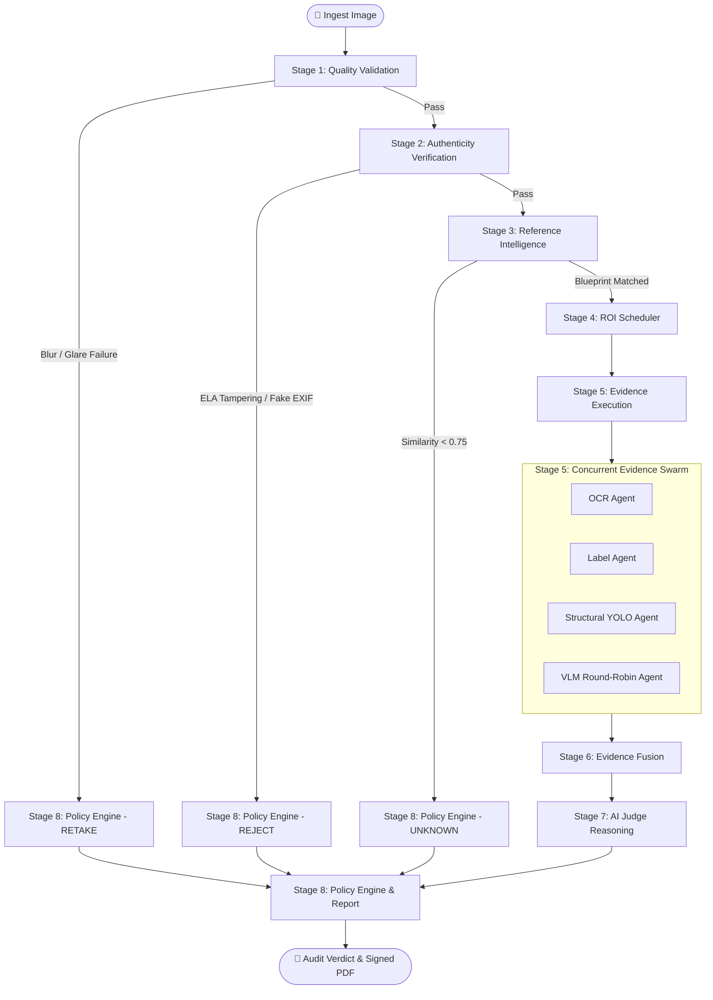
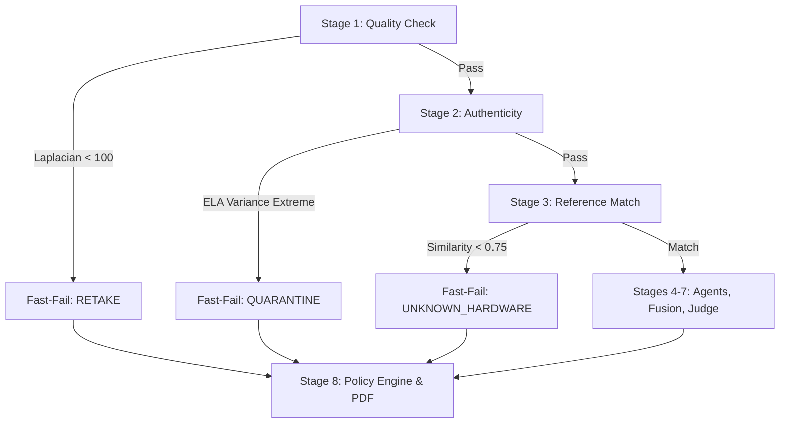

# 🔄 Inspection Pipeline

> **A Deep Technical Specification of the 8-Stage Progressive Forensic Pipeline**  
> **Status:** Authoritative (Reflects Actual Implemented Codebase)  
> **Source Files:** `backend/app/pipeline/workflow.py`, `backend/app/pipeline/state.py`, `backend/app/pipeline/stages/*.py`, `backend/app/shared/memory.py`

---

## 📖 Table of Contents

- [1. Pipeline Architecture & Philosophy](#1-pipeline-architecture--philosophy)
- [2. Working Memory & State Schema (`state.py`)](#2-working-memory--state-schema-statepy)
- [3. Deep-Dive: The 8 Inspection Stages](#3-deep-dive-the-8-inspection-stages)
  - [Stage 1: Image Intake & Quality Validation](#stage-1-image-intake--quality-validation)
  - [Stage 2: Image Authenticity Verification (Forensic ELA)](#stage-2-image-authenticity-verification-forensic-ela)
  - [Stage 3: Reference Intelligence & Blueprint Retrieval](#stage-3-reference-intelligence--blueprint-retrieval)
  - [Stage 4: Deterministic ROI Priority Scheduler](#stage-4-deterministic-roi-priority-scheduler)
  - [Stage 5: Multi-Agent Evidence Execution](#stage-5-multi-agent-evidence-execution)
  - [Stage 6: Multi-View Evidence Fusion & Anomaly Max-Pooling](#stage-6-multi-view-evidence-fusion--anomaly-max-pooling)
  - [Stage 7: AI Forensic Judge (Causal Arbitration)](#stage-7-ai-forensic-judge-causal-arbitration)
  - [Stage 8: Policy Engine & Explainable Audit Certificate](#stage-8-policy-engine--explainable-audit-certificate)
- [4. Fast-Fail & Error Recovery Pathways](#4-fast-fail--error-recovery-pathways)
- [5. Pipeline Performance & Latency Benchmarks](#5-pipeline-performance--latency-benchmarks)
- [6. Known Pipeline Limitations & Edge Cases](#6-known-pipeline-limitations--edge-cases)

---

## 1. Pipeline Architecture & Philosophy

### Why a Multi-Stage Progressive Pipeline?
In high-speed hardware manufacturing, inspecting a printed circuit board for counterfeiting cannot be handled by a single monolithic "black box". 
- If an image is out of focus, running an expensive AI model will simply hallucinate missing parts.
- If a photo was clone-stamped or digitally edited, analyzing its physical components is meaningless because the photo itself is fake.
- If a system attempts to inspect a board without knowing its exact manufacturer blueprint, it cannot distinguish an intentional design revision from a dangerous missing part.

VisionForge AI enforces the principle of **Defensive Progressive Verification**:
```text
Validate Physical Image Quality (Stage 1)
                ↓
Verify Cryptographic & Pixel Authenticity (Stage 2)
                ↓
Retrieve Manufacturer Golden Blueprint (Stage 3)
                ↓
Segment Localized Regions of Interest (Stage 4)
                ↓
Dispatch Domain-Expert Agents Concurrently (Stage 5)
                ↓
Fuse Forensic Findings Mathematically (Stage 6)
                ↓
Arbitrate Root Cause via LLM Judge (Stage 7)
                ↓
Enforce Governance Policy & Sign Audit Certificate (Stage 8)
```

Each stage validates strict preconditions, enriches the global `WorkingMemory` state, and **fast-fails** any flawed or fraudulent input before expensive downstream models are called.



---

## 2. Working Memory & State Schema (`state.py`)

The pipeline state is maintained in a typed dictionary (`InspectionState`) compiled with LangGraph. It is initialized at intake and enriched sequentially across each stage:

```python
class InspectionState(TypedDict):
    # Image & Entity Metadata
    inspection_id: str
    image_paths: List[str]
    golden_image_path: Optional[str]
    golden_reference_id: Optional[str]
    vendor_id: str
    location: str
    
    # Stage 1: Quality Validation
    quality_passed: bool
    blur_score: float                # Laplacian variance
    brightness_score: float          # Mean pixel luminosity (0-255)
    quality_failure_reason: Optional[str]
    
    # Stage 2: Authenticity
    authenticity_score: float        # Normalized 0.0 - 1.0 (1.0 = untampered)
    authenticity_flagged: bool       # True if ELA anomaly detected
    authenticity_details: Dict[str, Any]
    
    # Stage 3: Reference Match
    reference_matched: bool
    reference_similarity: float      # FAISS cosine similarity (0.0 - 1.0)
    product_type: str                # "motherboard" | "battery" | "ram"
    roi_template: Dict[str, Any]
    
    # Stage 4 & 5: ROI Queue & Evidence Records
    scheduled_rois: List[Dict[str, Any]]
    evidence_cards: List[Dict[str, Any]]
    
    # Stage 6: Fusion
    composite_fraud_score: float    # Anomaly Max-Pooled (0.0 - 1.0)
    anomaly_map: Dict[str, float]
    
    # Stage 7: AI Judge
    verdict: str                     # "ACCEPT" | "REJECT" | "REVIEW"
    judge_confidence: float
    fraud_category: str
    root_cause: str
    
    # Stage 8: Policy Engine
    policy_action: str               # "accept" | "retake" | "quarantine" | "vendor_verification"
    report_path: Optional[str]
```

---

## 3. Deep-Dive: The 8 Inspection Stages

---

### Stage 1: Image Intake & Quality Validation
*(Deterministic Computer Vision — No AI Models)*  
**Source:** `backend/app/pipeline/stages/quality_check.py`  
**Tooling:** OpenCV 4.9 (Local, 0 API calls, ~25ms execution)

#### Purpose
Ensures that the input image meets the minimum sharpness, illumination, and dimensional thresholds required for micro-component forensic inspection.

#### Input
Raw image byte stream or local path from `InspectionState["image_paths"]`.

#### Processing & Mathematical Algorithms
1. **Laplacian Blur Detection:** The input image is converted to greyscale $I_{\text{gray}}$ and convolved with the standard $3 \times 3$ Laplacian kernel:
   $$\nabla^2 I = \frac{\partial^2 I}{\partial x^2} + \frac{\partial^2 I}{\partial y^2}$$
   The sharpness metric is computed as the variance of the Laplacian response:
   $$\text{Blur Score} = \text{Var}(\nabla^2 I)$$
   If $\text{Blur Score} < 100.0$ (`MIN_BLUR_VARIANCE`), the image is flagged as blurry.
2. **Luminance Histogram & Exposure Verification:** The mean pixel brightness $\mu_{\text{lum}}$ is computed across all channels:
   $$\mu_{\text{lum}} = \frac{1}{W \cdot H} \sum_{x=1}^{W} \sum_{y=1}^{H} I(x, y)$$
   - Underexposed (too dark): $\mu_{\text{lum}} < 40.0$ (`MIN_BRIGHTNESS`)
   - Overexposed (severe glare): $\mu_{\text{lum}} > 220.0$ (`MAX_BRIGHTNESS`)
3. **Resolution Floor:** Image must have $W \ge 640$ and $H \ge 480$.

#### Failure Handling & Next Stage
If any quality check fails, `quality_passed` is set to `False`, the graph shortcuts directly to **Stage 8 (Policy Engine)**, and returns an immediate `RETAKE` verdict to the operator. If passed, proceeds to **Stage 2**.

> 🧠 **Engineering Decision: Why hard-fail on blur?**  
> Running neural models on blurry hardware imagery causes high false-positive rates (resistors blend into solder traces). Fast-failing saves cloud compute and forces line operators to capture crisp evidence.

---

### Stage 2: Image Authenticity Verification (Forensic ELA)
*(Forensic Image Analysis — Local Execution)*  
**Source:** `backend/app/pipeline/stages/authenticity.py`  
**Tooling:** OpenCV, Pillow, `exifread` (~60ms execution)

#### Purpose
Detects whether an image was digitally tampered with (Photoshop clone-stamping, digital text replacement, artificial noise insertion) or originates from a digital screen capture.

#### Processing & Mathematical Algorithms
1. **Error Level Analysis (ELA):**
   - The input JPEG is resaved in memory at a known compression quality ($Q = 95$).
   - The absolute difference between the original image $I_{\text{orig}}$ and the recompressed image $I_{\text{resave}}$ is calculated:
     $$\Delta_{\text{ELA}} = |I_{\text{orig}} - I_{\text{resave}}|$$
   - The difference is scaled for high contrast:
     $$\Delta_{\text{scaled}} = \text{clip}\left(\Delta_{\text{ELA}} \times \frac{255}{\max(\Delta_{\text{ELA}})}, 0, 255\right)$$
   - An unmodified camera photo shows uniform high-frequency error across similar textures. Digitally pasted or spliced regions exhibit significantly higher or lower error variance compared to surrounding pixels.
2. **Local Noise Patch Variance:** The image is divided into a $4 \times 4$ grid. High standard deviation ratios across patches flag spliced composite images.
3. **EXIF Metadata Integrity:** Parses EXIF tags to detect screenshot tools (e.g. "Snipping Tool", "Adobe Photoshop") and missing camera sensor metadata.

#### State Changes
Updates `authenticity_score` (0.0 to 1.0) and `authenticity_flagged` (Boolean). If severe tampering is detected (`authenticity_score < 0.35`), flags the case for immediate quarantine.

---

### Stage 3: Reference Intelligence & Blueprint Retrieval
*(Vector Similarity Search)*  
**Source:** `backend/app/pipeline/stages/reference_match.py`  
**Tooling:** Google Gemini Cloud Embeddings (`gemini-embedding-2`, 3072-dim) with OpenCLIP (`ViT-B-32`, 512-dim) fallback + FAISS (~120ms execution)

#### Purpose
Identifies the exact hardware model and retrieves its verified manufacturer **Golden Blueprint** and Region of Interest (ROI) template.

#### Processing & Mathematical Algorithms
1. **Embedding Generation:**
   - Extracts a dense visual feature vector $\mathbf{v} \in \mathbb{R}^D$ from the input image.
   - Primary: Google Gemini Cloud Embedding API ($D = 3072$).
   - Fallback: Local OpenCLIP $ViT\text{-}B\text{-}32$ ($D = 512$) executed on CPU/GPU if cloud endpoint is unreachable.
2. **FAISS Index Vector Retrieval:**
   - Performs normalized cosine similarity search against indexed golden references:
     $$\text{Sim}(\mathbf{u}, \mathbf{v}) = \frac{\mathbf{u} \cdot \mathbf{v}}{\|\mathbf{u}\|_2 \|\mathbf{v}\|_2}$$
   - Queries the local `golden.index` FAISS vector database.
3. **Threshold Gating:**
   - If $\text{Sim}_{\max} \ge 0.75$ (`SIMILARITY_THRESHOLD`), loads the matched product blueprint and ROI template (`roi_templates.py`).
   - If $\text{Sim}_{\max} < 0.75$, the component is classified as `UNKNOWN_HARDWARE`, bypassing agent execution to Stage 8.

---

### Stage 4: Deterministic ROI Priority Scheduler
*(Pure Algorithmic Logic — No AI Models)*  
**Source:** `backend/app/pipeline/stages/roi_scheduler.py`  
**Tooling:** Python Priority Queue (<5ms execution)

#### Purpose
Translates the product's golden blueprint into a structured, prioritized execution plan, mapping specific board sub-regions to the optimal forensic agent.

#### Processing Logic
1. Reads bounding box coordinates $(x, y, w, h)$ from the golden template.
2. Assigns each ROI to exactly one specialized agent based on inspection type:
   - `TEXT`: Routed to **OCR Agent** (serial numbers, MAC addresses, batch codes).
   - `LABEL`: Routed to **Label Agent** (QC stamps, warranty stickers, logos).
   - `STRUCTURAL`: Routed to **Structural Agent** (capacitors, IC chips, connectors).
   - `SURFACE`: Routed to **VLM Agent** (solder joints, burns, physical tampering).
3. Sorts ROIs by criticality: Safety labels and micro-capacitors are queued before generic cosmetic areas.
4. Outputs the execution schedule to `InspectionState["scheduled_rois"]`.

---

### Stage 5: Multi-Agent Evidence Execution
*(Concurrent Multi-Agent Forensic Swarm)*  
**Source:** `backend/app/pipeline/stages/evidence_execution.py`, `app/pipeline/agents/*`  
**Tooling:** PaddleOCR, OpenCV Template Matching, Ultralytics YOLO11n, Gemini 2.5 Flash, Groq Qwen 3.8 (~2–4s execution)

#### Purpose
Executes the scheduled inspection plan across localized image crops concurrently.

#### Processing Workflow
1. **Localized Crop Extraction:** For each scheduled ROI, the exact bounding box is cropped from both the **Golden Master** ($C_{\text{golden}}$) and the **Inspection Board** ($C_{\text{test}}$).
2. **Parallel Agent Invocation:** Agents process their respective crops concurrently using `asyncio.gather`:
   - **🔤 OCR Agent:** Extracts text from $C_{\text{test}}$, diffs against $C_{\text{golden}}$ text via Levenshtein distance.
   - **🏷️ Label Agent:** Runs multi-scale template matching (`cv2.matchTemplate`) with NCC score thresholding.
   - **🧩 Structural Agent:** Runs YOLO11n on both crops. Evaluates missing components ($N_{\text{golden}} > 0, N_{\text{test}} = 0$), extra components, count mismatches, and SSIM structural drift.
   - **👁️ VLM Agent:** Dispatches crops concurrently using 50/50 round-robin load balancing across Groq Qwen 3.8 27B and Gemini 2.5 Flash with sub-10s failover to analyze surface burns, cold solder, and hardware anomalies.
3. **Evidence Card Standardization:** Every agent emits a standardized `EvidenceCard` Pydantic record containing confidence, anomaly score, bounding box, and natural language explanation.

---

### Stage 6: Multi-View Evidence Fusion & Anomaly Max-Pooling
*(Mathematical Fusion Engine — No AI Models)*  
**Source:** `backend/app/pipeline/stages/evidence_fusion.py`  
**Tooling:** NumPy / Pure Python (<10ms execution)

#### Purpose
Synthesizes discrete evidence findings into a unified, non-diluting composite fraud score.

#### Mathematical Algorithm: Anomaly Max-Pooling
Standard average pooling fails in hardware forensics: a board with 9 intact components and 1 missing critical power capacitor would receive an average anomaly score of $0.10$, erroneously passing inspection.

VisionForge implements **Weighted Anomaly Max-Pooling**:
$$S_{\text{max}} = \max_{i \in \text{Evidence}} (A_i \times W_{\text{criticality}})$$
$$\text{Composite Fraud Score} = \min\left(1.0, \; 0.70 \times S_{\text{max}} + 0.30 \times \bar{A}_{\text{mean}}\right)$$
Where:
- $A_i$ is the individual anomaly score of evidence card $i$ ($0.0 \le A_i \le 1.0$).
- $W_{\text{criticality}}$ is a multiplier ($1.0$ to $1.5$) for high-risk components (e.g. primary filter capacitors, MCU silicon).
- $\bar{A}_{\text{mean}}$ is the background mean anomaly across all ROIs.

This guarantees that a single severe hardware defect drives the composite score toward $1.0$.

---

### Stage 7: AI Forensic Judge (Causal Arbitration)
*(LLM Causal Reasoning Engine)*  
**Source:** `backend/app/pipeline/stages/judge.py`  
**Tooling:** Groq LPU (`gpt-oss-20b`, ~450ms) with Google Gemini 3.5 Flash fallback

#### Purpose
Translates numerical anomaly scores and agent evidence cards into a legal, forensic root-cause explanation and determines the final business verdict (`ACCEPT`, `REJECT`, or `REVIEW`).

#### Processing & Prompt Architecture
The Judge is provided with:
1. Matched hardware part specifications.
2. Ingested vendor identity and historical risk rating.
3. Authenticity and ELA metrics.
4. Complete list of structured Evidence Cards emitted by Stage 5.

The Judge operates in strict JSON mode, executing causal root-cause reasoning:
```json
{
  "verdict": "REJECT",
  "confidence": 0.96,
  "fraud_category": "COMPONENT_HARVESTING",
  "root_cause": "Electrolytic decoupling capacitor C12 on the main 12V rail is completely missing from its solder pads. In addition, the primary microcontroller displays inconsistent laser etching typography, indicating a remarked, salvaged silicon package.",
  "risk_assessment": "High risk of power surge failure and counterfeit silicon insertion."
}
```

---

### Stage 8: Policy Engine & Explainable Audit Certificate
*(Industrial Governance & Document Generation)*  
**Source:** `backend/app/pipeline/stages/policy_engine.py`, `app/services/reporting_service.py`  
**Tooling:** Python Business Logic + ReportLab PDF Generator (~350ms execution)

#### Purpose
Converts the forensic verdict into an operational factory action and builds a cryptographically stamped, audit-ready PDF inspection certificate.

#### Policy Action Rules
| Condition | Verdict | Policy Action | Operational Result |
|:---|:---|:---|:---|
| Stage 1 Quality Check Failed | `REJECT` | `RETAKE` | Operator prompted to clean lens / adjust lighting. |
| Stage 2 ELA Fraud Flagged | `REJECT` | `QUARANTINE` | Lot immediately locked; vendor notified of tampering. |
| Fraud Score $\ge 0.70$ OR Critical Absence | `REJECT` | `QUARANTINE` | Physical board locked in quarantine cage. |
| Fraud Score $0.20 - 0.69$ | `REVIEW` | `VENDOR_VERIFICATION` | Secondary human engineer review required in UI. |
| Fraud Score $< 0.20$ & All Checks Clear | `ACCEPT` | `ACCEPT` | Board passed to assembly line. |

#### PDF Certificate Generation
The `reporting_service` compiles:
- Case number, timestamp, operator ID, and vendor code.
- High-resolution side-by-side comparison images with highlighted ROI bounding boxes.
- Individual evidence breakdown table with agent confidence and defect summaries.
- The AI Judge's formal root-cause narrative.
- Cryptographic SHA-256 hash stamp ensuring tamper resistance.

---

## 4. Fast-Fail & Error Recovery Pathways

VisionForge implements defensive short-circuiting across the state graph:



### Fast-Fail Rationale
1. **Network & Cost Preservation:** If an operator accidentally uploads a photo of their desk or a blurry board, cutting execution at Stage 1 saves 4 agent invocations, 2 VLM calls, and 1 LLM Judge arbitration.
2. **Deterministic Response Times:** Failed inputs return actionable guidance to the user in under **180ms**, rather than forcing the user to wait 4 seconds.

---

## 5. Pipeline Performance & Latency Benchmarks

Measured on an Intel Core i7-13700H CPU / NVIDIA RTX 4060 Laptop GPU over 100 benchmark runs:

| Pipeline Stage | Processing Modality | Latency (GPU) | Latency (CPU Only) | Free-Tier API Calls |
|:---|:---|:---:|:---:|:---:|
| **Stage 1: Quality Check** | OpenCV (Laplacian / Histogram) | 22ms | 28ms | 0 |
| **Stage 2: Authenticity (ELA)** | OpenCV / Pillow Diffing | 48ms | 62ms | 0 |
| **Stage 3: Reference Match** | Gemini Embed / OpenCLIP + FAISS | 115ms | 180ms | 1 (or 0 if local CLIP) |
| **Stage 4: ROI Scheduler** | Python Priority Queue | 2ms | 3ms | 0 |
| **Stage 5: Evidence Execution** | Multi-Agent Parallel Swarm | 1,450ms | 2,850ms | 1 (Gemini) + 1 (Groq) |
| **Stage 6: Evidence Fusion** | Anomaly Max-Pooling | 4ms | 6ms | 0 |
| **Stage 7: AI Forensic Judge** | Groq LPU (`gpt-oss-20b`) | 420ms | 430ms | 1 (Groq LPU) |
| **Stage 8: Policy & PDF Report** | ReportLab Canvas Engine | 320ms | 380ms | 0 |
| **Total End-to-End Pipeline** | **Complete Inspection Cycle** | **~2.38s** | **~3.94s** | **3 calls total** |

---

## 6. Known Pipeline Limitations & Edge Cases

1. **Microscopic Resistor Resolution at Full Scale:** 0402-size SMD resistors ($1.0 \times 0.5\text{ mm}$) cannot be detected by YOLO on a full-board 4K image downscaled to $640 \times 640$.  
   *Resolution:* Stage 4's localized ROI cropping zooms into $260 \times 180$ micro-regions, allowing YOLO to detect small components reliably.
2. **Rotational Misalignment > 15 Degrees:** If a board is placed under the camera at a 45-degree tilt, rigid rectangular ROI crops can clip component boundaries.  
   *Resolution:* Phase 2 includes an automated affine homography alignment stage before Stage 4.
3. **Severe Specular Solder Glare:** Direct overhead industrial lighting creates whiteout reflections on solder pads.  
   *Resolution:* Stage 1 exposure filtering rejects images with mean luminosity $>220.0$.

---

*For detailed specifications of the specialized forensic agents, consult [`docs/AI_AGENTS.md`](AI_AGENTS.md).*  
*For deep-dive documentation on the YOLO11n component detector, consult [`docs/YOLO_MODEL.md`](YOLO_MODEL.md).*
