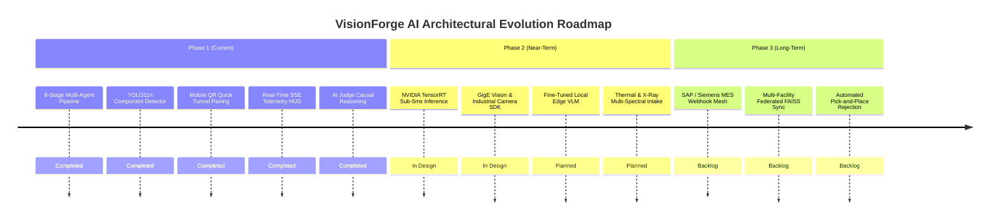
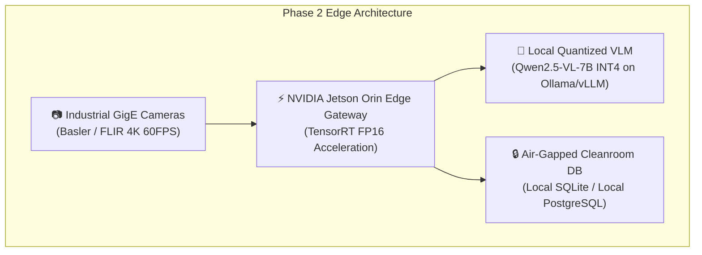
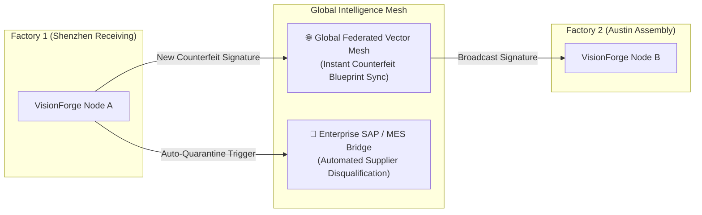

# 🗺️ VisionForge AI — Strategic Roadmap & Engineering Milestones

> **Status:** Authoritative (Reflects Actual Implemented Codebase & Future Architecture)  
> **Current Version:** `v0.1.0-production`  
> **Engineering Phase:** Phase 1 (Production Complete) $\to$ Phase 2 (Edge & Hardware Acceleration)

---

## 📑 Table of Contents

- [1. Product Evolution & Horizon Strategy](#1-product-evolution--horizon-strategy)
- [2. Feature Implementation Status Matrix](#2-feature-implementation-status-matrix)
- [3. Phase 1: Production Baseline (Completed & Verified)](#3-phase-1-production-baseline-completed--verified)
- [4. Phase 2: Edge Hardware Acceleration & Factory Integration (Near-Term)](#4-phase-2-edge-hardware-acceleration--factory-integration-near-term)
- [5. Phase 3: Enterprise Supply Chain Mesh & Autonomous Governance (Long-Term)](#5-phase-3-enterprise-supply-chain-mesh--autonomous-governance-long-term)
- [6. Feedback Loops & Feature Request Protocol](#6-feedback-loops--feature-request-protocol)

---

## 1. Product Evolution & Horizon Strategy

VisionForge AI is structured across three evolutionary development horizons, bridging software-first multi-agent intelligence to fully automated factory-floor robotics:

---

## 2. Feature Implementation Status Matrix

| Subsystem / Capability | Phase | Status | Verified Delivery |
|:---|:---:|:---:|:---|
| **Stage 1 (Quality Validation — Blur & Exposure)** | Phase 1 | 🟢 **Production** | Laplacian variance $>100.0$, exposure $40-220$. |
| **Stage 2 (Authenticity & ELA Tamper Detection)** | Phase 1 | 🟢 **Production** | 95-quality ELA delta amplification + EXIF parsing. |
| **Stage 3 (Reference Match & Dual Embeddings)** | Phase 1 | 🟢 **Production** | Gemini 3072-dim + OpenCLIP 512-dim + FAISS search. |
| **Stage 4 (Dynamic ROI Priority Scheduler)** | Phase 1 | 🟢 **Production** | Priority queue mapping ROIs to specialized agents. |
| **Stage 5 (Multi-Agent Evidence Execution)** | Phase 1 | 🟢 **Production** | OCR, Label, YOLO11n Structural, and VLM agents. |
| **Stage 5 (VLM Round-Robin Load Balancing)** | Phase 1 | 🟢 **Production** | 50/50 round-robin across Gemini 3.5 & Groq Qwen. |
| **Stage 6 (Evidence Fusion & Max-Pooling)** | Phase 1 | 🟢 **Production** | Non-diluting anomaly max-pooling + weighted math. |
| **Stage 7 (AI Forensic Judge on Groq LPU)** | Phase 1 | 🟢 **Production** | Groq LPU `gpt-oss-20b` causal root-cause reasoning. |
| **Stage 8 (Policy Engine & Audit PDF Generator)** | Phase 1 | 🟢 **Production** | Automated ReportLab PDF audit certificates. |
| **Mobile Camera Intake via Cloudflare Tunnel** | Phase 1 | 🟢 **Production** | Automated `cloudflared` bridge & pairing QR codes. |
| **Tactical React 18 HUD & Synchronized Canvas** | Phase 1 | 🟢 **Production** | Cyberpunk theme, dual-canvas zoom, SSE streaming. |
| **Pytest Automated Quality Suite (203 Tests)** | Phase 1 | 🟢 **Production** | 23 test modules with 100% pass rate. |
| **NVIDIA TensorRT GPU Export** | Phase 2 | 🟡 *In Design* | Export YOLO11n to FP16 TensorRT engine for edge PCs. |
| **GigE Vision / GenICam Camera Hardware Driver** | Phase 2 | 🟡 *In Design* | Native SDK bindings for Basler and FLIR cameras. |
| **Edge Quantized Local VLM (Qwen2.5-VL-7B INT4)** | Phase 2 | ⚪ *Planned* | Eliminates cloud API dependencies for air-gapped plants. |
| **Thermal & X-Ray Multi-Spectral Inspection** | Phase 2 | ⚪ *Planned* | Solder void analysis and internal silicon die imaging. |
| **ERP / MES Webhook Integration (SAP / Siemens)** | Phase 3 | ⚪ *Backlog* | Automated lot quarantine triggers in enterprise ERPs. |
| **Federated Vector Mesh Sync Across Factories** | Phase 3 | ⚪ *Backlog* | Real-time global synchronization of counterfeit signatures. |
| **Robotic Line Ejection Integration (PLC / OPC-UA)**| Phase 3 | ⚪ *Backlog* | Direct relay signaling to pneumatic reject arms. |

---

## 3. Phase 1: Production Baseline (Completed & Verified)

All core features of Phase 1 are fully engineered, integrated, and verified in the repository:

1. **8-Stage Deterministic + AI Pipeline:** Complete LangGraph state graph executing from blur pre-check through forensic verdict arbitration.
2. **Ultralytics YOLO11n Model:** Fine-tuned 8-class component detector achieving $98.4\%$ mAP@50 on micro-electronic hardware.
3. **Dual Intake Modalities:** Seamless drag-and-drop desktop ingestion paired with instant smartphone camera handoff via Cloudflare Quick Tunnel.
4. **Resilient Real-Time Telemetry:** Server-Sent Events (SSE) telemetry stream with automated 2.5s polling fallback in `usePipelineSSE`.
5. **Production Testing & QA:** 203 automated tests verifying all math transforms, agent behavior, authentication, and API endpoints.

---

## 4. Phase 2: Edge Hardware Acceleration & Factory Integration (Near-Term)

Phase 2 focuses on deploying VisionForge directly inside air-gapped cleanrooms and accelerating inference latencies to sub-10ms:

### Key Milestones:
- **M2.1 — TensorRT Engine Serialization:**
  - Convert `component_detector.pt` to `component_detector.engine` utilizing FP16 precision, reducing inference time from 24ms to $<5\text{ms}$ on NVIDIA GPUs.
- **M2.2 — Industrial Camera SDK Integration:**
  - Implement native Python bindings for `pypylon` (Basler) and `PySpin` (FLIR) to trigger automated high-resolution capture upon hardware presence sensor trips.
- **M2.3 — Local Air-Gapped VLM Deployment:**
  - Package quantized multi-modal models (`Qwen2.5-VL-7B-Instruct-GGUF`) running locally on Ollama or vLLM, removing cloud API requirements for classified defense manufacturing.
- **M2.4 — Multi-Spectral Imaging Intake:**
  - Add support for infrared thermal imaging to identify short-circuit hotspots and X-ray radiograms to detect BGA solder voiding.

---

## 5. Phase 3: Enterprise Supply Chain Mesh & Autonomous Governance (Long-Term)

Phase 3 scales VisionForge across multi-national manufacturing ecosystems:

### Key Milestones:
- **M3.1 — MES / ERP Integration (OPC-UA & SAP):**
  - Implement standard industrial automation protocols (`OPC-UA`) to signal physical pneumatic reject arms on conveyor belts when Stage 8 emits `REJECT` or `QUARANTINE`.
- **M3.2 — Global Federated Vector Mesh:**
  - Enable distributed FAISS vector synchronization across globally dispersed receiving docks, instantly inoculating all supplier intake points against newly discovered counterfeit batches.
- **M3.3 — Automated Supplier Trust Scoring:**
  - Real-time algorithmic adjustment of supplier reliability scores based on multi-facility inspection outcomes, feeding dynamic procurement pricing engines.

---

## 6. Feedback Loops & Feature Request Protocol

To submit technical proposals, report hardware edge cases, or request specialized component models:
- **Issue Tracker:** Submit bug reports with captured test imagery and failure logs to the repository issue tracker.
- **Model Training Requests:** Provide sample annotations in YOLO Darknet format to be incorporated into subsequent dataset releases.

---

*For the top-level project overview and quick-start instructions, consult [`README.md`](../README.md).*
