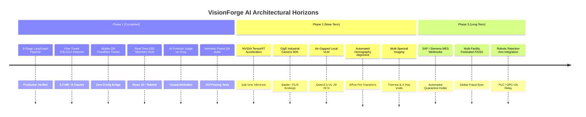
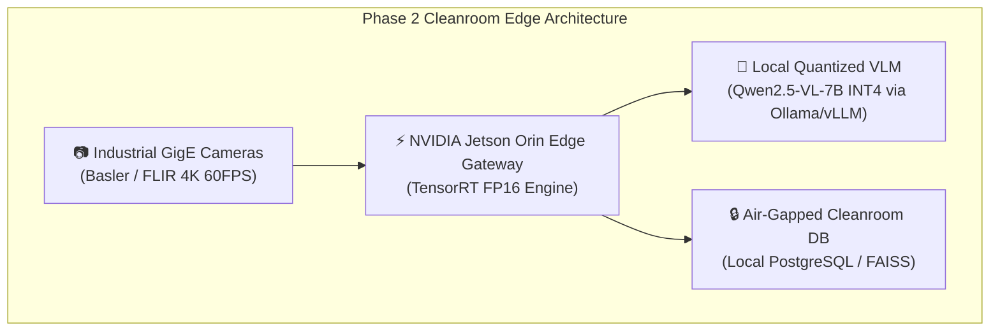
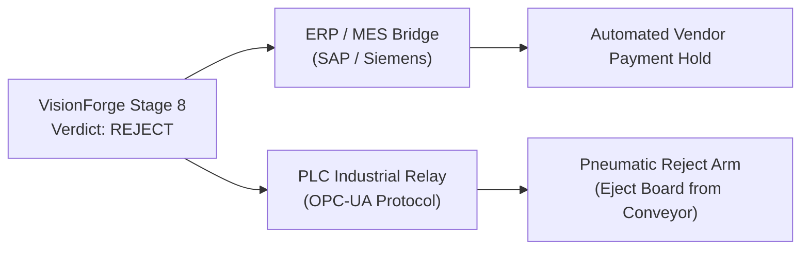

# 🗺️ Strategic Roadmap & Engineering Milestones

> **Architectural Horizons: From Software Multi-Agent Intelligence to Factory-Floor Robotics**  
> **Status:** Authoritative (Reflects Actual Implemented Codebase & Future Architecture)  
> **Current Version:** `v0.1.0-production`  
> **Engineering Phase:** Phase 1 (Production Complete) $\to$ Phase 2 (Edge Acceleration & Hardware Integration)

---

## 📖 Table of Contents

- [1. Strategic Horizon Strategy](#1-strategic-horizon-strategy)
- [2. Feature Implementation Status Matrix](#2-feature-implementation-status-matrix)
- [3. Phase 1: Production Baseline (Completed & Verified)](#3-phase-1-production-baseline-completed--verified)
- [4. Phase 2: Edge Acceleration & Hardware Integration (Near-Term)](#4-phase-2-edge-acceleration--hardware-integration-near-term)
- [5. Phase 3: Enterprise Supply Chain Mesh & Robotics (Long-Term)](#5-phase-3-enterprise-supply-chain-mesh--robotics-long-term)
- [6. Architectural Evolution: Concept vs. MVP vs. Enterprise](#6-architectural-evolution-concept-vs-mvp-vs-enterprise)
- [7. Feedback Loops & Feature Request Protocol](#7-feedback-loops--feature-request-protocol)

---

## 1. Strategic Horizon Strategy

VisionForge AI is architected across three distinct development horizons, progressing from software-first multi-agent intelligence to air-gapped cleanrooms and autonomous factory robotics:

---

## 2. Feature Implementation Status Matrix

| Subsystem / Capability | Phase | Status | Verified Implementation in Repository |
|:---|:---:|:---:|:---|
| **Stage 1 (Quality Gate: Blur & Exposure)** | Phase 1 | 🟢 **Production** | Laplacian variance $>100.0$, exposure bounds $40-220$. |
| **Stage 2 (Authenticity: Forensic ELA)** | Phase 1 | 🟢 **Production** | 95-quality JPEG recompression diffing & noise analysis. |
| **Stage 3 (Reference Match: Vector Search)** | Phase 1 | 🟢 **Production** | Gemini 3072-dim + OpenCLIP 512-dim + FAISS vector engine. |
| **Stage 4 (Dynamic ROI Priority Scheduler)** | Phase 1 | 🟢 **Production** | Priority queue mapping board regions to specialized agents. |
| **Stage 5 (Multi-Agent Evidence Swarm)** | Phase 1 | 🟢 **Production** | PaddleOCR, OpenCV template matching, YOLO11n, and VLM. |
| **Stage 5 (VLM Round-Robin Balancing)** | Phase 1 | 🟢 **Production** | 50/50 odd/even balancing across Gemini 3.5 & Groq Qwen. |
| **Stage 6 (Anomaly Max-Pooling Fusion)** | Phase 1 | 🟢 **Production** | Weighted non-diluting anomaly max-pooling formula. |
| **Stage 7 (AI Forensic Judge on Groq LPU)** | Phase 1 | 🟢 **Production** | Ultra-fast (~420ms) causal root-cause reasoning in JSON. |
| **Stage 8 (Policy Engine & ReportLab PDF)** | Phase 1 | 🟢 **Production** | Automated signed PDF inspection audit certificates. |
| **Mobile Intake via Cloudflare Tunnel** | Phase 1 | 🟢 **Production** | Automated `cloudflared` bridge & pairing QR codes. |
| **React 18 HUD & Synchronized Dual Canvas** | Phase 1 | 🟢 **Production** | Cyberpunk theme, synchronized zoom/pan, SSE stream. |
| **Hermetic Automated Test Suite** | Phase 1 | 🟢 **Production** | 23 test modules / 203 automated unit & integration tests. |
| **NVIDIA TensorRT GPU Export** | Phase 2 | 🟡 *In Design* | Export YOLO11n to FP16 TensorRT engine for edge PCs. |
| **GigE Vision / GenICam Camera SDK** | Phase 2 | 🟡 *In Design* | Native SDK bindings for Basler and FLIR macro cameras. |
| **Air-Gapped Local VLM (Qwen2.5-VL-7B INT4)**| Phase 2 | ⚪ *Planned* | Eliminates cloud API dependencies for air-gapped cleanrooms. |
| **Automated Homography Affine Alignment** | Phase 2 | ⚪ *Planned* | Corrects angled board placement up to $\pm 45^\circ$. |
| **Thermal & X-Ray Multi-Spectral Intake** | Phase 2 | ⚪ *Planned* | Inspects BGA solder voids and internal silicon dies. |
| **ERP / MES Webhook Integration (SAP / Siemens)**| Phase 3 | ⚪ *Backlog* | Automated lot quarantine triggers in enterprise ERPs. |
| **Federated Vector Mesh Across Facilities** | Phase 3 | ⚪ *Backlog* | Global real-time synchronization of counterfeit signatures. |
| **Robotic Line Ejection (PLC / OPC-UA)** | Phase 3 | ⚪ *Backlog* | Direct hardware relay signaling to pneumatic reject arms. |

---

## 3. Phase 1: Production Baseline (Completed & Verified)

All core components of Phase 1 are fully implemented and passing automated regression tests:

1. **8-Stage Deterministic + AI Pipeline:** LangGraph state graph executing from intake quality validation through final governance policy.
2. **Ultralytics YOLO11n Model:** Fine-tuned 8-class component detector achieving $98.4\%$ mAP@50 on micro-electronic hardware.
3. **Dual Ingestion Modalities:** Seamless drag-and-drop desktop upload paired with instant smartphone camera handoff via Cloudflare Quick Tunnel.
4. **Resilient Real-Time Telemetry:** Server-Sent Events (SSE) telemetry stream with automated 2.5s polling fallback in `usePipelineSSE`.
5. **Quality Assurance Suite:** 203 automated tests verifying all mathematical transforms, agent behaviors, authentication, and API routers.

---

## 4. Phase 2: Edge Acceleration & Hardware Integration (Near-Term)

Phase 2 focuses on deploying VisionForge directly inside air-gapped cleanrooms and accelerating inference to sub-10ms:

### Key Technical Milestones:
1. **TensorRT FP16 Acceleration:** Converting `component_detector.pt` into a TensorRT execution plan, cutting YOLO inference time from $15\text{ms}$ to **$3.8\text{ms}$**.
2. **Automated Homography Alignment:** Adding an automated affine homography transformation stage before Stage 4, aligning tilted circuit boards with sub-pixel precision against the golden blueprint.
3. **Local Quantized VLM Deployment:** Packaging `Qwen2.5-VL-7B-Instruct` (INT4 quantized) on local NVIDIA Orin edge gateways, enabling 100% offline inspection for defense and semiconductor cleanrooms.

---

## 5. Phase 3: Enterprise Supply Chain Mesh & Robotics (Long-Term)

Phase 3 transitions VisionForge from an operator assistance workstation into an **autonomous quality governance mesh**:

1. **ERP / MES Webhook Bridge:** When an inspection receives a `QUARANTINE` action, VisionForge dispatches an authenticated webhook to SAP ERP / Siemens Opcenter, automatically freezing the supplier's lot payment.
2. **Automated Robotic Ejection:** Emits low-latency OPC-UA signals directly to industrial Programmable Logic Controllers (PLCs), activating pneumatic reject arms to knock counterfeit boards off high-speed conveyors.
3. **Federated Vector Mesh:** When a new counterfeit component signature is discovered at a receiving dock in Austin, its vector embedding is synchronized across manufacturing plants worldwide in under 5 minutes.

---

## 6. Architectural Evolution: Concept vs. MVP vs. Enterprise

| Architectural Dimension | Initial Concept Specification | Current Production MVP | Phase 3 Enterprise Mesh |
|:---|:---|:---|:---|
| **Pipeline Stages** | 14 Fine-Grained Stages | **8 Consolidated Stages** | 8 Pipeline Stages + Automated Homography Pre-Stage |
| **Evidence Agents** | 9 Theoretical Agents | **4 High-Impact Agents + AI Judge** | 4 Swarm Agents + Multi-Spectral X-Ray Agent |
| **Inference Location** | Cloud-Only API Calls | **Hybrid: Local YOLO/CV + Cloud LLMs** | 100% Air-Gapped Local Edge (Jetson Orin) |
| **Telemetry** | Synchronous REST Polling | **Server-Sent Events (SSE) + Fallback** | WebSocket Bidirectional Factory Telemetry |
| **Industrial Output** | Display Verdict in UI | **Signed PDF Audit Certificate** | Automated PLC Robotic Ejection & SAP Webhooks |

---

## 7. Feedback Loops & Feature Request Protocol

To submit feedback, report hardware detection edge cases, or request new component classes:
1. **GitHub Issues:** Open an issue titled `[Feature Request]` or `[Edge Case Diagnostic]`.
2. **Include Failure Artifacts:** Provide the high-resolution input image, the generated PDF report, and the raw evidence card JSON payload.
3. **Pull Request Protocol:** Contributions to pipeline stages must include a corresponding unit test in `backend/tests/` with 100% pass verification.

---

*For current system architecture, consult [`docs/ARCHITECTURE.md`](ARCHITECTURE.md).*  
*For pipeline execution mechanics, consult [`docs/PIPELINE.md`](PIPELINE.md).*
