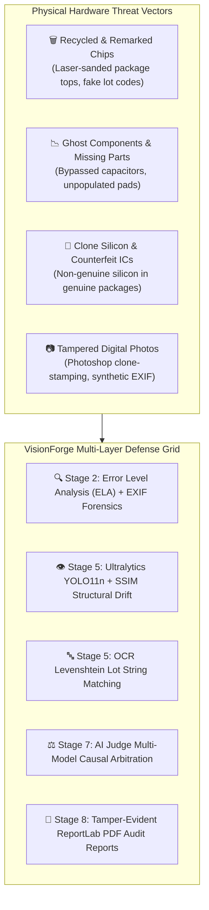
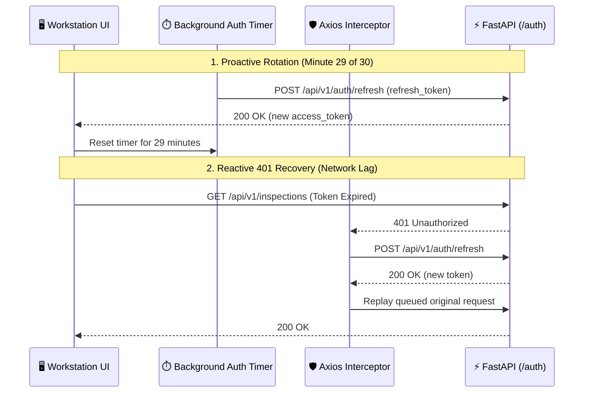
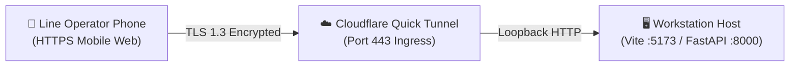

# 🛡️ VisionForge AI Security Architecture & Threat Model

> **How defense-in-depth, cryptographic JWT tokens, append-only evidence logging, and AI anti-hallucination guardrails secure hardware inspection lines.**

---

## 📖 Table of Contents

- [1. The Story: The Stakes of Hardware & Digital Security](#1-the-story-the-stakes-of-hardware--digital-security)
- [2. Supply Chain Hardware Threat Model](#2-supply-chain-hardware-threat-model)
- [3. Authentication Architecture & Token Lifecycle](#3-authentication-architecture--token-lifecycle)
  - [🔐 3.1 Dual-Token Cryptographic Specification](#-31-dual-token-cryptographic-specification)
  - [⏱️ 3.2 Proactive Rotation & 401 Interception Queue](#️-32-proactive-rotation--401-interception-queue)
- [4. Role-Based Access Control (RBAC)](#4-role-based-access-control-rbac)
- [5. Forensic Integrity & Append-Only Evidence Storage](#5-forensic-integrity--append-only-evidence-storage)
- [6. Network Security & Encrypted Mobile Ingress](#6-network-security--encrypted-mobile-ingress)
- [7. AI Model Safeguards & Anti-Hallucination Controls](#7-ai-model-safeguards--anti-hallucination-controls)
- [8. Input Validation & File Sanitization](#8-input-validation--file-sanitization)

---

## 1. The Story: The Stakes of Hardware & Digital Security

When a supplier delivers counterfeit microcontrollers, the threat is not just a digital bug—it is **physical hardware sabotage** that can cause automotive braking systems to fail, medical equipment to power down, or aerospace communications to lose synchronization.

At the same time, because inspection reports are used to justify warranty chargebacks and legal contract terminations, bad actors have strong incentives to tamper with digital inspection records or alter camera photos.

VisionForge AI deploys a **dual-domain defense grid** protecting both the physical hardware intake and the digital software infrastructure:



---

## 2. Supply Chain Hardware Threat Model

| Hardware Attack Vector | Description | VisionForge Countermeasure |
| :--- | :--- | :--- |
| **Silicon Remarking** | Grinding off original low-speed silicon markings and laser-etching fake high-speed part numbers. | **OCR Agent + Levenshtein Matching:** Flags mismatched font metrics, skewed lot codes, and invalid checksums. |
| **Ghost / Missing Passives** | Omitting bypass capacitors or pull-up resistors to reduce production costs by pennies. | **Structural YOLO11n Detector:** Compares component counts against the verified Golden Blueprint. |
| **Component Harvesting** | Desoldering aged chips from e-waste boards and polishing pins for resale. | **VLM Agent + Texture Analysis:** Identifies package micro-scratches, solder flux residue, and thermal burn marks. |
| **Digital Photo Tampering** | Altering photos in Photoshop to pass intake inspection. | **Error Level Analysis (ELA):** Amplifies compression discrepancies ($10\times$) across spliced image regions. |

---

## 3. Authentication Architecture & Token Lifecycle

---

### 🔐 3.1 Dual-Token Cryptographic Specification

VisionForge uses **Bcrypt password hashing** with salt rounds and a two-tier JWT token system:

```text
┌─────────────────────────────────────────────────────────────────────────────┐
│                          JWT TOKEN SPECIFICATIONS                           │
├─────────────────────────────────────────────────────────────────────────────┤
│  Access Token:                                                              │
│    • Signing Algorithm: HS256 (HMAC-SHA256)                                 │
│    • Lifespan:          30 Minutes                                          │
│    • Payload:           { "sub": "<user_uuid>", "role": "<role>", "exp" }  │
│                                                                             │
│  Refresh Token:                                                             │
│    • Signing Algorithm: HS256 (HMAC-SHA256)                                 │
│    • Lifespan:          7 Days                                              │
│    • Payload:           { "sub": "<user_uuid>", "type": "refresh", "exp" }  │
└─────────────────────────────────────────────────────────────────────────────┘
```

---

### ⏱️ 3.2 Proactive Rotation & 401 Interception Queue

To ensure operators are never logged out during active inspections while maintaining tight token lifespans:



---

## 4. Role-Based Access Control (RBAC)

FastAPI endpoints enforce strict role verification via dependency injection:

```python
# backend/app/core/security.py (Conceptual Role Guard)
def require_roles(*allowed_roles: UserRole):
    async def role_checker(current_user: User = Depends(get_current_user)) -> User:
        if current_user.role not in allowed_roles:
            raise HTTPException(
                status_code=status.HTTP_403_FORBIDDEN,
                detail="Insufficient permissions for this operation."
            )
        return current_user
    return role_checker
```

### RBAC Permission Matrix
| Operation | `OPERATOR` | `ADMIN` | Security Rationale |
| :--- | :---: | :---: | :--- |
| **Run Hardware Inspection** | ✅ | ✅ | Core dock receiving duty. |
| **View Past Inspections & PDFs** | ✅ | ✅ | Historical traceability. |
| **Approve AI Verdict** | ✅ | ✅ | Factory validation workflow. |
| **Override AI Verdict** | ✅ | ✅ | Mandatory engineering notes required. |
| **Upload Golden Blueprints** | ❌ | ✅ | Prevents unauthorized baseline modifications. |
| **Delete Golden Reference** | ❌ | ✅ | Preserves historic inspection baselines. |
| **Register / Delete Suppliers** | ❌ | ✅ | Protects vendor ledger integrity. |
| **View Analytics & Risk KPIs** | ❌ | ✅ | Supervisory oversight dashboard. |

---

## 5. Forensic Integrity & Append-Only Evidence Storage

In legal warranty disputes, the integrity of the evidence ledger is critical:

1. **Append-Only Evidence Schema:** The `evidence` database table has zero `UPDATE` or `DELETE` API endpoints. Once an agent records an anomaly, it is permanently locked to that inspection ID.
2. **Referential Deletion Protection (`ON DELETE RESTRICT`):** Deleting a supplier or operator account is blocked if that entity is linked to historical inspection records.
3. **Immutable PDF Audit Certificates:** Every completed inspection generates an immutable, signed ReportLab PDF certificate containing timestamped model versions, bounding box coordinates, and operator signatures.

---

## 6. Network Security & Encrypted Mobile Ingress



1. **Zero-Inbound Port Forwarding:** Cloudflare Quick Tunnel establishes outbound HTTPS tunnels over standard port 443, eliminating the need to open firewall ports on sensitive factory networks.
2. **Mandatory Secure Contexts:** Mobile camera access (`getUserMedia`) requires HTTPS, preventing unencrypted video stream eavesdropping.
3. **CORS Restrictions:** The backend enforces strict origin whitelisting (`CORS_ORIGINS`).

---

## 7. AI Model Safeguards & Anti-Hallucination Controls

To prevent vision-language models from hallucinating defects or missing real physical anomalies:

1. **Round-Robin Multi-Provider Load Balancing:** VLM visual inspection alternates between **Google Gemini 3.5 Flash** and **Groq Qwen 3.8 27B** to prevent vendor lock-in and single-provider bias.
2. **Deterministic Prompt Envelopes:** Prompts strictly constrain models to return structured JSON adhering to predefined schemas.
3. **Cognitive Judge Isolation (Stage 7):** The AI Judge does not inspect raw images directly; it reasons over deterministic mathematical telemetry (blur score, ELA score, YOLO missing counts, OCR Levenshtein distance).
4. **Human Escalation Zone:** Inspections with ambiguous fraud probabilities ($0.40 \le p \le 0.70$) are automatically routed to `FLAGGED FOR REVIEW`, requiring human engineering approval.

---

## 8. Input Validation & File Sanitization

- **Magic Byte Inspection:** Uploaded images are verified using binary magic headers (JPEG `FF D8 FF`, PNG `89 50 4E 47`).
- **File Size Caps:** Uploads are strictly capped at 25 MB to prevent memory exhaustion attacks.
- **Pydantic Schema Serialization:** All API requests are parsed and validated against strict Pydantic v2 models, stripping untrusted or extraneous keys.

---

*For upcoming security enhancements and feature milestones, read [`docs/ROADMAP.md`](ROADMAP.md).*
