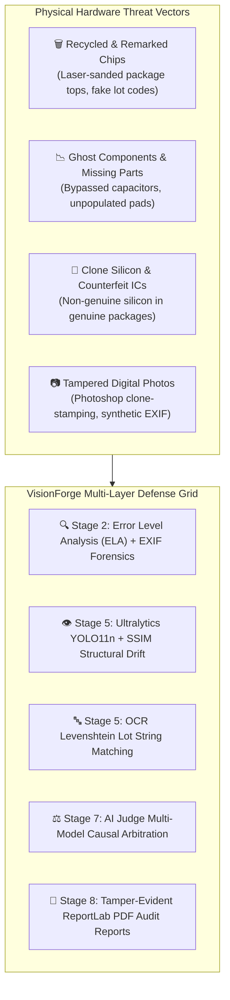
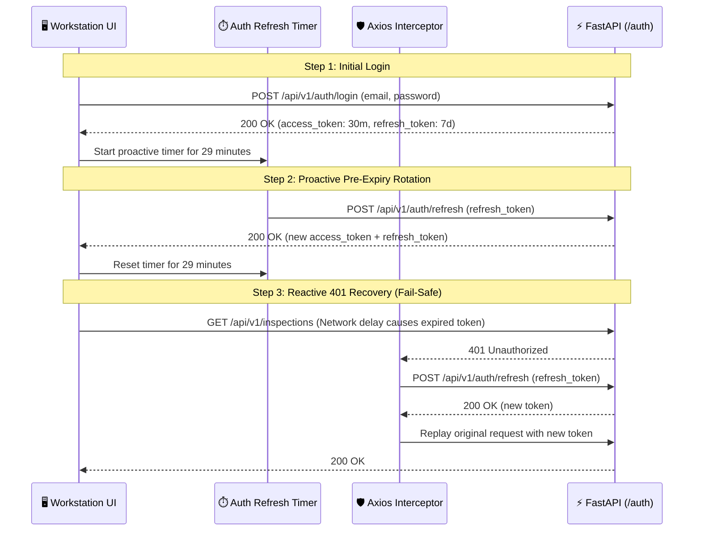
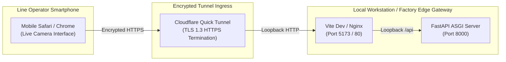

# 🛡️ VisionForge AI — Security Architecture & Threat Model

> **Status:** Authoritative (Reflects Actual Implemented Codebase)  
> **Security Framework:** Defense-in-Depth for Micro-Electronics & Supply Chain Integrity  
> **Cryptography Engine:** Bcrypt (Password Hashing) + PyJWT (HS256 Dual-Token Architecture)  
> **Audit Integrity:** Append-Only Forensic Provenance (`evidence` Table)

---

## 📑 Table of Contents

- [1. Security Philosophy & Hardware Threat Model](#1-security-philosophy--hardware-threat-model)
  - [1.1 Supply-Chain Hardware Attack Vectors](#11-supply-chain-hardware-attack-vectors)
  - [1.2 Digital & Software Threat Vectors](#12-digital--software-threat-vectors)
- [2. Authentication Architecture & Token Lifecycle](#2-authentication-architecture--token-lifecycle)
  - [2.1 Dual-Token Cryptographic Specification](#21-dual-token-cryptographic-specification)
  - [2.2 Proactive Rotation & 401 Interception Queue](#22-proactive-rotation--401-interception-queue)
- [3. Role-Based Access Control (RBAC)](#3-role-based-access-control-rbac)
- [4. Forensic Integrity & Append-Only Evidence Storage](#4-forensic-integrity--append-only-evidence-storage)
- [5. Network Security & Tunnel Ingress Isolation](#5-network-security--tunnel-ingress-isolation)
- [6. AI Model Safeguards & Anti-Hallucination Controls](#6-ai-model-safeguards--anti-hallucination-controls)
- [7. Input Validation & File Sanitization](#7-input-validation--file-sanitization)

---

## 1. Security Philosophy & Hardware Threat Model

VisionForge AI operates at the intersection of **physical supply-chain hardware security** and **enterprise web application security**. The system is hardened against both counterfeit component insertion and digital tampering:



### 1.1 Supply-Chain Hardware Attack Vectors
- **Silicon Remarking:** Fraudulent suppliers grind off original markings on cheaper or slower chips and laser-etch high-grade specifications (e.g., re-marking consumer microcontrollers as automotive-grade).
- **Component Harvesting:** Desoldering aged components from e-waste boards, polishing pins, and reselling them as factory-new parts.
- **Counterfeit Clones:** Unlicensed third-party silicon packages that mimic pinouts but fail under thermal or high-frequency load.
- **Missing Passives:** Cost-cutting omissions of decoupling capacitors, safety fuses, or ESD protection diodes.

### 1.2 Digital & Software Threat Vectors
- **Image Manipulation:** Submitting altered digital images (e.g., clone-stamping serial numbers) to pass automated receiving checks.
- **Audit Tampering:** Attempting to modify historical inspection logs to conceal fraudulent component receipts.
- **API Unauthorized Ingestion:** Injecting false inspection results to bypass factory line operator gates.

---

## 2. Authentication Architecture & Token Lifecycle

VisionForge enforces strict JSON Web Token (JWT) authentication using **Bcrypt salted password hashing** and a **two-tier proactive and reactive token management system**:



### 2.1 Dual-Token Cryptographic Specification
- **Access Token:**
  - **Algorithm:** `HS256` (HMAC SHA-256).
  - **Payload:** `{ "sub": user_id, "role": user_role, "exp": timestamp + 30m }`.
  - **Lifespan:** 30 minutes.
- **Refresh Token:**
  - **Algorithm:** `HS256`.
  - **Payload:** `{ "sub": user_id, "type": "refresh", "exp": timestamp + 7d }`.
  - **Lifespan:** 7 days.
- **Secret Isolation:** Cryptographic signing keys (`JWT_SECRET_KEY`) are dynamically loaded from OS environment variables and never checked into source control.

### 2.2 Proactive Rotation & 401 Interception Queue
- **Proactive Renewal:** The frontend schedules a background rotation timer that fires 60 seconds before token expiry (29 minutes into a 30-minute lifespan), preventing user session interruption during active inspections.
- **Axios Request Queueing:** If a network lag causes an in-flight request to receive a `401 Unauthorized`, the Axios interceptor pauses outgoing HTTP traffic, queues incoming requests, refreshes the token, and replays all queued calls transparently.

---

## 3. Role-Based Access Control (RBAC)

Access permissions are enforced on both the backend (FastAPI dependency injection) and frontend (React route guards):

```python
# backend/app/core/security.py - Role Dependency Guard
def require_roles(*allowed_roles: UserRole):
    from app.models.user import User, UserRole as _UR
    allowed = set(allowed_roles) or set(_UR)

    async def role_checker(current_user: User = Depends(get_current_user)) -> User:
        if current_user.role not in allowed:
            raise HTTPException(
                status_code=status.HTTP_403_FORBIDDEN,
                detail=f"Requires one of: {', '.join(r.value for r in allowed)}",
            )
        return current_user

    return role_checker
```

### RBAC Permission Matrix

| Operation / Feature | `OPERATOR` | `ADMIN` | Security Rationale |
|:---|:---:|:---:|:---|
| **Run Hardware Inspection** | ✅ Allowed | ✅ Allowed | Core factory line duty. |
| **View Inspection History & PDFs** | ✅ Allowed | ✅ Allowed | Line traceability. |
| **Approve AI Judge Verdict** | ✅ Allowed | ✅ Allowed | Operator validation of authentic parts. |
| **Override AI Judge Verdict** | ✅ Allowed | ✅ Allowed | Requires recording engineering justification. |
| **Upload Golden Master Blueprints** | ❌ Blocked | ✅ Allowed | Prevents unauthorized baseline tampering. |
| **Delete Golden Reference** | ❌ Blocked | ✅ Allowed | Preserves historic blueprint integrity. |
| **Register / Delete Supply Chain Vendors** | ❌ Blocked | ✅ Allowed | Vendor ledger modification restricted. |
| **View Operator Performance & Override KPIs** | ❌ Blocked | ✅ Allowed | Quality assurance supervisor analytics. |

---

## 4. Forensic Integrity & Append-Only Evidence Storage

To satisfy legal chain-of-custody standards in supply-chain fraud disputes:

1. **Append-Only Evidence Schema:**
   - The `evidence` table records individual YOLO detections, OCR strings, and VLM findings.
   - Evidence records are strictly **append-only** (no `UPDATE` endpoints exist in the API).
2. **Referential Deletion Protection:**
   - Deleting a vendor is blocked (`ON DELETE RESTRICT`) if inspection records reference that supplier.
   - Deleting a user account is blocked (`ON DELETE RESTRICT`) if that operator authored historical inspection certificates.
3. **Automated PDF Cryptographic Audit Proof:**
   - Every completed inspection generates an immutable ReportLab PDF certificate (`/data/reports/*.pdf`) containing timestamped model versions, bounding box coordinates, and operator signatures.

---

## 5. Network Security & Tunnel Ingress Isolation



1. **Zero-Inbound Port Forwarding:** Cloudflare Quick Tunnel (`cloudflared`) establishes outbound HTTPS tunnels over standard port 443, requiring zero router port forwarding or public IP exposure on factory floor networks.
2. **HTTPS Media Stream Enforcement:** WebRTC / `getUserMedia` camera feeds are strictly bound to secure HTTPS contexts, preventing man-in-the-middle video stream interception.
3. **CORS Isolation:** The FastAPI backend rejects all origins not explicitly configured in `CORS_ORIGINS`.

---

## 6. AI Model Safeguards & Anti-Hallucination Controls

To prevent vision-language models from hallucinating defects or missing real physical anomalies:

1. **Dual-Model Round-Robin Load Balancing:**
   - VLM visual queries alternate between **Google Gemini 3.5 Flash** and **Groq Qwen 3.8 27B**.
   - If one provider returns an unparseable response or hits a rate limit, the request automatically fails over to the alternative provider.
2. **Deterministic Prompt Envelopes:**
   - Prompts strictly constrain the model to structured JSON schemas with enumerated defect types (`MISSING_COMPONENT`, `ALTERED_MARKING`, `BURN_MARK`, `CORROSION`).
3. **Cognitive AI Judge Arbitration (Stage 7):**
   - The AI Judge does not inspect raw images directly; it synthesizes deterministic evidence vectors (Laplacian blur, ELA delta, FAISS cosine distance, YOLO missing counts, OCR Levenshtein distance).
4. **Human Review Escalation Buffer:**
   - Any inspection with a composite fraud probability in the ambiguous range ($0.40 \le p \le 0.70$) is automatically routed to `FLAGGED FOR REVIEW`, requiring physical human engineering sign-off.

---

## 7. Input Validation & File Sanitization

1. **MIME Type & Magic Byte Validation:** Uploaded images must match valid JPEG, PNG, or WebP magic headers. Executables or scripts masked as images are rejected at Stage 1.
2. **File Size Caps:** Uploads are strictly capped at 25 MB per image to protect against denial-of-service (DoS) memory exhaustion.
3. **Pydantic Schema Serialization:** All JSON payloads are validated against strict Pydantic v2 schemas with automated type casting, stripping malicious or extraneous input keys.

---

*For project milestones and upcoming capabilities, consult [`docs/ROADMAP.md`](ROADMAP.md).*
