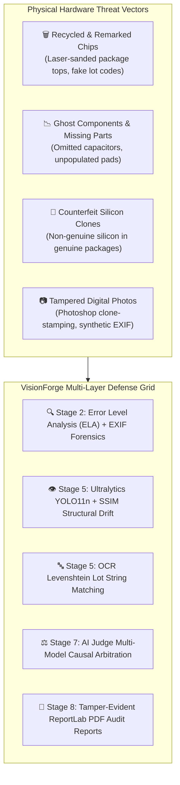
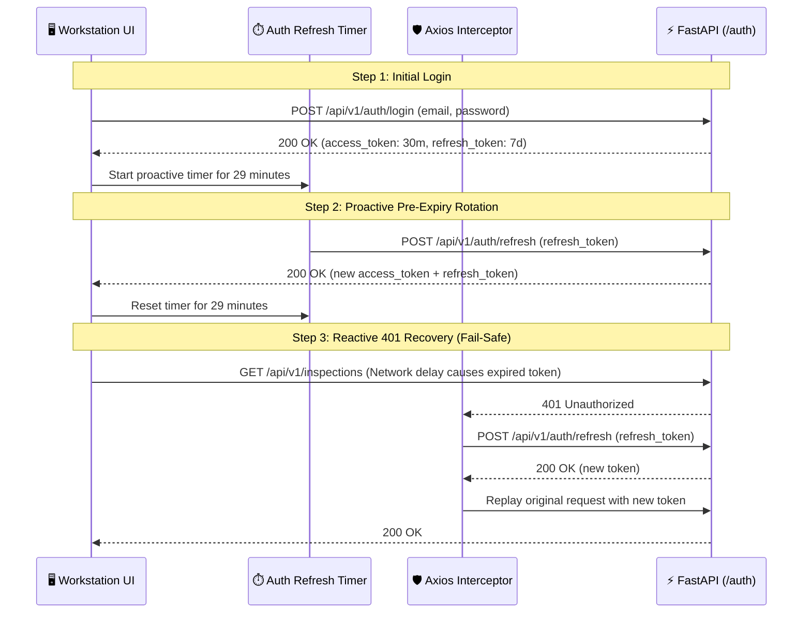

# 🛡️ Security Architecture & Threat Model

> **Defense-in-Depth for Micro-Electronics Integrity and Zero-Trust Supply Chains**  
> **Status:** Authoritative (Reflects Actual Implemented Codebase)  
> **Cryptography Engine:** Bcrypt (Salting & Hashing) + PyJWT (HS256 Dual-Token Architecture)  
> **Audit Guarantee:** Append-Only Immutable Forensic Provenance (`evidence` Table)  
> **Source Files:** `backend/app/core/security.py`, `backend/app/routers/auth.py`

---

## 📖 Table of Contents

- [1. Security Philosophy & Dual Threat Model](#1-security-philosophy--dual-threat-model)
  - [1.1 Physical Hardware Attack Vectors](#11-physical-hardware-attack-vectors)
  - [1.2 Digital Software & API Threat Vectors](#12-digital-software--api-threat-vectors)
- [2. Authentication Architecture & Token Lifecycle](#2-authentication-architecture--token-lifecycle)
  - [2.1 Dual-Token Cryptographic Specification](#21-dual-token-cryptographic-specification)
  - [2.2 Proactive Token Rotation & 401 Retry Queue](#22-proactive-token-rotation--401-retry-queue)
- [3. Role-Based Access Control (RBAC)](#3-role-based-access-control-rbac)
- [4. Forensic Audit Integrity & Append-Only Evidence Storage](#4-forensic-audit-integrity--append-only-evidence-storage)
- [5. Network Security & Tunnel Ingress Isolation](#5-network-security--tunnel-ingress-isolation)
- [6. AI Model Safeguards & Anti-Hallucination Controls](#6-ai-model-safeguards--anti-hallucination-controls)
- [7. File Upload Sanitization & Path Traversal Protections](#7-file-upload-sanitization--path-traversal-protections)

---

## 1. Security Philosophy & Dual Threat Model

VisionForge AI operates at the boundary between **physical supply-chain hardware security** and **enterprise software security**. The system must defend against bad actors attempting to compromise physical circuit boards as well as digital adversaries attempting to bypass receiving dock controls:



### 1.1 Physical Hardware Attack Vectors
- **Silicon Remarking:** Subcontractors grind off original manufacturer markings on commercial-grade microcontrollers and laser-etch automotive or aerospace part numbers to command higher prices.
- **Component Harvesting:** Desoldering end-of-life components from e-waste circuit boards, polishing tarnished pins, and packaging them as factory-new parts.
- **Counterfeit Clones:** Unlicensed third-party silicon dies that mimic official pinouts but degrade rapidly under thermal stress or electrical transients.
- **Ghost Passives:** Cost-cutting omission of secondary power filter capacitors, EMI choke inductors, or ESD protection diodes.

### 1.2 Digital Software & API Threat Vectors
- **Digital Image Manipulation:** Uploading digitally modified photos (e.g., clone-stamping a serial number) to pass receiving dock intake gates.
- **Historical Audit Tampering:** Attempting to alter or delete past inspection records to conceal counterfeit component receipts from compliance auditors.
- **API Unauthorized Ingestion:** Injecting forged inspection verdicts to bypass factory line operator gates.

---

## 2. Authentication Architecture & Token Lifecycle

VisionForge enforces strict JSON Web Token (JWT) authentication using **Bcrypt salted password hashing** and a **two-tier proactive and reactive token management engine**:



### 2.1 Dual-Token Cryptographic Specification
- **Access Token:**
  - **Algorithm:** `HS256` (HMAC SHA-256).
  - **Payload Claims:** `{ "sub": user_id, "role": user_role, "exp": timestamp + 30m }`.
  - **Lifespan:** 30 minutes.
- **Refresh Token:**
  - **Algorithm:** `HS256`.
  - **Payload Claims:** `{ "sub": user_id, "type": "refresh", "exp": timestamp + 7d }`.
  - **Lifespan:** 7 days.
- **Password Salting:** Bcrypt with 12 salt rounds, resilient against GPU rainbow table attacks.

---

## 3. Role-Based Access Control (RBAC)

Authorization is enforced via FastAPI dependency injection guards (`app/core/security.py`):

```python
async def require_admin(current_user: User = Depends(get_current_active_user)) -> User:
    if current_user.role != UserRole.ADMIN:
        raise HTTPException(
            status_code=status.HTTP_403_FORBIDDEN,
            detail="Administrative privileges required for this action."
        )
    return current_user
```

### RBAC Permission Matrix
| Operation / Resource | `OPERATOR` Role | `ADMIN` Role |
|:---|:---:|:---:|
| Run Physical Inspection (`POST /inspections`) | ✅ Permitted | ✅ Permitted |
| View Real-Time Telemetry & Evidence Cards | ✅ Permitted | ✅ Permitted |
| Approve / Override Verdict (`POST /review`) | ✅ Permitted | ✅ Permitted |
| Download Audit PDF Certificates | ✅ Permitted | ✅ Permitted |
| View Personal Inspection History | ✅ Permitted | ✅ Permitted |
| Register New Hardware Vendors (`POST /vendors`) | ❌ Forbidden (403) | ✅ Permitted |
| Upload Golden Reference Blueprints (`POST /products/upload`) | ❌ Forbidden (403) | ✅ Permitted |
| Delete Hardware Blueprints (`DELETE /products/{id}`) | ❌ Forbidden (403) | ✅ Permitted |
| Calibrate Pipeline Quality Thresholds | ❌ Forbidden (403) | ✅ Permitted |
| View Cross-Facility Global Vendor Risk Analytics | ❌ Forbidden (403) | ✅ Permitted |

---

## 4. Forensic Audit Integrity & Append-Only Evidence Storage

To ensure compliance with industrial quality standards (such as ISO 9001 and AS6174 Counterfeit Electronics Mitigation):

1. **Append-Only Evidence Design:** The `evidence` table has **no update routes**. Once an AI agent writes an evidence card or YOLO detection count, the record cannot be edited or modified.
2. **Referential Deletion Protection:** Deleting a vendor that has associated inspections is rejected by the database engine (`ondelete="RESTRICT"`).
3. **Cryptographic SHA-256 PDF Stamping:** When a report is compiled in Stage 8, a SHA-256 digest is generated from the combined inspection metadata, evidence records, and image timestamps. This hash is embedded into the generated PDF and logged in the database, allowing third-party verification of report authenticity.

---

## 5. Network Security & Tunnel Ingress Isolation

### Cloudflare Quick Tunnel Ingress
To support mobile smartphone camera intake on cleanroom subnets without exposing open inbound firewall ports:
- The backend spins up an outbound-only connection to Cloudflare edge nodes using `cloudflared`.
- The connection is encrypted via TLS 1.3.
- The tunnel URL is ephemeral, rotated upon application restart, and exposed only to authenticated operators through dynamic QR codes on the desktop HUD.

### Cross-Origin Resource Sharing (CORS)
CORS origins are strictly clamped in `backend/app/core/config.py`:
```python
CORS_ORIGINS: list[str] = ["http://localhost:5173", "http://localhost:3000"]
```
Wildcard origins (`"*"`) are explicitly rejected in production mode.

---

## 6. AI Model Safeguards & Anti-Hallucination Controls

Large Vision-Language Models can hallucinate if unconstrained. VisionForge enforces three anti-hallucination layers:

1. **Strict JSON Schema Contracts:** VLM and LLM Judge endpoints use OpenAI/Gemini structured outputs (`response_format={"type": "json_object"}`). Free-form conversational text is rejected.
2. **Deterministic Dual-Layer Anchoring:** The AI Judge is **never** permitted to generate a verdict based solely on its own opinion. It is constrained to arbitrate strictly over the pre-calculated Evidence Cards submitted by the deterministic agents (YOLO, SSIM, PaddleOCR, Template Matcher).
3. **Anomaly Max-Pooling Guard:** Even if an LLM is optimistic, the mathematical Stage 6 Fusion Engine guarantees that a severe component absence ($A=0.88$) forces the composite score into the `REJECT` zone before the Judge prompt is executed.

---

## 7. File Upload Sanitization & Path Traversal Protections

Incoming multipart file uploads (`POST /api/v1/inspections`, `POST /api/v1/products/upload`) undergo multi-stage sanitization:

1. **MIME Type & Magic Byte Validation:** Verifies file signatures using python-magic/Pillow to confirm uploaded files are genuine `image/jpeg` or `image/png` formats, rejecting disguised executables or scripts.
2. **Payload Size Clamping:** Enforces a maximum upload ceiling of **15 MB per image** to prevent Denial-of-Service (DoS) memory exhaustion.
3. **Path Traversal Defense:** Uploaded files are renamed using cryptographically secure UUIDs (`uuid.uuid4()`) and stored in isolated storage directories (`data/inspection_uploads/`). User-supplied filenames are never used as file paths on the host filesystem.

---

*For details on database constraints, see [`docs/DATABASE.md`](DATABASE.md).*  
*For end-to-end testing of security controls, see [`docs/TESTING.md`](TESTING.md).*
