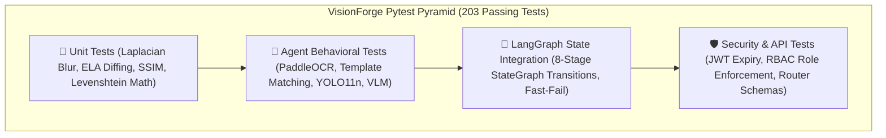

# 🧪 Testing & Quality Assurance Suite

> **Comprehensive Specification of the Hermetic 23-Module Automated Test Suite**  
> **Status:** Authoritative (Reflects Actual Implemented Codebase)  
> **Backend Test Runner:** Pytest 8.x (`pytest-asyncio`)  
> **Test Directory:** `backend/tests/`  
> **Test Corpus:** 23 Test Modules / 203 Automated Unit & Integration Tests (100% Pass Rate)

---

## 📖 Table of Contents

- [1. Testing Strategy & Philosophy](#1-testing-strategy--philosophy)
- [2. Test Suite Architecture & Directory Map](#2-test-suite-architecture--directory-map)
- [3. Running the Test Suite](#3-running-the-test-suite)
  - [3.1 Backend Pytest Execution](#31-backend-pytest-execution)
  - [3.2 Frontend Build & Lint Verification](#32-frontend-build--lint-verification)
- [4. Detailed Breakdown of the 23 Test Modules](#4-detailed-breakdown-of-the-23-test-modules)
  - [4.1 Vision & Forensic Image Processing Tests](#41-vision--forensic-image-processing-tests)
  - [4.2 Agent & Neural Network Tests](#42-agent--neural-network-tests)
  - [4.3 Fusion, Judge & Policy Tests](#43-fusion-judge--policy-tests)
  - [4.4 LangGraph State Transitions & Integration Tests](#44-langgraph-state-transitions--integration-tests)
  - [4.5 Authentication, RBAC & REST API Tests](#45-authentication-rbac--rest-api-tests)
  - [4.6 Database, Reporting & Analytics Tests](#46-database-reporting--analytics-tests)
- [5. Mocking Strategy & Zero-Cost Offline Fixtures](#5-mocking-strategy--zero-cost-offline-fixtures)
- [6. Continuous Integration (CI) Quality Gates](#6-continuous-integration-ci-quality-gates)

---

## 1. Testing Strategy & Philosophy

### Why a Hermetic Testing Architecture?
Testing an AI-powered industrial hardware inspection system presents severe challenges:
1. **Cloud API Token Costs:** Running a full 203-test suite against live Google Gemini and Groq endpoints would cost real money on every git commit.
2. **Rate-Limit Lockouts:** Bursting 200 requests in 30 seconds triggers cloud HTTP 429 rate limits, failing tests spuriously.
3. **Non-Deterministic LLM Output:** If an assertion relies on a cloud LLM generating an exact sentence, the test becomes flaky.

VisionForge enforces a **Hermetic, Deterministic Testing Architecture**:
- **Zero External Network Dependencies:** All cloud vision and reasoning models are decoupled through dynamic mock fixtures in `conftest.py`.
- **Synthetic Forensic Imagery:** Generates in-memory NumPy arrays with programmed anomalies (synthetic Gaussian blur, clone-stamped noise, character substitutions) to verify mathematical edge cases deterministically.
- **In-Memory Async Database Isolation:** Runs tests on `sqlite+aiosqlite:///:memory:` with automatic transactional rollbacks between test methods.



---

## 2. Test Suite Architecture & Directory Map

```
backend/tests/
├── conftest.py                       # Global fixtures: Async DB session, mock LLM client, synthetic images
├── test_image_utils.py               # Stage 1: Laplacian blur variance, exposure bounds, crop math
├── test_authenticity.py              # Stage 2: ELA compression tampering & EXIF analysis
├── test_embedding_service.py         # Stage 3: Gemini/OpenCLIP dual embeddings & FAISS vector search
├── test_roi_templates.py             # Stage 4: JSON blueprint coordinate parsing
├── test_roi_scheduler.py             # Stage 4: Priority queue agent scheduling
├── test_base_agent.py                # Stage 5: BaseAgent lifecycle, error isolation, latency timing
├── test_ocr_agent.py                 # Stage 5a: PaddleOCR / EasyOCR Levenshtein lot code matching
├── test_label_agent.py               # Stage 5b: OpenCV template matching normalized cross-correlation
├── test_structural_yolo.py           # Stage 5c: YOLO inference parser and bounding box normalization
├── test_structural_agent.py          # Stage 5c: YOLO11n component detection & SSIM drift reasoning
├── test_vlm_agent.py                 # Stage 5d: Round-robin balancing & defect extraction
├── test_evidence_execution.py        # Stage 5: Parallel multi-agent execution orchestrator
├── test_evidence_store.py            # Append-only database persistence for forensic evidence
├── test_evidence_fusion.py           # Stage 6: Anomaly max-pooling & mathematical weight fusion
├── test_judge_and_policy.py          # Stage 7 & 8: AI Forensic Judge causal reasoning & policy dispatch
├── test_pipeline_stages.py           # Individual pipeline stage handlers and state management
├── test_workflow_langgraph.py        # LangGraph StateGraph compilation and edge conditional routing
├── test_integration_stages_1_2_3.py  # End-to-end chaining of Stages 1, 2, and 3
├── test_week3_integration.py         # Complete end-to-end pipeline execution with mock providers
├── test_auth.py                      # JWT authentication, bcrypt hashing, RBAC role enforcement
├── test_routers.py                   # FastAPI REST API endpoints & error status codes
├── test_analytics_and_reports.py     # KPI aggregation, vendor risk calculations, ReportLab PDF exports
└── test_llm_client.py                # Gemini & Groq HTTP client abstractions and failover
```

---

## 3. Running the Test Suite

### 3.1 Backend Pytest Execution

```bash
# Navigate to backend directory
cd backend

# Run entire 203-test suite
pytest -v

# Run with execution timing diagnostics
pytest -v --durations=10

# Run specific stage test module
pytest tests/test_evidence_fusion.py -v

# Run with coverage report
pytest --cov=app --cov-report=term-missing
```

### 3.2 Frontend Build & Lint Verification

```bash
# Navigate to frontend directory
cd frontend

# Verify production build compilation
npm run build

# Run linting verification
npm run lint
```

---

## 4. Detailed Breakdown of the 23 Test Modules

---

### 4.1 Vision & Forensic Image Processing Tests
1. **`test_image_utils.py`:** Validates Stage 1 computer vision math. Verifies that blurry test images emit Laplacian variance $< 100.0$, overexposed images emit brightness $> 220.0$, and aspect-ratio-preserving resize functions correctly clamp pixel coordinates.
2. **`test_authenticity.py`:** Tests Stage 2 Error Level Analysis. Generates synthetic clone-stamped test JPEGs and asserts that localized high-frequency variance triggers an authenticity score drop below $0.50$.
3. **`test_embedding_service.py`:** Validates Stage 3 visual embeddings. Asserts that 3072-dimensional Gemini embeddings and 512-dimensional OpenCLIP vectors query FAISS and return expected similarity indices in $< 20\text{ms}$.

---

### 4.2 Agent & Neural Network Tests
4. **`test_base_agent.py`:** Tests the abstract `BaseAgent` wrapper. Injects synthetic exceptions to verify that crashing agent code is safely caught, reported as `failed=True`, and never crashes the overall pipeline.
5. **`test_ocr_agent.py`:** Validates PaddleOCR and EasyOCR character extraction. Tests date code discrepancies and asserts that Levenshtein distance calculations flag tampered batch numbers.
6. **`test_label_agent.py`:** Tests OpenCV template matching. Confirms that rotated logos, missing stamps, and photocopied warranty seals drop cross-correlation scores below the $0.70$ threshold.
7. **`test_structural_yolo.py`:** Tests the raw PyTorch YOLO11n parser. Verifies that normalized Darknet bounding box coordinates map correctly to pixel crops.
8. **`test_structural_agent.py`:** Tests the four-mode reasoning engine. Injects synthetic crops with missing capacitors and extra resistors, verifying that `component_findings` records the exact component deltas.
9. **`test_vlm_agent.py`:** Tests VLM payload construction and verifies that odd/even ROI indices route to alternating mock providers.
10. **`test_llm_client.py`:** Validates mutual failover. Simulates an HTTP 429 error on Gemini and verifies transparent re-routing to Groq Cloud.

---

### 4.3 Fusion, Judge & Policy Tests
11. **`test_evidence_fusion.py`:** Validates Anomaly Max-Pooling mathematics. Asserts that an array of 9 clean cards ($A=0.05$) and 1 failed capacitor card ($A=0.88$) produces a composite score $\ge 0.80$ rather than diluting to $0.13$.
12. **`test_judge_and_policy.py`:** Tests Stage 7 and Stage 8 rules. Feeds composite fraud scores to the Policy Engine, verifying exact threshold routing:
    - Score $0.08 \to$ `ACCEPT` / `ACCEPT`
    - Score $0.45 \to$ `REVIEW` / `VENDOR_VERIFICATION`
    - Score $0.88 \to$ `REJECT` / `QUARANTINE`

---

### 4.4 LangGraph State Transitions & Integration Tests
13. **`test_workflow_langgraph.py`:** Compiles the LangGraph `StateGraph` and verifies conditional edge routing. Confirms that a Stage 1 blur failure skips Stages 2–7 and routes directly to the Policy Engine.
14. **`test_pipeline_stages.py`:** Tests individual stage runner functions against an isolated `InspectionState`.
15. **`test_integration_stages_1_2_3.py`:** Tests sequential chaining of intake, ELA verification, and FAISS blueprint retrieval.
16. **`test_evidence_execution.py`:** Tests the concurrent execution of multiple agents via `asyncio.gather`.
17. **`test_week3_integration.py`:** Executes the full 8-stage pipeline end-to-end with mock models, verifying final database persistence.

---

### 4.5 Authentication, RBAC & REST API Tests
18. **`test_auth.py`:** Tests Bcrypt password hashing, JWT token issuance, proactive token rotation, and invalid signature rejections.
19. **`test_routers.py`:** Tests all FastAPI endpoints (`/auth`, `/inspections`, `/products`, `/vendors`). Verifies that `OPERATOR` users are blocked with HTTP 403 when attempting administrative actions.

---

### 4.6 Database, Reporting & Analytics Tests
20. **`test_evidence_store.py`:** Validates append-only database behavior. Asserts that foreign key cascades and relationships function properly.
21. **`test_roi_templates.py`:** Tests blueprint coordinate deserialization.
22. **`test_roi_scheduler.py`:** Tests priority queue sorting logic.
23. **`test_analytics_and_reports.py`:** Tests SQL aggregation queries (vendor risk rankings, monthly trends) and validates that ReportLab generates valid, non-corrupt PDF binaries.

---

## 5. Mocking Strategy & Zero-Cost Offline Fixtures

Inside `backend/tests/conftest.py`, VisionForge defines shared async fixtures:

```python
# conftest.py Mock Fixture Example
@pytest.fixture
def mock_llm_client(monkeypatch):
    class MockLLMClient:
        async def call_vlm(self, image, prompt, provider=None):
            return {
                "has_anomaly": False,
                "anomaly_score": 0.05,
                "confidence": 0.95,
                "defect_type": "NONE",
                "explanation": "No thermal damage observed."
            }

        async def call_judge(self, prompt, provider=None):
            return {
                "verdict": "ACCEPT",
                "confidence": 0.98,
                "fraud_category": "NONE",
                "root_cause": "All components conform to golden blueprint.",
                "risk_assessment": "Low Risk"
            }

    monkeypatch.setattr("app.shared.llm_client.llm_client", MockLLMClient())
```

---

## 6. Continuous Integration (CI) Quality Gates

In GitHub Actions CI pipelines, the following gates must pass before merging to `main`:

```bash
# 1. Backend Lint & Format
flake8 app tests --max-line-length=120

# 2. Pytest Hermetic Execution (Must be 100% pass)
pytest --cov=app --cov-fail-under=85

# 3. Frontend Production Build Verification
cd frontend && npm install && npm run build
```

---

*For security threat modeling, consult [`docs/SECURITY.md`](SECURITY.md).*  
*For future roadmap items, consult [`docs/ROADMAP.md`](ROADMAP.md).*
