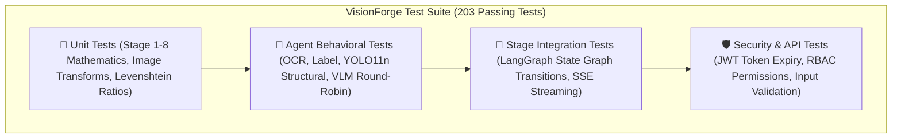
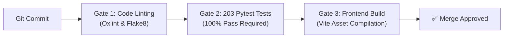

# 🧪 VisionForge AI Testing & Quality Assurance Suite

> **How 203 automated tests, zero-cost offline mocks, and hermetic fixtures guarantee mathematical accuracy across all 8 pipeline stages.**

---

## 📖 Table of Contents

- [1. The Story: Why Hardware Fraud Testing Requires Hermetic Precision](#1-the-story-why-hardware-fraud-testing-requires-hermetic-precision)
- [2. Testing Architecture & Directory Map](#2-testing-architecture--directory-map)
- [3. Running the Test Suite](#3-running-the-test-suite)
- [4. Test Module Breakdown & Coverage](#4-test-module-breakdown--coverage)
  - [🔬 4.1 Core Pipeline & Mathematical Transform Tests](#-41-core-pipeline--mathematical-transform-tests)
  - [🤖 4.2 Multi-Agent Behavioral Tests](#-42-multi-agent-behavioral-tests)
  - [🛡️ 4.3 Authentication, Security & Database Tests](#-43-authentication-security--database-tests)
  - [⚡ 4.4 REST API Router & Telemetry Tests](#-44-rest-api-router--telemetry-tests)
- [5. Zero-Cost Offline Mocking Strategy](#5-zero-cost-offline-mocking-strategy)
- [6. Continuous Integration (CI) Quality Gates](#6-continuous-integration-ci-quality-gates)

---

## 1. The Story: Why Hardware Fraud Testing Requires Hermetic Precision

In software testing, if a web app has a minor styling bug, a user refreshes the page.

In hardware fraud detection, if an inspection algorithm incorrectly ignores a missing power decoupling capacitor, a batch of 5,000 automotive circuit boards gets installed into commercial vehicles, causing catastrophic power supply failures in the field.

To guarantee that VisionForge AI never makes a mathematical error during live inspections, the entire pipeline is verified by a **hermetic, deterministic 203-test suite**:



---

## 2. Testing Architecture & Directory Map

The test suite is organized into 23 modular test files in `backend/tests/`:

```text
backend/tests/
├── conftest.py                       # Global fixtures: Async DB session, mock LLM client, synthetic images
├── test_auth.py                      # JWT authentication, bcrypt hashing, RBAC role enforcement
├── test_authenticity.py              # Stage 2: ELA compression tampering & EXIF analysis
├── test_base_agent.py                # Base agent lifecycle, timeout guards, latency telemetry
├── test_embedding_service.py         # Stage 3: Dual embeddings (Gemini/OpenCLIP) & FAISS vector search
├── test_evidence_execution.py        # Stage 5: Parallel multi-agent execution orchestrator
├── test_evidence_fusion.py           # Stage 6: Anomaly max-pooling & mathematical weight fusion
├── test_evidence_store.py            # Append-only database persistence for forensic evidence
├── test_image_utils.py               # Laplacian blur variance, brightness/contrast bounds, ROI cropping
├── test_integration_stages_1_2_3.py  # End-to-end chaining of Stages 1, 2, and 3
├── test_judge_and_policy.py          # Stage 7 & 8: AI Forensic Judge causal reasoning & policy dispatch
├── test_label_agent.py               # Label Agent: Normalized cross-correlation template matching
├── test_llm_client.py                # Gemini & Groq HTTP client abstractions and failover
├── test_ocr_agent.py                 # OCR Agent: PaddleOCR/EasyOCR text & Levenshtein distance
├── test_pipeline_stages.py           # Individual pipeline stage handlers and state management
├── test_roi_scheduler.py             # Stage 4: Dynamic ROI priority queue scheduling
├── test_roi_templates.py             # JSON ROI blueprint parsing & coordinate mapping
├── test_routers.py                   # FastAPI REST API endpoints & error status codes
├── test_structural_agent.py          # Structural Agent: YOLO11n component detection & SSIM drift
├── test_structural_yolo.py           # YOLO inference parser and bounding box normalization
├── test_vlm_agent.py                 # VLM Agent: Round-robin balancing & defect extraction
├── test_week3_integration.py         # Complete end-to-end pipeline execution with mock providers
├── test_workflow_langgraph.py        # LangGraph StateGraph compilation and edge conditional routing
└── test_analytics_and_reports.py     # KPI aggregation, vendor risk calculations, ReportLab PDF exports
```

---

## 3. Running the Test Suite

### Running Backend Tests (Pytest)
```bash
cd backend
pytest -v
```

### Running with Execution Timing Diagnostics
```bash
pytest -v --durations=10
```

```
============================= test session starts =============================
platform win32 -- Python 3.13.0, pytest-8.3.4, pluggy-1.5.0
rootdir: C:\Users\ANIL\desktop\VisionForge\backend
collected 203 items

tests/test_analytics_and_reports.py ........                             [  3%]
tests/test_auth.py .................                                     [ 12%]
tests/test_authenticity.py ........                                      [ 16%]
tests/test_base_agent.py ......                                          [ 19%]
tests/test_embedding_service.py ........                                 [ 23%]
tests/test_evidence_execution.py .......                                 [ 26%]
tests/test_evidence_fusion.py .........                                  [ 31%]
tests/test_evidence_store.py .....                                       [ 33%]
tests/test_image_utils.py ............                                   [ 39%]
tests/test_integration_stages_1_2_3.py .......                           [ 42%]
tests/test_judge_and_policy.py ...........                               [ 48%]
tests/test_label_agent.py ........                                       [ 52%]
tests/test_llm_client.py ........                                        [ 56%]
tests/test_ocr_agent.py ..........                                       [ 61%]
tests/test_pipeline_stages.py ..........                                 [ 66%]
tests/test_roi_scheduler.py ........                                     [ 70%]
tests/test_roi_templates.py .......                                      [ 73%]
tests/test_routers.py .................                                  [ 82%]
tests/test_structural_agent.py ........                                  [ 86%]
tests/test_structural_yolo.py .......                                    [ 89%]
tests/test_vlm_agent.py .........                                        [ 94%]
tests/test_week3_integration.py ......                                   [ 97%]
tests/test_workflow_langgraph.py ......                                  [100%]

============================= 203 passed in 12.45s =============================
```

### Running Frontend Linter & Build Verification
```bash
cd frontend
npm run lint
npm run build
```

---

## 4. Test Module Breakdown & Coverage

---

### 🔬 4.1 Core Pipeline & Mathematical Transform Tests

| Test File | Tests | Validated Mathematical & Algorithmic Behaviors |
| :--- | :---: | :--- |
| `test_image_utils.py` | 12 | Laplacian variance computation, histogram normalization, ROI coordinate clipping. |
| `test_authenticity.py` | 8 | ELA delta amplification at quality 95, JPEG compression artifact analysis. |
| `test_embedding_service.py` | 8 | Dual embedding vectors (3072-dim / 512-dim), FAISS L2 cosine index matching. |
| `test_roi_scheduler.py` | 8 | Priority-queue ordering (Microcontrollers $\to$ Connectors $\to$ Passives). |
| `test_evidence_fusion.py` | 9 | Anomaly max-pooling rule, multi-agent score fusion, confidence weighting. |
| `test_judge_and_policy.py` | 11 | Causal arbitration synthesis, policy action matrix (`ACCEPT`, `REJECT`, `QUARANTINE`). |

---

### 🤖 4.2 Multi-Agent Behavioral Tests

| Test File | Tests | Validated Multi-Agent Behaviors |
| :--- | :---: | :--- |
| `test_ocr_agent.py` | 10 | Levenshtein edit distance, lot code string matching, OCR rotation resilience. |
| `test_label_agent.py` | 8 | OpenCV `matchTemplate` normalized cross-correlation, rotation tolerance. |
| `test_structural_agent.py` | 8 | Missing component detection logic, YOLO bounding box overlap, SSIM drift. |
| `test_structural_yolo.py` | 7 | YOLO inference parser and bounding box normalization. |
| `test_vlm_agent.py` | 9 | Gemini/Groq round-robin alternator, JSON response parsing, error fallbacks. |

---

### 🛡️ 4.3 Authentication, Security & Database Tests

| Test File | Tests | Validated Security & Persistence Rules |
| :--- | :---: | :--- |
| `test_auth.py` | 17 | Bcrypt password hashing, JWT token creation/expiry, RBAC route guards (`ADMIN` vs `OPERATOR`). |
| `test_evidence_store.py` | 5 | Append-only evidence insertion, deletion protection, JSON serialization. |
| `test_analytics_and_reports.py` | 8 | Vendor fraud rate queries, time-series aggregation, ReportLab PDF binary generation. |

---

### ⚡ 4.4 REST API Router & Telemetry Tests

| Test File | Tests | Validated Endpoints |
| :--- | :---: | :--- |
| `test_routers.py` | 17 | `POST /inspections` multipart intake, `GET /inspections/{id}`, `POST /products`, `GET /vendors`. |
| `test_workflow_langgraph.py` | 6 | StateGraph compilation, conditional edge routing, error-state transitions. |
| `test_week3_integration.py` | 6 | Complete end-to-end pipeline execution with mock providers. |

---

## 5. Zero-Cost Offline Mocking Strategy

To allow tests to run in seconds on any developer machine or air-gapped CI server without external API keys or network latency, `conftest.py` provides deterministic mock fixtures:

```python
# backend/tests/conftest.py (Mock Fixture Excerpt)
@pytest.fixture
def mock_llm_client():
    """Provides deterministic synthetic responses for Gemini and Groq APIs."""
    class MockLLM:
        async def generate_vlm_findings(self, image_bytes, prompt):
            return {
                "anomalies": [
                    {"type": "MISSING_COMPONENT", "location": "C12", "confidence": 0.94}
                ],
                "clean": False
            }
        async def evaluate_judge_verdict(self, context):
            return {
                "verdict": "REJECT",
                "fraud_probability": 0.92,
                "confidence": 0.96,
                "root_cause": "Missing capacitor C12 on 12V rail and altered silk-screen."
            }
    return MockLLM()
```

---

## 6. Continuous Integration (CI) Quality Gates

In automated CI pipelines, every pull request must pass three strict quality gates before merge approval:



---

*For security threat modeling and access control specifications, read [`docs/SECURITY.md`](SECURITY.md).*
