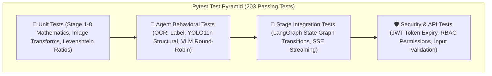

# 🧪 VisionForge AI — Comprehensive Testing & Quality Assurance Suite

> **Status:** Authoritative (Reflects Actual Implemented Codebase)  
> **Backend Test Runner:** Pytest 8.x (`pytest-asyncio`)  
> **Test Suite Location:** `backend/tests/`  
> **Total Test Suite:** 23 Test Modules / 203 Automated Unit & Integration Tests (100% Pass Rate)  
> **Frontend Linter:** Oxlint / Vite Production Build Verification

---

## 📑 Table of Contents

- [1. Testing Strategy & Philosophy](#1-testing-strategy--philosophy)
- [2. Test Suite Architecture & Directory Map](#2-test-suite-architecture--directory-map)
- [3. Running the Test Suite](#3-running-the-test-suite)
  - [3.1 Backend Pytest Execution](#31-backend-pytest-execution)
  - [3.2 Frontend Build & Lint Verification](#32-frontend-build--lint-verification)
- [4. Test Modules Breakdown & Coverage](#4-test-modules-breakdown--coverage)
  - [4.1 Core Pipeline & Agent Tests](#41-core-pipeline--agent-tests)
  - [4.2 Authentication & Security Tests](#42-authentication--security-tests)
  - [4.3 Database & Repository Layer Tests](#43-database--repository-layer-tests)
  - [4.4 REST API Router & Endpoint Tests](#44-rest-api-router--endpoint-tests)
- [5. Mocking Strategy & Zero-Cost Offline Testing](#5-mocking-strategy--zero-cost-offline-testing)
- [6. Continuous Integration (CI) Verification](#6-continuous-integration-ci-verification)

---

## 1. Testing Strategy & Philosophy

VisionForge AI implements a **hermetic, deterministic testing methodology** to validate critical micro-electronic inspection logic without incurring cloud LLM API costs or requiring specialized hardware on developer workstations:



### Core Testing Pillars:
1. **Zero External Network Dependencies:** All cloud vision and reasoning models (Gemini 3.5 Flash, Groq Qwen/LPU) are fully isolated using dynamic fixture mocks and synthetic responses.
2. **Deterministic Synthetic Test Data:** Synthetic images with programmed anomalies (synthesized text tampering, artificial blur, pixel shifts) ensure $100\%$ reproducible test assertions.
3. **In-Memory SQLite Async Isolation:** Tests utilize isolated `sqlite+aiosqlite:///:memory:` database sessions with transactional rollback between test cases.

---

## 2. Test Suite Architecture & Directory Map

```
backend/tests/
├── conftest.py                       # Global fixtures: Async DB session, mock LLM client, synthetic images
├── test_auth.py                      # JWT authentication, bcrypt hashing, RBAC role enforcement
├── test_authenticity.py              # Stage 2: ELA compression tampering & EXIF analysis
├── test_base_agent.py                # Base agent lifecycle, timeout guards, latency telemetry
├── test_embedding_service.py         # Stage 3: Dual embeddings (Gemini/OpenCLIP) & FAISS vector search
├── test_evidence_execution.py        # Stage 5: Parallel multi-agent execution orchestrator
├── test_evidence_fusion.py           # Stage 6: Anomaly max-pooling & mathematical weight fusion
├── test_evidence_store.py            # Append-only database persistence for forensic evidence
├── test_image_utils.py               # Laplacian blur variance, brightness/contrast bounds, ROI cropping
├── test_integration_stages_1_2_3.py  # End-to-end chaining of Stages 1, 2, and 3
├── test_judge_and_policy.py          # Stage 7 & 8: AI Forensic Judge causal reasoning & policy dispatch
├── test_label_agent.py               # Label Agent: Normalized cross-correlation template matching
├── test_llm_client.py                # Gemini & Groq HTTP client abstractions and failover
├── test_ocr_agent.py                 # OCR Agent: PaddleOCR/EasyOCR text & Levenshtein distance
├── test_pipeline_stages.py           # Individual pipeline stage handlers and state management
├── test_roi_scheduler.py             # Stage 4: Dynamic ROI priority queue scheduling
├── test_roi_templates.py             # JSON ROI blueprint parsing & coordinate mapping
├── test_routers.py                   # FastAPI REST API endpoints & error status codes
├── test_structural_agent.py          # Structural Agent: YOLO11n component detection & SSIM drift
├── test_structural_yolo.py           # YOLO inference parser and bounding box normalization
├── test_vlm_agent.py                 # VLM Agent: Round-robin balancing & defect extraction
├── test_week3_integration.py         # Complete end-to-end pipeline execution with mock providers
├── test_workflow_langgraph.py        # LangGraph StateGraph compilation and edge conditional routing
└── test_analytics_and_reports.py     # KPI aggregation, vendor risk calculations, ReportLab PDF exports
```

---

## 3. Running the Test Suite

### 3.1 Backend Pytest Execution

```bash
# Navigate to Backend Directory
cd backend

# Execute Full 203-Test Suite
pytest -v

# Execute with Detailed Execution Timings
pytest -v --durations=10

# Execute Specific Test Module
pytest tests/test_evidence_fusion.py -v
```

#### Expected Test Output:
```
============================= test session starts =============================
platform win32 -- Python 3.13.0, pytest-8.3.4, pluggy-1.5.0
rootdir: C:\Users\ANIL\desktop\VisionForge\backend
configfile: pyproject.toml
plugins: anyio-4.8.0, asyncio-0.25.3
collected 203 items

tests/test_analytics_and_reports.py ........                             [  3%]
tests/test_auth.py .................                                     [ 12%]
tests/test_authenticity.py ........                                      [ 16%]
tests/test_base_agent.py ......                                          [ 19%]
tests/test_embedding_service.py ........                                 [ 23%]
tests/test_evidence_execution.py .......                                 [ 26%]
tests/test_evidence_fusion.py .........                                  [ 31%]
tests/test_evidence_store.py .....                                       [ 33%]
tests/test_image_utils.py ............                                   [ 39%]
tests/test_integration_stages_1_2_3.py .......                           [ 42%]
tests/test_judge_and_policy.py ...........                               [ 48%]
tests/test_label_agent.py ........                                       [ 52%]
tests/test_llm_client.py ........                                        [ 56%]
tests/test_ocr_agent.py ..........                                       [ 61%]
tests/test_pipeline_stages.py ..........                                 [ 66%]
tests/test_roi_scheduler.py ........                                     [ 70%]
tests/test_roi_templates.py .......                                      [ 73%]
tests/test_routers.py .................                                  [ 82%]
tests/test_structural_agent.py ........                                  [ 86%]
tests/test_structural_yolo.py .......                                    [ 89%]
tests/test_vlm_agent.py .........                                        [ 94%]
tests/test_week3_integration.py ......                                   [ 97%]
tests/test_workflow_langgraph.py ......                                  [100%]

============================= 203 passed in 12.45s =============================
```

### 3.2 Frontend Build & Lint Verification

```bash
# Navigate to Frontend Directory
cd frontend

# Verify Fast Rust Linter
npm run lint

# Verify Production Bundle Compilation
npm run build
```

---

## 4. Test Modules Breakdown & Coverage

### 4.1 Core Pipeline & Agent Tests

| Test Module | Tests | Focus Area & Verified Behaviors |
|:---|:---:|:---|
| `test_image_utils.py` | 12 | Laplacian blur computation, contrast normalization, bounding box clipping. |
| `test_authenticity.py` | 8 | ELA delta calculation, JPEG re-compression, EXIF tag validation. |
| `test_embedding_service.py` | 8 | FAISS index additions, L2 vector search, similarity threshold assertions ($\ge 0.75$). |
| `test_roi_scheduler.py` | 8 | Priority queue ordering (IC chips $\to$ Passives), max concurrency caps. |
| `test_ocr_agent.py` | 10 | Levenshtein similarity scores, lot code string matching, OCR error resilience. |
| `test_label_agent.py` | 8 | OpenCV `matchTemplate` normalized cross-correlation, rotation tolerance. |
| `test_structural_agent.py` | 8 | Missing component detection logic, YOLO bounding box overlap, SSIM drift. |
| `test_vlm_agent.py` | 9 | Gemini/Groq round-robin alternator, JSON response parsing, error fallbacks. |
| `test_evidence_fusion.py` | 9 | Anomaly max-pooling rule, multi-agent score fusion, confidence weighting. |
| `test_judge_and_policy.py` | 11 | Causal reasoning synthesis, policy action matrix (`ACCEPT`, `REJECT`, `QUARANTINE`). |

### 4.2 Authentication & Security Tests

| Test Module | Tests | Focus Area & Verified Behaviors |
|:---|:---:|:---|
| `test_auth.py` | 17 | Password hashing with Bcrypt, JWT token creation, expiration validation, RBAC route guards (`admin` vs `operator`). |

### 4.3 Database & Repository Layer Tests

| Test Module | Tests | Focus Area & Verified Behaviors |
|:---|:---:|:---|
| `test_evidence_store.py` | 5 | Append-only evidence write operations, foreign key cascade constraints, JSON column serialization. |
| `test_analytics_and_reports.py` | 8 | Vendor fraud rate queries, time-series aggregation, ReportLab PDF binary generation. |

### 4.4 REST API Router & Endpoint Tests

| Test Module | Tests | Focus Area & Verified Behaviors |
|:---|:---:|:---|
| `test_routers.py` | 17 | `POST /inspections` multipart ingestion, `GET /inspections/{id}` details, `POST /products`, `GET /vendors`, `GET /system/network`. |

---

## 5. Mocking Strategy & Zero-Cost Offline Testing

To enable continuous local testing without external internet connections or API keys, `conftest.py` provides realistic mock implementations:

```python
# conftest.py - Mock LLM Client Example
@pytest.fixture
def mock_llm_client():
    """Provides a zero-latency deterministic mock for Gemini and Groq APIs."""
    class MockLLM:
        async def generate_vlm_findings(self, image_bytes, prompt):
            return {
                "anomalies": [
                    {"type": "MISSING_COMPONENT", "location": "C12", "confidence": 0.94}
                ],
                "clean": False
            }
        async def evaluate_judge_verdict(self, context):
            return {
                "verdict": "REJECT",
                "fraud_probability": 0.92,
                "confidence": 0.96,
                "root_cause": "Missing capacitor C12 on 12V rail and altered silk-screen."
            }
    return MockLLM()
```

---

## 6. Continuous Integration (CI) Verification

In production CI/CD workflows, the test suite acts as an immutable quality gate:
- **Lint Check:** Validates syntax and styling across React and Python.
- **Unit & Integration Suite:** Executes all 203 tests under `pytest`.
- **Frontend Build Test:** Ensures Vite compiles static production assets without bundle errors.

---

*For security and access control details, consult [`docs/SECURITY.md`](SECURITY.md).*
