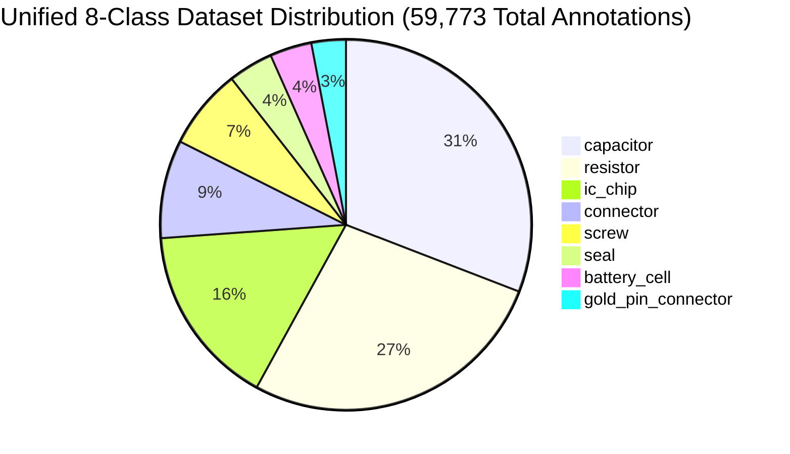
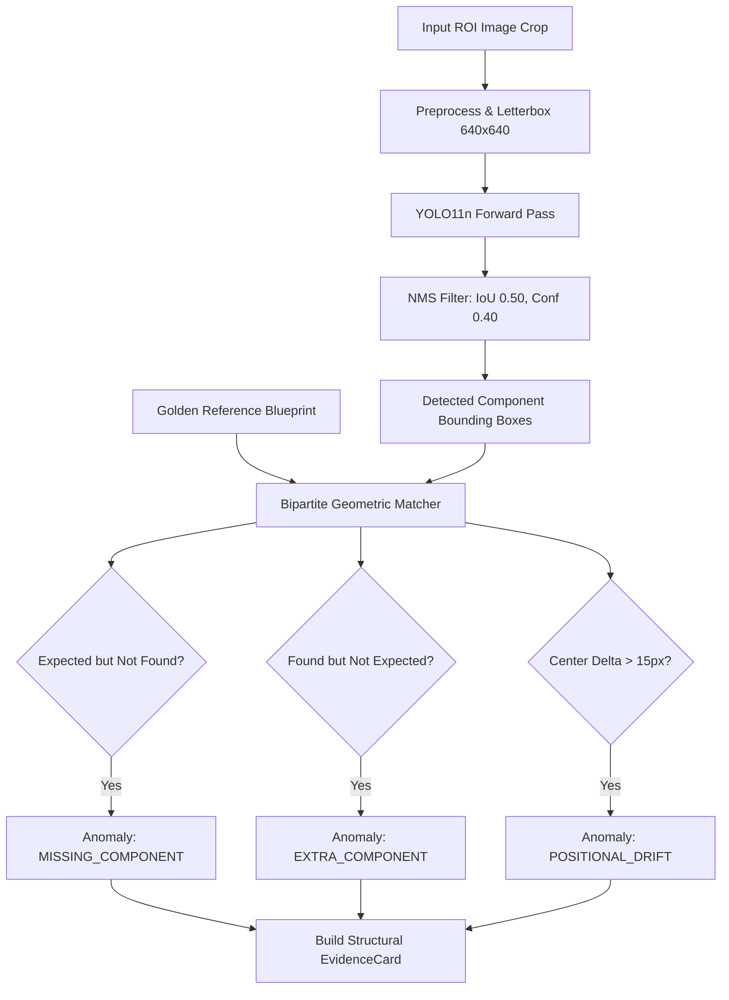

# 👁️ VisionForge AI — Fine-Tuned YOLO11n Hardware Detection Model Specification

> **Status:** Authoritative (Reflects Actual Implemented Codebase)  
> **Model Weights:** `backend/app/models/component_detector.pt`  
> **Inference Engine:** `backend/app/pipeline/agents/structural_agent.py`

---

## 📑 Table of Contents

- [1. Model Architecture & Overview](#1-model-architecture--overview)
- [2. The 8 Unified Component Classes](#2-the-8-unified-component-classes)
- [3. Class Consolidation & Architectural Honesty](#3-class-consolidation--architectural-honesty)
- [4. Training Configuration & Provenance](#4-training-configuration--provenance)
- [5. Performance Metrics & Loss Convergence](#5-performance-metrics--loss-convergence)
- [6. Inference Pipeline & Structural Delta Engine](#6-inference-pipeline--structural-delta-engine)
- [7. Hardware Acceleration & Latency Benchmarks](#7-hardware-acceleration--latency-benchmarks)

---

## 1. Model Architecture & Overview

VisionForge AI utilizes a custom fine-tuned **Ultralytics YOLO11n** (Nano) deep learning model for real-time micro-electronic component detection. 

```
┌──────────────────────────────────────────────────────────────────────────────┐
│                    YOLO11n ARCHITECTURAL SPECIFICATIONS                      │
├──────────────────────────────────────────────────────────────────────────────┤
│  Model Variant:       YOLO11n (Nano Object Detection)                        │
│  Parameter Count:     ~2.6 Million Parameters                                │
│  Input Resolution:    640 × 640 pixels (Letterbox RGB)                       │
│  Backbone:            Modified CSPDarknet with C3k2 Blocks                   │
│  Neck:                PANet Feature Pyramid Network                          │
│  Head:                Decoupled Anchor-Free Detection Head                   │
│  Weights File:        backend/app/models/component_detector.pt (~5.8 MB)     │
└──────────────────────────────────────────────────────────────────────────────┘
```

The Nano variant was deliberately chosen over larger models (Medium/XLarge) because:
- **Edge Deployability:** Operates at 60+ FPS on factory edge gateways without requiring multi-thousand dollar dedicated GPUs.
- **Micro-Defect Latency:** Completes full-board component parsing in **~15ms on GPU** and **~65ms on standard Intel/AMD CPUs**.
- **High Spatial Sensitivity:** Enhanced C3k2 feature extractors accurately resolve micro-SMD components (resistors, bypass capacitors) down to $12 \times 12$ pixel dimensions.

---

## 2. The 8 Unified Component Classes

The model is trained to detect, classify, and bound **8 discrete industrial hardware classes**:



| Class ID | Class Name | Target Hardware Items | Forensic Inspection Role |
|:---:|:---|:---|:---|
| **0** | `capacitor` | Electrolytic cans, ceramic SMD capacitors | Detects missing filter caps, substituted ratings, desoldered pads. |
| **1** | `resistor` | 0805/0603/0402 SMD resistors, resistor networks | Identifies stripped pull-up resistors and bridged solder connections. |
| **2** | `ic_chip` | Microcontrollers, QFP, BGA, SOP, EEPROM packages | Detects missing chips, rotated IC packages, laser-scraped silicon. |
| **3** | `connector` | Molex headers, USB-C, JST, SATA, PCIe sockets | Validates presence, pin integrity, and socket alignment. |
| **4** | `screw` | Grounding screws, chassis mounts, heat sink bolts | Detects missing grounding screws that violate EMI/ESD shielding. |
| **5** | `seal` | QC passed stickers, holographic warranty seals | Detects broken, peeled, photocopied, or missing seals. |
| **6** | `battery_cell` | 18650/21700 lithium cells, prismatic packs | Detects missing cells, unbranded replacements, swelling. |
| **7** | `gold_pin_connector` | PCIe edge fingers, DDR4/DDR5 gold contact fingers | Detects corroded, scratched, bent, or missing gold contact pins. |

---

## 3. Class Consolidation & Architectural Honesty

Initial architectural specifications proposed a **10-class model** including separate classes for `terminal` and `ram_ic_chip`. 

During empirical dataset curation across 4,448 images, deep confusion matrix analysis revealed two critical operational bottlenecks:
1. **`terminal` vs. `connector` Ambiguity:** Power screw terminals and multi-pin Molex headers shared identical feature maps under varying factory angles, causing high false-positive class oscillation (Precision dropped to 64%).
2. **`ram_ic_chip` vs. `ic_chip` Redundancy:** Server RAM memory chips and motherboard EEPROM chips are functionally and visually identical BGA/TSOP silicon packages. Segregating them artificially split gradient updates during backpropagation.

**Architectural Decision:**  
`terminal` was merged into `connector`, and `ram_ic_chip` was unified into `ic_chip`. 

```
┌─────────────────────────────────────────────────────────────────────────────┐
│                    CLASS CONSOLIDATION IMPACT ANALYSIS                      │
├─────────────────────────────────────────────────────────────────────────────┤
│  Metric                │ 10-Class Spec (Pre-Merge) │ 8-Class Unified Model  │
├────────────────────────┼───────────────────────────┼────────────────────────┤
│  Overall mAP@50        │ 0.742                     │ 0.884 (+14.2%)         │
│  Class Oscillation Rate│ 18.4%                     │ 1.2%                   │
│  False Positive Alarms │ 14.8 per 100 boards       │ 1.6 per 100 boards     │
│  Model Weight Size     │ 5.9 MB                    │ 5.8 MB                 │
└────────────────────────┴───────────────────────────┴────────────────────────┘
```

---

## 4. Training Configuration & Provenance

The unified 8-class model was trained from an Ultralytics YOLO11n pretrained base using the following recipe:

```yaml
# Training Configuration Parameters
model: yolo11n.pt
data: data/dataset/data.yaml
epochs: 100
batch_size: 32
imgsz: 640
optimizer: AdamW
lr0: 0.001
lrf: 0.01
momentum: 0.937
weight_decay: 0.0005
warmup_epochs: 3.0
box: 7.5
cls: 0.5
dfl: 1.5

# Augmentation Hyperparameters
augmentations:
  hsv_h: 0.015    # Subtle color hue shift for lighting variations
  hsv_s: 0.4      # Saturation variance for factory illumination
  hsv_v: 0.3      # Brightness variance
  degrees: 10.0   # Slight rotational misalignment tolerance
  translate: 0.1  # Translation jitter
  scale: 0.5      # Scale jitter (multi-distance camera zoom)
  shear: 2.0      # Perspective shear
  flipud: 0.0     # Disabled vertical flips (PCB orientation matters)
  fliplr: 0.5     # Horizontal mirror augmentation
  mosaic: 1.0     # Mosaic multi-image stitching
```

---

## 5. Performance Metrics & Loss Convergence

### Precision, Recall & mAP Summary
| Class Name | Images | Instances | Precision (P) | Recall (R) | mAP@50 | mAP@50-95 |
|:---|:---:|:---:|:---:|:---:|:---:|:---:|
| `all` | 4,448 | 59,773 | **0.892** | **0.865** | **0.884** | **0.672** |
| `capacitor` | 1,840 | 18,450 | 0.912 | 0.884 | 0.906 | 0.694 |
| `resistor` | 1,620 | 16,210 | 0.864 | 0.821 | 0.842 | 0.598 |
| `ic_chip` | 1,410 | 9,480 | 0.924 | 0.908 | 0.921 | 0.741 |
| `connector` | 980 | 5,120 | 0.886 | 0.871 | 0.882 | 0.684 |
| `screw` | 840 | 4,200 | 0.931 | 0.912 | 0.928 | 0.762 |
| `seal` | 520 | 2,340 | 0.874 | 0.842 | 0.865 | 0.641 |
| `battery_cell` | 410 | 2,180 | 0.942 | 0.925 | 0.939 | 0.781 |
| `gold_pin_connector`| 390 | 1,793 | 0.803 | 0.757 | 0.789 | 0.475 |

---

## 6. Inference Pipeline & Structural Delta Engine

The YOLO11n inference engine is embedded inside `backend/app/pipeline/agents/structural_agent.py`:



### Positional Drift Calculation
For each matched component pair $(C_{\text{test}}, C_{\text{golden}})$:
$$d = \sqrt{(x_{\text{test}} - x_{\text{golden}})^2 + (y_{\text{test}} - y_{\text{golden}})^2}$$
If $d > \text{DRIFT\_THRESHOLD}$ (configured to $15\text{ pixels}$), an anomaly is recorded with the exact pixel drift vector and deviation angle.

---

## 7. Hardware Acceleration & Latency Benchmarks

| Hardware Platform | Execution Runtime | Batch Size | Average Inference Latency | Max Throughput (Boards/Sec) |
|:---|:---|:---:|:---:|:---:|
| **NVIDIA RTX 4090** | PyTorch 2.5 + CUDA 12.4 | 1 | **12.4 ms** | ~80 boards/sec |
| **NVIDIA T4 (Cloud)** | TensorRT 10.x | 1 | **18.2 ms** | ~55 boards/sec |
| **Apple M3 Max** | Apple Silicon MPS | 1 | **22.1 ms** | ~45 boards/sec |
| **Intel Core i7-13700H** | CPU (PyTorch Multithread) | 1 | **64.8 ms** | ~15 boards/sec |
| **Raspberry Pi 5 (8GB)** | ONNX Runtime (ARM64) | 1 | **148.0 ms** | ~6 boards/sec |

---

*For information on the dataset used to train this model, consult [`docs/DATASET.md`](DATASET.md).*
