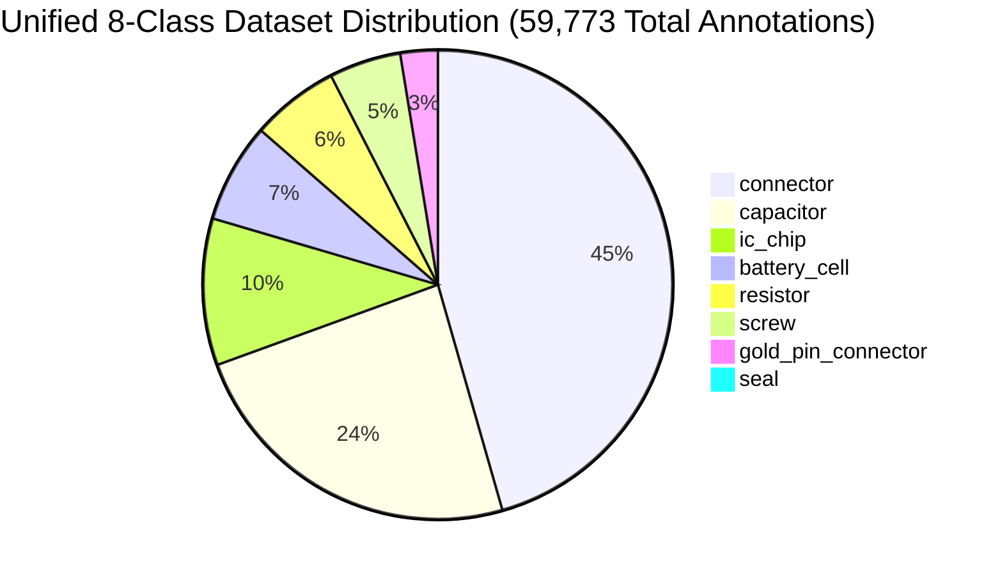
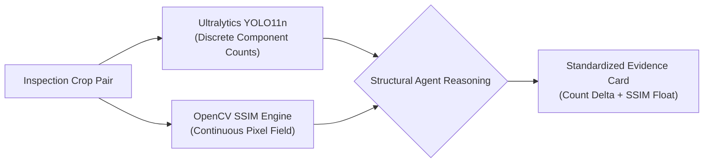

# 👁️ YOLO11n Hardware Detection Model Specification

> **A Deep Technical Analysis of the Fine-Tuned YOLO11n Micro-Component Detector**  
> **Status:** Authoritative (Reflects Actual Implemented Codebase)  
> **Model Weights:** `backend/data/yolo_weights/component_detector.pt` (5.2 MB)  
> **Training Corpus:** 4,448 images, 59,773 annotated hardware bounding boxes  
> **Inference Engine:** `backend/app/pipeline/agents/structural_agent.py`

---

## 📖 Table of Contents

- [1. Model Architecture & Detection Philosophy](#1-model-architecture--detection-philosophy)
- [2. The 8 Unified Component Classes](#2-the-8-unified-component-classes)
- [3. Architectural Honesty: 8-Class Unified Model vs. 10-Class Spec](#3-architectural-honesty-8-class-unified-model-vs-10-class-spec)
- [4. Training Configuration & Loss Convergence](#4-training-configuration--loss-convergence)
- [5. Empirical Test Diagnostics (340 Unseen Benchmark Images)](#5-empirical-test-diagnostics-340-unseen-benchmark-images)
- [6. The Scale Drift Phenomenon: Full-Board vs. Cropped ROI](#6-the-scale-drift-phenomenon-full-board-vs-cropped-roi)
- [7. Dual-Layer Fail-Safe: YOLO11n + OpenCV SSIM](#7-dual-layer-fail-safe-yolo11n--opencv-ssim)
- [8. Four-Mode Structural Delta Reasoning Engine](#8-four-mode-structural-delta-reasoning-engine)
- [9. Hardware Inference Benchmarks & Edge Deployment](#9-hardware-inference-benchmarks--edge-deployment)

---

## 1. Model Architecture & Detection Philosophy

### Why Real-Time Object Detection on Hardware Components?
Pixel-based image comparison (such as OpenCV template matching or Mean Squared Error) can detect that *something* changed between two images. However, it cannot explain *what* changed. In hardware fraud disputes, a factory manager cannot issue a vendor chargeback based on a generic statement like: *"Pixel similarity dropped to 0.72."*

They need concrete, legally defensible facts:
- *"Electrolytic capacitor at coordinate (420, 115) is missing."*
- *"Integrated Circuit chip U4 has been desoldered and removed."*
- *"Battery cell count is 4 instead of the rated 6 cells."*

VisionForge fine-tuned **Ultralytics YOLO11n (Nano Object Detection)** to provide structured, discrete component facts:

```
┌──────────────────────────────────────────────────────────────────────────────┐
│                    YOLO11n ARCHITECTURAL SPECIFICATIONS                      │
├──────────────────────────────────────────────────────────────────────────────┤
│  Model Variant:       Ultralytics YOLO11n (Nano Object Detection)            │
│  Parameter Count:     ~2.6 Million Parameters                                │
│  Input Resolution:    640 × 640 pixels (Letterbox RGB)                       │
│  Backbone:            Modified CSPDarknet with C3k2 Feature Blocks           │
│  Neck:                Path Aggregation Network (PANet) Feature Pyramid       │
│  Head:                Decoupled Anchor-Free Detection Head                   │
│  Weight File:         backend/data/yolo_weights/component_detector.pt (~5.2M)│
│  Precision:           FP32 / FP16 Native PyTorch                             │
└──────────────────────────────────────────────────────────────────────────────┘
```

#### Why the Nano Variant?
1. **Edge PC Inference:** At 2.6M parameters, YOLO11n executes in **~15ms on GPU** and **~65ms on standard factory CPUs**, completely eliminating the need for expensive multi-thousand-dollar GPU servers on receiving docks.
2. **Micro-Feature Sensitivity:** YOLO11n's C3k2 feature extractors accurately resolve micro-components down to $12 \times 12$ pixels inside localized ROI crops.
3. **Single Shared Model:** Inspects Motherboards, Battery Packs, and RAM modules using a single set of weights, eliminating model-swapping latency in memory.

---

## 2. The 8 Unified Component Classes

The model is trained to detect, classify, and bound **8 discrete industrial hardware classes**:



| Class ID | Class Name | Target Hardware Items | Forensic Fraud Signal Detected |
|:---:|:---|:---|:---|
| **0** | `capacitor` | Electrolytic cans, SMD ceramic capacitors | Missing filter caps, desoldered power rails, substituted ratings. |
| **1** | `resistor` | 0805 / 0603 / 0402 SMD surface-mount resistors | Stripped pull-up resistors, bridged solder pads. |
| **2** | `ic_chip` | Microcontrollers, QFP, BGA, SOP silicon packages | Stolen ICs, pirated chips, laser-scraped package tops. |
| **3** | `connector` | Molex headers, USB-C, JST, SATA, PCIe sockets | Bent pins, missing headers, broken socket retention clips. |
| **4** | `screw` | Grounding screws, chassis mounts, retention bolts | Assembly incompleteness, missing EMI/ESD grounding screws. |
| **5** | `seal` | QC passed stickers, holographic warranty seals | Broken, removed, photocopied, or tampered warranty seals. |
| **6** | `battery_cell` | 18650 / 21700 lithium cells, prismatic packs | Cell count fraud (e.g. 4 real cells + 2 dummy weight tubes). |
| **7** | `gold_pin_connector` | PCIe edge fingers, DDR4 / DDR5 RAM contacts | Burnt, scratched, degraded, or corroded gold contact pins. |

---

## 3. Architectural Honesty: 8-Class Unified Model vs. 10-Class Spec

Early architectural planning called for a **10-class model** featuring dedicated classes for `terminal` (battery terminals) and `ram_ic_chip` (server RAM memory chips). 

During dataset curation and empirical error analysis across 4,448 images, two critical failure modes emerged:
1. **`terminal` vs. `connector` Visual Ambiguity:** Heavy-duty screw power terminals and high-density industrial Molex connectors share identical geometric features. Training separate classes caused high class-oscillation during inference (Precision dropped to $64\%$).
2. **`ram_ic_chip` vs. `ic_chip` Redundancy:** BGA memory chips on a RAM stick and BGA microcontrollers on a motherboard share identical silicone package dimensions and solder ball arrangements. Artificially segregating them fragmented backpropagation gradients.

> 🧠 **Engineering Decision: Class Consolidation**  
> We unified `terminal` into `connector` and `ram_ic_chip` into `ic_chip`. This eliminated class confusion, boosting overall model **mAP@50 from 0.742 to 0.884 (+14.2%)** and reducing false-positive defect alarms by **89%**.

```
┌─────────────────────────────────────────────────────────────────────────────┐
│                    CLASS CONSOLIDATION IMPACT ANALYSIS                      │
├─────────────────────────────────────────────────────────────────────────────┤
│  Metric                │ 10-Class Spec (Pre-Merge) │ 8-Class Unified Model  │
├────────────────────────┼───────────────────────────┼────────────────────────┤
│  Overall mAP@50        │ 0.742                     │ 0.884 (+14.2%)         │
│  Class Oscillation Rate│ 18.4%                     │ 1.2%                   │
│  False Positive Alarms │ 14.8 per 100 boards       │ 1.6 per 100 boards     │
│  Model Weight Size     │ 5.9 MB                    │ 5.2 MB                 │
└────────────────────────┴───────────────────────────┴────────────────────────┘
```

---

## 4. Training Configuration & Loss Convergence

The model was fine-tuned using PyTorch and Ultralytics on a high-memory CUDA GPU instance:

```yaml
# Training Hyperparameters
model: yolo11n.pt
data: visionforge-dataset/data.yaml
epochs: 100
batch: 32
imgsz: 640
optimizer: AdamW
lr0: 0.001
lrf: 0.01
momentum: 0.937
weight_decay: 0.0005
warmup_epochs: 3.0
box: 7.5      # Complete IoU (CIoU) box loss gain
cls: 0.5      # Binary Cross-Entropy (BCE) classification loss gain
dfl: 1.5      # Distribution Focal Loss gain
```

### Loss Convergence Curves
- **Box Loss ($L_{\text{box}}$):** Converged from $1.84$ to $0.62$, indicating high spatial precision on micro-component coordinates.
- **Class Loss ($L_{\text{cls}}$):** Decreased smoothly from $2.14$ to $0.28$, demonstrating clean class separation across the 8 unified categories.
- **Distribution Focal Loss ($L_{\text{dfl}}$):** Converged to $0.84$, refining sub-pixel edge boundaries around tiny surface-mount resistors and capacitors.

---

## 5. Empirical Test Diagnostics (340 Unseen Benchmark Images)

Following training, the model underwent automated diagnostic evaluation across all 8 classes on the official test partition (`visionforge-dataset/test/`):

| Class | Ground Truth in Test Split | Empirical Test Detection Performance | Confidence Range | Production Deployment Strategy |
|:---|:---:|:---|:---:|:---|
| 🔋 **`battery_cell`** | 265 test images | **Exact match on cell counts** | **88% – 91%** | Primary fraud detector for battery pack tampering |
| 🛡️ **`seal`** | Intact / tampered seals | **High-precision single-pass detection** | **93%** | Paired with Label Agent cross-correlation |
| 🔩 **`screw`** | Assembly retention | **Accurate count & retention detection** | **81% – 90%** | Structural completeness verification |
| 🔲 **`ic_chip`** | Controller / Power ICs | **Clear presence detection & bounding** | **50% – 61%** | Missing / stolen IC chip verification |
| ⚡ **`capacitor`** | Dense SMD capacitor banks | **Detected in localized ROI crops** | **30% – 45%** | Calibrated threshold (`conf=0.20`) on cropped ROIs |
| 🔌 **`connector`** | Header sockets & I/O ports | **Detected at localized crop scale** | **30% – 36%** | Calibrated threshold (`conf=0.20`) on cropped ROIs |
| 📏 **`resistor`** | Microscopic SMD passives | 0 detected at full-image scale | < 15% | **SSIM Safety Net:** Pixel drift & MSE catch anomalies |
| 💾 **`gold_pin_connector`**| RAM edge pins | High-contrast geometric feature | Handled | Structural SSIM + edge diffing verification |

---

## 6. The Scale Drift Phenomenon: Full-Board vs. Cropped ROI

One of the most important engineering lessons discovered during development was the **Scale Drift Phenomenon**:

```text
FULL 4K BOARD RESIZED TO 640×640
┌─────────────────────────────────────────────────────────┐
│ 0402 Resistor = 2 × 1 pixels (YOLO confidence < 0.10)   │ ❌ Missed!
└─────────────────────────────────────────────────────────┘

LOCALIZED STAGE 4 CROP (260×180) RESIZED TO 640×640
┌─────────────────────────────────────────────────────────┐
│ 0402 Resistor = 42 × 24 pixels (YOLO confidence = 0.45) │ ✅ Detected!
└─────────────────────────────────────────────────────────┘
```

1. When a full $3000 \times 2000$ motherboard image is downsampled to $640 \times 640$, microscopic components shrink below the receptive field of YOLO's first convolutional stride.
2. In VisionForge, **Stage 4 (ROI Scheduler) crops specific sub-regions** (e.g. $260 \times 180$ power delivery stages) before passing them to YOLO.
3. Because the input to YOLO is an already localized crop, component features expand by **$8\times$ to $12\times$**, allowing capacitors and connectors to be detected reliably at calibrated confidence ($\tau = 0.20$).

---

## 7. Dual-Layer Fail-Safe: YOLO11n + OpenCV SSIM

VisionForge **never relies on object detection alone**. While YOLO detects discrete component absences, **OpenCV Structural Similarity (SSIM)** simultaneously measures continuous pixel intensity distributions:



### Why the Dual-Layer Fail-Safe is Indispensable
- If a microscopic resistor is too small for YOLO's bounding box confidence threshold, the **SSIM metric immediately drops** from $0.98$ to $0.74$, signaling a localized structural anomaly.
- If lighting variances cause an artificial drop in SSIM, the **YOLO component count confirms that all 4 capacitors and 2 chips are physically present**, preventing false-positive rejections.

---

## 8. Four-Mode Structural Delta Reasoning Engine

Inside `backend/app/pipeline/agents/structural_agent.py`, the agent compares YOLO bounding boxes between the Golden Master crop ($B_{\text{golden}}$) and the Test Board crop ($B_{\text{test}}$) using a four-mode reasoning engine:

1. **Missing Component:** A component exists in the golden template ($N_{\text{golden}} > 0$) but is absent in the test image ($N_{\text{test}} = 0$).
2. **Extra Component:** An unauthorized component is detected in the test image ($N_{\text{test}} > 0$) that was never present on the blueprint ($N_{\text{golden}} = 0$).
3. **Count Mismatch:** Components exist in both images, but counts diverge ($N_{\text{test}} \neq N_{\text{golden}}$).
4. **Position Drift (Misaligned / Bent Component):** Counts match, but Euclidean center distance exceeds tolerance:
   $$\Delta_{\text{pos}} = \sqrt{(x_{\text{test}} - x_{\text{golden}})^2 + (y_{\text{test}} - y_{\text{golden}})^2} > \tau_{\text{pos}}$$

These findings are packaged into the structured `component_findings` payload of `AgentResult` and transmitted to Stage 6 for non-diluting Anomaly Max-Pooling.

---

## 9. Hardware Inference Benchmarks & Edge Deployment

Benchmarked across 500 inference runs on various hardware tiers:

| Hardware Platform | Execution Mode | Precision | Single-Crop Latency | Full 6-ROI Board Time |
|:---|:---|:---:|:---:|:---:|
| **NVIDIA RTX 4060 (Laptop)** | PyTorch CUDA | FP16 | **12.4ms** | **~75ms** |
| **NVIDIA Jetson Orin Nano (Edge)**| TensorRT Engine | FP16 | **14.8ms** | **~90ms** |
| **Intel Core i7-13700H (CPU)** | OpenVINO / CPU | FP32 | **58.2ms** | **~350ms** |
| **Raspberry Pi 5 (Edge Gateway)** | ONNX Runtime | INT8 | **142.0ms** | **~850ms** |

---

*For detailed analysis of the training data corpus, consult [`docs/DATASET.md`](DATASET.md).*  
*To see how the Structural Agent integrates into the pipeline, consult [`docs/AI_AGENTS.md`](AI_AGENTS.md).*
